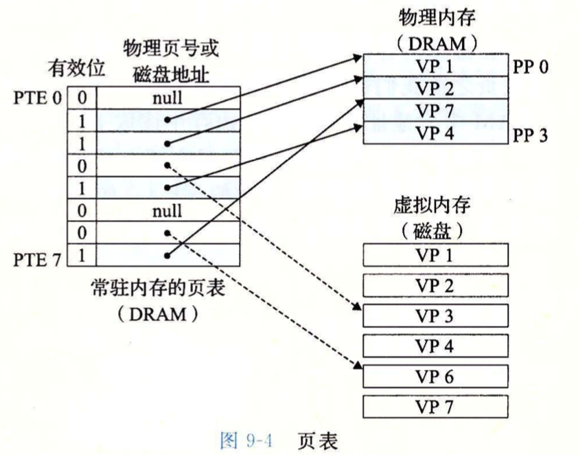
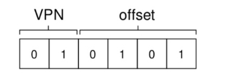
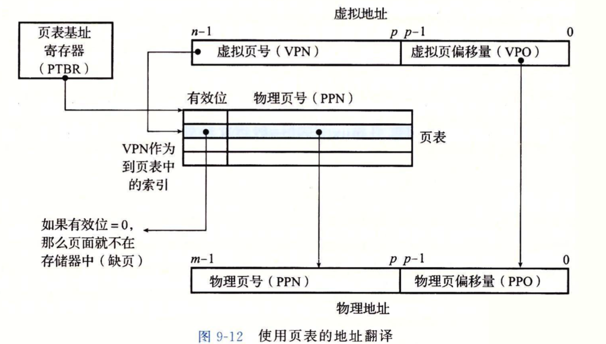
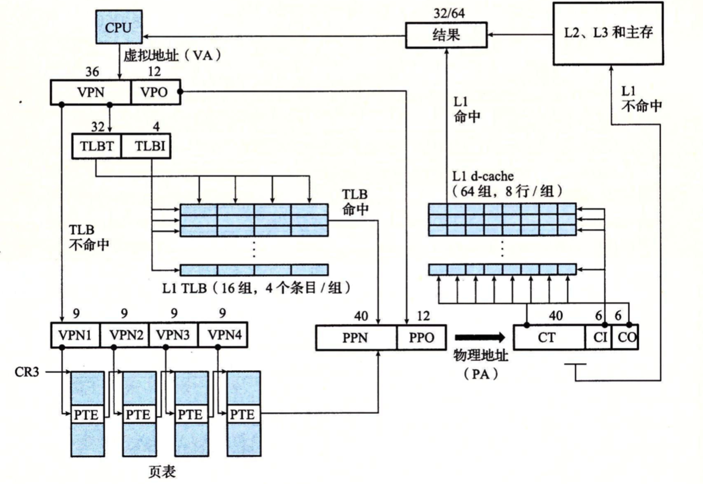
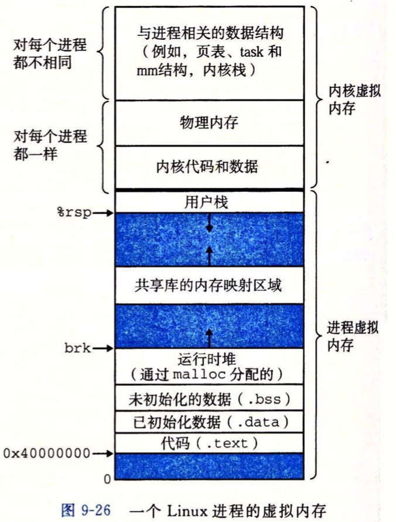
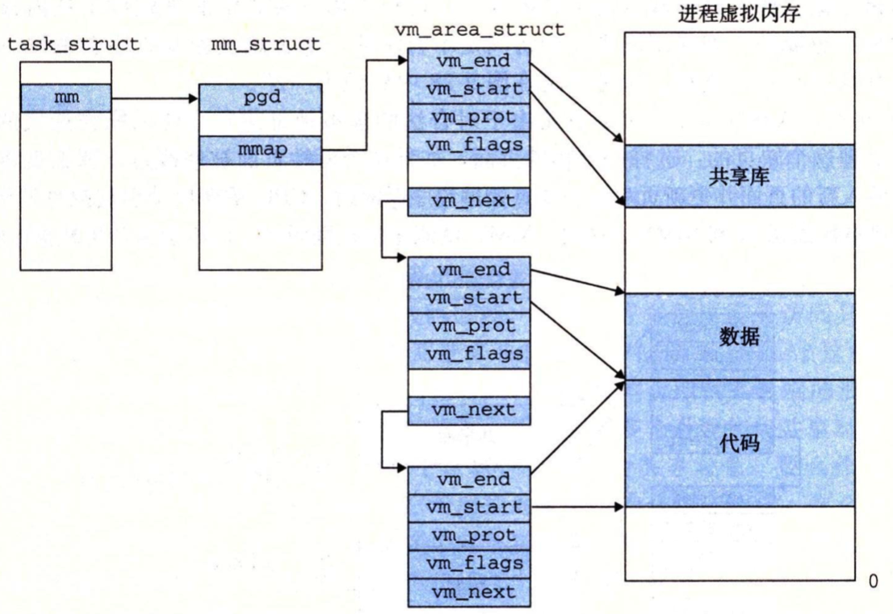
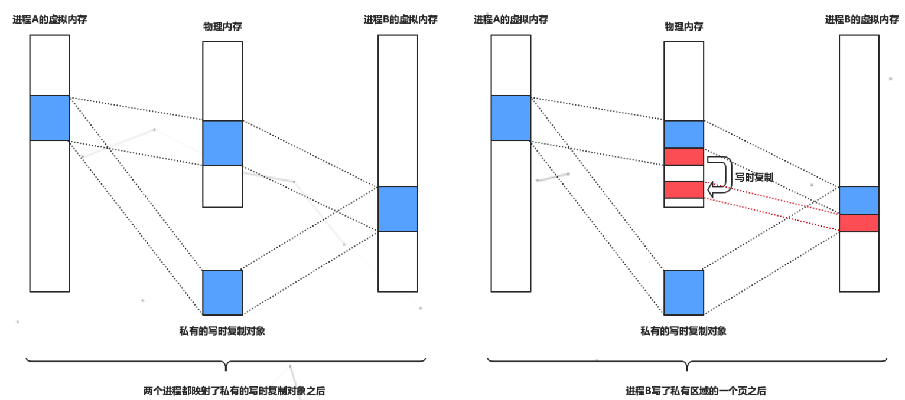
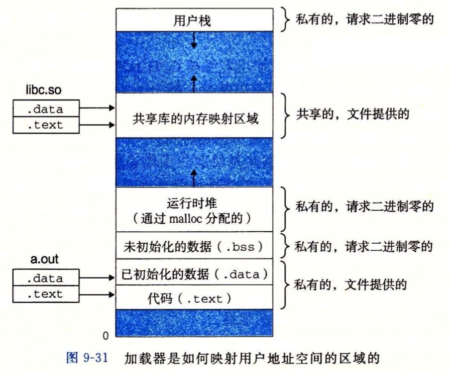

# 第九章 虚拟内存

 注意两种概念： 虚拟页 与 物理页 
每个字节都代表一个地址空间

PTE（Page Table Entry, PTE）
在大多数情况下，只有硬件设备需要得到物理地址连续的内存，因为硬件设备通常并不理解虚拟地址。

##  虚拟页
操作系统通过将**虚拟内存**分割为大小固定的块来作为硬盘和内存之间的传输单位，这个块被称为**虚拟页（Virtual Page, VP）**

**物理内存也会按照这种方法分割为物理页（Physical Page, PP）**，内核把物理页作为**内存管理的基本单位**

在任意的时刻，虚拟页面都分为三个不相交的子集
* 未分配的
* 缓存的（缓存在物理内存中）
* 未缓存的

区：
有些页位于内存的特定物理地址上，（注意，页只跟内存有关系），所以不能将其用于一些特定的任务。内核使用区对具有相似特性的页进行分组。

主要有三种区：
ZONE_DMA , NORMAL ,HIGHEM

## 页表：虚拟页到物理页的映射  
**页表是一个PTE数组 页表在内存中**
PTE（Page Table Entry, PTE）

页表中的原组：(Virtual Page 0 -> Physical Frame 3)
（PTE --> PPN    Physical Page Number）

9-4展示了一个 8个虚拟页 和 4个物理页 所组成的 页表，其中 1 2 7 4 这四个虚拟页被缓存
PTE2 中物理地址 指向PP physical page1的 起始地址

例子：

21 = 010101
movl 21, %eax
虚拟页 01 ，我们再查一下**页表**，**找到物理页号**，+ 0101

MMU用VPN（virtual Page Number）来选择PTE，例如：VPN0选择PTE0、
页表（PTE-->PPN）
VPO **virtual Page offset**  = PPO 

TLB：主要用来缓存MMU使用的页表
每次翻译一个虚拟地址，MMU就必须查阅一个PTE
因为**页表是被缓存在内存中的**，尽管内存的速度相对于硬盘来说已经非常快了，但与CPU还是有所差距。为了防止每次地址翻译操作都需要去访问内存，CPU使用了**高速缓存与TLB来缓存PTE**。

## 以i7为例
core i7 支持48位（256T）虚拟地址空间 和 52位的物理地址空间

地址翻译是一个虚拟地址空间中的元素和一个物理地址空间中元素之间的映射:

可以看到，如果VPN命中了TLB，直接回返回PPN （physical page number）

--
Linux为每一个进程维护一个虚拟地址空间：

**Linux将虚拟内存组织成一些区域（area）**
一个区域就是已经存在着的（已经分配的）虚拟内存的连续片，每个存在的虚拟页面都保存在某个区域中
**例如 代码段 数据段 堆 以及用户栈 都是不同的区域**

内核为系统中的每个进程维护一个单独的任务结构（task_struct）。任务结构中的元素包含或者指向内核运行该进程所需的所有信息（PID、指向用户栈的指针、可执行目标文件的名字、程序计数器等）。

mmap指向一个vm_area_structs的链表，其中每个vm_area_structs都描述了当前虚拟地址空间的一个区域。

## 内存映射
Linux通过将一个虚拟内存区域与一个硬盘上的文件关联起来，**以初始化这个虚拟内存区域的内容，这个过程称为内存映射（memory mapping）**。

由于按需页面调度的策略，**这些虚拟页面没有实际交换进入物理内存**，直到CPU引用的虚拟地址在该区域的范围内。

**普通文件映射就是将一个文件与一块内存建立起映射关系，对该文件进行IO操作可以绕过内核直接在用户态完成（用户态在该虚拟地址区域读写就相当于读写这个文件）。**

匿名文件映射一般在用户空间需要分配一段内存来存放数据时，由内核创建匿名文件并与内存进行映射，之后用户态就可以通过操作这段虚拟地址来操作内存了。**匿名文件映射最熟悉的应用场景就是动态内存分配（malloc()函数）。**

Linux很多地方都采用了“懒加载”机制，自然也包括内存映射。**不管是普通文件映射还是匿名映射，Linux只会先划分虚拟内存地址。**只有当CPU第一次访问该区域内的虚拟地址时，才会真正的与物理内存建立映射关系。

## 共享对象
如果一个进程将一个共享对象映射到它的虚拟地址空间的一个区域内（即从物理内存映射到虚拟内存），那么这个进程对这个区域的任何写操作，对于那些也把这个共享对象映射到它们虚拟内存的其他进程而言，也是可见的。

在物理内存中只保存私有对象的一份副本
当fork()函数被当前进程调用时，内核会为新进程创建各种必要的数据结构，并分配给它一个唯一的PID。**为了给新进程创建虚拟内存，它复制了当前进程的mm_struct、vm_area_struct和页表的原样副本**。并将两个进程的每个页面都标为只读，两个进程中的每个区域都标记为私有区域（写时复制）。
这样，父进程和子进程的虚拟内存空间完全一致，只有当这两个进程中的任一个进行写操作时，再使用写时复制来保证每个进程的虚拟地址空间私有的抽象概念。

## 动态内存分配
虽然可以使用内存映射（mmap()函数）来创建和删除虚拟内存区域来满足运行时动态内存分配的问题，mmap()让内核创建一个新的内存虚拟区域。
