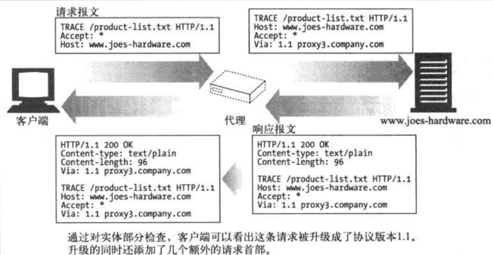
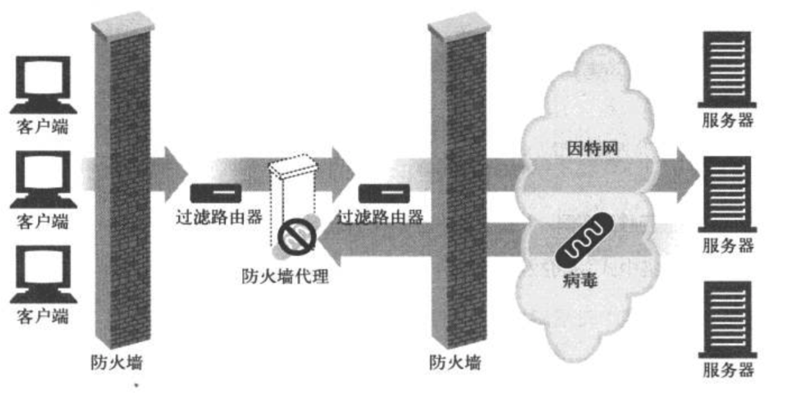

通常，Web缓存是由ISP购买和安装的。
二层交换机，是根据第二层数据链路层的MAC地址和通过站表选择路由来完成端到端的数据交换的。
三层交换机，是直接根据第三层网络层IP地址来完成端到端的数据交换的。
四层交换机是基于传输层数据包的交换过程的，是一类基于TCP/IP协议应用层的用户应用交换需求的新型局域网交换机。第四层交换机支持TCP/UDP第四层以下的所有协议，可识别至少80个字节的数据包包头长度，可根据TCP/UDP端口号来区分数据包的应用类型，从而实现应用层的访问控制和服务质量保证。

# 1、HTTP概述
MIME类型：如image/jpeg  对象类型/特定的子类型

给定了URI，HTTP就可以解析出对象
**URI有两种形式，URL和URN**。
URL描述了一台特定机器上的某资源的特定位置。
URN（统一资源名）与目前的资源位置无关，仍处于试验阶段，还未大范围使用

content_Length：说明了响应主体的长度
content_Type：说明了响应主体的MIME类型

HTTP的URL中没有端口号时，**默认端口号为80**.‘
书中推荐了**netcat** 操纵基于TCP与UDP的流量

## 1.8 Web的结构组件

代理：
**接收所有的HTTP请求，转发到服务器。 significant part of web security**.

缓存：（web缓存或者代理缓存）
客户端从附近的缓存下载文档会比从**远程的HTTP服务器**下载速度要快得多。

# 2、URL与资源
URL可以通过除了HTTP之外的**其他协议**来访问资源，如FTP等，他只是提供了一个统一的命名方式。
相对URL就相当于Linux的**相对路径**，基于一个base URL。在搬运一组资源的时候，仍然保持了链接的有效性。
http 与 https **唯一的区别在于后者使用了ssl**, ssl为端到端加密机制，默认端口443。

## 3、HTTP报文

起始行和首部都是由行分隔的ASC2文本。每行都以一个由两字符 组成的行终止符作为结束，包括**一个回车和一个换行符**。 可以写作CRLF
稳健的程序应该也要能够处理单个换行符作为的行终止。

HEAD方法与GET方法的行为很类似，但服务器在响应中只返回首部。
使用HEAD，**可以在不获取实际资源的情况下，了解资源的情况，查看某个资源是否存在**。

**TRACE方法主要用于诊断，用于诊断请求是否穿过了请求/响应链**。因为客户端在发起请求的时候，这个请求可能要穿过防火墙、代理、网关等各种程序。

OPTION请求Web服务器告知 其支持的各种功能。

## 3.5首部
通用首部：服务器和客户端都可以使用的首部，如Date
可以查看RFC找通用首部

请求首部：请求首部是请求报文独有的。
1. 请求信息性首部
2. Accept首部
3. 条件请求首部
4. 安全请求首部
5. 代理请求首部

响应首部：
1. 响应的信息性首部
2. 协商首部
3. 安全响应首部

实体首部：
1. 内通首部
2. 实体缓存首部

# 4、连接管理
HTTP会以**流的形式**将报文数据的内容通过TCP传输

**TCP收到数据流后**，会将数据流分成段，**将段封装在IP分组中**。每一个段都有序列号。如果没有收到ACK，会重发段。

## 4.2、对TCP性能的考虑
与建立TCP连接，以及传输请求和响应的时间比，事务的处理时间很短，因此，**HTTP的延时主要是由于TCP网络延时造成的**。

延时的原因：
DNS解析系统将URI的hostname转换为IP可能要数十秒，**不过大多数HTTP客户端都有一个小的DNS缓存**，用于保存近期访问站点的IP。
ELSE：TCP建立 与 传输时间

TCP的延时确认：
延时确认会在一个特定的时间内，将确认放在缓冲区，以找到一个能够**捎带**它的输出数据分组。因为确认很小，所以可以捎带。**而实际上，往相反方向传回的分组，并没有那么多，因此延时算法可能会引入一些延时**。可以对TCP的栈的参数进行修改。

## 4.3、并行连接
每个事务都有自己的连接

但大量打开连接非常消耗内存资源，引发自身的性能问题，也会导致服务器端端性能大下降。
事实上，浏览器确实使用了并行连接，但它们通常把总连接数设置为4。

## 4.5 持久连接
**HTTP/1.1 运行HTTP设备在事物处理结束后将TCP连接仍然保持在打开状态**，以便为未来的HTTP请求重用现存的连接。
非持久连接会在每个事务结束后关闭，而持久连接会等到客户端和服务器决定将其关闭。

持久连接降低了延时和连接建立的开销。
持久连接与并行连接的配合可能是最有效率的方式

keep alive已经不再使用了：
keep alive 引出的哑代理的问题——主要原因**当代理在转发HTTP请求和响应的时候**，由于**不理解connection选项**，不会删除首部，而是将它完好地转发。而此时客户端和服务器都认为自己在与代理keep alive，而代理不认为自己建立了Keep alive，因此一直等着新的连接的到来。

HTTP/1.1逐渐停止了对keep alive的支持，**而用一种名为持久连接的改进型代替**。
它在默认情况下是激活的，除非特别指明，**所有的HTTP/1.1都是持久的**。

每个客户端对任何服务器最多开2个持久连接，以防过载。

## 4.6、管道化连接
HTTP/1.1允许在持久连接上可选地使用请求管道。

Key：**把多条请求放入队列，不必一条请求得到响应再发下一条**。

## 4.7、关闭连接
代理如果发现context-length与实体长度不匹配，不应该缓存，而是直接转发。

大量请求置于队列中，一旦连接关闭，客户端并不知道服务器激活了多少事务。
对于GET一个静态页面，没有影响，但如果有POST请求反复执行，可能会有重复下单之类的风险，
因此，**客户端不应该用管道方式传输非幂等请求，如POST**。

正常而言，先关闭自己的输出信道，

# 6、代理
**HTTP的代理服务器既是Web服务器，又是Web客户端**。
HTTP客户端向代理发请求，代理必须返回响应，同时其自身要向服务器发请求。

代理的应用：

代理服务器在网络中的单一节点上，**限制哪些应用层协议可以流入或者流出**。
代理缓存维护了常用的本地文档的副本（缓存），并将它们按需提供。

## 6.3、如何部署代理
可以将代理固定在本地网络的出口点，也可以在ISP访问点上

Web客户端，如浏览器，都支持手动和自动地配置代理。

通用的代理服务器既能支持完整的URI，也能够支持部分的URI（带上host首部）。

根据是否有代理，浏览器对请求URI的解析会有所不同。

1. 如果没有代理，浏览器会根据user输入的URI，尝试寻找相应的IP。如果找不到主机，浏览器会尝试自动扩展，以防用户输入有省略。

2. 当有显式的URI代理时，用户的URI会直接发送给代理。注意：去DNS回去代理服务器的地址

## 6.7、代理认证
我推荐大家还是自己搭建代理服务器。但是有一点要特别注意，如果自己搭建代理服务器的话，一定不要公开，要设置用户名密码，一般情况下，我们使用简单的基本身份认证就可以了。如果你不设置密码的话，没过几天你就会发现你的服务器会卡到爆，登上去使用 netstat 一看，几百上千个连接，服务器带宽全占满了。这是因为互联网上有着大量的代理扫描程序在没日没夜的扫描，你搭建的代理服务器没设密码，或者弱密码，都会被扫出来，而扫出来的后果就是，你的代理服务器被公开到各大免费代理站点，然后所有人都来连你的代理服务器，直到把你的带宽流量耗尽。

用户第一次向服务器发起请求时，**服务器会返回一条 401 Unauthorized 响应**，如果用户是使用浏览器访问的话，**浏览器会弹出一个密码提示框（如果是407的话，就会去本地数据库里找相应的证书），提醒用户输入用户名和密码**，于是用户重新发起请求，在第二次请求中将在 Authorization 头部添加上身份信息，这个身份信息其实只是简单的对用户输入的用户名密码做了 Base64 编码处理，服务器对用户的认证成功之后，返回 200 OK 。

WWW 认证：第一次访问时响应 401 Unauthorized
Proxy 认证：第一次访问时响应 407 Unauthorized

### 补充：
正向代理与反向代理的区别？
Nginx 是一个高性能的 HTTP 和反向代理服务器。

反向代理隐藏了真实的服务端，当我们请求 http://www.baidu.com 的时候，**背后可能有成千上万台服务器为我们服务，反向代理服务器会帮我们把请求转发到真实的服务器那里去**。

# 7、缓存
**很多网络为本地网络客户端提供的带宽比为远程网络提供的带宽要大**。

如果客户端能够从一个**快速局域网的缓存中得到一个副本**，那么缓存就能够提高性能。

缓存对缓存的副本进行验证时，**会向原始的服务器发送一个小的再响应请求**。如果内容没有变化，服务器会以一个小的304 Not Modified 来响应。
HTTP提供了几个再验证的工具，最常用的是 If-Modified-Since 首部。
服务器收到后：
如果验证命中：会发HTTP 304 Not Modified 响应。
如果未命中：服务器发HTTP 200 OK
对象被删除：404 

**客户端有一种方法可以判断响应是否来自于缓存，用Date首部，如果时间比当前时间要早，那么通常来自于缓存**。

私有缓存：私有缓存不需要很大的存储空间，Web浏览器内有内建的私有缓存，可以在浏览器内设置。

公有代理缓存：
共有代理缓存是特殊的共享代理服务器，也称作缓存代理服务器。
**代理缓存会从本地服务器中提供文档，或者代表用户与服务器进行联系**。

副本新鲜度
1、文档过期
HTTP让原始服务器向每一个文档附上一个过期日期Expires。在过期前，缓存可以任意使用，除非客户端请求有组织提供已缓存。一旦文档过期，就需要向服务器核对，询问是否被修改过。

2、使用期  Cache-Control
Cache-Control ： max-age=484200
**更倾向于使用期，因为绝对日期需要计算机时钟的正确设置**。

3、条件验证
缓存向服务器发一个条件GET，只有条件为真，才返回主体
If-Modified-Since:<date>：
没发生变化 304 NOT Modified
发生变化 200 +主体

**If-None-Match:<tags>：版本标识符**
文档的序列号或者版本号

# 8、网关 隧道和中继
## 8.1、网关

可以通过网关对所有的输入Web请求加密，提供安全保护。

### **网关和代理的区别：————引用自知乎 “车小胖”**
#### 网关
小明的主机被配了IP参数如下：
IP=10.1.1.2
Mask = 255.255.255.0
Gateway = 10.1.1.1

小明主机需要三种类型通信：
1）自己和自己（10.1.1.2）通信流量在主机内部溜达，流量不会碰到网线。
2）与广播域内其它主机（10.1.1.x)通信通过ARP广播发现其它主机的MAC，**这些流量在主机之间穿梭，流量不会到达网关**。除非主机要和网关10.1.1.1通信，比如ping 10.1.1.1，流量会到达网关网卡，并上行到网关的TCP/IP协议栈，甚至会到达网关的应用层，这取决于是什么应用。
3）与1）2）之外的主机通信通常这类主机可以标示为ROW（**Rest Of the World**)比如与Internet上的8.8.8.8 服务器通信，这种通信需要小明主机**把流量发给网关** ，需要二层Destination MAC = MAC of Gateway

简而言之：**二层目的MAC地址是网关的，三层目的IP是服务器的**。

#### 网关
小明经常浏览社交网站，这个网站IP假设为http://www.zhihu.com（6.6.6.6），公司发现了，将6.6.6.6 过滤（Block)掉，

小明急中生智，使用了代理
代理IP = 9.9.9.9
代理端口 =9999
小明和代理建立TCP连接（9.9.9.9:9999），把自己的需求告诉代理，想访问"http://www.zhihu.com"

代理用自己的IP与6.6.6.6:80建立另外一个TCP连接，**并将6.6.6.6:80返回的Http网页，原封不动地发给小明，使用的是代理TCP连接**。简而言之：代理是中间人，使用代理的主机发出的IP报文的目的IP是代理的，但是会在应用层里明确告诉代理，自己真实需求是什么

#### 隧道
小美在北京，
她的IP = 10.1.1.3 
Mask= 255.255.255.0
Gateway = 10.1.1.1

小明的主机被配了IP参数如下：
IP=10.1.1.2
Mask = 255.255.255.0
Gateway = 10.1.1.1

小明在上海，小明发现小美和自己在同一个网段，于是想ARP广播发现小美的MAC地址，如果没有隧道，这是痴心梦想，因为小明、小美的主机被Internet隔离。但有了隧道（VxLAN / Ethernet over GRE ），这一切会梦想成真。
隧道有两个IP头，**外部IP用于在Internet传输，而内部IP就是小明、小美的IP**。简而言之：隧道通常有两个IP头。

最常见的 网关 服务器端网关，**连接服务器与应用程序**：

服务器收到客户端A的请求，根据URI发给一个数码相机的应用程序。将得到的图片绑定在一条HTTP响应报文中。
客户端B的请求是发给一个电子商务软件的，结果会被发回给浏览器。

**第一个流行的应用程序网关API是网关通用接口 CGI  common Gateway Interface**
CGI是一个标准接口，Web服务器可以根据它来装载程序以响应特定的HTTP请求。

缺点：为每条CGI请求引发新开一个进程的开销是非常高的。会限制服务器性能，因此引入了fast CGI。

## 8.5、隧道
Web隧道允许用户通过HTTP协议发送非HTTP流量
HTTP隧道用于在**受限制的网络连接**（包括防火墙，NAT和ACL）以及其他限制的情况下**在两台计算机之间创建网络链接**。

**隧道是一个盲目转发的代理**
**HTTP隧道的最常见形式是标准化的HTTP CONNECT方法**。在这种机制中，客户端要求HTTP代理服务器将TCP连接转发到所需的目的地。然后服务器继续代表客户端进行连接。服务器建立连接后，代理服务器将继续代理与客户端之间的TCP流。只有初始连接请求是HTTP-之后，服务器仅代理建立的TCP连接。

## SSL/TLS
SSL（安全套接字层）是一种标准安全协议，用于在在线通信中建立Web服务器和浏览器之间的加密链接。
Transport Layer Security (TLS)是SSL协议（Secure Sockets Layer）的升级版，TLS 1.0通常被标示为SSL 3.1，TLS 1.1为SSL 3.2，TLS 1.2为SSL 3.3。现在习惯将这个两个组合在一起称为SSL/TLS，只要知道它是一种用于加密的安全协议就好了。

当网页期望用户提交机密数据（包括个人信息，密码或信用卡详细信息）时，网页应使用加密，这个时候web服务器就应该使用HTTPS协议来传输数据，**它其实就是HTTP和SSL/TLS结合实现的**；同样的还有SMTPS，它是加密的简单邮件通信协议，这样在传输邮件的时候就不是明文传输了，一般我们在设置邮箱服务器的时候可以选择是否勾选SSL/TLS的，如果没有勾选的话邮件就是明文传输了。

SSL/TLS协议的基本思路：采用公钥加密法。**客户端先向服务器端索要公钥，然后用公钥加密信息**，服务器收到密文后，**用自己的私钥解密**。

### 代理 && HTTP Connection && SSL/TLS：
HTTP隧道的引入，主要为了解决明文的HTTP proxy无法代理跑在TLS中的流量（也就是https）的问题，

**当浏览器需要通过代理服务器发起HTTPS请求时**，由于请求的**站点地址和端口号都是加密保存于HTTPS请求头中的**，代理服务器是如何既确保通信是加密的（代理服务器自身也无法读取通信内容）又知道该往哪里发送请求呢？

为了解决这个问题，**浏览器需要先通过明文HTTP形式向代理服务器发送一个CONNECT请求告诉它目标站点地址及端口号**。当代理服务器收到这个请求后，会在对应的端口上与目标站点建立一个TCP连接，连接建立成功后返回一个HTTP 200状态码告诉浏览器与该站点的加密通道已建成。

也就是说，**此时Http代理服务器已经变成了一个TCP代理，只是单纯地转发 tcp 流量**。

# 11、客户端识别与cookie机制
常见的表明客户端信息的HTTP首部：

cookie分为会话cookie和持久cookie
会话cookie是一种临时的cookie，**当用户退出浏览器的时候，会话cookie就被删除了**。
持久cookie存在硬盘上，即使计算机重启它们都在。

cookie与会话跟踪的流程：

# 12+13、认证
服务器需要用某种方式来了解用户的身份，一旦服务器知道用户的身份，就可以判断用户可以访问的事务和资源了。

基本认证：

服务器用401拒绝了请求，说明需要user提供用户名+密码
图中的realm指令  是安全域，每个安全域可以有不同的授权用户集

HTTP基本认证将 由冒号分隔的 用户名和密码打包在一起，用Base64编码。在元端进行解码。

缺陷：容易被解码，因此只能用于一些不太重要的应用程序。

摘要认证
摘要认证并不能满足安全HTTP的需求，对这些需求而言，使用TLS和HTTPS更好。

