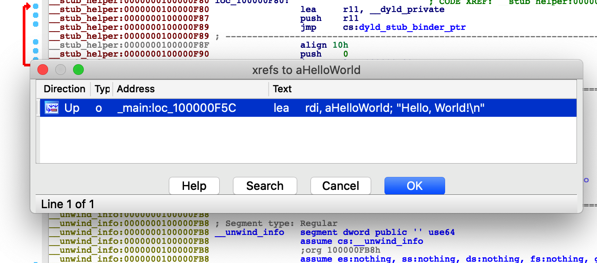

# 逆向反汇编工具

### 1.1　反汇编理论
- 第一代语言 。这些语言是最低级的语言，一般由 0 和1 或某些简写编码（如十六进制码）组成。只有二进制超人才能读懂它们。由于数据和指令看起来都差不多，人们往往很难将它们区分开来，因此这种语言很容易造成混淆。**第一代语言也称为机器语言 ，有时也叫做字节码 ，而机器语言程序常被称为二进制文件** 。
- 第二代语言 。第二代语言也叫汇编语言 ，它只是一种脱离了机器语言的表查找方式。通常，汇编语言会将具体的位模式或操作码，与短小且易于记忆的字符序列（即助记符 ）对应起来。有时候，这些助记符确实有助于程序员记住与它们有关的指令。**汇编器是程序员用来将汇编语言程序转换成能够执行的机器语言的工具。**
- 第三代语言 。这些语言引入了关键字和结构（它们是程序的构建块），因而其表达能力更接近于自然语言。通常，第三代语言不依赖于任何平台。但是，由于用第三代语言编写的程序使用了特定于操作系统的独特功能，它们便具有了平台依赖性。常见的第三代语言包括FORTRAN 、COBOL、C 和Java 。程序员通常使用编译器将程序转换成汇编语言，或者直接转换成机器语言（或某种大致的等价形式，如字节码）。


### 1.2　何为反汇编
在传统的软件开发模型中，程序员使用编译器、汇编器和链接器中的一个或几个创建可执行程序。

为了回溯编程过程（或对程序进行逆向工程），我们使用各种工具来撤销汇编和编译过程。毫不奇怪，这些工具就叫做反汇编器 和反编译器。

**反汇编器撤销汇编过程，因此，我们可以得到汇编语言形式的输出结果（以机器语言作为输入）**。

**反编译器**则以汇编语言甚至是机器语言为输入，其输出结果为高级语言。


### 1.3　为何反汇编

由于缺乏源代码，要准确地了解恶意软件的运行机制，你的选择非常有限。**动态分析和静态分析是分析恶意软件的两种主要技术**。

动态分析 （dynamic analysis ）是指在严格控制的环境（沙盒）中执行恶意软件，并使用系统检测实用工具记录其所有行为。相反，静态分析 （static analysis ）则试图通过浏览程序代码来理解程序的行为。


### 1.4　如何反汇编

TODO


# 第2章　逆向与反汇编工具

这些工具大多在IDA 之前发布，并且仍然可用于快速分析二进制文件，以及审查IDA 的分析结果。如我们所见，IDA 将这些工具的诸多功能整合到它的用户界面中，为逆向工程提供了一个集成环境。

### 2.1　分类工具

file 命令是一个标准的实用工具，file 图通过检查文件中的某些特定字段来确认文件的类型。有时，file 能够识别常见的字符串，如#!/bin/sh （shell 脚本文件）

多数情况下，它会搜索某些文件类型所特有的标签值（通常称为幻数magic file ）


众所周知，Java 的.class 文件的幻数为十六进制数0xcafebabe 

**你可以使用一个十六进制文件编辑器将任何文件的前4 字节修改为 Java 的幻数序列 CA FE BA BE**


### 2.2　摘要工具
由于我们的目标是对二进制程序文件进行逆向工程，因此，在对文件进行初步分类后，需要用更高级的工具来提取详尽的信息。


#### 2.2.1 nm

将源文件编译成目标文件时，**编译器必须嵌入一些全局（外部）符号的位置信息**，以便链接器在组合目标文件以创建可执行文件时，能够解析对这些符号的引用。

除非被告知要去除最终的可执行文件中的符号，**否则，链接器通常会将目标文件中的符号带入最终的可执行文件**

根据nm 手册的描述，这一实用工具的作用是“列举目标文件中的符号


#### 2.2.2 ldd


创建可执行文件时，必须解析该文件引用的任何库函数的地址

如果要求使用静态链接，链接器会将应用程序的目标文件和所需的库文件组合起来，生成一个可执行文件。这样，在运行时就不需要确定库代码的位置，因为它已经包含在可执行文件中了。静态链接的优点包括：函数调用更快一些；发布二进制文件更加容易，因为这时不需要对用户系统中库函数的可用性做出任何假设。其缺点包括：生成的可执行文件更大


动态链接与静态链接不同。使用动态链接时，链接器不需要复制它需要的任何库。相反，链接器只需将对所需库（通常为.so 或.dll 文件）的引用插入到最终的可执行文件中。因此，这时生成的可执行文件也更小一些。

动态链接的另一个缺点是，供应商不仅需要发布他们自己的可执行文件，而且必须发布该文件所需的所有库文件。如果一个系统无法提供程序所需的全部库文件，在这个系统上运行该程序将会导致错误。


因此，与静态链接二进制文件不同，我们可轻易确定一个动态链接二进制文件所依赖的库文件。ldd （list dynamic dependencies ）是一个简单的实用工具，可用来列举任何可执行文件所需的动态库。


要查看一个程序依赖的so文件可以用ldd命令，**ldd 命令后面必须根这个程序的绝对路径**，

一般先用**which** 找到这个程序的绝对路径，然后再用ldd命令查看。

ldd的结果分三列
第一列：程序依赖库的名字
第二列：系统提供库的名字

第三列：库加载的开始地址。


#### 2.2.4　otool
otool 可用于解析与 OS X Mach-O二进制文件有关的信息，因此，可简单将其描述为 OS X系统下的类似于 objdump 的实用工具。

2.2.6　C++ filt

通常，一个目标文件中不能有两个名称相同的函数。为支持重载，编译器将描述函数参数类型的信息合并到函数的原始名称中，从而为重载函数生成唯一的函数名称。为名称完全相同的函数生成唯一名称的过程叫做名称改编（name mangling）

```
void demo(void);  
void demo(int x);  
void demo(double x);  
void demo(int x, double y);  
void demo(double x, int y);  
void demo(char* str);  ”

idabook#  g++ -o cpp_test cpp_test.cpp

idabook#  nm cpp_test | grep demo

  
0804843c  T _Z4demoPc  
08048400  T _Z4demod  
08048428  T _Z4demodi  
080483fa  T _Z4demoi  
08048414  T _Z4demoid  
080483f4  T _Z4demov 
```


如果将上面 nm 输出的结果交给 c++filt 处理，将可以得到这些函数的原始名称，如下所示:

```
idabook#  nm cpp_test | grep demo | c++filt

  
0804843c  T demo(char*)  
08048400  T demo(double)  
08048428  T demo(double, int)  
080483fa  T demo(int)  
08048414  T demo(int, double)  
080483f4  T demo()
```


### 2.3　深度检测工具


strings 实用工具专门用于提取文件中的字符串内容


不过，我们发现，一些字符串看起来像程序输出，一些字符串则像函数名称或库名称。**因此，绝不能仅仅根据这些字符串来断定程序的功能**。分析人员往往会掉入陷阱，根据 strings 的输出来推断程序的功能。需要记住的是：二进制文件中包含某个字符串，并不表示该文件会以某种方式使用这个字符串。


需要牢记的是，使用 strings 处理可执行文件时，默认情况下，strings 仅仅扫描文件中可加载的、经初始化的部分。使用命令行参数–a 可强制strings 扫描整个文件。


# 第4章　IDA入门


IDA 的任务是将选定的可执行文件加载到内存中，并对相关部分进行分析。随后，IDA 会创建一个数据库，其组件分别保存在4 个文件中，这些文件的名称与选定的可执行文件的名称相同，扩展名分别为.id0 、.id1 、.nam 和.til


彩色的水平带是 IDA 的概况导航栏，默认情况下，它会呈现二进制文件的整个地址范围。你可以右击导航带内任何位置


反汇编视图是主要数据显示视图，它有两种不同的形式：图形视图（默认）和列表视图。

打开 IDA-View 窗口后，**可以使用空格键**在图形视图样式和列表视图样式之间切换。


使用View▶Open Subviews命令恢复你无意中关闭的数据显示窗口。

使用Windows▶Reset Desktop 命令可迅速将桌面恢复到原始布局。


图形视图会让人联想到程序流程图，因为它将一个函数分解成许多基本块，以生动显示该函数由一个块到另一个块的控制流程。

1. 基本块 是一个不包含分支，从头执行到尾的最大指令序列。因此，每个基本块都有唯一的入口点（块中的第一条指令）和退出点（块中的最后一条指令）”


在屏幕上你会发现，IDA 使用不同的彩色箭头区分函数块之间各种类型的流。

根据测试条件，在条件跳转位置终止的基本块可能会生成两种流：**Yes边的箭头（是的，执行分支）默认为绿色，No边的箭头（不，不执行分支）默认为红色**。只有一个后继块的基本块会**利用一个正常边（默认为蓝色）**指向下一个即将执行的块。


在图形模式下，IDA 一次显示一个函数。


a：将数据转换为字符串

f5：一键反汇编


双击任何一个符号，IDA 将跳转到相应的位置

x：对着某个函数、变量按该快捷键，可以查看它的交叉引用




g：直接跳转到某个地址

