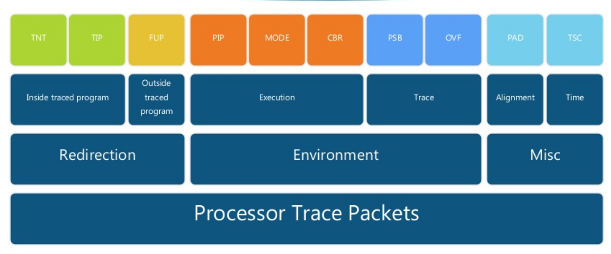

1. Intel PT records the beginning and the end of trac- ing through PGE and PGD packets, respectively.
2. Throughout the program execution, Intel PT generates TNT packets to log whether conditional branches are taken (e.g., jcc) 
3.  and TIP packets to log the targets of indirect branches (e.g., call* and ret).

With such information and the disassembled binary, a software decoder can reconstruct the complete control flow.

It is worth mentioning that direct branches (e.g., call) do not trigger any packets because of their deterministic effects on control flows.


To reduce the size of TIP packets, Intel PT compresses the target address if the upper address bytes match the previous address logged, suppressing up to six bytes.

Intel PT outputs packets directly to physical memory to avoid the cost of address translation. For flexibility, it can be configured to use multiple buffers that are not contiguous in the physical address space through a table-like data struc- ture.


## Indirect branch

In a direct branch, the argument specifies where the address is located. 

An example is 'jump indirect on the r1 register', which means that the next instruction to be executed is at the address in register r1. The address to be jumped to is not known until the instruction is executed. 

An indirect branch can be useful to make a conditional branch

```
jmp eax
```





Information provided in “data packets”: 

 Timing and synchronization packets

 Execution mode packets. 

 Flow execution packets.


1. TNT: Conditional Branch Taken or Not Taken. 

2. TIP: Target Address within program binary

3. FUP FLow up packets: Target Address outside program binary (异步事件)

   

4. PIP  page Information packet: Modification to the CR3 task page base address

5.  MODE:  Current CPU mode (16/32/64 bits).

6. CBR Core Bus Ratio: Bus Clock Ratio

   

7. PSB: Heartbeat, every 4K packets

8. OVF overflow: Internal buffer overflow

   

9. TSC Time Stamp Count: wall clock data

10. PAD: alignment对准 purpose 


CR3. (filtering by process)


PT利用TNT（jnz，je这样的直接调用）、TIP（call，jmp这样的间接调用）和FUP（exception、interrupt这样的远程调用）获取hit的基本块并记录边信息。


## TNT

2种事件

conditional branch : take 1 not take 0

umodified return address : take 1


2种size

short TNT: 8 bit 包含了六个decision bit

Long TNT: 64比特 包含了47个decision bit


## TIP

A destination address within traced program


Used for:

1. indirect jump /call : use an address from a register or memory
2. modified return : return address on a call stack is modified 


有两个变体

TIP.PGE: Packet generation Enable

TIP.PGD: Packet generation Disable


## FUP

Target Address outside program binary


generated when asynchronous event happens:

1. external 中断
2. exception and faults
3. ..............


## PIP

generated when CR3 is modified


CR3 register contains task's page base address

CR3 control register that contains the Process Context Identifier (PCID). On every context switch the corresponding PCID is loaded to CR3.

## PSB

generated every 4K packets

分析者 search for this packets first to start decodeing

PSB自己并不包含任何的信息: 只是一些二进制签名


## PAD: 填补

没有任何的信息

只是为了对齐


## 其它


## 细节

Can filter trace by CPL, CR3, or IP ranges


Timing 

1. MTC (Mini Timestamp Counter) : More frequent, based on CTC (crystal clock counter) value (8 bit). Can be frequency adjusted. Used with TSC to get accurate timestamps for less cost. [TSC → TMA → MTC, MTC, MTC → TSC] 
2. Decoder finds out accurate time offline through elaborate calculation


tip.pgd

