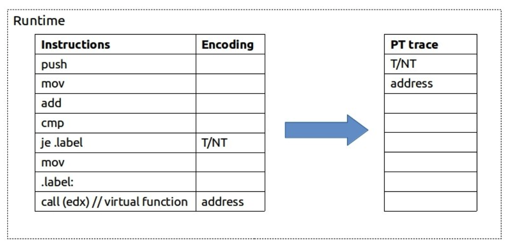
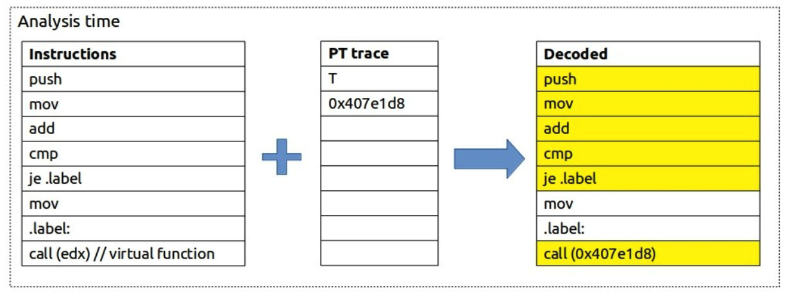

# 基本概念

###  Branch

A **branch** is an instruction in a computer program that can cause a computer to begin executing a different instruction sequence and thus deviate from its default behavior of executing instructions in order.

Branch instructions are used to implement [control flow](https://en.wikipedia.org/wiki/Control_flow) in program loops and conditionals (i.e., executing a particular sequence of instructions only if certain conditions are satisfied).

Common **branching** statements include break , continue , return , **and** goto .

### Control Flow

In computer science, control flow (or flow of control) is the order in which individual statements, instructions or function calls of an imperative program are executed or evaluated. The emphasis on explicit control flow distinguishes an imperative programming language from a declarative programming language.

中断和信号是低级机制，可以类似于子例程的方式更改控制流，但通常是对某些外部刺激或事件的响应（可以异步发生），而不是在线执行控制流语句。

#  Intel Processor Trace 

Intel PT is a hardware feature that logs information about software execution with minimal impact to system execution

This enables developers to understand very detailed timing and functional behavior of their programs at a level accuracy and low-runtime overhead not available before on Intel CPUs.

在默认情况下CPU的PT部件是处于关闭状态，这意味着CPU不会记录程序的分支信息，因此也不会产生任何开销。

PT allows capturing branch outcomes and timing information on code executing on the processor with minimal perturbation (less than 5% runtime overhead). 由于分支信息记录完全由硬件完成，因此开销非常小，一般在5%以下，这个开销对于大多数应用来讲基本上可以忽略不计。

Intel Processor Trace can monitor the execution of user-level and kernel code, and can collect cycle information at a granularity as fine as a handful of branches.

### Library

Intel has released a library along wth sample tools to enable use of Intel Processor Trace (Intel PT) available as the "Processor Trace Decoder Library" available：

https://github.com/intel/libipt

## Adding Processor Trace support to Linux

Tracing is a technique that is used for both performance analysis and debugging. A tracer generates its data into a log; these are tracing events that can be later analyzed to understand the program's execution. Linux has ftrace that can log function calls and tracepoint data for the kernel. 

Processor Trace (PT) is a new tracing mechanism for Intel CPUs that traces branches executing on the CPU, which allows the reconstruction of the control flow of all executed code.

跟踪以多GHz速度运行多个内核的现代CPU上的分支可能会生成大量数据。尽管CPU可以以很少的开销进行实际的跟踪（硬件可以并行执行），但是维持日志缓冲区的带宽却是一个挑战。

Intel PT：完全不记录无条件的直接分支，conditional branches are compressed to a single bit (taken or not-taken), and `CALL`/`RET` instructions can be elided by maintaining a call stack in the decoder.

## Enhance performance analysis with Intel Processor Trace.

During the years new methods for doing performance analysis have been developed. One of them is based on interrupts. The easiest way to look at it is the following. If you use a debugger and will stop the program every second and record the place where you stop, you will get a collection of the samples which will tell you where your program spends time the most. This is the over simplified description of what profiling tools are doing. Read more about the underlying mechanics here: [PMU counters and profiling basics](https://easyperf.net/blog/2018/06/01/PMU-counters-and-profiling-basics), [Basics of profiling with perf](https://easyperf.net/blog/2018/08/26/Basics-of-profiling-with-perf).

 **It is a CPU tracing feature which records the program execution by encoding packets in a very compressed format. It has extensive coverage and relatively small  ~5% overhead. 它的主要用法是事后分析和引起性能故障的根本原因.**

a revolutionary technology that allows doing performance analysis without interrupting the program execution. 

It has tracing nature and in some sense is similar to Linux tracing facilities like `ftrace/strace` and so on.

### Workflow

Similar to sampling techniques it does not require any modifications to the source code它不需要对源代码进行任何修改. All you need to collect traces is just to run the program under PT enabled tool. Once PT are enabled SW tools start writing packets to DRAM.

At runtime, whenever CPU encounters any branch instruction (`je`, `call`, `ret`) it will record what happened with this branch. For simple conditional jump instruction CPU will record whether it was taken (`T`) or not (`NT`) using just 1 bit. For indirect call, for example, it will record the target address. 

CPU then stores this highly compressed 压缩 PT trace in a binary form to DRAM.

At the time of analysis, we bring together the application binary and the PT trace collected. **SW decoder needs the application binary file, in order to reconstruct the execution flow of the program**.

It starts from an entry point of the program and then uses collected traces as a lookup reference to determine the control flow: 

即使考虑压缩，它仍然包含大量数据。通常，每条指令小于1个字节。准备好具有至少100 MB / s的编码数据。解码后，它可能会轻易增加10倍以上（〜1GB / s）。这使得它不能用于长时间运行的工作负载。但是即使您的工作量很大，您也可以运行一小段时间。

### Timings

Not only flow of execution can be traced but also timing information.

**instruction data (control flow) is perfectly accurate but timing information is less accurate**.

https://easyperf.net/blog/2019/08/23/Intel-Processor-Trace

Intel PT traces can be easily collected with Linux perf tool

 Intel PT works by recording branches.

At runtime, whenever CPU encounters any branch instruction (`je`, `call`, `ret`) it will record what happened with this branch. 

