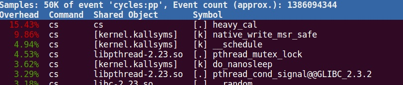
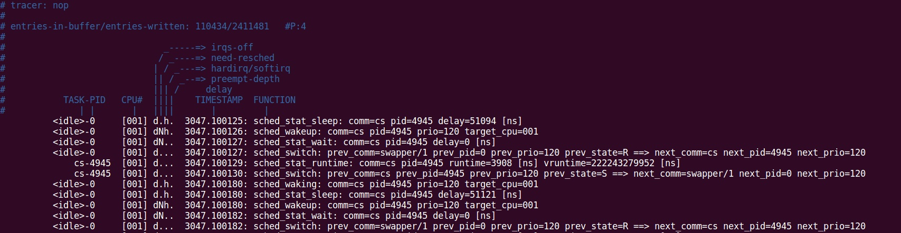
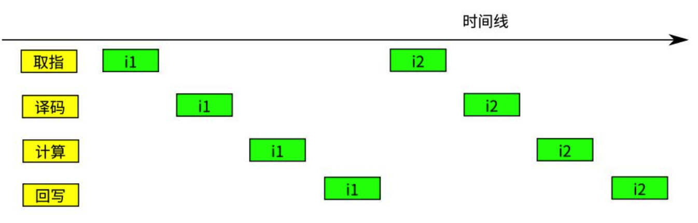
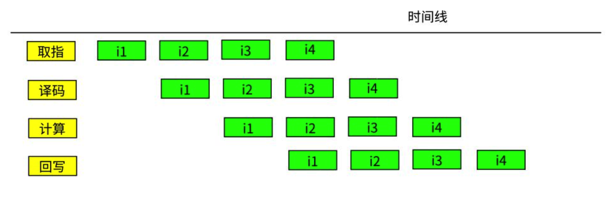

## 在Linux下做性能分析1：基本模型

https://zhuanlan.zhihu.com/p/22124514

我们需要有一套完整的方法来发现系统的瓶颈。

从业务目标角度，通常我们的瓶颈出现在业务的通量（Throughput）和时延（Latency）两个问题上。（手机等领域常常还会考虑功耗这个要素，但那个需要另外的模型，这里暂时忽略）

比如一个MySQL数据库，你从其他机器上对它发请求，每秒它能处理10万个请求，这个就是通量性能，每个请求的反应时间是0.5ms，这个就是时延性能。


所以，当我们遭遇一个通量性能瓶颈的时候，我们通常分三步来发现瓶颈的位置：

1. CPU占用率是否已经满了，这个用top就可以看到，比如下面这个例子：

如果CPU没有满，有三种可能：

a.  某个队列提早流控了。我们通过查看每个独立队列的统计来寻找这些流控的位置，决定是否需要提升队列长度来修复这种流控。例如，我们常常用ifconfig来观察网卡是否有丢包：

```bash
wlan0     Link encap:以太网  硬件地址 7c:7a:91:xx:xx:xx  
          inet 地址:192.168.0.103  广播:192.168.0.255  掩码:255.255.255.0
          inet6 地址: fe80::7e7a:91ff:fefe:5a1a/64 Scope:Link
          UP BROADCAST RUNNING MULTICAST  MTU:1500  跃点数:1
          接收数据包:113832 错误:0 丢弃:0 过载:0 帧数:0
          发送数据包:81183 错误:0 丢弃:0 过载:0 载波:0
          碰撞:0 发送队列长度:1000 
          接收字节:47850861 (47.8 MB)  发送字节:18914031 (18.9 MB)
```


b. 调度没有充分展开，比如你只有一个线程，而你其实有16个核，这样就算其他核闲着，你也不能怎么样。这是需要想办法把业务hash展开到多个核上处理。上面那个top的结果就是这种情形。

c. 配套队列的线程有IO空洞，要通过异步设计把空洞填掉，或者通过在这个队列上使用多个线程把空洞修掉。

2. 如果CPU占用率已经占满了，观察CPU的时间是否花在业务进程上，如果不是，分析产生这种问题的原因。Linux的perf工具常常可以提供良好的分析.




这里例子中的CPU占用率已经全部占满了。但时间中只有15.43%落在主业务流程上，下面有大量的时间花在了锁和调度上。


当我们发现比如schedule调度特别频繁的时候，我们可以通过ftrace观察每次切换的原因，比如下面这样：



可以看到业务线程执行3个ns就直接切换为Idle了，我们可以在业务线程上加mark看具体是什么流程导致这个切换的（如果系统真的忙，任何线程都应该用完自己的时间片，否则就是有额外的问题引起额外的代价了）.


==总结==

性能分析应该是一个有针对性的工作，我们大部分情况都不可能通过“调整这个参数看看结果，再调整调整那个参数看一个结果，然后寄望于运气。我们首先必须从一开始就建立系统的运行模型，并有意识地通过程序本身的统计以及系统的统计，对程序进行profiling，并针对性地解决问题。


## Linux性能分析：perf

perf的原理是这样的：每隔一个固定的时间，就在CPU上（每个核上都有）产生一个中断，在中断上看看，当前是哪个pid，哪个函数，然后给对应的pid和函数加一个统计值，这样，我们就知道CPU有百分几的时间在某个pid，或者某个函数上了。

很明显可以看出，这是一种采样的模式，我们预期，运行时间越多的函数，被时钟中断击中的机会越大，从而推测，那个函数（或者pid等）的CPU占用率就越高。


perf比起ftrace来说，最大的好处是它可以直接跟踪到整个系统的所有程序（而不仅仅是内核），所以perf通常是我们分析的第一步，我们先看到整个系统的outline，然后才会进去看具体的调度，时延等问题。


在不少软件人员的想象中，似乎只要保证CPU的占用率是100%，CPU应该是很忙的，应该在执行完一条指令，然后执行下一条指令，没有空干别的事情。

但如果我们深入进去看，实际上CPU里面也不是只有一个执行部件。假设有一个CPU上有4个执行部件，这些执行部件在CPU时钟的驱动下，一跳一跳地完成每一个动作，并完成一个指令一个指令的执行，这个执行流程就会是这样的：




所以，合理的模型应该是这样的：



这样算起来，其实不是4个时钟周期执行一条指令的，实际上是一个时钟周期执行一条指令的。这个执行模型，我们就称为“流水线”


前面这个模型看起来很美，但实际上不是这样的，有很多问题会破坏流水线。最常见的破坏是指令依赖。


## 其它


Ftrace is a tracing utility built directly into the Linux kernel. 

One of the benefits that Ftrace brings to Linux is the ability to see what is happening inside the kernel.


请求从网卡上发送过来。首先是中断向量收到包请求，然后是softirq收包，调用napi的接口来收包，比如napi_schedule。这时调用进入网卡框架层了，但线程上下文还是没有变，napi_schedule回过头调用网卡的polling函数，网卡收包，通过napi_skb_finish()一类的函数向IP层送包，然后顺着比如netif_receive_skb_internal->__netif_receive_skb->__netif_receive_skb_core->deliver_skb->...这样的路径一路进去到某种类型的socket buffer中