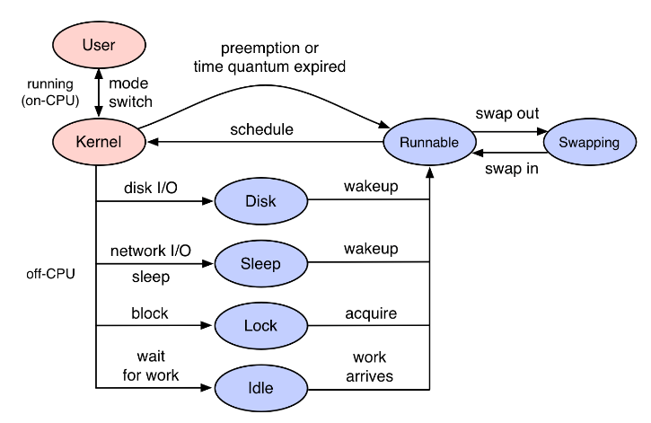

Performance issues can be categorized into one of two types:

- **On-CPU**: where threads are spending time running on-CPU.
- **Off-CPU**: where time is spent waiting while blocked on I/O, locks, timers, paging/swapping, etc.



Threads can leave CPU for a number of reasons, including I/O and locks, but also some that are unrelated to the current thread's execution, including involuntary context switching due to high demand for CPU resources, and interrupts. Whatever the reason, if this occurs during a workload request (a synchronous code-path), then it is introducing latency.


## Introduction 

While I've been promoting off-CPU analysis for over a decade,**it is still not a widely used methodology**, in part due to the lack of tools in production Linux environments to measure it. **That is now changing with eBPF** and newer Linux kernels (4.8+).

### 1. CPU Sampling

许多传统的分析工具都使用定时采样所有CPU的活动，以一定的时间间隔或速率（例如99赫兹）收集当前指令地址（程序计数器）.On Linux, the perf  tool in sampling mode does timed CPU sampling.


Brendan Gregg

https://www.youtube.com/watch?v=bj3qdEDbCD4

http://www.brendangregg.com/ebpf.html


问题:

ebpf能不能用内核以外的库


Linux Tracing — A Purposefully Over-Summarized History 

- 2004: kprobes/kretprobes 
- 2008: ftrace 
- 2009: perf_events 
- 2009: tracepoints • 
  - Enable-able logging functions that pack log content into documented structs 
- 2012: uprobes • 
- 2015: eBPF tracing integration (Linux 4.1+)


## eBPF简介

eBPF is also useful for debugging the kernel and carrying out performance analysis; programs can be attached to tracepoints, kprobes, and perf events. Because eBPF programs can access kernel data structures, developers can write and test new debugging code without having to recompile the kernel. The implications are obvious for busy engineers debugging issues on live, running systems. It's even possible to use eBPF to debug user-space programs by using Userland Statically Defined Tracepoints.


There are inherent security and stability risks with allowing user-space code to run inside the kernel. So, a number of checks are performed on every eBPF program before it is loaded. The first test ensures that the eBPF program terminates and does not contain any loops that could cause the kernel to lock up. This is checked by doing a depth-first search of the program's control flow graph (CFG). Unreachable instructions are strictly prohibited; any program that contains unreachable instructions will fail to load.

The second stage is more involved and requires the verifier to simulate the execution of the eBPF program one instruction at a time. The virtual machine state is checked before and after the execution of every instruction to ensure that register and stack state are valid. Out of bounds jumps are prohibited, as is accessing out-of-range data.


Lastly, the verifier uses the eBPF program type (covered later) to restrict which kernel functions can be called from eBPF programs and which data structures can be accessed. Some program types are allowed to directly access network packet data, for example.


## kernel function

A limited set of kernel functions may be called from eBPF programs. These functions provide read-write access to eBPF maps, may be used to retrieve current processor id and task pointer and also provide access to perf events.

Note that all eBPF programs need to be always compiled against the kernel-headers of the specific kernel where these will run.


由 eBPF 带来的性能开销通常可以忽略不计，这让它非常适合做[应用监控](https://sematext.com/application-monitoring/)和跟踪很重的系统执行。窗口用户没有 eBPF，但是他们可以使用[窗口事件跟踪](https://sematext.com/blog/fibratus-windows-kernel-logging/)。


https://github.com/iovisor/bcc/blob/master/tools/cpudist_example.txt

http://www.helight.info/blog/2020/linux-kernel-observability-ebpf/

https://opensource.googleblog.com/2016/11/cilium-networking-and-security.html

https://github.com/cilium/cilium

https://blog.csdn.net/M2l0ZgSsVc7r69eFdTj/article/details/90322840

https://github.com/iovisor/bcc/issues/2247

https://stackoverflow.com/questions/60383861/failure-to-compare-strings-with-ebpf


The **kernel** runs a verifier on the bytecode to make sure the **program** is safe to run (**kernel**/**bpf**/verifier. c). The **kernel** JiT-compiles the bytecode to native code and inserts it in (or attaches to) the specified code location. The inserted code writes data to ringbuffers or generic key-value maps.

https://www.collabora.com/news-and-blog/blog/2019/04/05/an-ebpf-overview-part-1-introduction/


https://lwn.net/Articles/740157/

```

# define BPF program
prog = """
#include <uapi/linux/resource.h>
#include <uapi/linux/time.h>
#include <linux/sched.h>

int hello(void *ctx) {

    struct task_struct *task;
    task = (struct task_struct *)bpf_get_current_task();
    struct rusage r;
    getrusage(task,RUSAGE_SELF, &r);

    bpf_trace_printk("Hello, World!\\n");
    return 0;
}

"""

# load BPF program
b = BPF(text=prog)
# b.attach_kprobe(event=b.get_syscall_fnname("clone"), fn_name="hello")

b.attach_uprobe(name="/home/tomwu/install/node-v8.15.0/node",
                            sym="uv_accept",
                            fn_name="hello")

# header
print("%-18s %-16s %-6s %s" % ("TIME(s)", "COMM", "PID", "MESSAGE"))

# format output
while 1:
    try:
        (task, pid, cpu, flags, ts, msg) = b.trace_fields()
    except ValueError:
        continue
    except KeyboardInterrupt:
        exit()
    printb(b"%-18.9f %-16s %-6d %s" % (ts, task, pid, msg))


#   int p_id = 10718;
#     struct pid *pid_struct;
#     struct task_struct *task;
#     find_get_pid(10718);
#     get_pid_task(find_get_pid(10718),PIDTYPE_PID);

# pid_struct = find_get_pid(10718);
# task = pid_task(pid_struct,PIDTYPE_PID);

```

