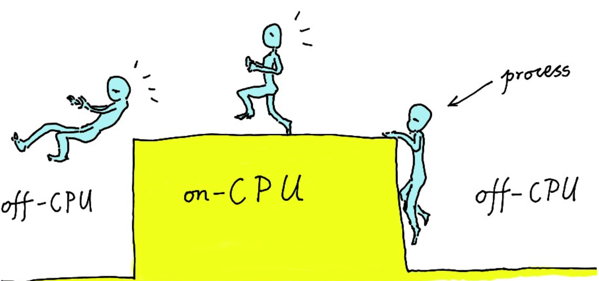

本文是阅读了章亦春（现任CloudFlare Inc.系统工程师）的 文章：《动态追踪技术漫谈》

所做的笔记和一点补充

文章的原文在这里：

https://blog.csdn.net/scdxmoe/article/details/73326099

# 动态追踪技术漫谈

我们运行的软件系统也变得越来越复杂，我们知道它会分成很多很多层次，包括操作系统内核然后上面是各种系统软件，像数据库和 Web 服务器，再往上有脚本语言或者其他高级语言的虚拟机、解释器及即时（JIT）编译器，顶上则是应用层面的各种业务逻辑的抽象层次和很多复杂的代码逻辑。

这些巨大的挑战带来的最严重的后果就是，今天的软件工程师正在迅速地丧失对整个生产系统的洞察力和掌控力。

一个大问题就是性能问题

现在大家都在拥抱云计算和大数据，这种大规模的生产环境中的诡异问题只会越来越多，很容易占据工程师大部分的时间和精力。大部分问题其实是线上才有的问题，很难复现，或者几乎无法复现。

动态追踪技术通常是基于操作系统内核来实现的。操作系统内核其实可以控制整个软件世界，因为它其实是处于“造物主”这样的一个地位。它拥有绝对的权限，同时它可以确保我们针对软件系统发出的各种“查询”不会影响到软件系统本身的正常运行。

在动态追踪里面一般是通过探针这样的机制来发起查询。我们会在软件系统的某一个层次，或者某几个层次上面，安置一些探针，然后我们会自己定义这些探针所关联的处理程序。

这有点像中医里面的针灸，就是说如果我们把软件系统看成是一个人，我们可以往他的一些穴位上扎一些“针”，那么这些针头上面通常会有我们自己定义的一些“传感器”，我们可以自由地采集所需要的那些穴位上的关键信息，然后把这些信息汇总起来，产生可靠的病因诊断和可行的治疗方案。

**各种基于动态追踪的分析工具的运行方式都是一种“热插拔”的方式**，就是说，我们随时可以运行这个工具，**随时进行采样**，随时结束采样，而不用管目标系统的当前状态。

与其在生产系统里面人工去埋点去记日志，再搜集日志入库，**还不如把整个生产系统本身看成是一个可以直接查询的“数据库”**，我们直接从这个“数据库”里安全快捷地得到我们想要的信息，而且绝不留痕迹，绝不去采集我们不需要的信息:

## 方法论

在这个过程当中，我们推荐的策略是一种所谓的小步推进、连续求问的方式。也就是说我们并不指望一下编写一个很庞大很复杂的调试工具，一下子采集到所有可能需要的信息，从而一下子解决掉最终的问题。相反，我们会把最终问题的假设，分解成一系列的小假设，然后逐步求索，逐步验证，不断确定会修正我们的方向，不断地调整我们的轨迹和我们的假设，以接近最终的问题。这样做有一个好处是，每一个步骤每一个阶段的工具都可以足够的简单，那么这些工具本身犯错的可能性就大大降低。Brendan 也注意到他如果尝试编写多用途的复杂工具，这种复杂工具本身引入 bug 的可能性也大大提高了。而错误的工具会给出错误的信息，从而误导我们得出错误的结论。这是非常危险的。简单工具的另一大好处是，在采样过程当中对生产系统产生的开销也会相对较小，毕竟引入的探针数目较少，每个探针的处理程序也不会有太多太复杂的计算。这里的每一个调试工具都有自己的针对性，都可以单独使用，那么这些工具在未来得到复用的机会也大大提高。所以总的来说，这种调试策略是非常有益的。

值得一提的是，这里我们拒绝所谓的“大数据”的调试做法。即我们并不会去尝试一下子采集尽可能全的信息和数据。相反，我们在每一个阶段每一个步骤上只采集我们当前步骤真正需要的信息。在每一步上，基于我们已经采集到的信息，去支持或者修正我们原来的方案和原来的方向，然后去指导编写下一步更细化的分析工具。

## 调试符号

较复杂的动态追踪都会依赖于调试符号

## Linux 内核的支持

Linux 主线版本很早就拥有了 kprobes 这种机制，可以动态地在指定的内核函数的入口和出口等位置上放置探针，并定义自己的探针处理程序。

用户态的动态追踪支持姗姗来迟，经历了无数次的讨论和反复修改。从官方 Linux 内核的 3.5 这个版本开始，引入了基于 inode 的 uprobes 内核机制，可以安全地在用户态函数的入口等位置设置动态探针，并执行自己的探针处理程序。再后来，从 3.10 的内核开始，又融合了所谓的 uretprobes 这个机制，可以进一步地在用户态函数的返回地址上设置动态探针。uprobes 和 uretprobes 加在一起，终于可以取代 utrace 的主要功能。

Dtrace，或者其他调试工具，是如何获取系统调用的栈信息，为什么能统计系统调用的次数？在linux中，这个问题的答案是kprobe

抛开各种细节，简单的描述就是：内核提供了一组方法，使用这组方法可以在内核任意一个方法上加一个钩子，每当内核执行到钩子的时候，就可以执行用户自定义的代码。

具体的实现原理是：

比如现在要在**do_fork**上加一个钩子，首先根据名称获取该方法在内核中的代码地址，类似于`cat /proc/kallsyms | grep do_fork`返回的地址 ffffffff81084950 处的代码（是do_fork的地址 ），**并将其改成一个软中断**。当程序执行到这条指令到时候，就会陷入中断处理程序，**中断处理程序执行用户指定到代码**，这样就实现了hook。

************

最近几年 Linux 的主线开发者们，把原来用于防火墙的 netfilter 里所使用的动态编译器，即 [BPF](https://www.kernel.org/doc/Documentation/networking/filter.txt)，扩展了一下，得到了一个所谓的 [eBPF](http://www.brendangregg.com/blog/2015-05-15/ebpf-one-small-step.html)，可以作为某种更加通用的内核虚拟机。通过这种机制，我们其实可以在 Linux 中构建类似 DTrace 那种常驻内核的动态追踪虚拟机。而事实上，最近已经有了一些这方面的尝试，比如说像 [BPF 编译器](https://github.com/iovisor/bcc/blob/master/README.md)（BCC）这样的工具，使用 LLVM 工具链来把 C 代码编译为 eBPF 虚拟机所接受的字节码。总的来说，Linux 的动态追踪支持是变得越来越好的。特别是从 3.15 版本的内核开始，动态追踪相关的内核机制终于变得比较健壮和稳定了。

**JIT**，实时把虚拟机指令编译成机器指令。

## 硬件追踪

操作系统是直接和硬件打交道的，那么通过追踪操作系统的某些驱动程序或者其他方面，我们也可以间接地去分析与之相接的硬件设备的一些行为和问题。

同时，现代硬件，比如说像 Intel 的 CPU，一般会内置一些性能统计方面的寄存器（[Hardware Performance Counter]），通过软件读取这些特殊寄存器里的信息，我们也可以得到很多有趣的直接关于硬件的信息。比如说 Linux 世界里的 [perf]工具最初就是为了这个目的。

