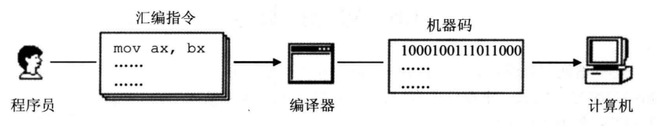
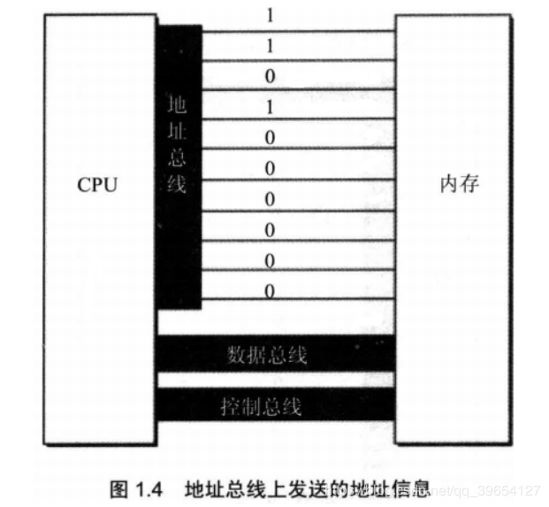
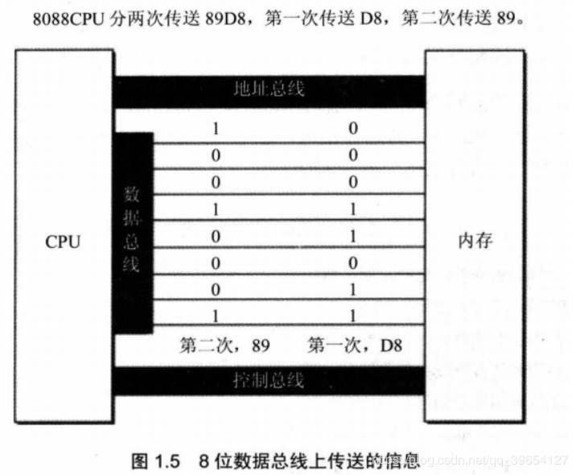
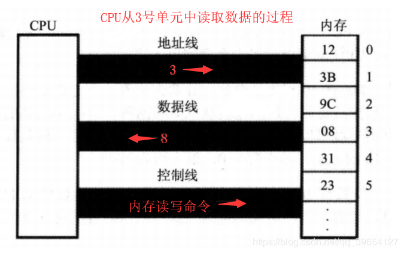
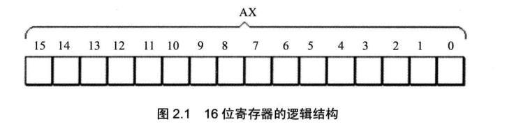
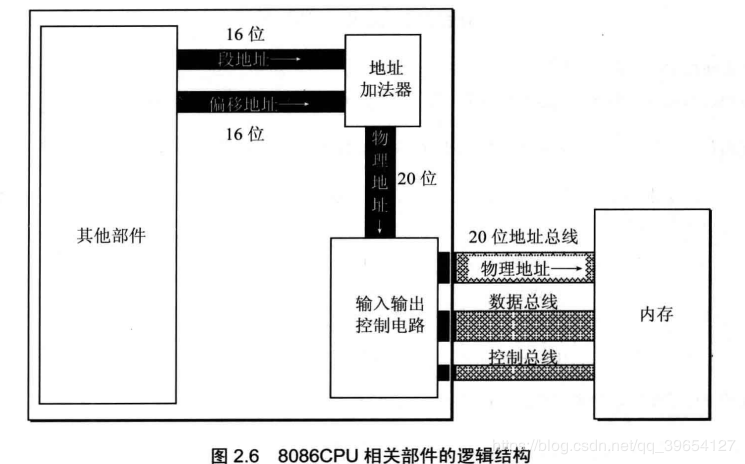
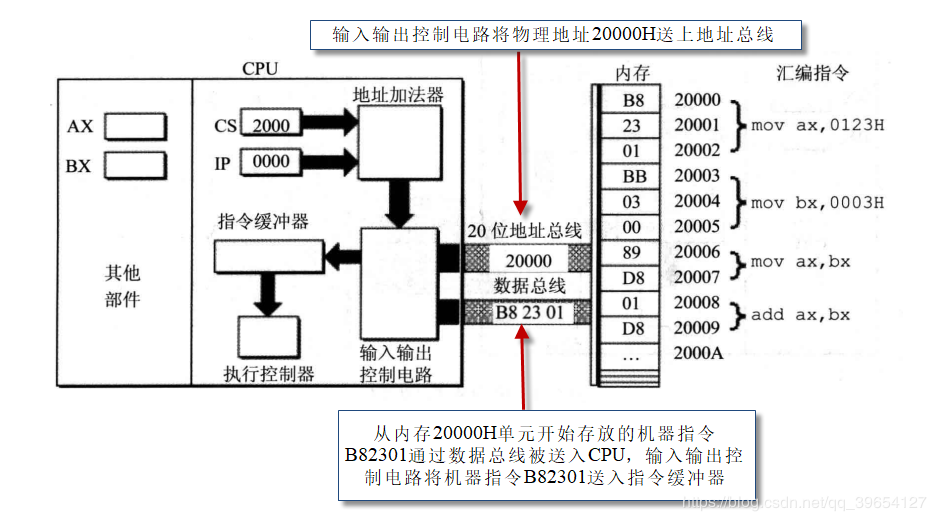

机器指令：CPU能直接识别并执行的二进制编码

汇编指令：汇编指令是机器指令的助记符，同机器指令一一对应。

指令集：每种CPU都有自己的汇编指令集。




CPU要想进行数据的读写，必须和外部器件（标准的说法是芯片）进行以下3类信息的交互。

1. **地址总线**：CPU通过地址总线来指定存储单元

   

2. **数据总线**：CPU与内存或其他器件之间的数据传送是通过数据总线来进行的

   

   8根数据线一次可传送一个8位二进制数据（即一个字节），传送2个字节需要两次；16根数据线一次可传送2个字节（内存对齐核心原理）

3. 控制总线**：CPU对外部器件的控制是通过控制总线来进行的。


### 2、CPU对存储器的读写



1、 CPU通过地址线将地址信息3发出。
2、 CPU通过**控制线发出内存读命令**，选中存储器芯片，并通知它，将要从中读取数据。
3、 存储器将3号单元中的数据8通过数据线送入CPU。写操作与读操作的步骤相似。


## 3、CPU对外设的控制
CPU对外设都不能直接控制，如显示器、音箱、打印机等。

直接控制这些设备进行工作的是插在扩展插槽上的接口卡。

扩展插槽通过总线和CPU相连，所以接口卡也通过总线同CPU相连。CPU可以直接控制这些接口卡，从而实现CPU对外设的间接控制。

如：CPU无法直接控制显示器，但CPU可以直接控制显卡，从而实现对显示器的间接控制


# 二、寄存器

8086CPU有14个寄存器：AX、BX、CX、DX、SI、DI、SP、BP、IP、CS、SS、DS、ES、PSW都是16位

16位结构CPU具有下面几方面的结构特性。

- 运算器一次最多可以处理16位的数据；
- 寄存器的最大宽度为16位；
- 寄存器和运算器之间的通路为16位。




## 2、通用寄存器

**通用寄存器**：通常用来存放一般性的数据，有AX、BX、CX、DX，它们可分为两个可独立使用的8位寄存器，

| 16位 | 8高位 | 8低位 |
| ---- | ----- | ----- |
| AX   | AH    | AL    |
| BX   | BH    | BL    |
| CX   | CH    | CL    |
| DX   | DH    | DL    |


## 3、8086CPU给出物理地址的方法

8086CPU又是16位结构，在内部一次性处理、传输、暂时存储的地址为16位。
从8086CPU的内部结构来看，如果将地址从内部简单地发出，那么它只能送出16位的地址，表现出的寻址能力只有64KB。
8086CPU采用一种在内部用两个16位地址合成的方法来形成一个20位的物理地址。


当8086CPU要读写内存时：

**CPU中的相关部件提供两个16位的地址，一个称为段地址，另一个称为偏移地址**；
地址加法器将两个16位地址合成为一个20位的物理地址；
地址加法器采用物理地址 = **段地址×16** + 偏移地址的方法用段地址和偏移地址合成物理地址。

例如，8086CPU要访问地址为123C8H的内存单元，1230H左移一位(空出4位)加上00C8H合成123C8H


## 4、段寄存器
我们可以**将一段内存定义为一个段**，用一个段地址指示段，**用偏移地址访问段内的单元**，**可以用分段的方式来管理内存**。

用一个段存放数据，将它定义为“数据段”；

用一个段存放代码，将它定义为“代码段”；

用一个段当作栈，将它定义为“栈段”。


注意：

一个段的起始地址一定是16的倍数；
偏移地址为16位，变化范围为0-FFFFH，所以一个段的长度最大为64KB。
CPU可以用不同的段地址和偏移地址形成同一个物理地址。
段寄存器：8086CPU有4个段寄存器：CS、DS、SS、ES，提供内存单元的段地址。


## 补充  分段与分页

某个程序大小是10M，然后，就需要有**连续的**10M内存空间才能把这个程序装载到内存里面。如果无法找到连续的10M内存，就无法把这个程序装载进内存里面，程序也就无法得到运行。

1、地址空间不隔离

举个例子，假设我有两个程序，一个是程序A，一个是程序B。程序A在内存中的地址**假设**是0x00000000~0x00000099，程序B在内存中的地址**假设**是0x00000100~x00000199。那么假设你在程序A中，本来想操作地址0x00000050，不小心**手残**操作了地址0x00000150，那么，不好的事情或许会发生。你影响了程序A也就罢了，你把程序B也搞了一顿。


2、程序运行时候的地址不确定

因为我们程序每次要运行的时候，都是需要装载到内存中的，假设你在程序中写死了要操作某个地址的内存，例如你要地址0x00000010。但是问题来了，你能够保证你操作的地址0x00000010真的就是你**原来**想操作的那个位置吗？很可能程序第一次装载进内存的位置是0x00000000~0x00000099，而程序第二次运行的时候，这个程序装载进内存的位置变成了0x00000200~0x00000299，而你操作的0x00000010地址压根就不是属于这个程序所占有的内存。


3、内存使用率低下

举个例子，假设你写了3个程序，其中程序A大小为10M，程序B为70M，程序C的大小为30M你的计算机的内存总共有100M。

这三个程序加起来有110M，显然这三个程序是无法**同时**存在于内存中的。

并且最多只能够同时运行两个程序。可能是这样的，程序A占有的内存空间是0x00000000～0x00000009，程序B占有的内存空间是0x00000010～0x00000079。假设这个时候程序C要运行该怎么做？可以**把其中的一个程序换出到磁盘上**，然后再把程序C装载到内存中。假设是把程序A换出，那么程序C还是无法装载进内存中，因为内存中空闲的连续区域有两块，一块是原来程序A占有的那10M，还有就是从0x00000080～0x00000099这20M，所以，30M的程序C无法装载进内存中。那么，唯一的办法就是把程序B换出，保留程序A，但是，此时会有60M的内存无法利用起来，**很浪费**对吧。


分段这种技术就出现了。

为了实现分段的这个技术，需要引入虚拟地址空间的概念。


分段这个技术做了一件什么事情呢？

它**把虚拟地址空间映射到了物理地址空间，并且你写的程序操作的是虚拟地址**。

假设，程序A的虚拟地址空间是0x00000100～0x00000200。此时，不仅需要一块**连续的**物理内存来存放程序A，还需要把程序A的虚拟地址空间映射到（转换为）物理地址空间。


那么分段的技术可以解决什么问题呢？可以解决上面1、2两个问题。

在问题1中，假设程序A的**虚拟**地址空间是0x00000000~0x00000099，映射到的物理地址空间是0x00000600~0x00000699，程序B的**虚拟**地址空间是0x00000100~0x00000199，映射到的物理地址空间是0x00000300~0x00000399。假设你还是手残，在程序A中操作了地址0x00000150，但是英文此时的地址0x00000150是虚拟的，而虚拟化的操作是在操作系统的掌控中的，所以，操作系统有能力判断，这个虚拟地址0x00000150是有问题的，然后阻止后续的操作。所以，**体现出了**隔离性。（另一种体现隔离性的方式就是，操作同一个虚拟地址，实际上**可能**操作的是不同的物理地址）

（注意，实际上，**很可能程序A和程序B的虚拟地址都是0x00000000~0x00000099**。这里的举例只是为了方便理解。）

问题2也很好的解决了。正是因为这种映射，使得程序**无需关注物理地址**是多少，只要虚拟地址没有改变，那么，程序就不会操作地址不当。


分段机制，映射的是一片**连续的**物理内存，所以问题3得不到解决。分页这个技术仍然是一种虚拟地址空间到物理地址空间映射的机制。但是，**粒度更加的小了**。单位不是整个程序，而是某个“页”，一段虚拟地址空间组成的某一页映射到一段物理地址空间组成的某一页。


**注意：分段还是需要一块连续的物理内存来存放的！！！**


### 1、CS和IP

CS为代码段寄存器，IP为指令指针寄存器，

CPU将CS、IP中的内容当作指令的段地址和偏移地址,用它们合成指令的物理地址,

**CPU将CS:IP指向的内容当作指令执行。(即PC)**



8086CPU的工作过程简要描述

1. 从CS:IP指向的内存单元读取指令，读取的指令进入指令缓冲器；
2. IP=IP+所读取指令的长度，从而指向下一条指令；
3. 执行指令。转到步骤1，重复这个过程。
4. 

在8086CPU加电启动或复位后（即CPU刚开始工作时）CS和IP被设置为CS=FFFFH，IP=0000H，即在8086PC机刚启动时，FFFF0H单元中的指令是8086PC机开机后执行的第一条指令。

*******

### Call 与 return 指令

`ret`指令用栈中的数据，修改IP的内容，从而实现近转移
`retf`指令用栈的数据，修改CS和IP的内容，从而实现远转移

CPU执行`ret`指令时，相当于进行：

```
pop IP1
```

CPU执行`retf`指令时，相当于进行：

```
pop IP
pop CS
```


> call指令隐含操作push EIP，ret指令隐含操作 pop EIP，两条指令完全对应起来.

**EIP**寄存器用于保存下一个要执行的命令地址。在**函数返回**的过程最后执行**ret**，就是把之前入栈的**返回地址**出栈，并放入到**EIP**寄存器。


