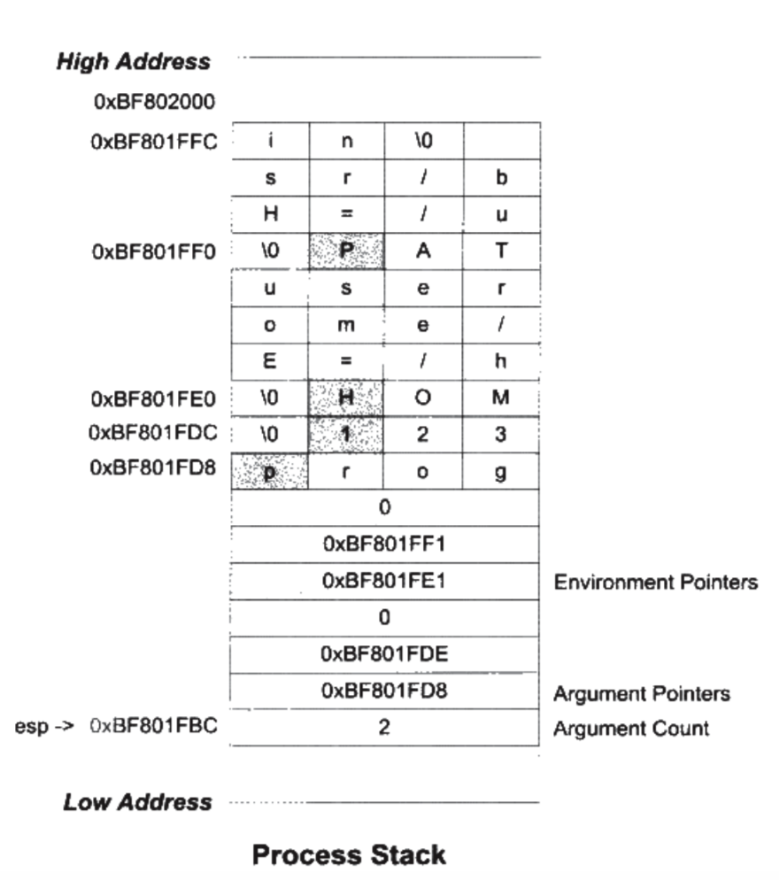

xxd的作用就是将一个文件以十六进制的形式显示出来


另外，在vim中也可以把文件转换为16进制来显示：

:%!xxd

返回正常显示：

:%!xxd -r


# 《程序员的自我修养 — 链接，装载与库》

## 2 编译和链接

在linux下只需要一个简单的命令（假设源代码文件名为hello.c）：

```
$ gcc hello.c
$ ./a.out
```

事实上，上述gcc过程可分解为4个步骤：预处理、编译、汇编、链接，如图所示：


#### 1、 预编译（prepressing）

预编译过程主要处理源代码文件中以”#”开头的预编译指令。比如”#include”、”#define”等，主要处理规则如下：

- 将所有的”#define”删除，并展开所有的宏定义

- 处理所有条件预编译指令，比如”#if”，”#ifdef”，”#elif” ”，#else”，”#endif”

- 处理”#include”预编译指令，将被包含的文件插入到该预编译指令的位置。

- 删除所有的注释“//”和“/**/”

- 添加行号和文件名标识，比如#2 “hello.c” 2。

- 保留所有的#pragma编译器指令

  

#### 2、 编译（compliation）

编译过程就是把预处理完的文件进行一系列**词法分析、语法分析、语义分析**及优化后生产相应的**汇编代码**文件，此过程是整个程序构建的核心部分，也是最复杂的部分之一。

#### 3、 汇编（assembly）

汇编器是**将汇编代码转变成机器可以执行的指令**，每一个汇编语句几乎对应一条机器令。所以汇编器的汇编过程相对于编译器来讲比较简单，它没复杂的语法，也没有语义，也不需要做指令优化，**只是根据汇编指令和机器指令的对照表一一翻译就可以了**。其汇编过程相当于如下命令：

```
as hello.s –o hello.o
```

#### 4、 链接（linking）

比如我们在程序模块main.c中使用另外一个模块func.c中的函数foo()。**我们在main.c模块中每一处调用foo()的时候都必须确切知道foo()这个函数的地址**，但是由于每个模块都是**单独编译**的，在编译器编译main.c的时候，它并不知道foo()函数的地址，所以它暂时把这些调用foo()的指令的目标地址**搁置**，等待最后链接的时候**由链接器去将这些指令的目标地址修正**。


假设我们有个全局变量叫做var，它在目标文件A里面。我们在目标文件B里面要访问这个全局变量，比如我们在目标文件B里面有这么一条指令：

```
mov1 $0x2a, var
```

这条指令就是给这个var变量赋值0x2a，相当于C语言里面的语句var = 42。然后我们编译目标文件B，得到这条指令机器码，如图：


由于在编译文件B的时候，编译器并不知道变量var的目标地址，所以编译器在没法确定地址的情况下，将这条mov指令的目标地址置为0，等待链接器在将目标文件A和B链接起来的时候，再将其修正。


# 3 目标文件里有什么

目标文件从结构上讲，它是已经编译后的可执行文件格式，只是还没有经过链接的过程，其中可能有些符号或有些地址还没有被调整。其实它本身就是按照可执行文件格式存储的，只是跟真正的可执行文件在结构上稍有不同。

**它跟可执行文件的内容与结构很相似，所以一般跟可执行文件格式一起采用一种格式存储.**


**可重定位文件**：代码+数据，可用来链接成可执行文件或共享目标文件。
 *如 Linux* **.o** *和 Windows* **.obj**

**可执行文件**：可以直接执行。
 *如 Linux* **.sh** *和 Windows* **.exe**

**共享目标文件**：代码+数据，链接器使用它们可重定位或共享目标文件链接生成新的目标文件，或者与可执行文件结合，作为映像一部分运行。
 *如 Linux* **.so** *和 Windows* ***.dll\***

**核心转储文件**：程序意外终止时转储一些信息。
 *如 Linux* **core dump**


### Attention：注意 .o是已经经过汇编的，只是还没有经过链接


### 3.1 目标文件的格式

目标文件中的内容至少有编译后的机器指令代码、数据，还包括了链接时所须要的一些信息，比如符号表、调试信息、字符串等。一般目标文件将这些信息按不同的属性，以”节”(Section)的形式存储，有时候叫”段”(Segment)，在一般情况下，它们都表示一个一定长度的区域，基本上不加以区别，唯一的区别是在链接视图和装载视图的时候。

 

**上图的可执行文件(目标文件)的格式就是ELF**，从图中可以看到，ELF文件的开头是一个”文件头”，它描述了整个文件的文件属性.

文件头后面就是各个段的内容，比如代码段保存的就是程序的指令，数据段保存的就是程序的静态变量等。

一般C语言的编译后执行语句都编译汇编成机器代码，保存在.text段；

已初始化的全局变量和局部静态变量都保存在.data段；

未初始化的全局变量和局部静态变量一般放在一个叫”.bss”的段里。未初始化的全局变量和局部静态变量默认值都为0，**本来它们也可以被放在.data段，但是因为它们都是0**，所以为它们在.data段分配空间并且存放数据0是没有必要的。程序运行的时候它们的确是要占内存空间的，并且可执行文件必须记录所有未初始化的全局变量和局部静态变量的大小总和，记为.bss段。所以.bss段只是为未初始化的全局变量和局部静态变量预留位置而已，它并没有内容，所以它在文件中也不占据空间


ELF 里面几个重要的段 ：

1. .text      （存放 ： 代码 和 局部变量）
2. .bss   （存放 ： 未初始化的数据）
3. .data （存放：初始化的数据）
4. .rodata(read only data)   （存放 ： 只读数据）
5.  .rel.text   （存放 ： 重定位数据）


### 3.3 挖掘SimpleSection.o

```
int printf(const char* format, ...);
 
int global_init_var = 84;
int global_uninit_var;
 
void func1(int i)
{
	printf("%d\n", i);
}
 
int main(void)
{
	static int static_var = 85;
	static int static_var2;
 
	int a = 1;
	int b;
 
	func1(static_var + static_var2 + a + b);
 
	return a;
}
```

执行

 ``gcc -c SimpleSection.c``

 会生成目标文件SimpleSection.o

执行：

​	``$ objdump -h SimpleSection.o`` 

使用objdump查看目标文件内部的结构，参数”-h”就是把ELF文件的各个段的基本信息打印出来


从执行结果得知，SimpleSection.o的段除了最基本的代码段(.text)、数据段(.data)和BSS段(.bss)以外，还有只读数据段(.rodata)、注释信息段(.comment)、堆栈提示段(.note.GNU-stack)、.eh_frame段。


有一个专门的命令叫做”size”，它可以用来查看ELF文件的代码段、数据段和BSS段的长度(dec表示3个段长度的和的十进制，hex表示长度和的十六进制)，

``size SimpleSection.o`` 

**代码段**：挖掘各个段的内容，离不开objdump，objdump的”-s”参数可以将所有段的内容以十六机制的方式打印出来，**”-d”参数可以将所有包含指令的段反汇编**，执行结果如下图所示：


对照下面的反汇编结果，可以明显地看到，.text段里面所包含的正是SimpleSection.c里两个函数func1()和main()的指令。.text段的第一个字节”0x55”就是”func1()”函数的第一条”push %rbp”指令，而最后一个字节”0xc3”正是main()函数的最后一条指令”retq”。**（一个字节占八位）**


**图里面只显示了代码段**：

SimpleSection.c里面在调用”printf”的时候，用到了一个字符串常量”%d\n”，它是一种只读数据，所以它被放到了”.rodata”段，

“.rodata”段存放的是只读数据，一般是程序里面的只读变量(如const修饰的变量)和字符串常量。单独设立”.rodata”段有很多好处，不光在语义上支持了C++的const关键字，而且操作系统在加载的时候可以将”.rodata”段的属性映射成只读，这样对于这个段的任何修改操作都会作为非法操作处理，保证了程序的安全性。

“.data”段里的前4个字节，从低到高分别为0x54, 0x00, 0x00, 0x00。这个值刚好是global_init_var，即十进制的84。global_init_var是个4字节长度的int类型，为什么存放的次序是0x54, 0x00, 0x00,, 0x00而不是0x00, 0x00, 0x00, 0x54？这涉及CPU的字节序(Byte Order)的问题，也就是所谓的大端(Big-endian)和小端(Little-endian)的问题。而最后4个字节刚好是static_var的值，即85.


有时候你可能希望变量或某些部分代码能够放到你所指定的段中去，以实现某些特定的功能。比如为了满足某些硬件的内存和I/O的地址布局，或者是像Linux操作系统内核中用来完成一些初始化和用户空间复制时出现页错误异常等。GCC提供了一个扩展机制，使得程序员可以指定变量所处的段：

__attribute__((section(“FOO”))) int global = 42;
__attribute__((section(“BAR”))) void foo() {}
我们在全局变量或函数之前加上”__attribute__((section(“name”)))”属性就可以把相应的变量或函数放到以”name”作为段名的段中。

### 3.4. ELF文件结构的描述

**什么是ELF ?**
 ELF ( Executable Linkable Format 的缩写)，简单的来讲 ELF 文件包括：

 **目标文件（.o 文件） + 可执行文件 （a.out） + 静态库/动态库（.so文件）** 。


**注意 .o是已经经过汇编的，只是还没有经过链接**


**ELF的结构是什么？**

ELF 里面应该存放在二进制的代码（因为它已经是被编译和汇编过的代码了），这个代码应该包括着 代码 + 数据。在ELF文件结构里面，他们分别被存放到不同的段里面。


### 段表

段表：ELF文件中有很多各种各样的段，**这个段表(Section Header Table)就是保存这些段的基本属性的结构**。段表是ELF文件中除了文件头以外最重要的结构，它描述了ELF的各个段的信息，比如每个段的段名、段的长度、在文件中的偏移、读写权限及段的其它属性。也就是说，ELF文件的段结构就是由段表决定的，编译器、链接器和装载器都是依靠段表来定位和访问各个段的属性的。段表在ELF文件中的位置由ELF文件头的”e_shoff”成员决定。


“objdump -h”命令只是把ELF文件中关键的段显示了出来，**而省略了其它的辅助性的段**，比如：符号表、字符串表、段名字符串表、重定位表等。可以使用readelf工具来查看ELF文件的段，它显示出来的结果才是真正的段表结构，如下图所示：


段表的结构比较简单，它是一个以”Elf64_Shdr”结构体为元素的数组。数组元素的个数等于段的个数，每个”Elf64_Shdr”结构体对应一个段。”

#### 重定位表

SimpleSenction.o中有一个叫做”.rela.text”(注：书中为”.rel.text”)的段，它的类型(sh_type)为”SHT_RELA”(注：SHT_RELA: Relocation entries with addends; SHT_REL: Relocation entries, no addends)，也就是说它是一个重定位表(Relocation Table)。

**链接器在处理目标文件时，须要对目标文件中某些部位进行重定位**，即代码段和数据段中那些对绝对地址的引用的位置。这些重定位的信息都记录在ELF文件的重定位表里面，对于每个须要重定位的代码段或数据段，都会有一个相应的重定位表。

比如SimpleSection.o中的”.rela.text”就是针对”.text”段的重定位表，**因为”.text”段中至少有一个绝对地址的引用，那就是对”printf”函数的调用**；而”.data”段则没有对绝对地址的引用，它只包含了几个常量，所以SimpleSection.o中没有针对”.data”段的重定位表”.rela.data”。一个重定位表同时也是ELF的一个段，那么这个段的类型(sh_type)就是”SHT_RELA”类型的，它的”sh_link”表示符号表的下标，它的”sh_info”表示它作用于哪个段。比如”.rela.text”作用于”.text”段，而”.text”段的下标为”1”，那么”.rela.text”的”sh_info”为”1”。

#### 字符串表

字符串表：ELF文件中用到了很多字符串，比如段名、变量名等。因为字符串的长度往往是不定的，所以用固定的结构来表示它比较困难。一种很常见的做法是把字符串集中起来存放到一个表，然后使用字符串在表中的偏移来引用字符串。通过这种方法，在ELF文件中引用字符串只需给出一个数字下标即可，不用考虑字符串长度的问题。一般字符串表在ELF文件中也以段的形式保存，常见的段名为”.strtab”或”.shstrtab”。这两个字符串表分别为字符串表(String Table)和段表字符串(Section Header String Table)。顾名思义，字符串表用来保存普通的字符串，比如符号的名字；段表字符串表用来保存段表中用到的字符串，最常见的就是段名(sh_name)。

### 3.5 链接的接口---符号  在链接中 函数和变量统称为符号

#### 

链接过程的本质就是要把多个不同的目标文件之间相互”粘”到一起。

在链接中，目标文件之间相互拼合实际上是**目标文件之间对地址的引用**，即**对函数和变量的地址的引用**。比如目标文件B要用到了目标文件A中的函数”foo”，那么我们就称目标文件A定义(Define)了函数”foo”，称目标文件B引用(Reference)了目标文件A中的函数“foo”。这两个概念也同样适用于变量。每个函数或变量都有自己独特的名字，才能避免链接过程中不同变量和函数之间的混淆。**在链接中，我们将函数和变量统称为符号(Symbol)**，函数名或变量名就是符号名(Symbol Name)。

**每一个目标文件都会有一个相应的符号表**

我们可以将符号看做是链接中的粘合剂，整个链接过程正是基于符号才能够正确完成。链接过程中很关键的一部分就是符号的管理，**每一个目标文件都会有一个相应的符号表**(Symbol Table)，这个表里面记录了目标文件中所用到的所有符号。

(1). 定义在本目标文件的全局符号，可以被其它目标文件引用。比如SimpleSection.o里面的”func1”、”main”和”global_init_var”。

(2). 在本目标文件中引用的全局符号，却没有定义在本目标文件，这一般叫做外部符号(External Symbol)，也就是我们前面所讲的符号引用。比如SimpleSection.o里面的”printf”。

(3). 段名，这种符号往往由编译器产生，它的值就是该段的起始地址。比如SimpleSection.o里面的”.text”、”.data”等。

(4). 局部符号，这类符号只在编译单元内部可见。比如SimpleSection.o里面的”static_var”和”static_var2”。调试器可以使用这些符号来分析程序或崩溃时的核心转储文件。**这些局部符号对于链接过程没有作用，链接器往往也忽略它们**。

(5). 行号信息，即目标文件指令与源代码中代码行的对应关系，它也是可选的。

对于我们来说，最值得关注的就是全局符号，即上面分类中的第一类和第二类。**因为链接过程只关心全局符号的相互”粘合”**，局部符号、段名、行号等都是次要的，它们对于其它目标文件来说是”不可见”的，在链接过程中也是无关紧要的。**我们可以使用很多工具来查看ELF文件的符号表，比如readelf、objdump、nm等**。

```cpp
#include <stdio.h>
int val2=100;
int main(){
    int val=100;

    printf("hello world \n ");
    return 0;
}
```

nm 命令查看

```bash
nm test1-2.o 
0000000000000000 T main
                 U printf
0000000000000000 D val2
```

# 4 链接

```
// a.c
extern int shared;

int main()
{
	int a = 100;
	swap(&a, &shared);
}
```


```
// b.c
int shared = 1;

void swap(int* a, int* b)
{
	*a ^= *b ^= *a ^= *b;
}
```


通过执行：`$ gcc -c a.c b.c ，生成a.o, b.o`。

对于多个输入目标文件，链接器如何将它们的各个段合并到输出文件？方法如下： 

按序叠加：一个最简单的方案就是将输入的目标文件按照次序叠加起来，如下图所示：就是直接将各个目标文件依次合并。但是这样做会造成一个问题，在有很多输入文件的情况下，输出文件将会有很多零散的段。这种做法非常浪费空间，因为每个段都需要有一定的地址和空间对齐要求，比如对于x86的硬件来说，**段的装载地址和空间的对齐单位是页，也就是4096字节**，那么就是说如果一个段的长度只有1个字节，它也要在内存中占用4096字节。这样会造成内存空间大量的内部碎片。


### 4.1.2 相似段合并

相似段合并：一个更实际的方法是将相同性质的段合并到一起，比如将所有输入文件的”.text”合并到输出文件的”.text”段，接着是”.data”段、”.bass”段等，如下图所示：**”.bss”段在目标文件和可执行文件中并不占用文件的空间，但是它在装载时占用地址空间**。所以链接器在合并各个段的同时，也将”.bss”合并，并且分配虚拟空间。


**“链接器为目标文件分配地址和空间”**这句话中的”地址和空间”其实有两个含义：**第一个是在输出的可执行文件中的空间；第二个是在装载后的虚拟地址中的虚拟地址空间**。对于有实际数据的段，比如”.text”和”.data”来说，它们在文件中和虚拟地址中都要分配空间，因为它们在这两者中都存在；而对于”.bss”这样的段来说，分配空间的意义只局限于虚拟地址空间，因为它在文件中并没有内容。


现在的链接器空间分配基本上都采用相似段合并，使用这种方法的链接器一般都采用一种叫两步链接(Two-pass Linking)的方法。**也就是说整个链接过程分两步**：

第一步：空间与地址分配：扫描所有的输入目标文件，并且获得它们的各个段的长度、属性和位置，并且将输入目标文件中的符号表中所有的符号定义和符号引用收集起来，统一放到一个全局符号表。这一步中，链接器将能够获得所有输入目标文件的段长度，并且将它们合并，计算出输出文件中各个段合并后的长度与位置，并建立映射关系。

第二步：符号解析与重定位：使用上面第一步中收集到的所有信息，读取输入文件中段的数据、重定位信息，并且**进行符号解析与重定位、调整代码中的地址**等。


现在使用ld链接器将”a.o”和”b.o”链接起来：$ ld a.o b.o -e main -o ab

”-e main”表示将main函数作为程序入口，**ld链接器默认的程序入口为_start**。”-o ab”表示链接输出文件名为ab，默认为a.out。使用objdump来查看链接前后地址的分配情况，如下图所示：


在链接之前，目标文件中的所有段的VMA都是0，因为虚拟空间还没有被分配，所以他们默认都为0.等到链接之后，可执行文件”ab”中的各个段都被分配到了相应的虚拟地址。这里的输出程序”ab”中，”.text”段被分配到了地址0x00000000004000e8，大小为0x00000071字节；”.data”段从地址0x 00000000006001b8开始，大小为0x00000004字节。可以看到，”a.o”和”b.o”的代码段被先后叠加起来，合并成”ab”的一个”.text”段，加起来的长度为0x00000071。所以”ab”的代码段里面肯定包含了main函数和swap函数的指令代码。


VMA表示Virtual Memory Addredd,即虚拟地址，LMA表示Load Memory Address，即加载地址，正常情况下这两个值应该是一样的，但是有些嵌入式系统中，特别是在那些程序放在ROM的系统中时，LMA和VMA是不相同的。

我们可以看到，**在链接之前，目标文件中的所有段的VMA都是0，因为虚拟空间还没有被分配，所以他们默认都为0**.等到链接之后，可执行文件”ab”中的各个段都被分配到了相应的虚拟地址。这里的输出程序”ab”中，”.text”段被分配到了地址0x00000000004000e8，大小为0x00000071字节；”.data”段从地址0x 00000000006001b8开始，大小为0x00000004字节。可以看到，”a.o”和”b.o”的代码段被先后叠加起来，合并成”ab”的一个”.text”段，加起来的长度为0x00000071。所以”ab”的代码段里面肯定包含了main函数和swap函数的指令代码。


### 4.1.3 **符号地址的确定**

在第一步的扫描和空间分配阶段，链接器按照前面介绍的空间分配方法进行分配，这时候输入文件中的各个段在链接后的虚拟地址就已经确定了，比如”.text”段起始地址为0x00000000004000e8，”.data”段的起始地址为0x 00000000006001b8。

当前面一步完成之后，链接器开始计算各个符号的虚拟地址。因为各个符号在段内的相对位置是固定的，所以这时候其实”main”、”shared”和”swap”的地址也已经是确定的了，只不过链接器须要给每个符号加上一个偏移量，使它们能够调整到正确的虚拟地址。比如我们假设”a.o”中的”main”函数相对于”a.o”的”.text”段偏移是X，但是经过链接合并以后，”a.o”的”.text”段位于虚拟地址0x00000000004000e8，那么”main”的地址应该是0x00000000004000e8+X。从前面”objdump”的输出看到，”main”位于”a.o”的”.text”段的最开始，也就是偏移为0，所以”main”这个符号在最终的输出文件中的地址应该是0x00000000004000e8+0，即0x00000000004000e8。


## 4.2 符号解析与重定位

使用objdump的”-d”参数查看”a.o”的代码段反汇编结果如下图所示：

在程序的代码里面使用的都是虚拟地址，在这里也可以看到”main”的起始地址为0x0000000000000000，这是因为在未进行空间分配之前，目标文件代码段中的起始地址以0x0000000000000000开始，等到空间分配完成以后，各个函数才会确定自己在虚拟地址空间中的位置。


从反汇编结果中，可以看到”a.o”共定义了一个函数main。**这个函数占用0x26个字节，共11条指令**；最左边那列是每条指令的偏移量，每一行代表一条指令(有些指令的长度很长)。图中粗体标出了两个引用”shared”和”swap”的位置，对于”shared”的引用是一条”mov”指定。另外一个是偏移为0x20的指令的一条调用指令，它其实就表示对swap函数的调用。


接器在完成地址和空间分配之后就已经可以确定所有符号的虚拟地址了，那么链接器就可以根据符号的地址对每个需要重定位的指令进行地位修正。用objdump来反汇编输出程序”ab”的代码段，可以看到main函数的两个重定位入口都已经被修正到正确的位置，如下图所示：经过修正以后，”shared”和“swap”的地址分别为0x6001b8和0x40010f。


### 4.2.2 重定位表

那么链接器是怎么知道哪些指令是要被调整的呢？

**实际上在ELF文件中，有一个重定位表的结构专门用来保存这些信息**

**而一个重定位表往往就是ELF文件中的一个段**，所以其实重定位表也可以叫重定位段。

比如.text如果有需要被重定位的地方，那么会有一个叫.rel.text的段保存了代码段的重定位表


可以使用objdump来查看文件的重定位表，如下图所示：”objdump -r a.o”命令可以用来查看”a.o”里面要重定位的地方，即”a.o”所有引用到外部符号的地址。

每个要被重定位的地方叫一个重定位入口(Relocation Entry)，可以看到”a.o”里面有两个重定位入口。重定位入口的偏移(Offset)表示该入口在要被重定位的段中的位置


”RELOCATION RECORDS FOR [.text]”表示这个重定位是代码段的重定位表，所以偏移表示代码段中需要被调整的位置。对照前面的反汇编结果可以知道，**这里的0x14和0x21分别就是代码段中的”mov”指令和”callq”指令的地址部分**

### 4.2.3 符号解析

其实重定位过程也伴随着符号的解析过程，每个目标文件都可能定义一些符号，也可能引用到定义在其它目标文件的符号。重定位的过程中，每个重定位的入口都是对一个符号的引用。

**那么当链接器须要对某个符号的引用进行重定位时，它就要确定这个符号的目标地址**。

这时候**链接器就会去查找由所有输入目标文件的符号表组成的全局符号表**，找到相应的符号后进行重定位.

比如查看”a.o”的符号表:


如图所示**”GLOBAL”**类型的符号，除了”main”函数是定义在代码段之外，其它两个”shared”和”swap”都是”UND”，即”undefined”未定义类型，这种未定义的符号都是因为该目标文件中有关于它们的重定位项。所以在链接器扫描完所有的输入目标文件之后，**所有这些未定义的符号都应该能够在全局符号表中找到**，否则链接器就报符号未定义错误。

### 4.4.2 全局构造与分析

全局构造与析构：一般的一个C/C++程序时从main开始执行的，随着main函数的结束而结束。然而，其实在main函数被调用之前，为了程序能够顺利执行，要先初始化进程执行环境，**比如堆分配初始化(malloc, free)、线程子系统等**。

C++的全局对象构造函数也是在这一时期被执行的，**C++的全局对象的构造函数在main之前被执行，C++全局对象的析构函数在main之后被执行**。


**Linux系统下一般程序的入口是”_start”，这个函数是Linux系统库(Glibc)的一部分**。

**当我们的程序与Glibc库链接在一起形成最终可执行文件以后，这个函数就是程序的初始化部分的入口**，程序初始化部分完成**一系列初始化过程之后**，会调用main函数来执行程序的主体。在main函数执行完成以后，返回到初始化部分，它进行一些清理工作，然后结束进程。


## 4.5 静态库链接

在一般的情况下，一种语言的开发环境往往会附带有语言库(Language Library)。这些库就是对操作系统的API(Application Programming Interface, 应用程序编程接口)的包装.

**其实一个静态库可以简单地看成一组目标文件的集合，即很多目标文件经过压缩打包后形成的一个文件**。


我们知道在一个C语言的运行库中，包含了很多跟系统功能相关的代码，比如输入输出、文件操作、时间日期、内存管理等。glibc本身是用C语言开发的，它由成百上千个C语言源代码文件组成，也就是说，编译完成以后有相同数量的目标文件，比如输入输出有printf.o，scanf.o；文件操作有fread.o, fwrite.o；时间日期有date.o, time.o；内存管理有malloc.o等。


# 6 可执行文件的装载与进程

可执行文件只有装载到内存以后才能被CPU执行。


每个程序被运行起来以后，它将拥有自己独立的虚拟地址空间(Virtual Address Space)

一般来说，C语言指针大小的位数与虚拟地址空间的位数相同，如32位平台下的指针为32位，即4字节；64位平台下的指针为64位，即8字节。

进程只能使用那些操作系统分配给进程的地址，如果访问未经允许的空间，那么操作系统就会捕获到这些访问，将进程的这种访问当作非法操作，强制结束进程。我们经常在Windows下碰到”进程因非法操作需要关闭”或Linux下的”Segmentation fault”很多时候是因为访问了未经允许的地址。

## 6.2 装载的方式

程序执行时所需要的指令和数据必须在内存中才能够正常运行，最简单的方法就是**将程序运行所需要的指令和数据全都装入内存中，这样程序就可以顺利运行，这就是最简单的静态装入**的方法。

但是很多情况下程序所需要的内存数量大于物理内存的数量，当内存的数量不够时，根本的解决办法就是添加内存。程序运行时是有**局部性**原理，所以我们可以**将程序最常用的部分驻留在内存中**，而将一些不太常用的数据存放在磁盘里面，这就是动态装入的基本原理。

页映射：是虚拟存储机制的一部分，它随着虚拟存储的发明而诞生。页映射不是一下子就把程序的所有数据和指令都装入内存，**而是将内存和所有磁盘中的数据和指令按照”页(Page)”为单位划分成若干个页**，以后所有的装载和操作的单位都是页。**硬件规定页的大小有4096字节、8192字节、2MB、4MB等**。


## 6.3 从操作系统角度看可执行文件的装载

**进程的建立**：从操作系统的角度来看，一个进程最关键的特征是它拥有独立的虚拟地址空间，这使得它有别于其它进程。

大多数时候一个程序被执行同时都伴随着一个新的进程的创建。创建一个进程，然后装载相应的可执行文件并且执行。在有虚拟存储的情况下，上述过程最开始只需要做三件事情：

1. 首先**创建虚拟地址空间**：一个虚拟空间由一组页映射函数**将虚拟空间的各个页映射至相应的物理空间**，那么创建一个虚拟空间实际上**并不是创建空间**而是创建映射函数所需要的相应的数据结构。
2. 读取可执行文件头，并且建立虚拟空间与可执行文件的映射关系：上面那一步的页映射关系函数是虚拟空间到物理内存的映射关系，这一步所做的是**虚拟空间与可执行文件的映射关系**。当程序执行发生页错误时，操作系统将从物理内存中分配一个物理页，然后将该”缺页”从磁盘中读取到内存中，再设置缺页的虚拟页和物理页的映射关系，这样程序才得以正常运行。**当操作系统捕获到缺页错误时，它应知道程序当前所需要的页在可执行文件中的哪一个位置**。这就是虚拟空间与可执行文件之间的映射关系。从某种角度来看，这一步是整个装载过程中最重要的一步，也是传统意义上”装载”的过程。
3. 将CPU指令寄存器设置成可执行文件入口，启动运行：操作系统通过设置CPU的指令寄存器将控制权转交给进程，由此进程开始执行。**可执行文件入口即是ELF文件头中保存的入口地址**。


### 6.3.3 页错误

这些步骤执行完了以后，其实可执行文件的真正指令和数据都没有被装入到内存里


程序入口地址为48000，当CPU开始打算执行这个地址的指令时，发现这是一个空页面。

CPU会交给操作系统，操作系统会在物理内存里面分配一个物理页面，将虚拟页和物理页建立起映射关系。

## 6.4 进程虚拟空间分布

### 6.4.1 ELF文件链接视图和执行视图

在6.3.3的例子中可执行文件只有一个代码段

在一个正常的进程中，可执行文件中包含的往往不止代码段，还有数据段、BSS等，所以映射到进程虚拟空间的往往不止一个段。当段的数量增多时，就会产生空间浪费的问题。


ELF文件被映射时，是以系统的页长度作为单位的，**那么每个段在映射时的长度应该都是系统页长度的整数倍**；如果不是，那么多余部分也将占用一个页。一个ELF文件中往往有十几个段，那么内存空间的浪费是可想而知的。


ELF文件中，段的权限往往只有为数不多的几种组合，基本上是三种：

(1).以代码段为代表的权限为可读可执行的段；

(2).以数据段和BSS段为代表的权限为可读可写的段；

(3).以只读数据段为代表的权限为只读的段。

**对于相同权限的段，把它们合并到一起当作一个段进行映射**。


比如有两个段 .txt 和 .init 它们的权限相同 都是可读可执行的


### 6.4.2 **堆和栈**

在Linux下，可以通过查看”/proc”来查看进程的虚拟空间分布，如下图所示：


”r”表示可读，”w”表示可写，”x”表示可执行，”p”表示私有(COW, Copy on Write)，”s”表示共享。


我们可以看到有两个区域分别是堆(Heap)和栈(Stack)。

这两个VMA几乎在所有的进程中存在，我们在C语言程序里面最常用的malloc()内存分配函数就是从堆里面分配的


进程虚拟地址空间的概念：操作系统通过给进程空间划分出一个个VMA来管理进程的虚拟空间；**基本原则是将相同权限属性的、有相同映像文件的映射成一个VMA**；

一个进程基本上可以分为如下几种VMA区域：

(1). 代码VMA，权限只读、可执行；有映像文件。

(2). 数据VMA，权限可读写、可执行；有映像文件。

(3). 堆VMA，权限可读写、可执行；无映像文件，匿名，可向上扩展。

(4). 栈VMA，权限可读写、不可执行；无映像文件，匿名，可向下扩展。

当我们在讨论进程虚拟空间的”Segment”的时候，基本上就是指上面的几种VMA。


### 6.4.3 进程栈初始化

假设两个环境变量

```
HOME = /home/user
PATH = /usr/bin

运行该程序
prog 123
```

初始化的栈（从下往上看）



注意esp（栈顶寄存器）

栈顶寄存器esp指向初始化以后堆栈的顶部，最前面的四个字节表示命令行参数的数量 也就是2


**进程启动**以后，程序库会把堆栈里面的初始化信息传给main


