# 14、安全HTTP
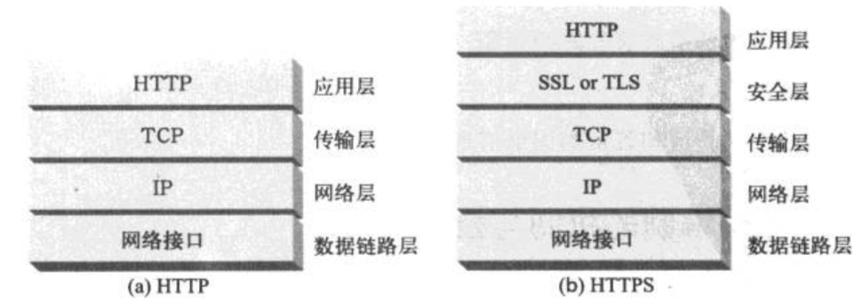

**数字密钥  是编码/解码算法的输入**，编码算法是一些函数。
很多情况下，**编码算法与解码算法都是众所周知的**，因此密钥就成了唯一保密的东西。

但对称密钥需要发送者和接受者之间，有共享的密钥，这样两两之间都生成一个，需要N的平方个密钥。

## 14.5、公开密钥加密技术
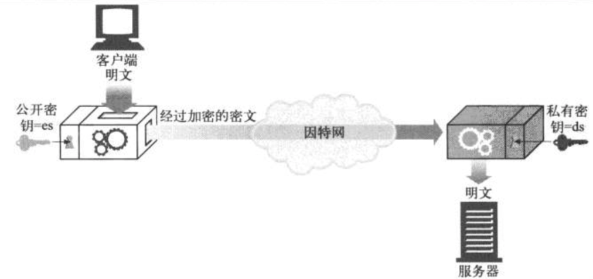
即服务器可以把它的加密密钥公之于众，**任何想要向该服务器发送报文的人都可以使用它公开的密钥来加密，但只有服务器可以用私钥去解密**。

**RSA加密技术：找到私有密钥的几乎不可能**。
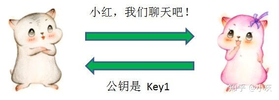
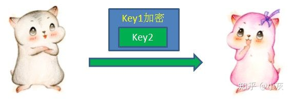

公开密钥的问题：
中间人虽然不知道小红的私钥是什么，但是在截获了小红的公钥Key1之后，却可以偷天换日，自己另外生成一对公钥私钥，把自己的公钥Key3发送给小灰。
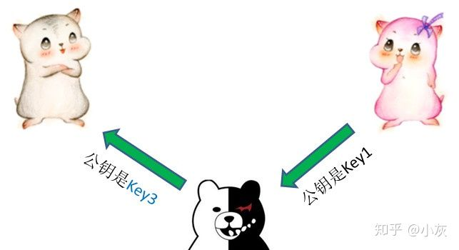
小灰不知道公钥被偷偷换过，以为Key3就是小红的公钥。于是按照先前的流程，用Key3加密了自己生成的对称加密密钥Key2，发送给小红。
这一次通信再次被中间人截获，中间人先用自己的私钥解开了Key3的加密，获得Key2，**然后再用当初小红发来的Key1重新加密**，再发给小红。

**这时候，我们有必要引入第三方，一个权威的证书颁发机构（CA）来解决**。

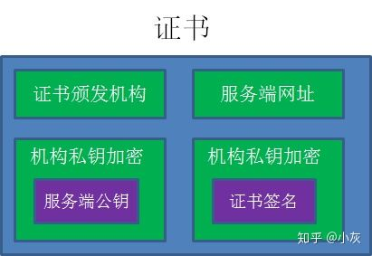

1. 作为服务端的小红，首先把自己的公钥发给证书颁发机构，向证书颁发机构申请证书。

2. 证书颁发机构自己也有一对公钥私钥。机构利用自己的私钥来加密Key1，并且通过服务端网址等信息生成一个证书签名，证书签名同样经过机构的私钥加密。证书制作完成后，机构把证书发送给了服务端小红。
3. 当小灰向小红请求通信的时候，小红不再直接返回自己的公钥，**而是把自己申请的证书返回给小灰**。
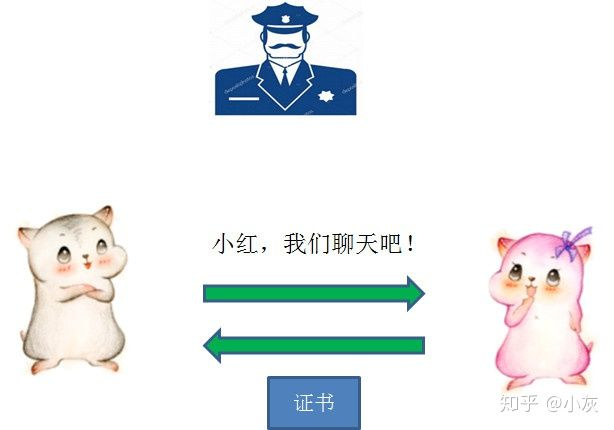

4. 小灰收到证书以后，要做的第一件事情是验证证书的真伪。需要说明的是，**各大浏览器和操作系统已经维护了所有权威证书机构的名称和公钥**。所以小灰只需要知道是哪个机构颁布的证书，就可以从本地找到对应的机构公钥，解密出证书签名。接下来，小灰按照同样的签名规则，自己也生成一个证书签名，如果两个签名一致，说明证书是有效的。验证成功后，小灰就可以放心地再次**利用机构公钥，解密出服务端小红的公钥Key1**。
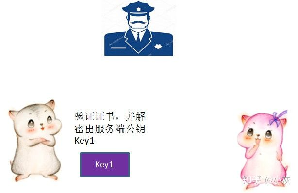
5. 像之前一样，**小灰生成自己的对称加密密钥Key2，并且用服务端公钥Key1加密Key2，发送给小红**。
6. 最后，小红用自己的私钥解开加密，得到对称加密密钥Key2。于是两人开始用Key2进行对称加密的通信。

7. 如果中间人自己申请证书呢

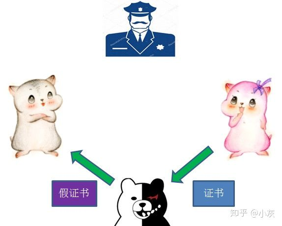
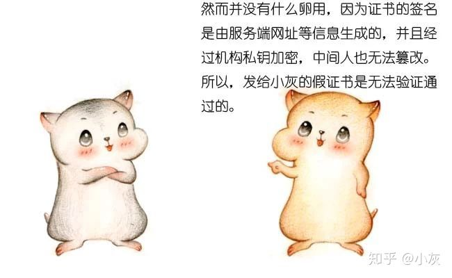
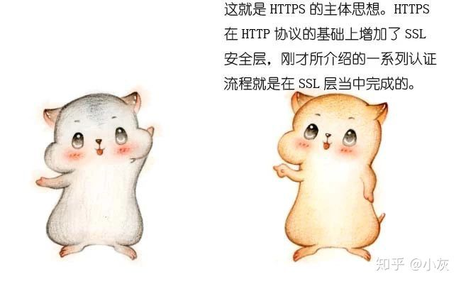

## HTTPS的具体过程

## 14.5、对称加密和非对称加密
密码：
密码学中的密码（cipher）和我们日常生活中所说的密码不太一样。计算机术语『密码 cipher』是一种用于加密或者解密的算法，而我们日常所使用的『密码 password』是一种口令，like a text.

密钥(key):
密钥是一种参数，它是在使用密码（cipher）算法过程中输入的参数。
同一个明文在  相同的密码算法  和 不同的密钥  计算下会产生不同的密文。
**很多知名的密码算法都是公开的，密钥才是决定密文是否安全的重要参数**，通常密钥越长，破解的难度越大
比如一个8位的密钥最多有256种情况，使用穷举法，能非常轻易的破解

对称密钥:
**对称密钥在加密和解密的过程中使用的密钥是相同的**
缺点：密钥需要在通讯的两端共享，让彼此知道密钥是什么对方才能正确解密。如果每个客户端与服务端单独维护一个密钥，那么服务端需要管理的密钥将是成千上万，这会给服务端带来噩梦

非对称密钥
**又称为公开密钥加密，服务端会生成一对密钥，一个私钥保存在服务端**，仅自己知道，另一个是公钥，公钥可以自由发布供任何人使用。客户端的明文通过公钥加密后的密文需要用私钥解密。

数字签名：
数据在浏览器和服务器之间传输时，有可能在传输过程中被冒充的盗贼把内容替换了，**那么如何保证数据是真实服务器发送的而不被调包呢，同时如何保证传输的数据没有被人篡改呢？**

要解决这两个问题就必须用到数字签名，
**数字签名就是用于验证传输的内容是不是真实服务器发送的数据，发送的数据有没有被篡改过**，它就干这两件事
是非对称加密的一种应用场景。不过他是反过来用私钥来加密，通过与之配对的公钥来解密。

- 第一步：服务端把报文经过Hash处理后生成摘要信息Digest，**摘要信息使用私钥private-key加密之后就生成签名**，服务器把签名连同报文一起发送给客户端。
- 第二步：客户端接收到数据后，**把签名提取出来用public-key解密**。如果能正常的解密出来Digest2，那么就能确认是对方发的，此时只是确定这是对方发的。
- 第三步：**客户端把报文Text提取出来做同样的Hash处理，得到的摘要信息Digest1，再与之前解密出来的Digist2对比**，如果两者相等，就表示内容没有被篡改，否则内容就是被人改过了。

**服务器把数字证书传输给客户端，数字证书中包含服务器公钥**，客户端用公钥解析证书中的数字签名，可以验证服务器的身份。
数字签名是附加在报文上的特殊加密的校验码

### HTTPS 和 OpenSSL 是什么关系
SSL协议要求建立在可靠的传输层协议(TCP)之上。SSL协议的优势在于它是与应用层协议独立无关的，高层的应用层协议(例如：HTTP，FTP，TELNET等)能透明地建立于SSL协议之上。

Https是Http的加密版。加密协议就是SSL协议。**而OpenSSL是SSL协议的一个开源实现。**
**但不是所有服务器都用OpenSSL来实现HTTPS！**

### 补充
在使用owasp-zap的时候，如果只在chrome设置代理而不在授权中心导入证书，会显示不安全的连接。
问题：为什么客户端需要一个证书？
HTTP 抓包神器 Fiddler 的工作原理也是在本地开启 HTTP 代理服务，通过让浏览器流量走这个代理，从而实现显示和修改 HTTP 包的功能。
**如果要让 Fiddler 解密 HTTPS 包的内容，需要先将它自带的根证书导入到系统受信任的根证书列表中。一旦完成这一步，浏览器就会信任 Fiddler 后续的「伪造证书」，从而在浏览器和 Fiddler、Fiddler 和服务端之间都能成功建立 TLS 连接。而对于 Fiddler 这个节点来说，两端的 TLS 流量都是可以解密的**。

如果我们不导入根证书，Fiddler 的 HTTP 代理还能代理 HTTPS 流量么？实践证明，不导入根证书，Fiddler 只是无法解密 HTTPS 流量，HTTPS 网站还是可以正常访问。这是如何做到的，这些 HTTPS 流量是否安全呢？这些问题将在下一节揭晓。

#### 隧道代理
HTTP 客户端通过 CONNECT 方法请求隧道代理创建一条到达任意目的服务器和端口的 TCP 连接，并对客户端和服务器之间的后继数据进行盲转发。
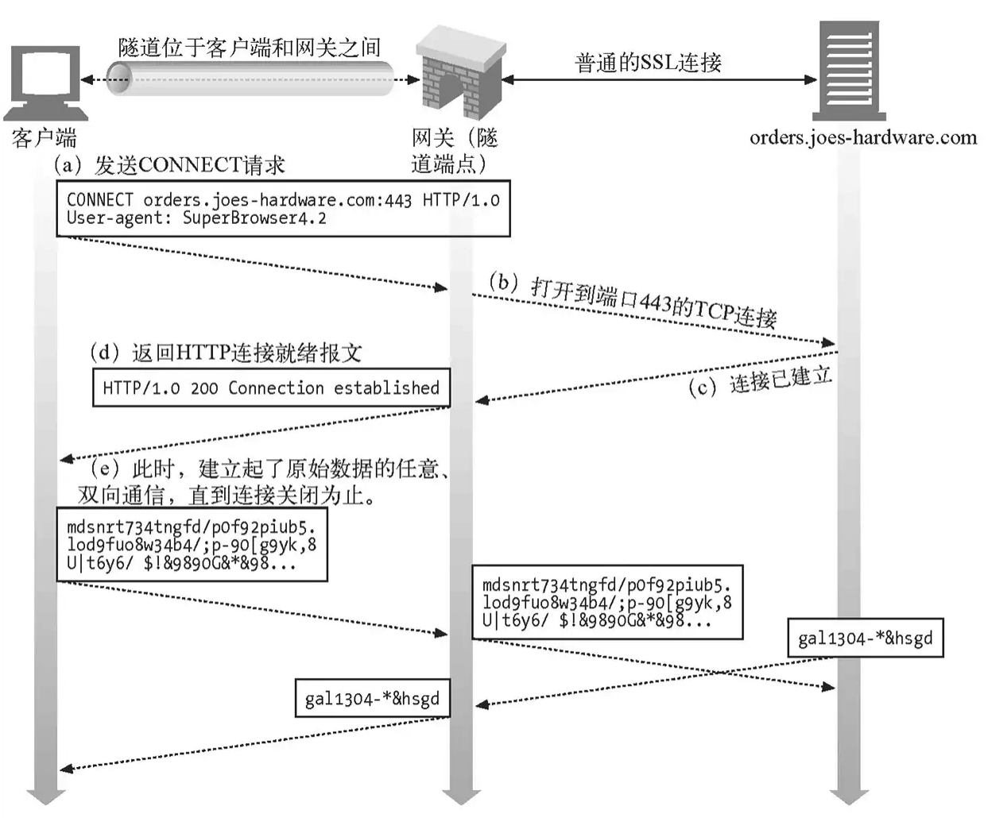

假如我通过代理访问 A 网站，浏览器首先通过 CONNECT 请求，让代理创建一条到 A 网站的 TCP 连接；一旦 TCP 连接建好，代理无脑转发后续流量即可。所以这种代理，理论上适用于任意基于 TCP 的应用层协议，HTTPS 网站使用的 TLS 协议当然也可以。这也是这种代理为什么被称为隧道的原因。

