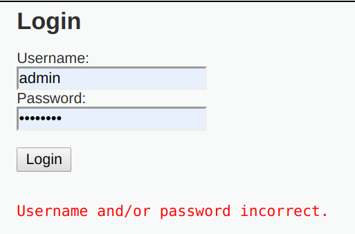
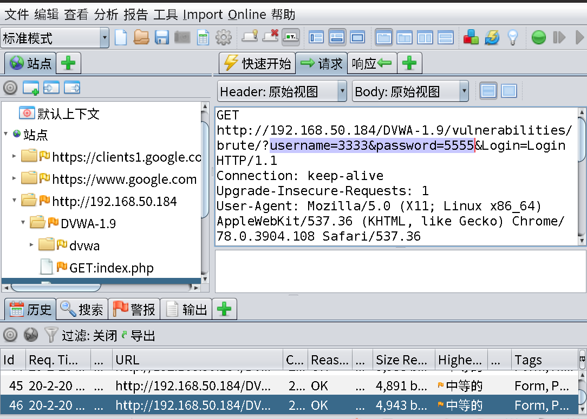
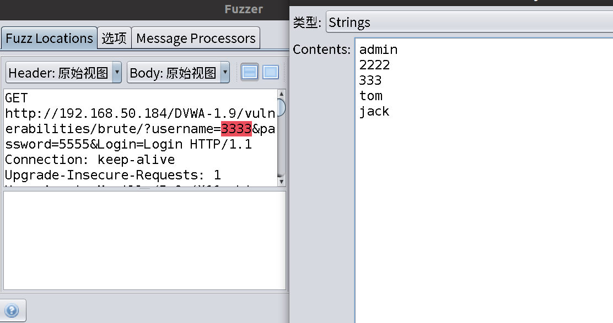
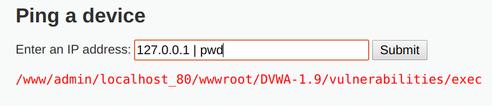
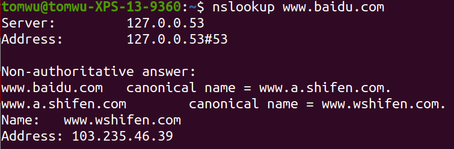
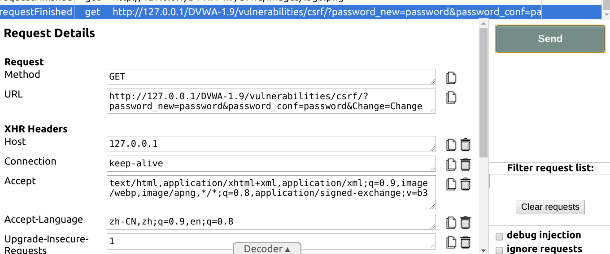
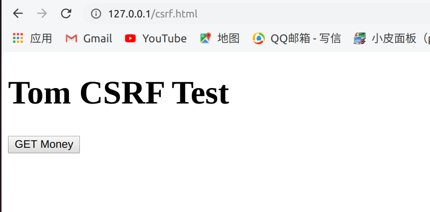
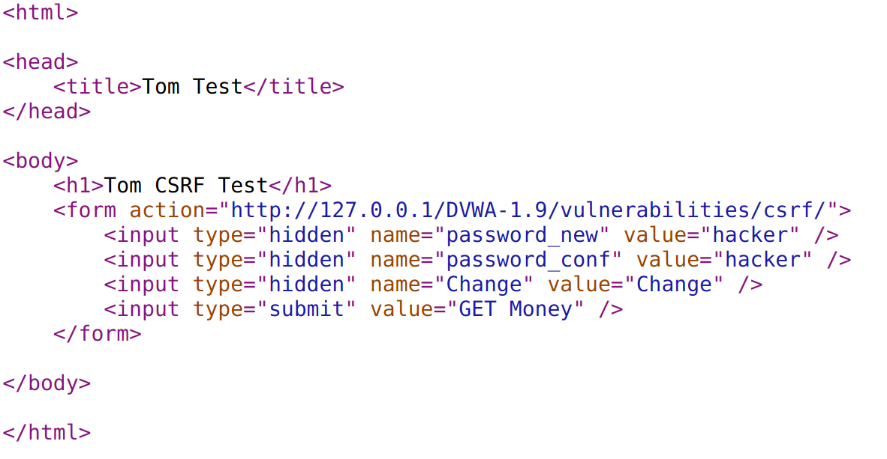
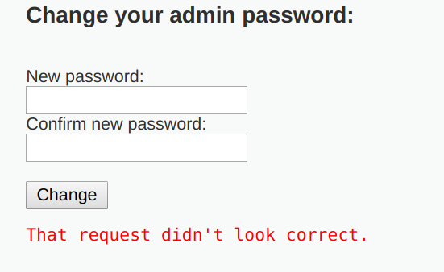
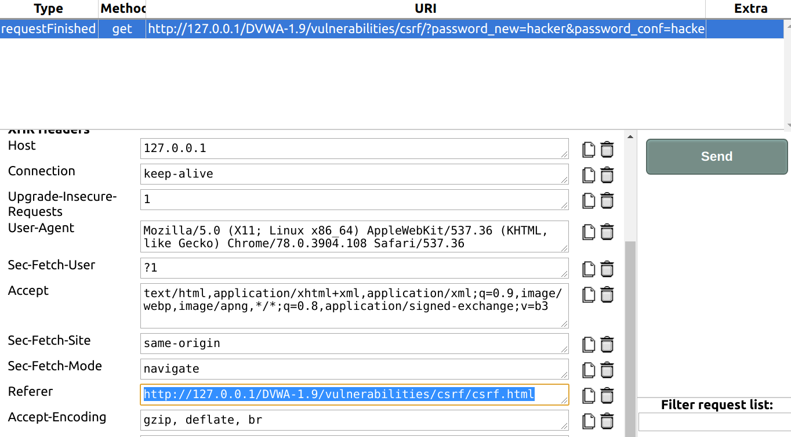

## 暴力破解





用ZAP 抓到包



设置字典进行暴力破解


## 命令注入



(服务器)Linux环境下的命令注入

(1)  ; 

分号，没有任何逻辑关系的连接符。当多个命令用分号连接时，各命令之间的执行成功与否彼此没有任何影响，都会一条一条执行下去。

(2) ||

逻辑或，当用此连接符连接多个命令时，前面的命令执行成功，则后面的命令不会执行。前面的命令执行失败，后面的命令才会执行。

(3) &&

逻辑与，当用此连接符连接多个命令时，前面的命令执行成功，才会执行后面的命令，前面的命令执行失败，后面的命令不会执行，与 || 正好相反。

(4) |

管道符，当用此连接符连接多个命令时，前面命令执行的正确输出，会交给后面的命令继续处理。若前面的命令执行失败，则会报错，若后面的命令无法处理前面命令的输出，也会报错。


Q:命令注入为什么不推荐黑名单的屏蔽???

A:可以用"" 或者''绕过


Q:如果不显示输出结果怎么办???

A:有时如果命令不回显的话, 

延时注入: sleep 5

远程请求: curl, wget 等, 请求自己的服务器

DNS查询```nslookup```




TODO:绕过


## CSRF



可以通过抓包后replay

修改内容重新发起请求


构造一个虚假页面





点击get money 后显示密码更改成功


### CSRF漏洞防御: HTTP referer字段

根据HTTP协议，在HTTP头中有一个字段叫Referer，**它记录了该HTTP请求的来源地址**。在通常情况下，访问一个安全受限页面的请求必须来自于同一个网站。比如某银行的转账是通过用户访问http://bank.test/test?page=10&userID=101&money=10000页面完成，用户必须先登录bank.test，然后通过点击页面上的按钮来触发转账事件。当用户提交请求时，**该转账请求的Referer值就会是转账按钮所在页面的URL**（本例中，通常是以bank. test域名开头的地址）。而如果攻击者要对银行网站实施CSRF攻击，他只能在自己的网站构造请求，当用户通过攻击者的网站发送请求到银行时，该请求的Referer是指向攻击者的网站。因此，要防御CSRF攻击，银行网站只需要对于每一个转账请求验证其Referer值，如果是以bank. test开头的域名，则说明该请求是来自银行网站自己的请求，是合法的。如果Referer是其他网站的话，就有可能是CSRF攻击，则拒绝该请求。




此时因为引入了refer字段,请求就失败了


抓包并且修改referer值到正确



可以创建相应名字的文件夹把csrf.html文件放在下面,可以伪造出referer


### CSRF防御的high等级

需要CSRF 需要CSRF token

Token在上一个请求的返回包中


如果该网站存在XSS漏洞,依然可以获取到token信息


### CSRF防御的impossiable等级

在这个案例中,修改密码需要原来的密码

也可以是验证码

确保肯定是原用户在操作

