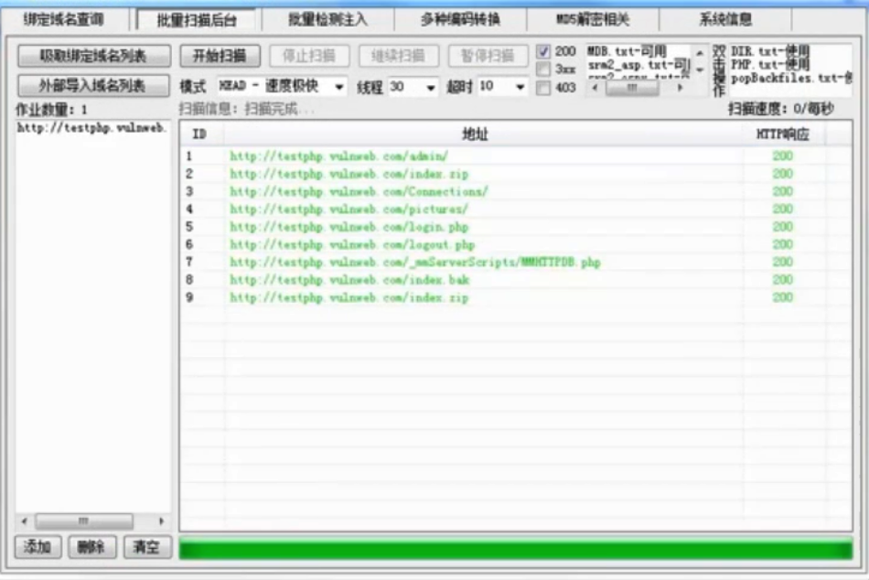

常用的HTTP代理工具

Burpsuite 
charles 
Fiddler 

## 敏感文件扫描
敏感文件探测原理
猜测文件名，根据状态码判断文件是否存在

301是什么？？？

如何判断目标网站的脚本类型
判断iindex的文件类型

**如何生成针对性的字典？**

敏感文件扫描：

## 漏洞扫描
常用工具：AWVS，Netsparker 
cookie HttpOnly 

使用漏洞扫描的问题：
高流量，高并发

TODO： 

## Sqlmap

## 搜索引擎语法
字词出现位置：
allinurl:  在网址中

搜索指定站点的页面
site:目标站点

找到目标站点并暴力破解密码

filetype：搜索特定后缀名的文件

## 网络空间
Shodan
zoomeye

whatweb:对站点进行基本信息探测
ipip.net:IP查询
cmd5.com:秘文转明文

安全导航工具:anquanquan.info

