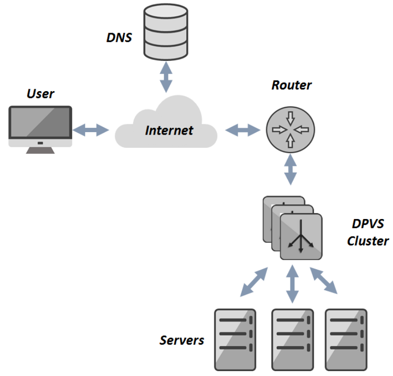
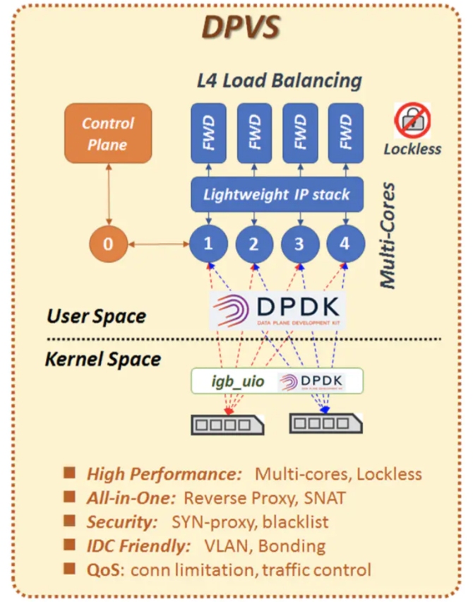

# DPVS

提起负载均衡设备，程序员基本都打过交道。硬件的比如 F5、netscaler, 以前在赶集网就用 netscaler, 后来过保也没续... 软件的有 lvs、haproxy，当然了七层的 nginx 也算。关于转发模式也知道一些 dr、nat、tunnel 等等，轮循的算法有 rr、wrr、wlc 等等。

## 背景

现代互联网流量越来越大，网卡吞吐能力也越来越强，从最早的 1gb, 到现在 10gb 是标配，以后可能 100gb, 所以负载均衡设备的线性扩展也遇到了瓶劲。

IT 行业技术变化真快，刚毕业时 `lvs` 还是负载均衡界的小甜甜，才过了几年就成了牛夫人。中小公司 `lvs` 足够好用，但是内核比较低，尤其 `fullnat` 模式应用非常广泛。那 `lvs` 问题是什么呢？

主要是内核太慢，网络栈代码写的也不好，各种历史问题，很多 `if` 语句，这个很影响分支预测的。

而`lvs` 的数据需要经过内核网络栈，再拷贝到用户空间，性能自然上不去。

## 整体架构

Load Balancer 模块根据 `lvs` 翻译而来，支持大家常用的几种转发模式。和 `lvs` 差别最大的地方就是，`dpvs` 自己实现了轻量级的 tcp 协义栈，并且在用户层模拟了网卡，就是最下面的 Net Devices 层。

