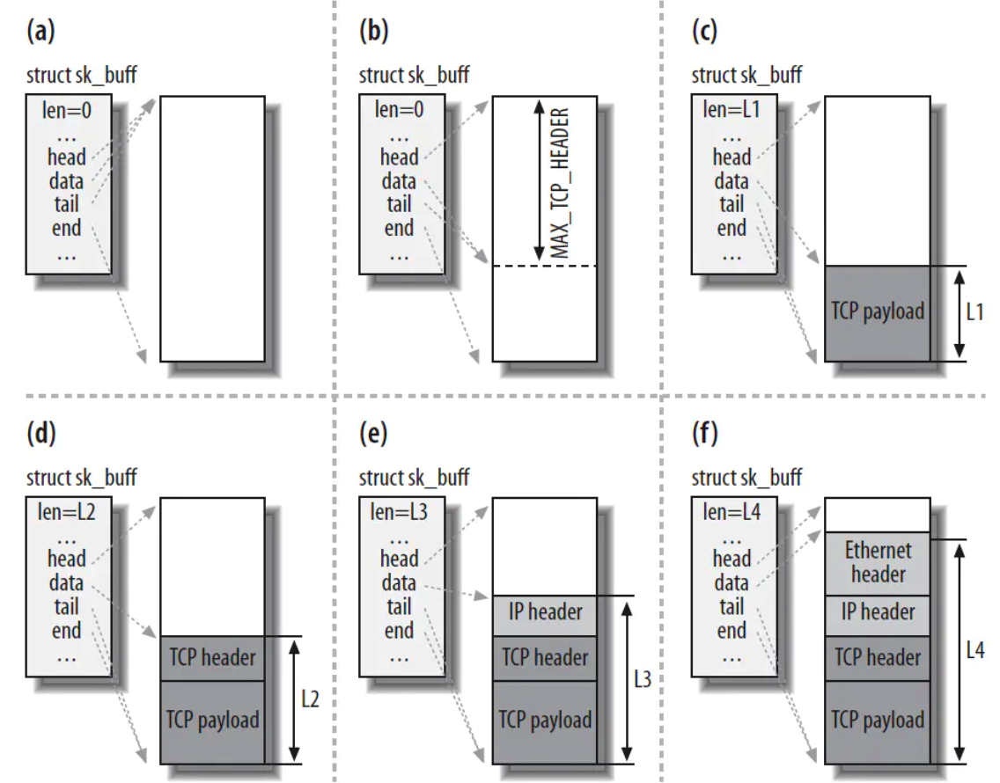
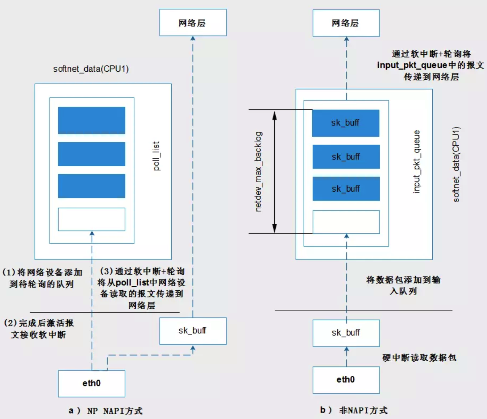
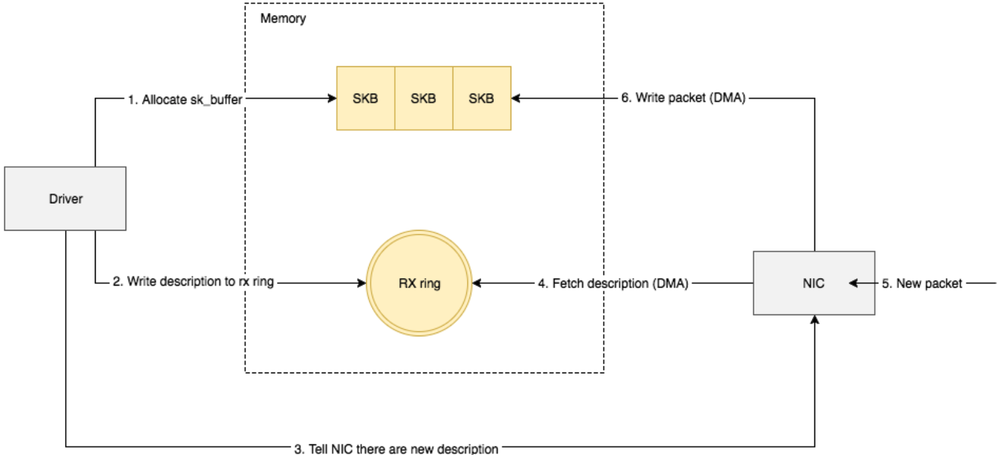
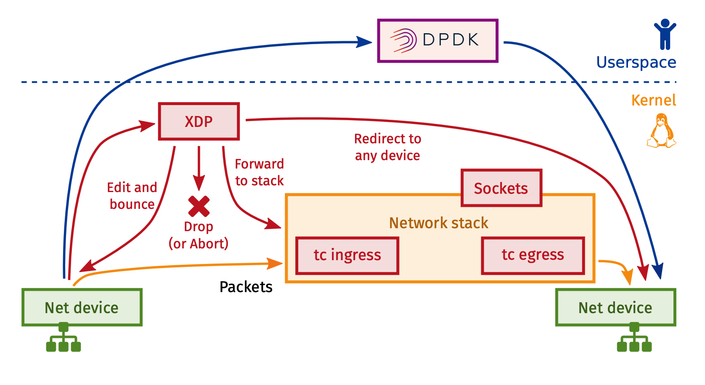
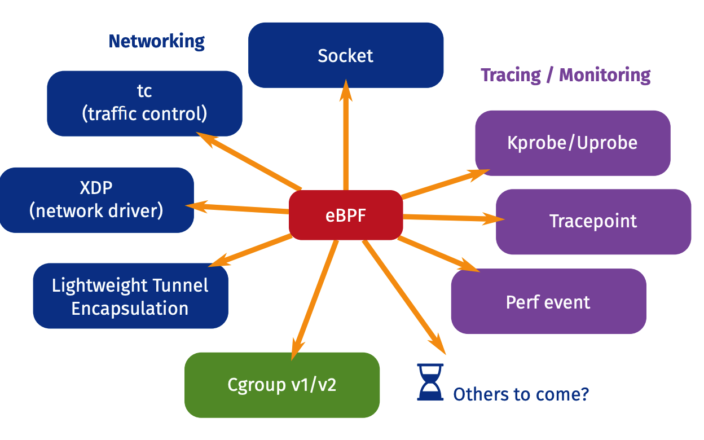

# 网卡收包流程（内核）

## 主要的数据结构

有3个数据结构在网卡收包的流程中是最主要的角色，它们是：sk_buff，softnet_data, net_device。

### sk_buff

sk_buff可以在不同的网络协议层之间传递，为了适配不同的协议，里面的大多数成员都是指针，还有一些union，其中data指针和len会在不同的协议层中发生改变，在收包流程中，即数据向上层传递时，下层的首部就不再需要了。


可以看到，head 指向的位置一直没有变过，但是data指针指向的位置不断地变化


### softnet_data 
softnet_data结构内的字段就是 NIC 和网络层之间处理队列，这个结构是全局的，每个cpu一个.
```
struct softnet_data
{
// 对于非NAPI方式的接收，驱动通过轮询或者硬中断(或二者结合)的方式将数据包放入该队列，然后激活
// 输入软中断程序，软中断程序会处理该队列中数据包，基于流量控制的排队规则将数据包递交给上层
struct sk_buff_head    input_pkt_queue;

// 网络设备轮询队列。驱动应该将需要轮询的网络设备的struct napi_struct链接到该队列并激活输入
// 软中断程序。输入软中断程序会遍历该队列，调用驱动提供的netpoll()接收完成接收
struct list_head    poll_list;

// 为了将软中断接收处理程序对非NAPI方式和NAPIF方式的处理统一，对于非NAPI接收，在硬中断处理
// 后，将backlog结构加入到poll_list,然后触发软中断接收程序，具体见下面非NAPI方式的接收
struct napi_struct    backlog;
};

```
在内核中sk_buff表示一个网络数据包，它是一个双向链表，而链表头就是sk_buff_head


### net_device
net_device代表的是一种网络设备，既可以是物理网卡，也可以是虚拟网卡。


补充：
在sk_buff中有一个net_device * dev变量，这个变量会随着sk_buff的流向而改变。在网络设备驱动初始化时，会分配接收sk_buff缓存队列，这个dev指针会指向收到数据包的网络设备。当原始网络设备接收到报文后，会根据某种算法选择某个合适的虚拟网络设备，并将dev指针修改为指向这个虚拟设备的net_device结构。


## 网络收包
no NAPI：每收到一个以太网包，都会产生一个接收中断给cpu，即完全靠中断方式来收包缺点是当网络流量很大时，cpu大部分时间都耗在了处理mac的中断。

netpoll：即轮询收包。缺点是实时性差。

NAPI：NAPI是linux新的网卡数据处理API，用于提高网络处理效率。是 中断 + 轮询  的结合。

数据量低时采用中断，数据量高时采用轮询。平时是中断方式，当有数据到达时，会触发中断处理函数执行，中断处理函数关闭中断开始处理。如果此时有数据到达，则没必要再触发中断了，因为中断处理函数中会轮询处理数据，直到没有新数据时才打开中断。





非 NAPI：
当网卡收到数据包，产生一个硬中断，**驱动程序在硬中断处理过程中，从网卡取数据，构造出SKB**，然后直接将该SKB放入当前CPU的接收队列input_pkt_queue中，**该队列随后会由网络接收软中断程序处理**，软中断处理程序会将数据包递交给上层协议栈。


NAPI：
这种方式的第一步并不是将数据从设备中读取出来，而是将网络设备对象（即struct net_device）添加到poll_list(一个轮询队列)中，**然后激活网络接收软中断**，在软中断处理函数中会遍历该poll_list，依次处理该轮询队列上的设备，**回调设备提供的数据接收函数完成数据包的接收**。


再来看一下接收队列的数据结构
```
struct softnet_data
{
// 对于非NAPI方式的接收，驱动通过轮询或者硬中断(或二者结合)的方式将数据包放入该队列，然后激活
// 输入软中断程序，软中断程序会处理该队列中数据包，基于流量控制的排队规则将数据包递交给上层
struct sk_buff_head    input_pkt_queue;

// 网络设备轮询队列。驱动应该将需要轮询的网络设备的struct napi_struct链接到该队列并激活输入
// 软中断程序。输入软中断程序会遍历该队列，调用驱动提供的netpoll()接收完成接收
struct list_head    poll_list;


// 为了将软中断接收处理程序对非NAPI方式和NAPIF方式的处理统一，对于非NAPI接收，在硬中断处理
// 后，将backlog结构加入到poll_list,然后触发软中断接收程序，具体见下面非NAPI方式的接收
struct napi_struct    backlog;
};
```

补充一下软中断：
软中断是硬中断触发的，
y中断处理应该是越快越好。硬中断处理那些短时间就可以完成的工作，而将那些处理事件比较长的工作，放到中断之后来完成，也就是软中断(softirq)来完成。

softirq实际上也是一种注册回调的机制


## 收包过程


1. 网卡收到数据包，先将高低电平转换到网卡fifo存储，网卡申请ring buffer的描述，根据描述找到具体的物理地址，从fifo队列物理网卡会**使用DMA将数据包写到了该物理地址**，其实就是skb_buffer中. (我觉得这一步不一定是申请)
2. 这个时候数据包已经被转移到skb_buffer中，因为是DMA写入，内核并没有监控数据包写入情况，这时候NIC触发一个硬中断，每一个硬件中断会对应一个中断号，且指定一个vCPU来处理，如上图vcpu2收到了该硬件中断
3. 硬件中断的中断处理程序，调用驱动程序完成，a.启动软中断
4. 硬中断触发的驱动程序会禁用网卡硬中断，其实这时候意思是告诉NIC，**再来数据不用触发硬中断了，把数据用DMA拷入系统内存即可**
5. 硬中断触发的驱动程序会启动软中断，启用软中断目的是将数据包后续处理流程交给软中断慢慢处理，这个时候退出硬件中断了，但是注意和网络有关的硬中断，要等到后续开启硬中断后，才有机会再次被触发
6. NAPI触发软中断，触发napi系统
7. 消耗ringbuffer指向的skb_buffer
8. NAPI循环处理ringbuffer数据，处理完成
9. 启动网络硬件中断，有数据来时候就可以继续触发硬件中断，继续通知CPU来消耗数据包

简单描述为：网卡收到数据包，DMA到内核内存，中断通知内核数据有了，内核按轮次处理消耗数据包，一轮处理完成后，开启硬中断。


## 如何将网卡收到的数据写入到内核内存？
NIC在接收到数据包之后，首先需要将数据同步到内核中，这中间的桥梁是rx ring buffer。它是由NIC和驱动程序共享的一片区域，**事实上，rx ring buffer存储的并不是实际的packet数据，而是一个描述符**。

1. 驱动在内存中分配一片缓冲区用来接收数据包，叫做sk_buffer;

2. 将上述缓冲区的地址和大小（即接收描述符），加入到rx ring buffer。描述符中的缓冲区地址是DMA使用的物理地址; **因为硬件不能理解虚拟地址，所以给物理地址**



再看收包过程：
1. 网卡从rx ring buffer中取出描述符，**从而获知缓冲区的地址和大小**;
2. 网卡收到新的数据包;
3. 网卡将新数据包通过DMA直接写到sk_buffer中。


##  以e1000网络驱动为例


1. 内核在主内存中为收发数据建立一个环形的缓冲队列（通常叫DMA环形缓冲区）：Linux内核中，用skb来描述一个缓存。建立一定数量的skb，然后用e1000_rx_ring 环形缓冲区队列描述符连接起来


看一下e1000_rx_ring的结构, 我只复制了最重要的三个
```
struct e1000_rx_ring {

/* pointer to the descriptor ring memory */

void *desc;

/* physical address of the descriptor ring */

dma_addr_t dma;

/* array of buffer information structs */

struct e1000_buffer *buffer_info;
```

desc是dma的虚拟地址，**即一个是收报的物理地址，一个是收报的虚拟地址**
**物理地址会被写到网卡的寄存器里，可以参照DPDK的实现**


# How to filter packets super fast: XDP & eBPF

 The XDP programs run as soon as the packet gets to the network driver 
 
 XDP:
 1. eBPF hook at the driver level (ingress)
 2. Intercept packet before it reaches the stack, before allocating sk_buff


One step further in that direction is XDP, which was recently merged into the Linux kernel and allows for DPDK-like performance for the kernel itself. 
The basic idea is that XDP is tightly coupled with eBPF and hooks into a very early ingress path **at the driver layer**, where it operates with direct access to the packet's DMA buffer.



```
enum bpf_prog_type {
BPF_PROG_TYPE_UNSPEC,
BPF_PROG_TYPE_SOCKET_FILTER,
BPF_PROG_TYPE_KPROBE,
BPF_PROG_TYPE_SCHED_CLS,
BPF_PROG_TYPE_SCHED_ACT,
BPF_PROG_TYPE_TRACEPOINT,
BPF_PROG_TYPE_XDP,
BPF_PROG_TYPE_PERF_EVENT,
BPF_PROG_TYPE_CGROUP_SKB,
BPF_PROG_TYPE_CGROUP_SOCK,
BPF_PROG_TYPE_LWT_IN,
BPF_PROG_TYPE_LWT_OUT,
BPF_PROG_TYPE_LWT_XMIT,
BPF_PROG_TYPE_SOCK_OPS,
BPF_PROG_TYPE_SK_SKB,
BPF_PROG_TYPE_CGROUP_DEVICE,
BPF_PROG_TYPE_SK_MSG,
BPF_PROG_TYPE_RAW_TRACEPOINT,
BPF_PROG_TYPE_CGROUP_SOCK_ADDR,
BPF_PROG_TYPE_LWT_SEG6LOCAL,
BPF_PROG_TYPE_LIRC_MODE2,
BPF_PROG_TYPE_SK_REUSEPORT,
BPF_PROG_TYPE_FLOW_DISSECTOR,
BPF_PROG_TYPE_CGROUP_SYSCTL,
BPF_PROG_TYPE_RAW_TRACEPOINT_WRITABLE,
BPF_PROG_TYPE_CGROUP_SOCKOPT,
};
```
可以看到KPROBE和TRACEPOINT只是其中的两个用于tracing的注入点
事实上eBPF可以看作是一种内核编程的新方式



https://blog.csdn.net/dog250/article/details/102982948

https://blog.cloudflare.com/sockmap-tcp-splicing-of-the-future/
