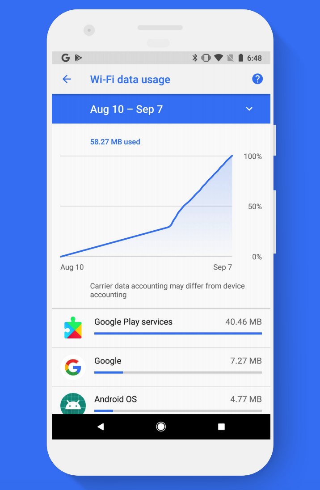
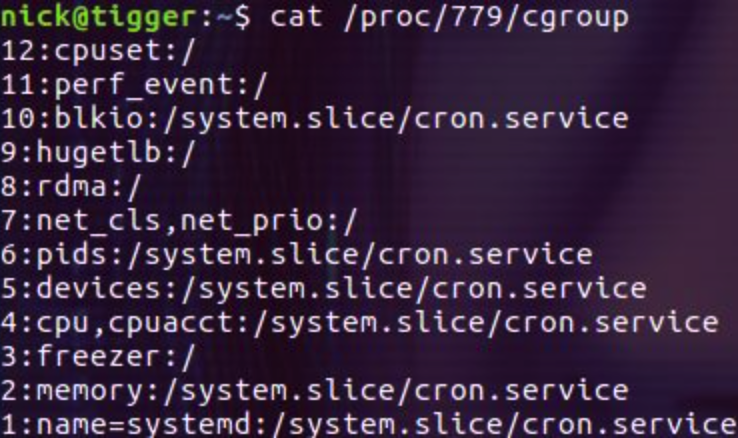
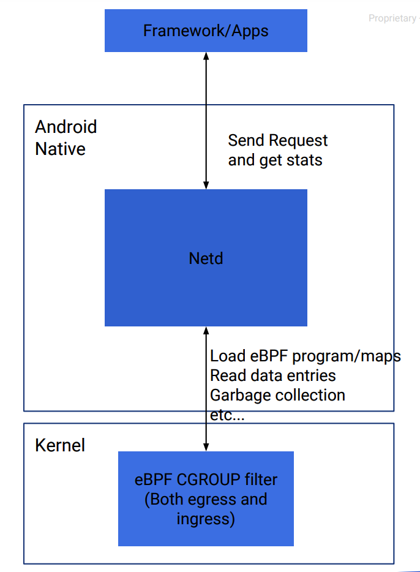
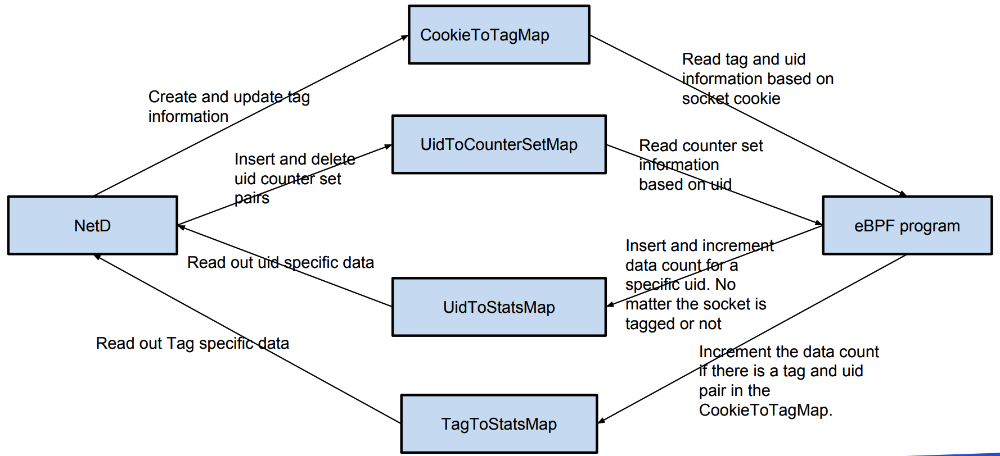

## 安卓流量分析

网络流量是指，能够连接网络的设备在网络上所产生的数据流量。

网络流量分析主要分两种：被动分析和主动分析。


#### 被动分析：

应用程序发送的网络数据不会被拦截。相反，我们将尝试捕获所有网络数据包，然后在网络分析器（如Wireshark）中打开它，然后尝试找出应用程序中的漏洞或安全问题。

被动分析：**可以使用 tcpdump  来将所有的信息保存到设备中一个位置**。此后，我们将该文件拉取到我们的系统，然后使用**Wireshark或其他包分析器查看它**。


tcpdump(需Root用户运行)拦截和显示发送或收到过网络连接到该机器的TCP/IP和其他数据包。简单说就监控手机进出网络数据。

- 测试手机需要获取root权限

- 测试手机需要安装tcpdump软件


假如你的Android设备已经root了，你可以用如下方式创建一个目录，存放TCPdump的二进制可执行文件。

```
mkdir /data/tcpdump/
chmod 777 /data/tcpdump/
```

#### 主动分析：

在主动分析中，测试者将主动拦截所有正在进行的网络通信，并可以即时分析，评估和修改数据。这里需要设置代理，并且由应用/设备生成和接收的所有网络流量会通过该代理。

最常用的抓包工具就是burpsuite。利用burpsuite拦截数据包流量只需要在设置代理。


当通过 HTTP 协议进行通信时，上述方法可以正常用于应用和流量器的流量拦截。 在

HTTPS 中，由于证书不匹配，因此我们无法拦截流量。我们只需要将burpsuite中证书导出，安装到手机证书中即可。

*****

[http://www.linuxplumbersconf.net/2017/ocw//system/presentations/4786/original/Replacing%20xt_qtaguid%20with%20an%20upstream%20eBPF%20implementation.pdf](http://www.linuxplumbersconf.net/2017/ocw//system/presentations/4786/original/Replacing xt_qtaguid with an upstream eBPF implementation.pdf)

### Replacing xt_qtaguid with an upstream eBPF implementation(2017)

从 Android 9 开始，内核版本为 4.9 或更高且最初搭载了 Android P 版本的 Android 设备必须使用基于 eBPF 的网络流量监控记帐模块，而不是 `xt_qtaguid`。新的基础架构更灵活且更易于维护，并且不需要任何外部内核代码。

什么是xt_qtaguid

- Network traffic monitoring tool on Android devices

- The xt_qtaguid kernel code is the foundation of data usage accounting and per-app network policy on Android

- Counting packet against the correct app uid. 
- Filtering per-app traffic with socket owner match




xt_qtaguid有什么问题？

- 最主要就是Totally out of linux kernel tree and not upstreamable. 
-  The version of this module varies with kernel version.
-  Stability, maintenance, and soon performance issues.


旧版流量监控和 eBPF 流量监控之间的主要设计差异如图所示：


为什么使用eBPF

- In networking area, it can apply filters on socket, cgroup, iptables module (xt_bpf), tc-bpf, etc.

- Much less chance to cause kernel crash
- Multiple filter hook points in network stack.


## 补充1: cgroups

```
cgroups(Control Groups) 是 linux 内核提供的一种机制，这种机制可以根据需求把一系列系统任务及其子任务整合(或分隔)到按资源划分等级的不同组内，从而为系统资源管理提供一个统一的框架。

本质上来说，cgroups 是内核附加在程序上的一系列钩子(hook)，通过程序运行时对资源的调度触发相应的钩子以达到资源追踪和限制的目的。
```

一些基本概念：

- Task(任务)： 在 linux 系统中，内核本身的调度和管理并不对进程和线程进行区分。**task 来表示系统的一个进程或线程**。

- Cgroup(控制组)：**cgroups** 中的资源控制以 cgroup 为单位实现。Cgroup 表示按某种资源控制标准划分而成的**任务组**，包含一个或多个子系统。**一个任务可以加入某个 cgroup，也可以从某个 cgroup 迁移到另一个 cgroup**。

- Subsystem(子系统)： cgroups 中的子系统就是一个资源调度控制器。比如 CPU 子系统可以控制 CPU 的时间分配，内存子系统可以限制内存的使用量。


cgroups 的主要作用

实现 cgroups 的主要目的是为不同用户层面的资源管理提供一个统一化的接口。从单个任务的资源控制到操作系统层面的虚拟化，cgroups 提供了四大功能：

- 资源限制：cgroups 可以对任务是要的资源总额进行限制。
- 比如设定任务运行时使用的内存上限，一旦超出就发 OOM。
- 优先级分配：通过分配的 CPU 时间片数量和磁盘 IO 带宽，实际上就等同于控制了任务运行的优先级。
- 资源统计：cgoups 可以统计系统的资源使用量，比如 CPU 使用时长、内存用量等。这个功能非常适合当前云端产品按使用量计费的方式。
- 任务控制：cgroups 可以对任务执行挂起、恢复等操作


**查看进程所属的 cgroups**

可以通过``cat /proc/进程号/cgroup`` 来查看指定进程属于哪些 cgroup。

安卓可以直接``adb shell cat proc/6566/cgroup``



每一行包含用冒号隔开的三列，他们的含义分别是：

- cgroup 树的 ID， 和 /proc/cgroups 文件中的 ID 一一对应。
- 和 cgroup 树绑定的所有 subsystem，多个 subsystem 之间用逗号隔开。这里 name=systemd 表示没有和任何 subsystem 绑定，只是给他起了个名字叫 systemd。
- 进程在 cgroup 树中的路径，即进程所属的 cgroup，这个路径是相对于挂载点的相对路径。


使用cgroups的例子:

https://cloud.tencent.com/developer/article/1328376


### Android socket tagging

Semantics:

Counts packets and bytes on combination of app, app-defined tag, interface;

Allows assigning 64-bit tag to every socket ;

- Socket tags comprised of 32 bits UID (i.e., app) and 32 bits app-defined tag 
- Privileged UIDs may impersonate other UIDs (e.g., download manager billing traffic to app that requested the download)


### 安卓 eBPF 流量监控设计

Per-cgroup eBPF program to perform accounting：

- Ingress: Transport layer (e.g. tcp_v4_rcv), same as eBPF socket filter
- Egress: Network layer (eg. ip_finish_output)




接收到的统计信息存储在eBPF map中。

Apps tag sockets by sending fd using binder call to privileged process


为什么使用Per-cgroup的filtering而不用Per-socket eBPF filter ？

- Need to apply program to every fd individually 
- Some sockets don’t have an fd, so can’t attach program to them


数据结构：



**Overall stats are in UidToStatsMap**

**Tagged sockets stats are in TagToStatsMap**


status的数据结构：（它是一个entry结构）

Key： contains Socket ID | foreground state | interface 

Value： contains tx/rx packets number and tx/rx bytes


Packet information collected: 

1.  Socket uid 
2. Packet type (tcp, udp, other)
3.  Packet length 
4. rx/tx interface


### 完整的过程

在启动时， `bpfloader` 将预编译的 eBPF 程序加载到内核中，并将其附加到正确的 `cgroup`。所有流量都对应于同一个根 `cgroup`，因此默认情况下，**所有进程都应包含在该 `cgroup` 中**。


收到包后：

1. load sk_buff来获得packet type, socket cookie, 包的length和协议。(socket cookie可能是用来识别eBPF Map里的socket，可以参考补充：Android socket tagging)

2. 根据socket cookie去CookieToTagMap里查出是哪一个UID
3. 查看这个socket是不是被tagged 
4. 如果还没有被tagged就去increment UidToStatMap
5. 


https://developer.android.com/reference/android/net/TrafficStats

