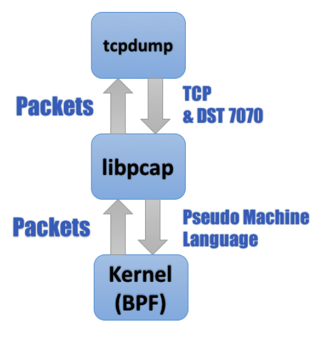
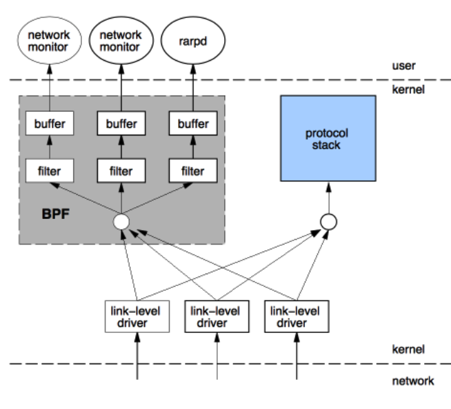
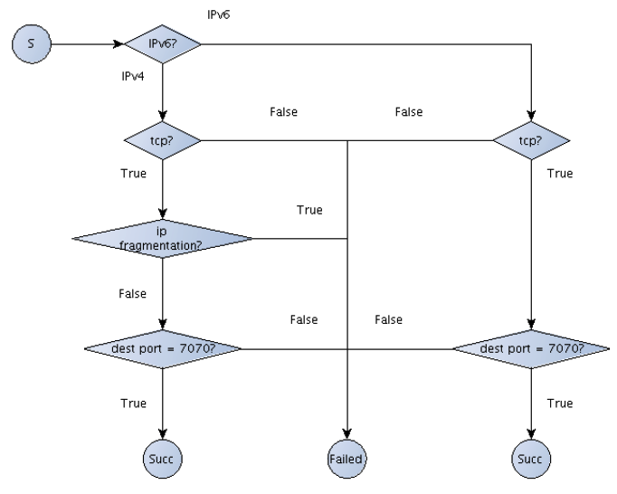
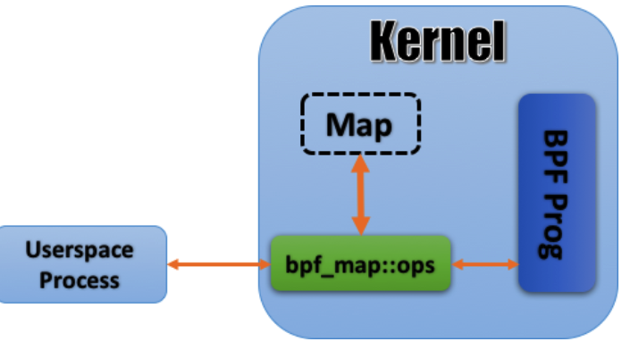
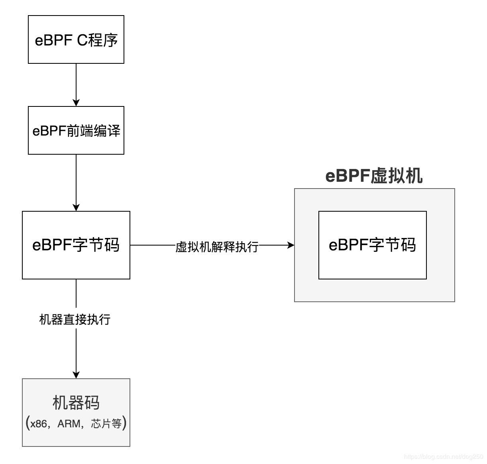
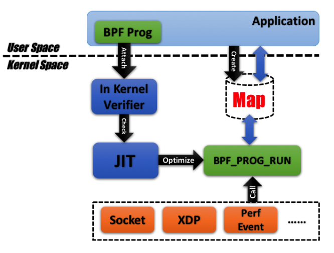
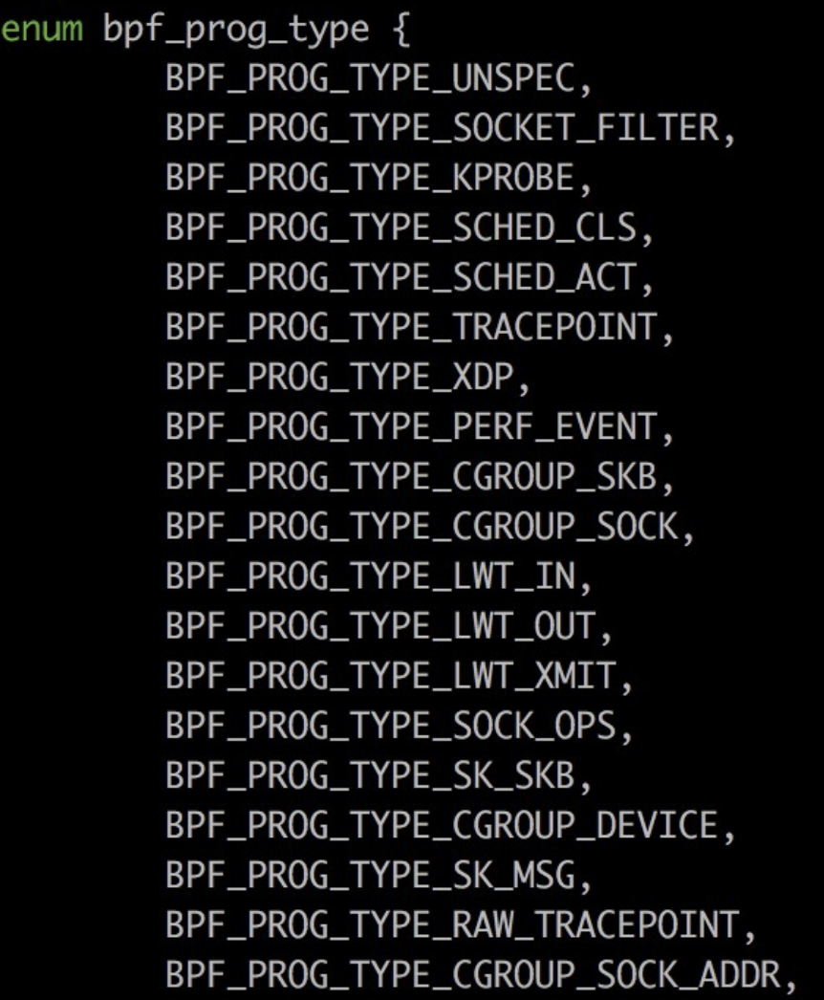
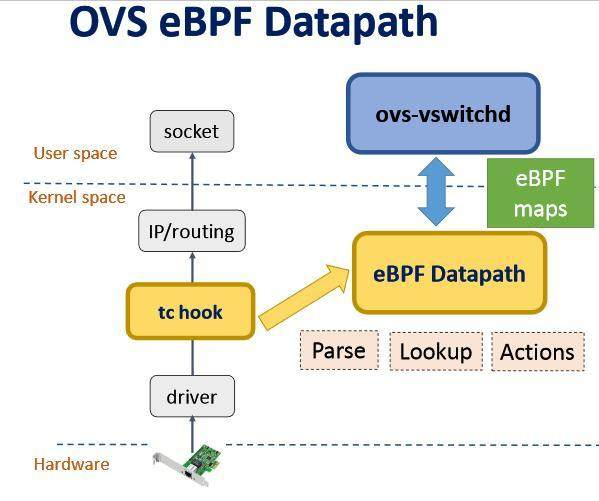
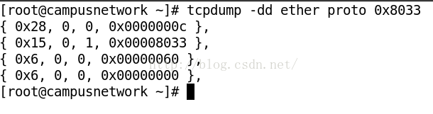

## 什么是 BPF?
BPF（Berkeley Packet Filter）伯克利包过滤器。 是在linux 平台下的一个包过滤器。使用此过滤器可以**在socket编程时非常方便的实现各种过滤规则**。


BPF 的两大核心功能：
1. 过滤(Filter): 根据外界输入的规则过滤报文；
2. 复制(Copy)：将符合条件的报文由内核空间复制到用户空间；

以 tcpdump 为例：熟悉网络监控(network monitoring)的读者大抵都知道 tcpdump 依赖于 pcap 库，tcpdump 中的诸多核心功能都经由后者实现，其整体工作流程如下图所示：


libpcap 是一个网络数据包捕获函数库，功能非常强大，Linux 下著名的 tcpdump 就是以它为基础的。
libpcap 程序的第一步通常是在系统中找到合适的网络接口设备。**网络接口在Linux 网络体系中是一个很重要的概念，它是对具体网络硬件设备的一个抽象，在它的下面是具体的网卡驱动程序，而其上则是网络协议层**。
Linux 中最常见的接口设备名 eth0 和 lo。Lo 称为回路设备，是一种逻辑意义上的设备,其主要目的是为了调试网络程序之间的通讯功能。**eth0 对应了实际的物理网卡**，在真实网络环境下，数据包的发送和接收都要通过 eht0。

位于内核之中的 BPF 模块是整个流程之中最核心的一环：它一方面接受 tcpdump 经由 libpcap 转码而来的滤包条件(Pseudo Machine Language) ，另一方面也将符合条件的报文复制到用户空间最终经由 libpcap 发送给 tcpdump。



时至今日，传统 BPF 仍然遵循图 2 的路数：**途经网卡驱动层的报文在上报给协议栈的同时会多出一路来传送给 BPF，再经后者过滤后最终拷贝给用户态的应用**。

```
#以下代码可以在任意支持 tcpdump 的类 Unix 平台上运行，输出大同小异   
bash-3.2$ sudo tcpdump -d -i lo tcp and dst port 7070


(000) ldh [12]
(001) jeq #0x86dd jt 2 jf 6 #检测是否为 ipv6 报文，若为假(jf)则按照 ipv4 报文处理         
                                                                    (L006)
(002) ldb [20]
(003) jeq #0x6 jt 4 jf 15 #检测是否为 tcp 报文
(004) ldh [56]
(005) jeq #0x1b9e jt 14 jf 15 #检测是否目标端口为 7070(0x1b9e)，若为真(jt)则跳转 L014
(006) jeq #0x800 jt 7 jf 15 #检测是否为 ipv4 报文
(007) ldb [23]
(008) jeq #0x6 jt 9 jf 15 #检测是否为 tcp 报文
(009) ldh [20]
(010) jset #0x1fff jt 15 jf 11 #检测是否为 ip 分片(IP fragmentation)报文
(011) ldxb 4*([14]&0xf)
(012) ldh [x + 16] #找到 tcp 报文中 dest port 的所在位置
(013) jeq #0x1b9e jt 14 jf 15 #检测是否目标端口为 7070(0x1b9e)，若为真(jt)则跳转 L014
(014) ret #262144 #该报文符合要求
(015) ret #0 #该报文不符合要求
```
tcpdump 的-d 会将输入的 expression 转义为一段"human readable"的"compiled packet-matching code"。
这段看起来类似于汇编的代码，便是 BPF 用于定义 Filter 的伪代码，亦即图 1 中 libpcap 和内核交互的 pseudo machine language，当 BPF 工作时，每一个进出网卡的报文都会被这一段代码过滤一遍，其中符合条件的(ret #262144)会被复制到用户空间，其余的(ret #0)则会被丢弃。


BPF 采用的报文过滤设计的全称是 CFG(Computation Flow Graph)，顾名思义是将过滤器构筑于一套基于 if-else 的控制流(flow graph)之上，例如清单 1 中的 filter 就可以用图 3 来表示：


### LSF

BPF 是在 1997 年首次被引入 Linux 的，当时的内核版本尚为 2.1.75。准确的说，Linux 内核中的报文过滤机制其实是有自己的名字的：Linux Socket Filter，简称 LSF。但也许是因为 BPF 名声太大了吧，连内核文档都不大买这个帐，直言 LSF 其实就是BPF。

当然，LSF 和 BPF 除了名字上的差异以外，还是有些不同的，首当其冲的分歧就是接口：传统的 BSD 开启 BPF 的方式主要是靠打开(open)/dev/bpfX 设备，之后利用 ioctl 来进行控制；而 linux 则选择了利用套接字选项(sockopt)SO_ATTACH_FILTER/SO_DETACH_FILTER 来执行系统调用。

### 演进：JIT For BPF
BPF 被引入 Linux 之后，除了一些小的性能方面的调整意外，很长一段时间都没有什么动静。直到 3.0 才首次迎来了比较大的革新：在一些特定硬件平台上，BPF 开始有了用于提速的 JIT(Just-In-Time) Compiler。

BPF JIT 的接口还是简单清晰的：各平台的 JIT 编译函数都实现于bpf_jit_compile()之中(3.16 之后，开始逐步改为bpf_int_jit_compile())，如果 CONFIG_BPF_JIT 被打开，则传入的 BPF 伪代码就会被传入该函数加以编译，编译结果被拿来替换掉默认的处理函数 sk_run_filter()。

### 进化：extended BPF
自 3.15 伊始，一个套源于 BPF 的全新设计开始逐渐进入人们的视野，并最终(3.17)被添置到了 kernel/bpf 下。这一全新设计最终被命名为了 extended BPF(eBPF)：顾名思义，有全面扩充既有 BPF 功能之意；而相对应的，为了后向兼容，**传统的 BPF 仍被保留了下来，并被重命名为 classical BPF(cBPF)**。

eBPF在内核提供了一个虚拟机，**用户态将过滤规则以虚拟机指令的形式传递到内核，由内核根据这些指令来过滤网络数据包**。

相对于 cBPF，eBPF 带来的改变可谓是革命性的：一方面，它已经为内核追踪(Kernel Tracing)、应用性能调优/监控、流控(Traffic Control)等领域带来了激动人心的变革；另一方面，在接口的设计以及易用性上，eBPF 也有了较大的改进。

eBPF 是一个在内核中运行的虚拟机，它可以运行用户实现的 eBPF 程序，在内核以本地代码的形式和速度去执行，它可以跟内核的 Trace 系统相结合，给我们提供几乎无限的可观测性。


sockex1_user.c
```
#include <…>
int main(int ac, char **argv)
{
// 1. eBPF 的伪代码位于 sockex1_kern.o 中，这是一个由 llvm 生成的 elf 格式文件，指令集为 bpf;
snprintf(filename, sizeof(filename), "%s_kern.o", argv[0]);

if (load_bpf_file(filename)) {
// load_bpf_file()定义于 bpf_load.c，利用 libelf 来解析 sockex1_kern.o
// 并利用 bpf_load_program 将解析出的伪代码 attach 进内核;
}
// 2. 因为 sockex1_kern.o 中 bpf 程序的类型为 BPF_PROG_TYPE_SOCKET_FILTER
// 所以这里需要用用 SO_ATTACH_BPF 来指明程序的 sk_filter 要挂载到哪一个套接字上
sock = open_raw_sock("lo");
assert(setsockopt(sock, SOL_SOCKET, SO_ATTACH_BPF, prog_fd,
sizeof(prog_fd[0])) == 0);
//……
for (i = 0; i < 5; i++) {
// 3. 利用 map 机制获取经由 lo 发出的 tcp 报文的总长度
key = IPPROTO_TCP;
assert(bpf_map_lookup_elem(map_fd[0], &key, &tcp_cnt) == 0);
// ……
}
return 0;
}

```
利用高级语言书写 BPF 逻辑并经由编译器生成出伪代码来并不是什么新鲜的尝试，比如 libpcap 就是在代码中内嵌了一个小型编译器来分析 tcpdump 传入的 filter expression 从而生成 BPF 伪码的。


BPF 代码进内核之后，cBPF 和内核通讯的方式是 recv()；**而 eBPF 则将 socket 丢到一边，使用一种名为 map 的全新机制和内核通讯，其大致原理下图所示**：


这套设计本身不复杂：位于用户空间中的应用在内核中辟出一块空间建立起一个数据库用以和 eBPF 程序交互(bpf_create_map())；数据库本身以 Key-Value 的形式进行组织，无论是从用户空间还是内核空间都可以对其进行访问，两边有着相似的接口，最终在逻辑上也都殊途同归。

### 追求极简：BPF Compiler Collection(BCC)
虽然现在可以用 C 来实现 BPF，但编译出来的却仍然是 ELF 文件

于是就有人设计了 BPF Compiler Collection(BCC)，BCC 是一个 python 库，但是其中有很大一部分的实现是基于 C 和 C++的，python 只不过实现了对 BCC 应用层接口的封装而已。

使用 BCC 进行 BPF 的开发仍然需要开发者自行利用 C 来设计 BPF 程序——但也仅此而已，余下的工作，包括编译、解析 ELF、加载 BPF 代码块以及创建 map 等等基本可以由 BCC 一力承担，无需多劳开发者费心。


### eBPF的补充

2016年10月的NetDev 1.2大会上，Netronome的Jakub Kicinski和Nic Viljoen发表了标题为“eBPF / XDP硬件卸载到SmartNIC”。 Nic Viljoen在其中介绍了Netronome SmartNIC上每个FPC每秒达到300万个数据包，每个SmartNIC有72到120个FPC，可能最大支持eBPF吞吐量4.3 Tbps！（理论上）


说起Offload，首先能想到的就是TCP Checksum的Offload，这算是比较经典的Offload案例了。

它的原理很简单，TCP Checksum Offload将本应该由**CPU承担的TCP校验和计算这件事交给网卡来完成**，带来的收益是CPU的发包路径更短，并且和网卡形成两极流水线，总的吞吐率增加。


落实到实现，无非就两种方法：
1. 网卡芯片上雕刻一个“校验码计算电路”。
2. 网卡芯片上安装一个小处理器。

如果每Offload一个功能，就要设计一个专门的电路，是不合适的
可以直接在网卡芯片上部署一个 “通用的小型CPU（或者叫网络协处理器）” ，这样你就可以将网卡芯片看成是一个和主机CPU并列等同的设备了，并且**它是可编程的**。

网卡部署了网络协处理器后，数据包到达后，网卡的协处理器可以先对该数据包进行一些预处理，然后根据处理结果再考虑是不是要把数据包接力给主机CPU，这种自带处理功能的网卡被叫做智能网卡。


这些预处理包括但不限于：
1. 判断数据包是否应该被丢弃或者被审计，这是防火墙的功能。
2. 判断数据包是否可以直接被转发到另一个网卡，这是路由器/交换机的功能。
3. 修改数据包内容。

如何对协处理器编程？
按照现在的观点，如果把网卡芯片上的协处理器看成和CPU一样的玩意儿的话，CPU可以用C编程，网卡芯片自然也可以。

这个为网卡编程的C程序便是eBPF的C程序。网卡芯片和CPU均可以看到同样的C代码，不同的是，同样的**C代码会被JIT（Just In Time）实时编译成对应CPU或网卡的不同指令**供它们执行。

这意味着eBPF的编译运行机制需要需要以下的组成部分：
1. 同样的C语言（以后还会有其它语言）语法，这便于任何C程序员均可以编写eBPF程序。
2. 一个eBPF编译器前端，将eBPF的C代码编译成一个特定的BPF体系结构的字节码。
3. 一个软件虚拟机，被部署在需要执行eBPF字节码的位置，执行eBPF指令。



解释执行：不生成目标程序而是一句一句的执行的方式会造成计算机资源的浪费
除了C以外的似乎都是解释执行。


### 总结一下


BPF像是一套完整的 计算机体系结构 规范。和x86，ARM这些类似，BPF规范了自己的指令集和运行时逻辑，同理，就像在x86平台编程，**最终要落实到x86汇编指令一样**，BPF字节码也可以看成是汇编指令的序列。
BPF的历史非常古老，早在1992年就被构建出来了，其背后的思想是， “与其把数据包复制到用户空间执行用户态程序过滤，不如把过滤程序灌进内核去。”


eBPF是一个非常古老但最近才大行其道的技术，Linux内核中被埋下了越来越多的eBPF调用点，bpfilter正是基于这些非固定的，不断增多的HOOK点来其作用的，这和Netfilter固定的HOOK非常不同。

比如，XDP就是一个eBPF调用点。它位于网络协议栈的最底层，网卡层面，这里做数据包过滤非常高效，并且可以依托硬件特性将数据包过滤行为offload到硬件中，很棒的主意。

目前eBPF的一些重要HOOK点：



OVS & eBPF



## BPF例子


```
过滤所有ip报文，可以使用tcpdump -d ip

(000) ldh      [12]                             // 链路层第12字节的数据加载到寄存器，ethertype字段
(001) jeq      #0x800           jt 2    jf 3    // 比较寄存器的ethertype字段是否为IP类型，true跳到2，false跳到3
(002) ret      #65535                           // 返回true
(003) ret      #0                               // 返回0
```


tcpdump的基本命令
```
3、过滤端口
tcpdump -i eth1 port 25

5、协议过滤
tcpdump -i eth1 arp

抓取所有经过eth1，目的地址是192.168.1.254或192.168.1.200端口是80的TCP包


tcpdump -i eth1 '((tcp) and (port 80) and ((dst host 192.168.1.254) or (dst host 192.168.1.200)))'
```


首先，要确保从socket中读取的是packet，也就是说是 MAC头+IP头+TCP/UDP头。
```
int init_packet_capture(struct lib_cap *p)
{
    int sock = -1;
    struct sock_fprog Filter;
    struct sockaddr_ll sll;


    // tcpdump -dd ether proto 0x8033
    struct sock_filter bpf_code [] = {
        {0x20, 0, 0, 0x0000000c},
        {0x15, 0, 1, 0x00000033},
        {0x6, 0, 0, 0x00000200},
        {0x6, 0, 0, 0x00000000}
        };

    if (NULL == p) 
    {
        return -1;
    }

    //定义并初始化了一个bpf过滤器 Filter,
    Filter.len =4;
    Filter.filter = bpf_code;

    //set default value
    p->ifindex = -1;
    p->fd = -1;
    p->buffer = NULL;
    p->buf_len = 0;

    if ( (sock = socket(PF_PACKET, SOCK_RAW, htons(ETHERTYPE_SADP))) < 0)
    {
    return -1;
    }


    //将Filter SO_ATTACH_FILTER 到了socket 上。
    if ( setsockopt(sock, SOL_SOCKET, SO_ATTACH_FILTER, &Filter, sizeof(Filter)) < 0); 

}
```

在注释中有一段提示 ```tcpdump -dd ether proto 0x8033```
过滤以太网协议中类型是 0x8033的数据包（某某IT公司的产品自定义的一个数据包）。

bpf_code的结构体
```
struct sock_filter
{
__u16    code;    /* actual filter code */
__8        jt;        /* jump true         */
__8        jf;        /* jump false        */
__u32    k;        /* Generic multiuse field */
}
```

sock_fprog的结构体
```
struct sock_fprog
{
unsigned short      len;
struct sock_filter    *filter;
}
```

bpf_code里的内容是怎么生成的？
**tcpdump 提供了一个生成bpf code 的一个命令行：**



由此可见BPF允许用户空间程序将一个过滤(filter)附加到任何的套接字(socket)上面用来允许或不允许某些类型的数据通过socket。
在Linux上，BPF比在BSD上简单的多。不需要担心devices之类的事情。你只需要简单的创建你的filter代码，通过SO_ATTTACH_FILTER选项发送到内核，并且你的filter代码能通过内核的检查，这样你就可以立即过滤socket上面的数据了。
```
tcpdump -i em1 port 22 -dd 
```
相关系统调用概要：
```
* setsockopt(sockfd, SOL_SOCKET, SO_ATTACH_FILTER, &val, sizeof(val));
* setsockopt(sockfd, SOL_SOCKET, SO_DETACH_FILTER, &val, sizeof(val));
* setsockopt(sockfd, SOL_SOCKET, SO_LOCK_FILTER,   &val, sizeof(val));
```


