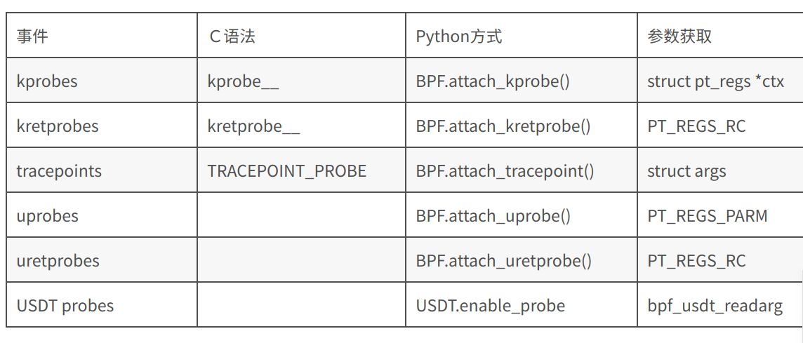
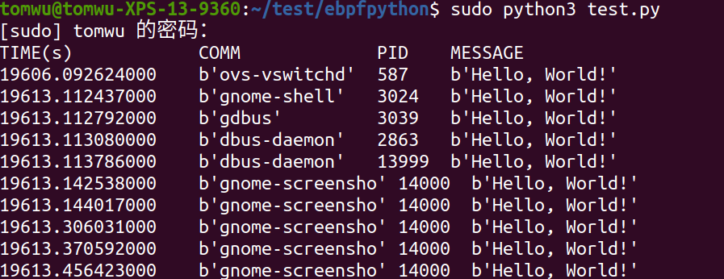

eBPF Verifier

before executing your code, the kernel will actually verify that your code is safe by restricting you from reading memory outside a given range, stopping any jumps either outside well defined space, as well as any jump backwards, and, if the flags are set properly, it will also prohibit any pointer arithmetic.

*The eBPF in-kernel verifier*, but the gist of this is that it's extremely cautious, and with the particularly large fallout that you cannot create any loop in your code (lest it becomes an infinite loop and crashes your kernel). 

因为C文件中的code被编译后要注入到内核去,所以eBPF Verifier会做详细的检查. 代码中不能出现循环


bcc提供的接口在这个文档里,可以去查

https://github.com/iovisor/bcc/blob/master/docs/reference_guide.md




#### What exactly am I tracing with BPF?


从广义上讲，可以将程序附加到并跟踪以下4类

- kprobes

- uprobes

- tracepoints

- USDT (User Statically-Defined Tracing)

  

  使用eBPF，不仅可以跟踪内核功能和入口/出口点，而且还可以跟踪用户空间代码。

kprobes的最大缺点是它们没有定义的接口，因此，每当出现新版本的内核时，所有kprobes的子集都可能完全改变并且变得不兼容。

为了解决这个问题，kernel developers decided to create a more formalized tracing API, which makes actual guarantees on consistency and compatibility. **They peppered these tracepoints all around the kernel**, at useful-to-trace points, like syscall entries and exits, interrupts, TCP events, and signals.

内核开发人员决定创建一个更加形式化的跟踪API，从而对一致性和兼容性做出实际保证。他们在有用的跟踪点（例如系统调用入口和出口，中断，TCP事件和信号）处将这些跟踪点**遍及整个内核**。您可以在/ sys / kernel / debug / tracing / events中找到大多数此类文件。


## hello

```
from __future__ import print_function
from bcc import BPF

prog = """
int hello(void *ctx) {
  bpf_trace_printk("Hello, World!\\n");
  return 0;
}
"""
b = BPF(text=prog)
b.attach_kprobe(event=b.get_syscall_fnname("clone"), fn_name="hello")
print("PID MESSAGE")
try:
    b.trace_print(fmt="{1} {5}")
except KeyboardInterrupt:
    exit()
```

每次在系统调用clone发生的时候都会执行 hello();



**If you need to define some helper function that will not be executed on a probe, they need to be defined as `static inline` in order to be inlined by the compiler. **

`b.trace_fields()`: Returns a fixed set of fields from trace_pipe. Similar to trace_print()


## nodejs USDT

必须要确保Node.js has built-in USDT (user statically-defined tracing) probes for performance analysis and debugging


先装一个Dtrace

```
sudo apt-get install systemtap-sdt-dev 
```

直接送官网下载下来的nodejs好像不能用

手动来 built Node.js :

http://nodejs.org/dist/v8.15.0/

```
 wget https://nodejs.org/dist/v6.7.0/node-v6.7.0.tar.gz
  tar xvf node-v6.7.0.tar.gz
 cd node-v6.7.0
  ./configure --with-dtrace
  make -j8
```

make -j8 因为我是8核CPU

 最重要的是必须加上--with-dtrace, 让他支持Dtrace, 即为用户态的tracepoint

