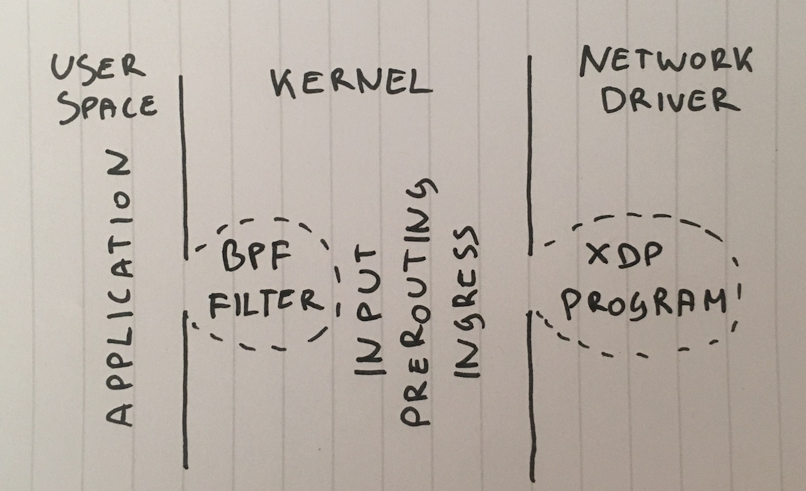

原文

https://blog.cloudflare.com/how-to-drop-10-million-packets/


# How to drop 10 million packets per second

DDoS缓解小组有时被称为“数据包丢弃者”。当其他团队开发出令人兴奋的产品来利用通过我们网络的流量来执行智能操作时，我们会高兴地发现丢弃它的新颖方法。

能够快速丢弃数据包对于抵御DDoS攻击非常重要。

Dropping packets hitting our servers, as simple as it sounds, **can be done on multiple layers**.每种技术都有其优点和局限性。在此博客文章中，我们将回顾到目前为止我们尝试过的所有技术。

 

## Test bench

为了说明这些方法的相对性能，我们将显示一些数字。


在目标端，所有数据包都将被转发到一个RX队列，即一个CPU。我们通过硬件流程控制来做到这一点:

```
ethtool -N ext0 flow-type udp4 dst-ip 198.18.0.12 dst-port 1234 action 2
```

Benchmarking is always hard.  **When preparing the tests we learned that having any active raw sockets destroys performance**。事后看来很明显，但很容易错过。在运行任何测试之前，请记住确保没有运行任何陈旧的tcpdump进程。这是检查它的方法，表明活动的进程无效：

```
 ss -A raw,packet_raw -l -p|cat
```


#### Step 1. Dropping packets in application

Let's start with the idea of delivering packets to an application and **ignoring them in userspace code**. For the test setup, let's make sure our iptables don't affect the performance:

```
iptables -I PREROUTING -t mangle -d 198.18.0.12 -p udp --dport 1234 -j ACCEPT
iptables -I PREROUTING -t raw -d 198.18.0.12 -p udp --dport 1234 -j ACCEPT
iptables -I INPUT -t filter -d 198.18.0.12 -p udp --dport 1234 -j ACCEPT
```

mpstat

**mpstat命令**指令主要用于多CPU环境下，它显示各个可用CPU的状态

```
watch 'mpstat -u -I SUM -P ALL 1 1|egrep -v Aver'
```

#### Step 3. BPF drop on a socket

we can attach a classical BPF filter to a SOCK_DGRAM socket with `setsockopt(SO_ATTACH_FILTER)` and program the filter to **discard packets in kernel space**.

其实就是把过滤规则给attach到相应的socket上

**All of them get dropped in the BPF filter while still in software interrupt mode**, which saves us CPU needed to wake up the userspace application.


#### Step 4. iptables DROP after routing

As a next step we can simply drop packets in the iptables firewall INPUT chain by adding rule like this:

```
iptables -I INPUT -d 198.18.0.12 -p udp --dport 1234 -j DROP
```


#### Step 5. iptables DROP in PREROUTING

An even faster technique is to drop packets before they get routed.

```
iptables -I PREROUTING -t raw -d 198.18.0.12 -p udp --dport 1234 -j DROP
```

This is quite a significant jump in performance, In any case - "raw" iptables table is definitely way faster.


如今，iptables被认为是过时的。Nftables promises to be faster than gray haired iptables 


#### Step 7. tc ingress handler DROP

A somewhat surprising fact is that a tc (traffic control) ingress hook happens before even PREROUTING. **在PREROUTING之前就发生了tc（流量控制）入口hook**.

tc makes it possible to select packets based on basic criteria and indeed - action drop - them. The syntax is rather hacky, so it's recommended to [use this script](https://github.com/netoptimizer/network-testing/blob/master/bin/tc_ingress_drop.sh) to set it up. 


#### Step 8. XDP_DROP

A tc ingress hook with u32 match allows us to drop 1.8mpps on a single CPU. This is brilliant!

But we can go even faster...


Finally, the ultimate weapon is XDP eXpress Data Path.

**With XDP we can run eBPF code in the context of a network driver**.可以在网络驱动中run ebpf的code 

Most importantly, this is before the `skbuff` memory allocation, allowing great speeds.

**最重要的是，这在`skbuff`内存分配之前，可以提高速度**.


通常，XDP项目包含两个部分： 

- 被加载到内核上下文中的eBPF代码 
- 用户空间加载器，它将代码加载到正确的网卡上并进行管理


 With XDP we can drop 10 million packets per second on a single CPU.