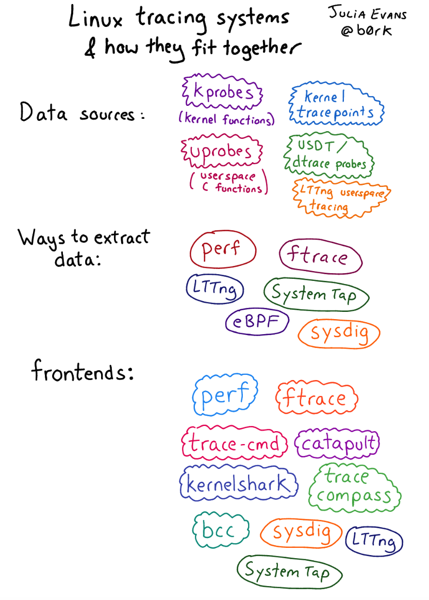
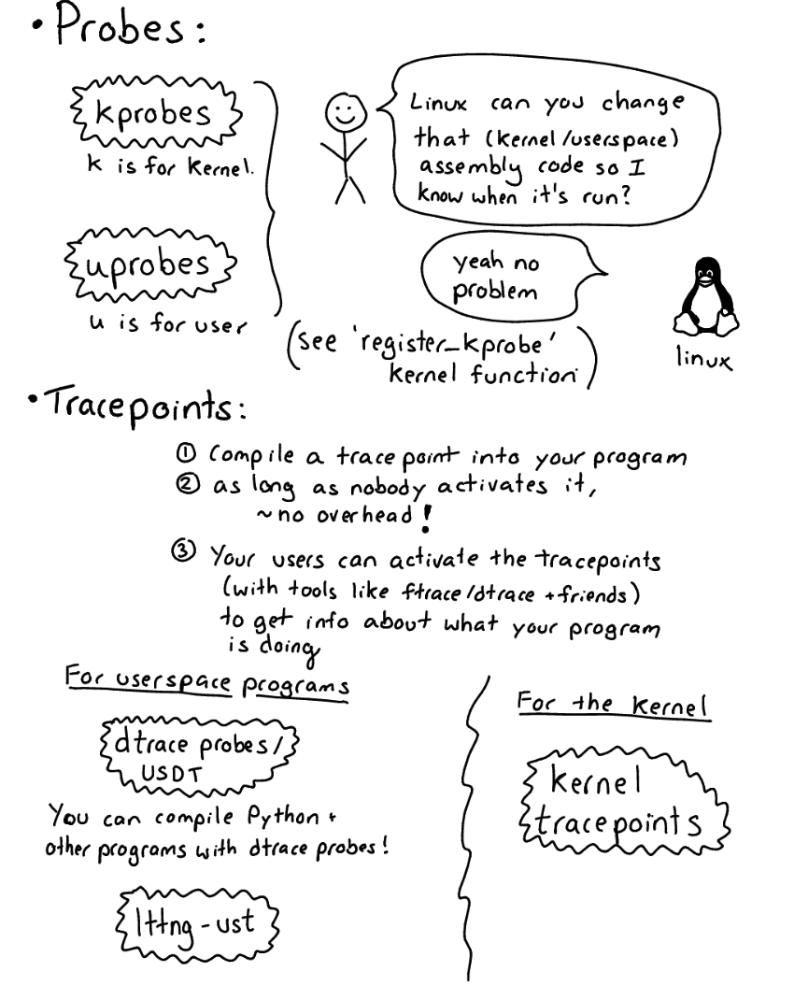
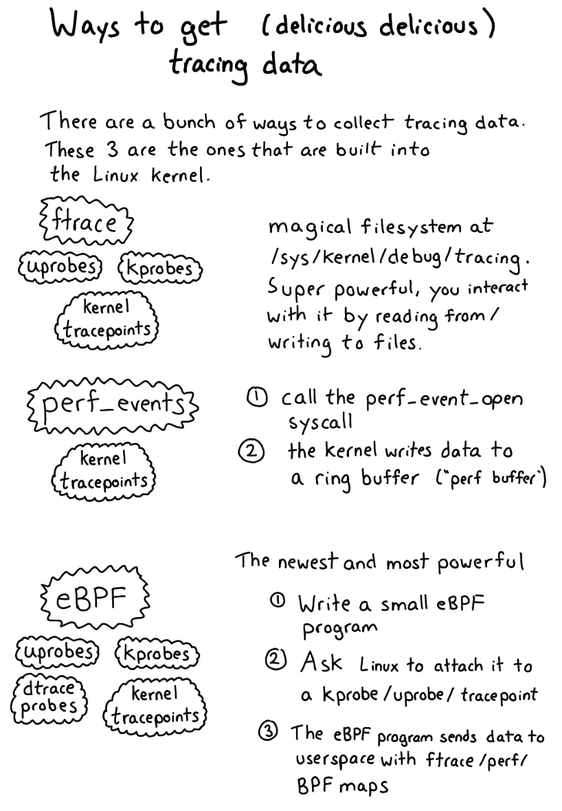

原文链接
https://jvns.ca/blog/2017/07/05/linux-tracing-systems/

# Linux Trace System

You can split linux tracing systems into 
1. data sources (where the tracing data comes from),
2. mechanisms for collecting data for those sources (like “ftrace”)
3. and tracing frontends (the tool you actually interact with to collect/analyse data). 

#### Data sources:
- kprobes
- uprobes
- Tracepoints
- lttng-ust
- USDT / dtrace probes

#### Mechanisms for collecting your delicious data:
- ftrace
- perf_events
- eBPF
- sysdig
- Systemtap kernel module
- LTTng

#### User frontends:
- perf
- Various ftrace frontends (trace-cmd, catapult, kernelshark, perf-tools)
- The bcc frontend for eBPF
- LTTng & SystemTap frontends

注意：
eBPF是让Linux attach你写的ebpf prgram到kprobe/tracepoint

### What can you trace?
A few different kinds of things you might want to trace:

1. System calls
2. Linux kernel function calls (which functions in my TCP stack are being called?)
3. Userspace function calls (did malloc get called?)
4. Custom “events” that you’ve defined either in userspace or in the kernel

### Data sources: kprobes, tracepoints, uprobes, dtrace probes & more
Okay, let’s do data sources! This is kind of the most fun part – there are so many EXCITING PLACES you can get data about your programs.

I’m going to split these up into **“probes” (kprobes/uprobes)** and **“tracepoints” (USDT/kernel tracepoints / lttng-ust)**. I’m think I’m not using the right terminology exactly but there are 2 distinct ideas here that are useful to understand

#### probe 
A probe is when the kernel **dynamically modifies your assembly program** at runtime  in order to enable tracing. 这非常强大（有点吓人！），因为您可以对正在跟踪的程序中的几乎所有指令启用探测。

#### tracepoint
**A tracepoint is something you compile into your program**. When someone using your program wants to see when that tracepoint is hit and extract data, they can “enable” or “activate” the tracepoint to start using it.有点像断点
Generally a tracepoint in this sense doesn’t cause any extra overhead when it’s not activated, and is relatively low overhead when it is activated. USDT (“dtrace probes”), lttng-ust, and kernel tracepoints are all examples of this pattern.

#### kprobes
改内核的汇编代码
**kprobes let you dynamically change the Linux kernel’s assembly code at runtime (like, insert extra assembly instructions) to trace when a given instruction is called**. 

I usually think of kprobes as **tracing Linux kernel function calls**, but you can actually trace **any instruction** inside the kernel and inspect the registers.

I think kprobes are useful in 3 scenarios: 
1. You’re tracing a system call. System calls all have corresponding **kernel functions** like do_sys_open 
2. You’re debugging some performance issue **in the network stack** or to do with **file I/O** and      you understand the kernel functions that are called well enough that it’s useful for you to trace them

3. You’re a kernel developer,or you’re otherwise trying to debug a kernel bug, which happens sometimes!

#### uprobes
Uprobes are kind of like kprobes, 除了不是检测内核函数，而是检测用户空间函数

My understanding of how uprobes work is:

1. You decide you want to trace the malloc function in libc
2. You ask the linux kernel to trace malloc for you from libc
3. **Linux goes and finds the copy of libc that’s loaded into memory (there should be just one, shared across all processes), and changes the code for malloc so that it’s traced**

4. Linux reports the data back to you somehow (we’ll talk about how “asking linux” and “getting the data back somehow” works later)

#### USDT/dtrace probes （tracepoint  用户空间）

USDT stands for “Userland Statically Defined Tracing”, and “USDT probe” means the same thing as “dtrace probe” (which was surprising to me!). You might have heard of dtrace on BSD/Solaris, but you can actually also use dtrace probes on Linux, though the system is different. It’s basically a way to expose custom events. For example! Python 3 has dtrace probes, if you compile it right.

This means that if you have a tool that can consume dtrace probes, (like eBPF / systemtap), and a version of Python compiled with dtrace support, **you can automagically trace Python function calls**. That’s really cool! (though this is a little bit of an “if” – not all Pythons are compiled with dtrace support, and the version of Python I have in Ubuntu 16.04 doesn’t seem to be)
不太懂，只需要知道他是一种用户空间的tracepoint

#### kernel tracepoints

Tracepoints are also in the Linux kernel. 

### eBPF

eBPF is a VERY EXCITING WAY to get data. Here’s how it works.

1. You write an “eBPF program” (often in C).
2. **You ask the kernel to attach that probe to a kprobe/uprobe/tracepoint/dtrace probe**
3. Your program writes out data to an **eBPF map** / ftrace / perf buffer
4. You have your precious precious data!

 eBPF is cool because it’s part of Linux and you can define your own programs to do any fancy aggregation you want so it’s really powerful. 
 **You usually use it with the bcc frontend which we’ll talk about a bit later.** It’s only available on newer kernels though (the kernel version you need depends on what data sources you want to attach your eBPF programs to)

