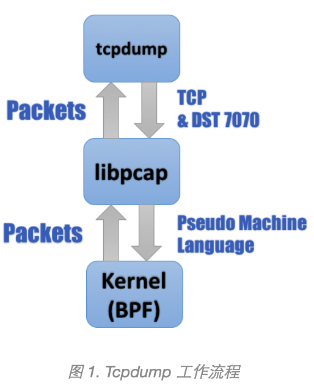
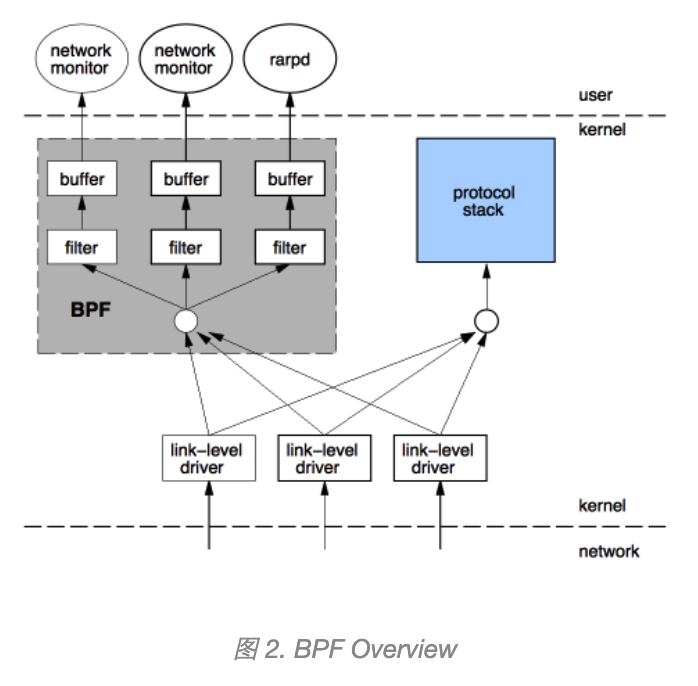
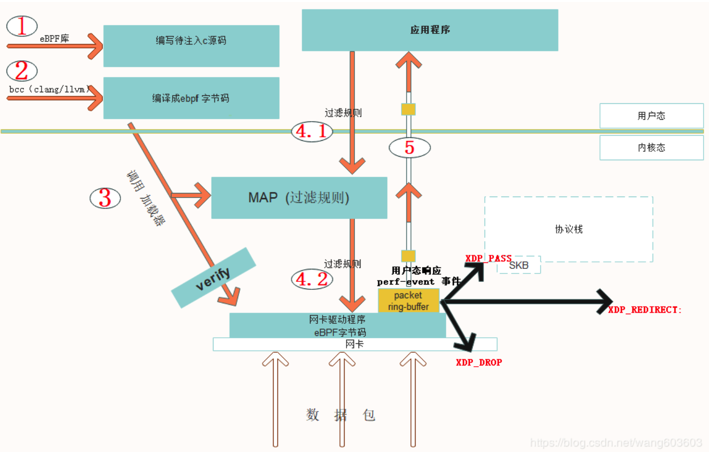

**xdp 使用ebpf 做 包过滤**，相对于dpdk将数据包直接送到用户态，用用户态当做快速数据处理平面，**xdp是在驱动层创建了一个数据快速平面**。

在数据被网卡硬件dma到内存，分配skb之前，对数据包进行处理。

**bfp：** Berkeley Packet Filter, 用于过滤filter 网络报文packet的架构。

其背后的思想是:**“与其把数据包复制到用户空间执行用户态程序过滤，不如把过滤程序灌进内核去”**

和x86，ARM这些类似，BPF包含自己的指令集和运行时逻辑

无论 BSD 和 Berkeley 如何变换，其后的 Packet Filter 总是不变的，这两个单词也基本概括了 BPF 的两大核心功能：

- 过滤Filter：根据外界输入的规则过滤报文；
- 复制Copy：将符合条件的报文由内核空间复制到用户空间；

位于内核之中的 BPF 模块是整个流程之中最核心的一环：它一方面接受 `tcpdump` 经由 libpcap 转码而来的滤包条件（Pseudo Machine Language），另一方面也将符合条件的报文复制到用户空间最终经由 libpcap 发送给 `tcpdump`。

https://linux.cn/article-9032-1.html

时至今日，传统 BPF 仍然遵循图 2 的路数：途经网卡驱动层的报文在上报给协议栈的同时会多出一路来传送给 BPF，再经后者过滤后最终拷贝给用户态的应用。

XDP, eXpress Data Path, **它其实是位于网卡驱动程序里的一个快速处理包的HOOK点**。

避免了很多内核skb处理开销(socket buffer, 数据包的管理结构)；可以将很多处理逻辑offload到网卡硬件。

 

********

内核如何从网卡接收数据,传统的过程：
1.数据到达网卡；
2.网卡产生一个中断给内核；
3.内核使用I/O指令，从网卡I/O区域中去读取数据；

中断的问题：

大流量的数据来到，网卡会产生大量的中断，内核在中断上下文中，会浪费大量的资源来处理中断本身。所以，就有一个问题，“可不可以不使用中断”，这就是轮询技术，所谓NAPI技术，说来也不神秘，就是说，内核屏蔽 中断，然后隔一会儿就去问网卡，“你有没有数据啊？”……

从这个描述本身可以看到，如果数据量少，轮询同样占用大量的不必要的CPU资源

IO的问题

另一个问题，就是从网卡的I/O区域，**包括I/O寄存器或I/O内存中去读取数据**，这都要CPU 去读，也要占用CPU资源，“CPU从I/O区域读，然后把它放到内存中”。

于是 自然地，就想到了DMA技术
 

 