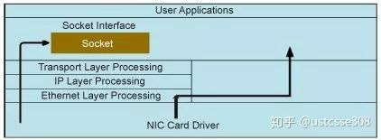
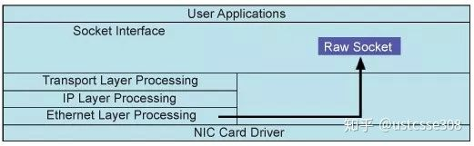
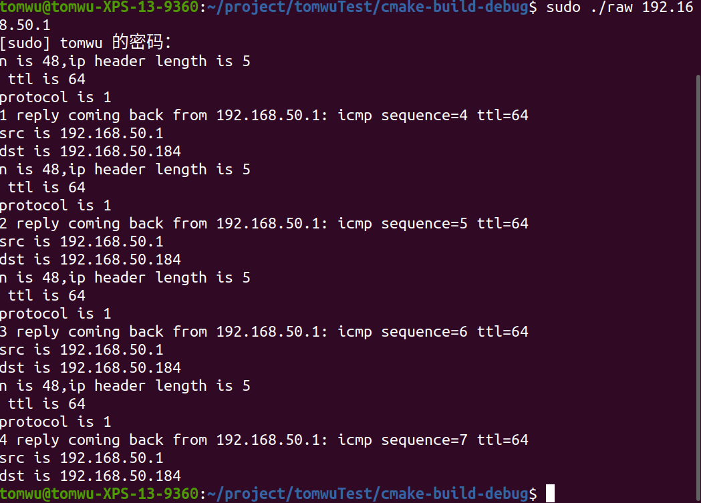

## raw socket编程

从应用开发的角度看，SOCK_STREAM、SOCK_DGRAM 这两类套接字似乎已经足够了。


但是，从另外的角度，这两种套接字有一些局限：

- 怎样发送一个 ICMP 协议包？
- 怎样伪装本地的 IP 地址？
- 怎样实现一个新设计的协议的数据包？


这两种套接字的局限在于它们只能处理数据载荷，数据包的头部在到达用户程序的时候已经被移除了。



所以，这里我们要引入一个新的socket类型，原始套接字（SOCK_RAW）。原始套接字应用也很广泛，可以实现sniffer【之前使用pcap实现的sniffer也可以使用raw_socket实现】、IP 欺骗等，基于此，可以实现各种攻击。**原始套接字之所以能够做到这一点，是因为它可以绕过系统内核的协议栈，使得用户可以自行构造数据包**。



原始套接字用于接收和发送原始数据包。 这意味着在**以太网层**接收的数据包将直接传递到原始套接字。 准确地说，原始套接字绕过正常的TCP / IP处理并将数据包发送到特定的用户应用程序。**使用 raw套接字可以实现上至应用层的数据操作，也可以实现下至链路层的数据操作**。


要创建套接字，必须知道套接字族、套接字类型和协议三个方面。 对于原始套接字，套接字族可以是AF_INET、PF_INET、AF_PACKET和PF_PACKET；套接字类型是SOCK_RAW；至于协议，可以查阅if_ether.h头文件。

使用AF_INET，用户程序无法获得链路层数据，也即，以太网头部。简单来说，使用AF_INET，是面向IP层的原始套接字；使用AF_PACKET，是面向链路层的套接字。


使用AF_INET时，我们所构造的报文从IP首部之后的第一个字节开始，IP首部由内核自己维护，首部中的协议字段会被设置为我们调用socket()函数时传递给它的protocol字段。

如果没有开启IP_HDRINCL选项，那么内核会帮忙处理IP头部。如果设置了IP_HDRINCL选项，那么用户需要自己生成IP头部的数据，其中IP首部中的标识字段和校验和字段总是内核自己维护。可以通过下面代码开启IP_HDRINCL：

```text
const int on = 1;
if(setsockopt(fd,SOL_IP,IP_HDRINCL,&on,sizeof(int)) < 0)
{
  printf("set socket option error!\n");
}
```


如果第一个参数是AF_PACKET，那么是面向链路层的套接字，第三个参数可以是

- ETH_P_IP - 只接收目的mac是本机的IP类型数据帧
- ETH_P_ARP - 只接收目的mac是本机的ARP类型数据帧
- ETH_P_RARP - 只接收目的mac是本机的RARP类型数据帧
- ETH_P_PAE - 只接收目的mac是本机的802.1x类型的数据帧
- ETH_P_ALL - 接收目的mac是本机的所有类型数据帧，同时还可以接收本机发出的所有数据帧，混杂模式打开时，还可以接收到目的mac不是本机的数据帧


如果第一个参数是AF_INET，那么是面向IP层的套接字，protocol字段定义在netinet/in.h中，常见的包括IPPROTO_TCP、IPPROTO_UDP、IPPROTO_ICMP和IPPROTO_RAW。


### **实现自己的ping程序**

ping是ICMP协议，目前不需要篡改IP地址，所以，我们的参数可以使用：

```text
sockfd = socket(AF_INET,SOCK_RAW,IPPROTO_ICMP);
```

AF_INET，是面向IP层的原始套接字




```
//
// Author: Shuohan Wu
// Created by Tom Wu  On 2020/2/25.

// Description:
//

//This is a ping which can both send and receive ICMP packets
#include <sys/types.h>
#include <unistd.h>
#include <errno.h>
#include <signal.h>
#include <sys/socket.h>
#include <netinet/in.h>
#include <arpa/inet.h>
#include <linux/tcp.h>
#include <netinet/ip_icmp.h>
#include<strings.h>
#include <stdio.h>
#include <stdlib.h>
#include<string.h>
#include <arpa/inet.h>

char buff[28]={0};
int sockfd;
struct sockaddr_in target;
struct sockaddr_in source;

unsigned short in_cksum(unsigned short *addr, int len)
{
    int sum=0;
    unsigned short res=0;
    while( len > 1)  {
        sum += *addr++;
        len -=2;
        // printf("sum is %x.\n",sum);
    }
    if( len == 1) {
        *((unsigned char *)(&res))=*((unsigned char *)addr);
        sum += res;
    }
    sum = (sum >>16) + (sum & 0xffff);
    sum += (sum >>16) ;
    res = ~sum;
    return res;
}


int main(int argc, char * argv[]){

    int send, recv,i;
    send = 0;
    recv = 0;
    i = 0;

    if(argc != 2){
        printf("usage: %s targetip\n", argv[0]);
        exit(1);
    }

//把目标IP存入target
    if(inet_aton(argv[1],&target.sin_addr)==0){
        printf("bad ip address %s\n",argv[1]);
        exit(1);
    }

    int recvfd = socket(AF_INET,SOCK_RAW,IPPROTO_ICMP);

    struct icmp * icmp = (struct icmp*)(buff);

    if((sockfd=socket(AF_INET,SOCK_RAW,IPPROTO_ICMP))<0)
    {	perror("socket error!");exit(1);	}


    icmp->icmp_type = ICMP_ECHO;
    icmp->icmp_code = 0;
    icmp->icmp_cksum = 0;
    icmp->icmp_id = 2;
    icmp->icmp_seq = 3;

    while(send < 4)
    {
        send++;
        icmp->icmp_seq = icmp->icmp_seq+1;
        icmp->icmp_cksum = 0;
        icmp->icmp_cksum = in_cksum((unsigned short *)icmp,8);
        sendto(sockfd, buff, 28,0,(struct sockaddr *)&target,sizeof(target));
        sleep(1);
    }

    struct sockaddr_in from;
    int lenfrom = sizeof(from);
    char recvbuff[1024];
    int n;
    while(recv<4){
        memset(recvbuff,0,1024);
        if((n = recvfrom(recvfd, recvbuff, sizeof(recvbuff), 0, (struct sockaddr *)&from,
                         reinterpret_cast<socklen_t *>(&lenfrom))) < 0) {perror("receive error!\n");exit(1);};
        struct ip *ip=(struct ip *)recvbuff;
        struct icmp *icmp = (struct icmp*)(ip+1);
        printf("n is %d,ip header length is %d\n ",n,ip->ip_hl);
        if((n-ip->ip_hl*4)<8) {printf("Not ICMP Reply!\n");break;}
        printf("ttl is %d\n",ip->ip_ttl);
        printf("protocol is %d\n",ip->ip_p);
        if((icmp->icmp_type==ICMP_ECHOREPLY)&&(icmp->icmp_id==2)){
            printf("%d reply coming back from %s: icmp sequence=%u ttl=%d\n",recv+1,inet_ntoa(from.sin_addr),icmp->icmp_seq,ip->ip_ttl);
            printf("src is %s\n",inet_ntoa(ip->ip_src));
            printf("dst is %s\n",inet_ntoa(ip->ip_dst));
            recv++;}

    }

    return 0;
}
```

