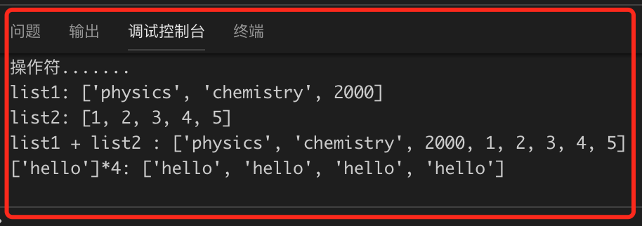
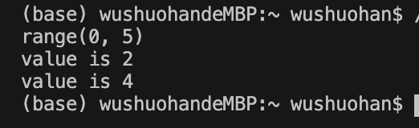

## Main

if __name__ == '__main__':的作用

一个python文件通常有两种使用方法，第一是作为脚本直接执行，第二是 import 到其他的 python 脚本中被调用（模块重用）执行。因此 if __name__ == 'main': 的作用就是控制这两种情况执行代码的过程，在 if __name__ == 'main': 下的代码只有在第一种情况下（即文件作为脚本直接执行）才会被执行，而 import 到其他脚本中是不会被执行的。

## 补充

print("string=%-6s" %string)  # 输出的打印结果为 string=good  (当字符串的长度小于6时，在字符串的右侧填补空格，使得字符串的长度为6)


## 1.2 数值类型

标准整型等价于C中的有符号长整型（long），与系统的最大整型一致（如32位机器上的整型是32位，64位机器上的整型是64位）
```a=64

```

长整型是整型的超集，可以表示无限大的整数（实际上只受限于机器的虚拟内存大小）。 长整型和标准整型，目前已经基本统一，当数学运算遇到整型异常的情况，在Python2.2以后的版本，会自动转换为长整型。

```
<!--使用bool数-->
foo = 42
bar = foo<42
```

ASII 转换：
```
<!---->chr函数和ord函数分别用来将数字转换为字符，和字符转换为数字。
print(chr(76))
print(ord('L'))
```

## 1.3
### 1.3.1 字符串
```#声明字符串
str1 ='Hello World!'
str2 ="hello 玄魂！"

#访问字符内容
print("str1[0]: ", str1[0])
print("str2[1:5]: ", str2[1:5])

```
Python不支持单字符类型，单字符在Python也是作为一个字符串使用。
在需要在字符中使用特殊字符时，python用反斜杠(\)转义字符。如下表：

in:
return ture if a character exit in a given string
``` 
if("H" in a):
print("H 在变量 a 中")
else:
print("H 不在变量 a 中")
```

在 Python 中，字符串格式化使用与 C 中 sprintf 函数一样的语法，例如：
```
print("My name is %s and weight is %d kg!"%('玄魂',71))
```

三引号允许一个字符串跨多行，字符串中可以包含换行符、制表符以及其他特殊字符。
```hi = '''hi
i� am  玄魂'''
print(hi)
```

```
#创建list
list1 =['physics','chemistry',1997,2000]
#更新list
list1[2]=2001
#使用 del 语句来删除列表的的元素
del(list1[2])
```

操作符
列表对 + 和 * 的操作符与字符串相似。+ 号用于组合列表，* 号用于重复列表。
```
#操作符
print('list1:',list1)
print('list2:',list2)

list4 = list1 + list2
print("list1 + list2 :",list4)

list5 = ['hello']*4
print('[\'hello\']*4:',list5)
```



列表截取与字符串操作类似
```
##读取第二个元素
print(L[2])
##读取倒数第二个元素
print(L[-2])
##从第二个开始截取
print(L[1:])
```
### 1.3.1 元组
元组与列表类似，不同之处在于元组的元素不能修改。元组使用小括号，列表使用方括号。元组创建很简单，只需要在括号中添加元素，并使用逗号隔开即可。
```
tup0=()#空元组
tup1 = ('physics', 'chemistry', 1997, 2000)
tup2 = (1, 2, 3, 4, 5 )
tup4= (50,)#元组中只包含一个元素时，需要在元素后面添加逗号
```
需要注意的是元组内元素**不能修改和删除**，会引发错误。


### 1.3.4 字典
键必须是唯一的，但值则不必。像C++里的map
 字典的每个键值(key=>value)对用冒号:分割，每个对之间用逗号,分割，整个字典包括在花括号{}中
```
dict ={'Name':'Zara','Age':7,'Class':'First'}
#访问元素
print("dict['Name']: ", dict['Name'])
# update existing entry
dict['Age']=8

#访问不存在的entry会抛异常

#删除
del dict['Age']# 删除键是'Name'的条目
dict.clear()    # 清空词典所有条目
```
### 1.3.5 集合 like C++ set
```
s1=set('abcdde')
s2=set([1,2,3,4,5])
s3 = frozenset("xuanhun")

print(type(s1))
print(type(s3))
print(s2)

#输出集合内容
for item in s3:
print(item)
```

可以看到集合**无序，无重复元素**的特性。

```
s.add()
s.update()
s.remove()
```

联合(union)操作与集合的OR操作其实等价的，联合符号有个等价的方法，union()。
```
#union
s1=set('abcdde')
s2=set([1,2,3,4,5])
s4=s1|s2
print(s4)
```

与集合AND等价，交集符号的等价方法是intersection()。测试代码如下：
```
#inter
print("s1&s2",s1&s2)
```

差集等价方法是difference()。测试代码如下：
```#dif
print("s1-s2",s1 -s2)
print("s1 dif  s2",s1.difference(s2))
```

### 1.4.5 RANGE和XRANGE
使用range函数可以很方便的生成一个等差系列。range函数完整的声明如下：
```range(start,end,step =1)

```
只有一个参数时，传入值为end，起始值为0，步长为1；
传递两个参数时，传入值为start和end，步长为1；
传递三个参数时，传入值为start，end和步长。

```
a=range(5)
c=range(2,5,2)

print(a)
for i in c:
print("value is",i)
```



## 1.5 函数
函数通过def关键字定义。def关键字后跟一个函数的 标识符 名称，然后跟一对圆括号。
```
def printMax(a, b):
if a > b:
    print(a, 'is maximum')
else:
    print(b, 'is maximum')
```

### 局部变量
当你在函数定义内声明变量的时候，它们与函数外具有相同名称的其他变量没有任何关系
```
def func(x):
    print('x is', x)
    x = 2
    print('Changed local x to', x)
print('局部变量')
x = 50
func(x)
print('x is still', x)
```

如果你想要为一个定义在函数外的变量赋值，那么你就得告诉Python这个变量名不是局部的，而是 全局 的。我们使用global语句完成这一功能。没有global语句，是不可能为定义在函数外的变量赋值的。
```
#访问外部变量
def func2():
    global x
    print('x is', x)
    x = 2
```
### 1.5.4 默认参数值
```
def say(message, times = 1):
    print(message * times)
```
### 1.5.5 关键字传参
```
#关键字传参
def func3(a, b=5, c=10):
    print('a is', a, 'and b is', b, 'and c is', c)

func3(3, 7)
func3(25, c=24)
func3(c=50, a=100)
```

没有返回值的return语句等价于return None, **每个函数都在结尾暗含有return None语句**.

## 1.6 模块
我们已经学习了如何在你的程序中定义一次**函数**而重用代码。如果你想要在其他程序中重用很多函数，那么你该如何编写程序呢？答案是使用模块。模块基本上就是一个包含了所有你定义的函数和变量的文件。为了在其他程序中重用模块，**模块的文件名必须以.py为扩展名**。

```
导入sys模块
import sys

for i in sys.argv:
    print(i)
```
当Python执行import sys语句的时候，**它在sys.path变量中所列目录中寻找sys.py模块**。如果找到了这个文件，这个模块的主块中的语句将被运行，然后这个模块将能够被你使用。


上面的示例中我们通过sys.argv的方式来获取argv变量中的内容，那如果我们想直接调用argv，就可以获取变量内容或进行方法调用，可以使用**from sys import argv** 语句。

## 1.7 异常
```
import sys

try:
    f = open('integers.txt')
    s = f.readline()
    i = int(s.strip())
except IOError as e:
    print("I/O error",e)
except ValueError:
    print("No valid integer in line.")
except:
    print("Unexpected error:", sys.exc_info()[0])
finally:
    print('to return in finally')
    return 'finally'
    
```


通过raise来抛出异常
```
class ShortInputException(Exception):
    '''A user-defined exception class.'''
    def __init__(self, length, atleast):
        Exception.__init__(self)
        self.length = length
        self.atleast = atleast
        
##通过raise来抛出异常
raise ShortInputException(len(s), 3)
```
自定义了一个ShortInputException类，它继承自Exception类，构造函数接受两个参数输入字符串的长度和最小长度。

```
def test1():
    try:
        print('to do stuff')
        raise Exception('hehe')
    except Exception:
        print('process except')
        print('to return in except')
        return 'except'
    finally:
        print('to return in finally')
        return 'finally'
```

执行结果：
```
to do stuff
process except
to return in except
to return in finally
```
在 try 中 raise一个异常，就立刻转入 except 中执行，在except 中遇到 return 时，就强制转到 finally 中执行， 在 finally 中遇到 return 时就返回。

## 1.8 面向对象编程
新建一个类
```
class Person2:
    ##类变量是全局的，对每个对象都共享
    population = 0
    
    
    ##构造函数
    def __init__(self, name):
        ##name变量属于对象（它使用self赋值）因此是对象的变量。
        self.name = name
    def sayHi(self):
        print('Hello, my name is', self.name)

p2 = Person2('TOM')
p2.sayHi()
```


继承：
```
class SchoolMember:
'''Represents any school member.'''
    def __init__(self, name, age):
        self.name = name
        self.age = age
        print('(Initialized SchoolMember: %s)' % self.name)

    def tell(self):
        '''Tell my details.'''
        print('Name:"%s" Age:"%s"' % (self.name, self.age))

    class Teacher(SchoolMember):
        '''Represents a teacher.'''
        def __init__(self, name, age, salary):
        SchoolMember.__init__(self, name, age)
        self.salary = salary
        print('(Initialized Teacher: %s)' % self.name)

def tell(self):
SchoolMember.tell(self)
print('Salary: "%d"' % self.salary)
```
类似于C++的多态，可以用基类去实例化子类


## 2.1 文件和目录基本操作
```
open(file, mode='r', buffering=-1, encoding=None, errors=None, newline=None, closefd=True, opener=None)
```

1. t    文本模式 (默认)
2. r    以只读方式打开文件。文件的指针将会放在文件的开头。这是默认模式。
3. w    打开一个文件只用于写入。如果该文件已存在则打开文件，并从开头开始编辑，即原有内容会被删除。如果该文件不存在，创建新文件。
4. w+   打开一个文件用于读写。如果该文件已存在则打开文件，并从开头开始编辑，即原有内容会被删除。如果该文件不存在，创建新文件。
5. a    打开一个文件用于追加。如果该文件已存在，文件指针将会放在文件的结尾。也就是说，新的内容将会被写入到已有内容之后。如果该文件不存在，创建新文件进行写入。


下面我们编写代码打开test.txt文件并读出其内容：
```
file = open('./test.txt','r')
print(file.read())
file.close()


import os

print(os.getcwd())
```

使用 for ... in 语句可以逐行读取文件内容。示例如下：
```
print('逐行读取.....')
file = open('./test.txt','r')
for c in file:
    print(c)
file.close()
```

如果是以read方法读取大文件，一般的形式如下：
```
with open('./test.txt','r') as f:
    while True:
        c = f.read(1)
        if not c:
            break
        print(c)
```

#### 2.1.1.2 文件写入
想要对文件进行写入，open方法可传入的mode参数有‘a’系列和‘w’系列，'a'模式代表追加，在原�文件的末尾添加内容，‘w’模式会清空原文件的内容，重新写入。
```
filePath = './test.txt'

print('a模式写入.....')

def printContent(path):
    with open(path,'r') as f:
        print(f.read())

with open(filePath,'a') as f:
f.write("追加内容\r\n")

printContent(filePath)

with open(filePath,'w') as f:
    f.write("追加内容\r\n")
```

#### 2.1.2.1 目录枚举
```
def listCurrentDirectory(path):
    files = os.listdir(path)
    for name in files:
        print(name)
```

只能获取名字是不够的，我们希望能获取更详细的信息，可以使用os.stat方法。添加如下示例代码
```
def listDirectoryDetail(path):
    files = os.listdir(path)
    for name in files:
        pathName = os.path.join(path,name)
        print(os.stat(pathName).st_mode)   #inode 保护模式
        print(os.stat(pathName).st_ino) #inode 节点号
        print(os.stat(pathName).st_dev )   # inode 驻留的设备
        print(os.stat(pathName).st_nlink)  #inode 的链接数
        print(os.stat(pathName).st_uid   ) #所有者的用户ID
        print(os.stat(pathName).st_gid    )#所有者的组ID
        print(os.stat(pathName).st_size  )#文件的大小，普通文件以字节为单位的大小；包含等待某些特殊文件的数据
        print(os.stat(pathName).st_atime  )#文件最后访问时间
        print(os.stat(pathName).st_mtime  )#文件最后修改时间
        print(os.stat(pathName).st_ctime  )#由操作系统报告的"ctime"。在某些系统上（如Unix）是最新的元数据更改的时间，在其它系统上（如Windows）是创建时间
```

从打印的数据看，我们仍然无法知道当前�路径是�文件还是目录、�权限等信息，此时需要引入stat模块对st_mode进行解析，我们先看示例。
```
import stat
def listCurrentDirectoryMode(path):
    files = os.listdir(path)
    for name in files:
        pathName = os.path.join(path, name)
        mode = os.stat(pathName).st_mode
        if stat.S_ISDIR(mode):
            # 如果是目录
            print('%s是文件夹' % pathName)
        elif stat.S_ISREG(mode):
            # 如果是文件
            print('%s是文件'%pathName)
        else:
            # 未知类型
            print('�未知目录类型 %s' % pathName)

listCurrentDirectoryMode('.')
```


上面的代码实现了枚举当前目录下的一级子目录的信息，但是多级目录，我们如何进行一层层的遍历呢？除了循环调用os.listdir外，可以用os.walk
```
def walkDir(path):
    for dirName, subdirList, fileList in os.walk(path):
        print('发现目录: %s' % dirName)
        for fname in fileList:
            print('\t%s' % fname)

walkDir('.')
```
### 2.1.3 修改权限 
```
os.chmod(path, mode)

os.chmod("./1.txt", stat.S_IXGRP)
```
stat.S_IRWXO: 其他用户有全部权限(权限掩码)0o007
stat.S_IRWXG: 组用户有全部权限(权限掩码)0o070
stat.S_IRWXU: 拥有者有全部权限(权限掩码)0o700
