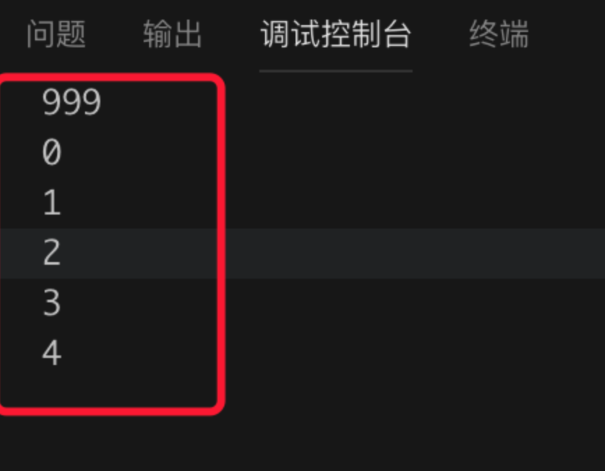

Python的多线程和其他语言还是有很大区别的，原则上讲是假的多线程。下面的解释引自知乎：

Python在设计之初就考虑要在主循环中，**同时只有一个线程在执行，就像单CPU的系统中运行多个进程那样**,内存中可以存放多个程序，但任意时刻，只有一个程序在CPU中运行。

同样地，**虽然Python解释器可以运行多个线程，只有一个线程在解释器中运行**。对Python虚拟机的访问由全局解释器锁（GIL）来控制，**正是这个锁能保证同时只有一个线程在运行**。


在多线程环境中，Python虚拟机按照以下方式执行:
1. 设置GIL。
2. **切换到一个线程去执行。**
3. 运行。
4. 把线程设置为睡眠状态。
5. 解锁GIL。
6. 再次重复以上步骤。


对所有面向I/O的（会调用内建的操作系统C代码的）程序来说，GIL会在这个I/O调用之前被释放，**以允许其他线程在这个线程等待I/O的时候运行**。如果某线程并未使用很多I/O操作，它会在自己的时间片内一直占用处理器和GIL。


## 2.2 多线程编程
threading模块中的Thread类代表一个线程
```
class SimpleCreator():
    def f(self,id):
        print('线程执行 %s \n' %id)
        return
    def __init__(self):
        return

    def creatThread(self):
        for i in range(3):
            t = threading.Thread(target=self.f,args=(i,))
            t.start()
```


自定义thread
```
from threading import Thread

class MyThread(Thread):
    def __init__(self, id):
        super(MyThread, self).__init__()  # 重构run函数必须要写
        self.id = id

    def run(self): #重写run方法
        print("task", self.id)

#调用自定义类
if __name__ == "__main__":
    t1 = MyThread("t1")
    t2 = MyThread("t2")

    t1.start()
    t2.start()
```
首先使用“if name == 'main'” 来判断当前文件是否是入口文件，在多个.py文件组成的应用中，或者编写给第三方调用的模块的时候，判断应用程序入口是十分必要的，不然很多代码会被引用一次就执行一次。

### 2.1.2 Identify
每个线程默认都有唯一的标识符，可以通过Thread的getName方法获取到。
```
print(currentThread().getName())#获取当前线程的名字
```
调用threading.currentThread()方法来获取当前线程（主线程）的实例。


### 2.1.3 setDaemon
如果主线程又创建一个子线程，主线程和子线程就分兵两路，分别运行，**那么当主线程完成想退出时，会校验子线程是否完成。如果子线程未完成，则主线程会等待子线程完成后再退出**，但是有时候我们需要主线程完成了，不管子线程是否完成，都要和主线程一起退出，这时就可以用setDaemon方法了。

主线程A中，创建了子线程B，并且在主线程A中调用了B.setDaemon(),这个的意思是，把主线程A设置为守护线程，这时候，要是主线程A执行结束了，就不管子线程B是否完成,一并和主线程A退出。要特别注意的：必须在start() 方法调用之前设置。
```
from threading import Thread
import time
class MyThread(Thread):
    def __init__(self):
        super(MyThread, self).__init__()
    def run(self):
        time.sleep(5)
        print("我是子线程：" + self.getName())

if __name__ == "__main__":
t1=MyThread()
t1.setDaemon(True)
t1.start()
print("我是主线程！")
```
**子线程t1中的内容并未打出**。t1.setDaemon(True)的操作，将父线程设置为了守护线程。根据setDaemon()方法的含义，父线程打印内容后便结束了，不管子线程是否执行完毕了。

### 2.1.4 join
主线程A中，创建了子线程B，并且在主线程A中调用了B.join()，那么，主线程A会在调用的地方等待，直到子线程B完成操作后，才可以接着往下执行，那么在调用这个线程时可以使用被调用线程的join方法。
```
import threading
import time
class MyThread(threading.Thread):
    def __init__(self,id):
        super(MyThread, self).__init__()
        self.id = id
    def run(self):
        time.sleep(3)
        print(self.id)

if __name__ == "__main__":
t1=MyThread(999)
t1.start()
t1.join()#此处增加join调用
    for i in range(5):
print(i)
```

程序会先等待3秒，然后打印999，最后才执行循环打印


### 2.16 锁
```
import threading
import time

num = 0
def run(n):
    lock.acquire()  #获取锁
    global num
    print('start:', num)
    num += 1
    print('end', num)
    lock.release()  #释放锁

lock = threading.Lock()  # 实例化一个锁对象
for i in range(200):
    t = threading.Thread(target=run, args=("t-%s" % i,))
    t.start()
    t.join()
```
了lock.acquire() 获取锁，通过lock.release()释放锁，**两者之间的代码同时只能被一个线程访问**

## 2.3 多进程编程

在上一节我们讲过Python的多线程由于全局线程锁的存在并不能实现真正的并行编程，但是Python中的多进程编程模式是可以实现这个目标的。多进程模式下进行上下文切换的损耗要远远大于线程。进程间无法直接共享数据，需要通过Queue、Pipe或则Manager方式做进程间通信。

TODO：

## 3.1 socket编程
```
import socket
import sys

#测试类
class Client:
    def __init__(self,host):
        self.host=host #待连接的远程主机的域名
    def connet(self): #连接方法
    try:
        s = socket.socket(socket.AF_INET, socket.SOCK_STREAM)
    except socket.error as e:
        print("Failed to create socket. Error: %s"%e)
        sys.exit() #退出进程
    try:
        remote_ip = socket.gethostbyname(self.host)#根据域名获取ip
    except socket.gaierror:
        print('主机无法被解析')
        sys.exit() #退出进程
    try:
        s.connect((remote_ip,80))#连接
        message = b"GET / HTTP/1.1\r\n\r\n"
        s.sendall(message)#发送数据
        reply = s.recv(4096)#接收数据
        print(reply)
        s.close()#关闭连接
    except socket.error:
        sys.exit() #退出进程

if __name__ == '__main__':
cl = Client('www.baidu.com')
cl.connet()
```
接收服务器的响应使用s.recv方法，该方法的参数为一次接收的数据大小，当数据很大或者不知道具体大小的时候，需要循环接收.

客户端：
```
import socket
import sys

class server:
def __init__(self,ip,port):
self.port=port
self.ip=ip
def start(self):
s = socket.socket(socket.AF_INET,socket.SOCK_STREAM)#创建socket
try:
s.bind((self.ip,self.port))#绑定
s.listen(10)#监听
print('等待客户端连接')
conn, addr = s.accept()#接收连接
print('客户端连接 ' + addr[0] + ':' + str(addr[1]))
data = conn.recv(1024)#接收数据
print("客户端数据：%s"%data)
conn.sendall(bytes("你好客户端\n\r", encoding = "utf8"))#发送数据
conn.close()#关闭连接

except socket.error as e:
print(e)
sys.exit()
finally:
s.close() #关闭服务端


if __name__ == '__main__':
    s = server('',8800)
    s.start()
```

服务端：
```
import socket
import sys

class server:
    def __init__(self,ip,port):
        self.port=port
        self.ip=ip
    def start(self):
        s = socket.socket(socket.AF_INET,socket.SOCK_STREAM)#创建socket
        try:
            s.bind((self.ip,self.port))#绑定
            s.listen(10)#监听
            print('等待客户端连接')
            conn, addr = s.accept()#接收连接
            print('客户端连接 ' + addr[0] + ':' + str(addr[1]))
            data = conn.recv(1024)#接收数据
            print("客户端数据：%s"%data)
            conn.sendall(bytes("你好客户端\n\r", encoding = "utf8"))#发送数据
            conn.close()#关闭连接

        except socket.error as e:
            print(e)
            sys.exit()
        finally:
            s.close() #关闭服务端

if __name__ == '__main__':
    s = server('',8800)
    s.start()
```
listen方法接收一个参数，用来指定可以同时挂起的连接数。

