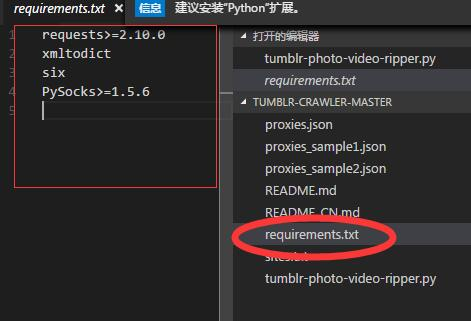

## pip
- 什么是pip
pip是Python安装包默认的包管理工具, like JAVA的maven(我的感觉)
通过 pip 来安装github3模块：
```pip install github3.py

<!---->卸载软件包，使用uninstall选项：
pip uninstall SomePackage 

<!---->更新软件包
pip install --upgrade SomePackage

<!---->显示已经安装的文件:
pip show --files SomePackage
```

- pip把包安装在哪里
在python目录下的site-packages中

如果要安装特定版本的package，通过使用==, >=, <=, >, <来指定一个版本号。例如：
```pip install 'Markdown<2.0'
```

我们也可以将所有的依赖放到一个requirement文件中，一次性安装。例如新建内容如下的requirements.txt文件：

执行命令：
```pip install -r requirements.txt
```

## easy install
easy_install 是Python setuptools系列工具的中的一个工具，可以用来自动查找、下载、安装、升级依赖包。
```sudo apt-get install python-setuptools

<!---->安装pyPdf
easy_install pyPdf
```

## virtualenv

```
<!---->安装Virtualenv
sudo pip install virtualenv

<!---->创建项目的虚拟环境
mkdir testvenv #名字随便取
cd testvenv
virtualenv venv # venv 可替换为别的虚拟环境名称

<!---->执行后，在本地会生成一个与虚拟环境同名的文件夹，包含 Python 可执行文件和 pip 库的拷贝，可用于安装其他包。但是默认情况下，虚拟环境中不会包含也无法使用系统环境的global site-packages。

<!---->进入虚拟环境目录，启动虚拟环境：
source xenv/bin/activate

退出虚拟环境：
deactivate
```


## 简单的例子
```import socket
print("hello\n")
print("world!")

var = input("请输入一段内容: ")
print("你输入了： " + str(var))
```
