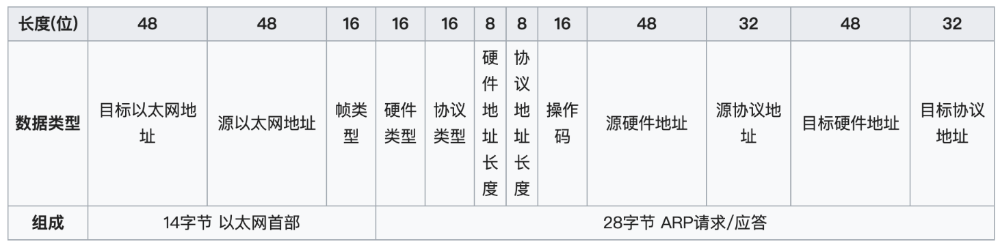
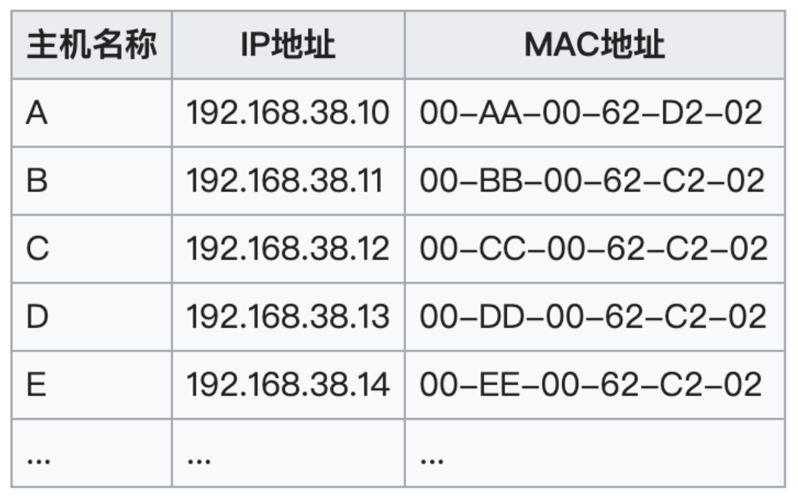
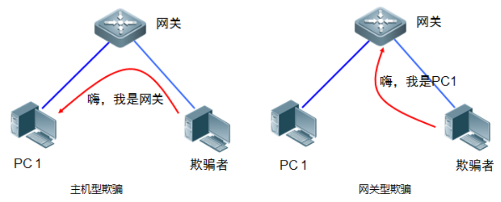

## 3.5 ARP欺骗

ARP报文:



```
目标以太网地址：目标MAC地址。FF:FF:FF:FF:FF:FF （二进制全1）为广播地址。
源以太网地址：发送方MAC地址。
帧类型：以太类型，ARP为0x0806。
以太网报文数据
硬件类型：如以太网（0x0001）、分组无线网。
协议类型：如网际协议(IP)（0x0800）、IPv6（0x86DD）。
硬件地址长度：每种硬件地址的字节长度，一般为6（以太网）。
协议地址长度：每种协议地址的字节长度，一般为4（IPv4）。
操作码：1为ARP请求，2为ARP应答，3为RARP请求，4为RARP应答。
源硬件地址：n个字节，n由硬件地址长度得到，一般为发送方MAC地址。
源协议地址：m个字节，m由协议地址长度得到，一般为发送方IP地址。
目标硬件地址：n个字节，n由硬件地址长度得到，一般为目标MAC地址。
目标协议地址：m个字节，m由协议地址长度得到，一般为目标IP地址。
```

在每台安装有TCP/IP协议的计算机或路由器里都有一个ARP缓存表，表里的IP地址与MAC地址是一对应的，如下表所示：




ARP缓存表采用老化机制，在一段时间内如果表中的某一行没有使用，就会被删除，这样可减少缓存表的长度，加快查询速度。

可以使用```arp -a```来查看本节ARP缓存表。

局域网上的一台主机，如果接收到一个ARP报文，**即使该报文不是该主机所发送的ARP请求的应答报文**，该主机也会将ARP报文中的发送者的MAC地址和IP地址更新或加入到ARP表中。

ARP欺骗攻击就利用了这点，攻击者主动发送ARP报文，发送者的MAC地址为攻击者主机的MAC地址，发送者的IP地址为被攻击主机的IP地址。通过不断发送这些伪造的ARP报文，让局域网上所有的主机和网关ARP表，其对应的MAC地址均为攻击者的MAC地址，这样所有的网络流量都会发送给攻击者主机。


根据ARP欺骗者与被欺骗者之间的角色关系的不同，通常可以把ARP欺骗攻击分为如下两种：

1. 主机型ARP欺骗：欺骗者主机冒充网关设备对其他主机进行欺骗
2. 网关型ARP欺骗：欺骗者主机冒充其他主机对网关设备进行欺骗




### 3.5.3 构造ARP欺骗数据包

我们先完成第一个目标，告诉目标主机192.168.1.18网关的地址为Linux攻击者所在主机的地址：192.168.1.102。

```
pkt = Ether(src=[1.102的MAC], dst=[1.18的Mac]) / ARP(1.102的MAC, 网关IP地址, hwdst=1.18MAC, pdst=1.18IP地址, op=2)
```

那么我们如果要欺骗网关，把网关发往1.18的数据包都发送到Linux（1.102）上，根据上面的代码稍作修改即可：

```
pkt = Ether(src=[1.102的MAC], dst=[网关的Mac]) / ARP(1.102的MAC, 1. 18地址, hwdst=网关MAC, pdst=网关IP地址, op=2)
```


上面构造的两个数据包都是ARP响应包，其实发送请求包也可以进行毒化，请求包毒化的原理是，我们请求时候**使用假的源IP和MAC地址，目标主机同样会更新自己的路由表**。

ARP请求的方式欺骗主机，构造的ARP包如下：

```
pkt = Ether(src=[1.102的MAC], dst=[1. 18的Mac]) / ARP(1.102的MAC, 网关IP地址, hwdst=1. 18MAC, pdst=1. 18IP地址, op=1)
```

ARP请求的方式欺骗网关，构造的ARP包如下：

```
pkt = Ether(src=[1.102的MAC], dst=[网关的Mac]) / ARP(1.102的MAC, 1. 18地址, hwdst=网关MAC, pdst=网关IP地址, op=1)
```


### TODO:


开启本机的IP转发功能

```
sysctl net.ipv4.ip_forward=1
```


## 3.6 网络嗅探

网络嗅探，是监听流经本机网卡数据包的一种技术，嗅探器就是利用这种技术进行数据捕获和分析的软件。

以太网网卡是我们日常生活中见得最多的网卡，常用的以太网卡支持以下工作模式：广播模式、多播模式、直接模式和混杂模式。

1. 广播模式（Broad Cast Model）:它的物理地址（MAC）地址是 0Xffffff 的帧为广播帧，工作在广播模式的网卡接收广播帧。它将会接收所有目的地址为广播地址的数据包，**一般所有的网卡都会设置为这个模式**。
2. 多播传送（MultiCast Model）：多播传送地址作为目的物理地址的帧可以被组内的其它主机同时接收，而组外主机却接收不到。但是，如果将网卡设置为多播传送模式，它可以接收所有的多播传送帧，而不论它是不是组内成员。当数据包的目的地址为多播地址，而且网卡地址是属于那个多播地址所代表的多播组时，网卡将接纳此数据包，即使一个网卡并不是一个多播组的成员，程序也可以将网卡设置为多播模式而接收那些多播的数据包。
3. 直接模式（Direct Model）:工作在直接模式下的网卡只接收目地址是自己 Mac地址的帧。只有当数据包的目的地址为网卡自己的地址时，网卡才接收它。
4. 混杂模式（Promiscuous Model）:工作在混杂模式下的网卡接收所有的流过网卡的帧，信包捕获程序就是在这种模式下运行的。网卡的缺省工作模式包含广播模式和直接模式，即它只接收广播帧和发给自己的帧。如果采用混杂模式，网卡将接受同一网络内所有主机发送的数据包。

利用网卡混杂模式的特性，就可以到达对于网络信息监听捕获的目的。

需要注意的是，并不是任何情况下，网络中的数据都会流经你的网卡，比如交换机网络，交换机会绑定端口和MAC，此时就需要上一章讲到的ARP欺骗了。

### 3.6.2 设置网卡为混杂模式

```
ifconfig eth0 promisc
```


通过

```
ifconfig eth0 -promisc
```

可以取消网卡的混杂模式。

ifconfig 对无线网卡同样适用。


### 3.6.4 基于Raw Socket的Sniffer开发

Raw Socket是一种较为底层的socket编程接口，可以用来获取IP层以上的数据，所以可以用来编写Sniffer。一个完整的sniffer代码组成，大致分为创建socket对象，接收数据，分析数据三个部分。其中开启网卡的混杂模式，需要配置socket对象的属性。在开启混杂模式方面，Linux上要比windows上复杂一点，我们先从简单的情况开始。

