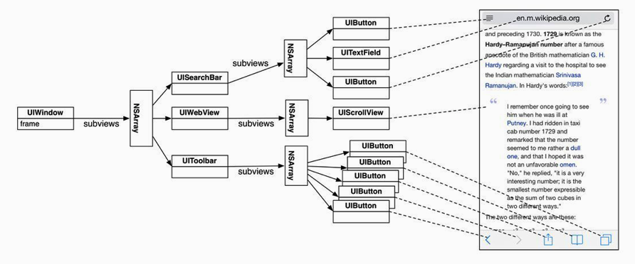
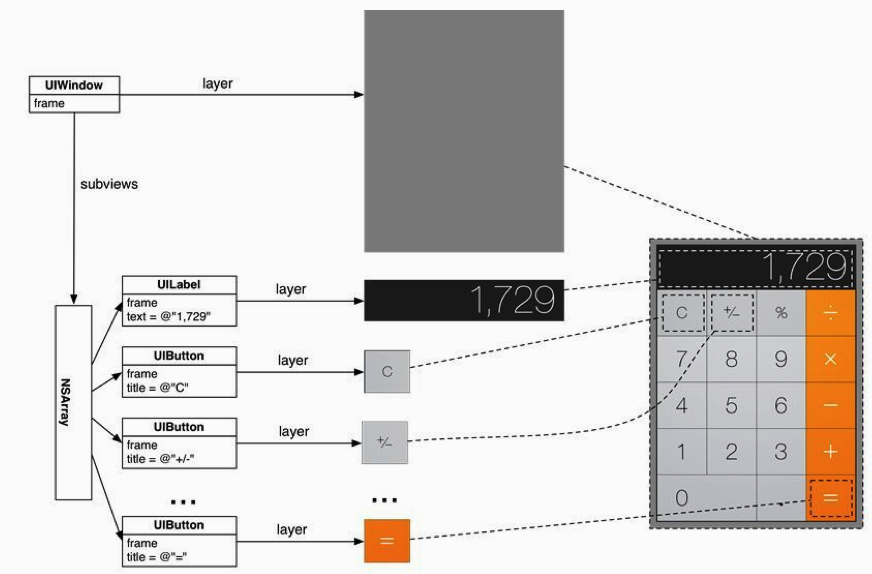

## 第3章 通过ARC管理内存

### 3.1栈

当程序执行某个方法（或函数）时，会从内存中名为栈（stack）的区域分配一块内存空间，这块内存空间称为帧（frame）。**帧负责保存程序在方法内声明的变量的值**。”


当某个应用启动并运行main函数时，它的帧会被保存在栈的底部。当main调用另一个方法（或函数）时，这个方法（或函数）的帧会压入栈的顶部。被调用的方法还可以再调用其他方法，依此类推。当被调用的方法（或函数）结束时，程序会将其帧从栈顶“弹出”并释放。

### 3.2 堆

栈会按后进先出的规则保存一组帧，而堆则包含了大量无序的活动对象，需要通过指针来保存这些对象在堆中的地址。

编写iOS应用时，并不需要记录对象是否应该保留或释放，而只需要通过ARC管理内存，也就是自动引用计数。


## 指针变量与对象所有权

对象所有权概念可以帮助我们决定是否应该释放某个对象并回收该对象占有的内存。

- 如果某个对象没有拥有者，就应该将其释放掉。没有拥有者的对象是孤立的，程序无法向其发送消息。保留这样的对象只会浪费宝贵的内存空间，导致内存泄露（memory leak）问题。”

- 如果某个对象有一个或多个拥有者，就必须保留不能释放。会有空引用和空指针的问题


因为对象可以拥有其他对象，后者也可以再拥有别的对象，所以释放一个对象可能会产“生连锁反应，导致多个对象失去拥有者，进而释放对象并归还内存。


### 3.4 强引用与弱引用

之前介绍过，只要指针变量指向了某个对象，那么相应的对象就会多一个拥有者，并且不会被程序释放。这种指针特性（attribute）称为强引用（strong reference）。

程序也可以选择让指针变量不影响其指向对象的拥有者个数。这种不会改变对象拥有者个数的指针特性称为弱引用（weak reference）。

弱引用非常适合解决一种称为强引用循环（strong reference cycle，有时也称为保留循环）的内存管理问题。当两个或两个以上的对象相互之间有强引用特性的指针关联时，就会产生强引用循环。强引用循环会导致内存泄露。当两个对象互相拥有时，将无法通过ARC机制来释放。即使应用中的其他对象都释放了针对这两个对象的所有权，这两个对象及其拥有的所有对象也无法被释放。


# 第四章 视图与视图层次结构


## 4.1 视图基础

视图是UIView对象，或是UIView子类对象。

- 视图知道如何绘制自己。

- 视图可以处理事件，例如触摸（touch）。

- 视图会按层次结构排列，位于视图层次结构顶端的是应用窗口。


## 4.2 视图层次结构

任何一个应用都有且只有一个UIWindow对象。UIWindow对象就像一个容器，负责包含应用中的所有视图。应用需要在启动时创建并设置UIWindow对象，然后为其添加其他视图。


加入窗口的视图会成为该窗口的子视图（subview）。窗口的子视图还可以有自己的子视图，从而构成一个以UIWindow对象为根视图的视图层次结构。





视图层次结构形成之后，系统会将其绘制到屏幕上，绘制过程可以分为两步：

- 层次结构中的每个视图（包括UIWindow对象）分别绘制自己。视图会将自己绘制到图层（layer）上，每个UIView对象都有一个layer属性，指向一个CALayer类的对象。 可以将图层layer看成是一个位图图像（bitmap image）。
- 所有视图的图层组合成一幅图像，绘制到屏幕上。


```
其实UIView之所以能显示在屏幕上，完全是因为它内部的一个图层，在创建UIView对象时，UIView内部会自动创建一个图层(即CALayer对象)，通过UIView的layer属性可以访问这个层

@property(nonatomic,readonly,retain) CALayer *layer; 

当UIView需要显示到屏幕上时，会调用drawRect:方法进行绘图，并且会将所有内容绘制在自己的图层上，绘图完毕后，系统会将图层拷贝到屏幕上，于是就完成了UIView的显示

换句话说，UIView本身不具备显示的功能，拥有显示功能的是它内部的图层。


UIView之所以能够显示，完全是因为内部的CALayer对象。
因此，通过操作这个CALayer对象，可以很方便地调整UIView的一些界面属性，比如：阴影、圆角大小、边框宽度和颜色等。
 //设置边框的宽度为20
14     self.customView.layer.borderWidth=20;
15     //设置边框的颜色
16     self.customView.layer.borderColor=[UIColor greenColor].CGColor;
```





部分视图类（例如UIButton和UILabel）已经实现了绘图功能。例如，在只需要创建UILabel对象并设置文本内容，UILabel对象就可以自动完成绘制文本的过程。

但是Apple并没有提供可以自动绘制同心圆的视图对象。因此，Hypnosister应用将创建一个UIView的子类，并编写自定义的绘图代码。


第6章 视图控制器

视图控制器是UIViewController类或其子类的对象。每个视图控制器都负责管理一个视图层次结构，包括创建视图层次结构中的视图并处理相关用户事件，以及将整个视图层次结构添加到应用窗口。


UIViewController的view属性

@property (nonatomic, strong) UIView *view;


view属性指向一个UIView对象。UIViewController对象可以管理一个视图层次结构，view就是这个视图层次结构的根视图，当程序将view作为子视图加入窗口时，也会加入UIViewController对象所管理的整个视图层次结构

视图控制器不会在其被创建出来的那一刻马上创建并载入相应的视图。只有当应用需要将某个视图控制器的视图显示到屏幕上时，相应的视图控制器才会创建其视图。这种延迟加载（lazy loading）视图的做法能提高内存的使用效率。


视图控制器可以通过两种方式创建视图层次结构。

　　•代码方式：覆盖UIViewController中的loadView方法。


