􏰫􏰬􏿼􏼿􏰕􏰀􏼰􏰭􏻈􏰮􏰯􏹞􏼫􏰰􏽁􏾎􏰀􏰱􏰲􏰓􏰔 􏻈􏰳􏼴􏷶􏰴􏿺􏰲􏰘􏿍􏼰􏾏􏽇􏻈􏰵􏰶􏰷􏰸􏰲􏰆􏰇􏰹􏰺􏰻 􏰼􏼬􏰫􏰬􏿼􏼿􏰕􏰀􏼰􏰭􏻈􏰮􏰯􏹞􏼫􏰰􏽁􏾎􏰀􏰱􏰲􏰓􏰔 􏻈􏰳􏼴􏷶􏰴􏿺􏰲􏰘􏿍􏼰􏾏􏽇􏻈􏰵􏰶􏰷􏰸􏰲􏰆􏰇􏰹􏰺􏰻 􏰼􏼬􏰽􏻈􏹐􏹑􏷎􏷏􏷮􏷒􏷓􏹒􏰤􏹓􏹔􏴣􏹕􏹖􏹗􏷑􏷒􏹘􏹙􏷩􏷪 􏰤􏹚􏷔􏹛􏹜􏷌􏹙􏲈􏹝􏷓􏹞􏹟􏰤􏹠􏹡􏹢􏹣􏹙􏷛􏷜􏹤􏹥􏹦 􏹧􏹨􏹩􏹐􏹑􏷎􏷏􏷮􏷒􏷓􏹒􏰤􏹓􏹔􏴣􏹕􏹖􏹗􏷑􏷒􏹘􏹙􏷩􏷪 􏰤􏹚􏷔􏹛􏹜􏷌􏹙􏲈􏹝􏷓􏹞􏹟􏰤􏹠􏹡􏹢􏹣􏹙􏷛􏷜􏹤􏹥􏹦 􏹧􏹨􏰟􏰠􏰐􏰔

## 1.4 iOS应用逆向工程的工具

相对于正向开发，逆向工程的工具并不那么智能，很多工作需要我们手动完成


iOS逆向工程的工具可以分为四类：

监测工具，反汇编工具，调试工具，开发工具


### 1.4.1 监测工具

这类工具通常可以记录目标程序的某些操作，如UI变化，网络活动，文件访问

iOS逆向常用的检测工具有reveal, snoop-it, introspy


reveal 可以用来实时地监测目标APP的UI布局变化


### 1.4.2 反汇编工具

从UI层面切入代码层面后，就要用反汇编工具来梳理代码


反汇编工具把二进制文件作为输入，经过处理后输出这个文件的汇编

常用的反汇编工具是IDA和Hopper


阅读生成的汇编代码是最具挑战的部分


### 1.4.3 调试工具

在iOS逆向中，用LLDB进行调试


### 1.4.4 开发工具

对于APP开发者来说，Xcode是最常用的开发工具，但是我们一旦把战场从APP store转到越狱的iOS，开发工具就得到了扩充，不但有基于Xcode的iOSOpenDev，还有偏命令行的TheOS

TheOS似乎非常牛逼


# 2 越狱iOS平台

未越狱的iOS是个封闭的黑盒子。对于未越狱的iOS，苹果官方开放的第三方直接访问iOS文件系统的接口非常有限，开发者只需要根据参考文档就行了。


因为权限太低，来自APP store的普通APP不能访问自身文件目录以外的绝大多数文件。而越狱后可以访问全文件系统。

来自Cydia的iFile是一个优秀的第三方文件管理APP


也可以通过iFunBox等PC端软件来访问全iOS文件系统


### 2.1.1 iOS目录简介

iOS是由OS X演化而来的，而OSX是基于Unix的

/ 根目录

/bin 用户级基础功能二进制

/boot 使系统成功启动的所有文件

/dev 存放BSD设备文件 每个文件代表系统的一个块设备或者字符设备

/sbin 系统级基础功能的二进制

/etc 系统脚本及配置文件


## 2.2 iOS二进制文件类型

三类二进制文件：

Application

Dynamic Library 活着dylib

Daemon


### 2.2.1 Application

即我们最熟悉的APP


**1 bundle**

Bundle是一个含有可执行的代码及代码所需资源，以特定标准的层次结构组合起来的文件夹。这里的可执行是指编译过后可直接运行的代码程序。


系统如何识别Bundle呢？一般而言一个文件夹如果带着.app，.bundle，.framework，.plugin，.kext等等特定后缀，那么系统就认为是Bundle。

 从上面的后缀我们也可以看出**Bundle主要分为**：

- Appliction。应用程序，包含代码和资源。iOS和macOS的app就是这种。
- Frameworks。框架，包含动态共享库和相应资源。我们常用的系统库和第三方库都属于这种。
- Plug-Ins。插件，macOS很多的系统功能支持插件，一种动态加载代码模块的方式。
- 

Application类型的bundle是很常见的，一般里面会包含一下几中类型的文件：

- Info.plist文件。每个程序中必须有这个文件，因为它包含了程序运行的配置信息，是系统运行程序的依据。
- 可执行代码文件。这是程序的主体，包含了程序的进入点和链接的静态代码。
- 资源文件。程序运行过程中需要的资源，比如图片，音频，视频，多语言的字符串文件，nib文件，数据文件，配置文件等等。这里面的大部分文件都可以根据语言、地区、设备通过特定的结构或命名方式加以区分，程序会自动识别加载。
- 其他支持文件。Mac app可以嵌入高层资源，比如私有库，插件，文件末班，自定义数据资源等等。iOS app可以包含自定义数据资源，但是不能包含私有库和插件。


Framework也是bundle，但是framework的bundle中存放的是一个dylib

通常来说 framework的地位比APP更高，**因为一个APP的绝大多数功能都是通过framework提供的接口来实现的**

将某个 bundle确定为逆向目标后，绝大多数的逆向线索都可以在bundle中找到。

 


**3 系统APP VS storeAPP**

/Application目录放的是系统APP和从Cydia下载的APP

而/var/mobile/Containers/下放的是storeAPP


存在如下的差异：

两种APP的bundle内部目录的结构差别不大，都包含info.plist，可执行文件以及lproj 但数据目录的位置不同

storeAPP的数据目录在/var/mobile/Containers/Data下，

以mobile权限运行的系统APP数据目录在/var/mobile下

以root权限运行的系统APP数据目录在/var/root下


Cydia APP的安装包格式一般是deb

storeAPP的安装包格式一般是ipa


deb从Debian移植过来，能够以root权限运行

而ipa则是苹果味iOS推出的APP安装包格式，只能以mobile权限运行


沙盒 sandbox

iOS中的沙盒是一种访问权限机制，它是iOS最核心的安全组件之一

沙盒会将APP的文件访问范围限制在这个APP内部


### 2.2.2 dylib

Xcode工程中导入的各种framework，链接的各种lib，其本质都是dylib

在iOS中，lib分为static和dynamic两种，其中static在编译阶段成为APP可执行文件的一部分，会增加可执行文件的大小


### 2.2.3 Daemon

1 iOS中并没有真正的后台多任务，对于大多数的storeAPP来说，按下home键，大多数的功能就会被暂停


Daemon为了后台运行而生，给用户提供了各种守护


# OS X工具集

## 3.1 class-dump

class-dump，用来dump目标对象的class信息的工具


### 碰到的问题

Bundle identifier 包名，是应用（application）在手机里的唯一标识符


## Mach-o

 Apple的操作系统只支持三种文件格式:

1. 以`#!`开头的脚本文件
2. 通用二进制文件
3. Mach-O格式文件

但是实际上  以`#!`开头的脚本文件其实是shell解释器找到后面指定的脚本解释器来执行的, 而通用二进制文件其实是多个架构的Mach-O文件的打包体。


Unix标准了一个可移植的二进制格式`ELF`但是苹果并没有实现它而是维护了一套NeXTSTEP的遗物 `Mach-Object`简称`Mach-O`。

官方文档《OS X ABI Mach-O File Format Reference》：


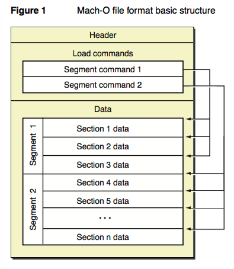


header的结构：

```
struct mach_header_64 {
    uint32_t magic;           /* mach magic number identifier */
    cpu_type_t cputype;       /* cpu specifier */
    cpu_subtype_t cpusubtype; /* machine specifier */
    uint32_t filetype;        /* type of file */
    uint32_t ncmds;           /* number of load commands */
    uint32_t sizeofcmds;      /* the size of all the load commands */
    uint32_t flags;           /* flags */
    uint32_t reserved;        /* reserved */
};
```


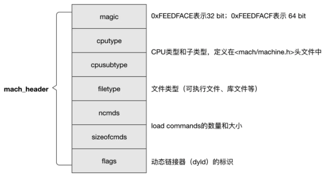

filetype，描述了二进制文件的类型，包括了十来个有效值，常见的：

```c
#define MH_OBJECT      0x1    // 中间目标文件，例如.o文件
#define MH_EXECUTE     0x2    // 可执行文件
#define MH_DYLIB       0x6    // 动态链接库
#define MH_DYLINKER    0x7    // 动态链接器
```


使用MachOView工具查看Mach-O文件


# 4 iOS工具集

## 4.1 CydiaSubstrate

CydiaSubstrate，iOS7越狱之前名为 MobileSubstrate

CydiaSubstrate由3部分组成：

- MobileHooker，前面介绍的Theos就是基于这个hooker实现的；
- MobileLoader，用于加载第三方开发的tweak代码；
- Safe mode，用于保护系统，一旦第三方tweak代码导致SpringBoard异常，能让整个系统进入安全模式，在这种模式下，所有第三方tweak代码都将失效，给我们机会来修复系统。


### 4.1.1 MobileHooker

**MobileHooker的作用是替换系统函数**，也就是所谓的hook技术，它主要包含两个函数：

```
MSHookMessage
MSHookMessageEx
```

因为MSHookMessage ()不是线程安全（thread-safe）的，所以被弃用了，改用MSHookMessageEx()。MSHookMessageEx ()用于Objective-C函数，通过调用IMP method_setImplementation来将[class selector]的实现改为replacement。


MSHookFunction()用于C/C++函数，通过编写汇编指令，在程序执行到被hook的位置时跳转到replacement处，并分配一块内存来保存被hook而没有得到执行的指令和其返回地址，从而保证程序能够在执行完replacement后继续运行。

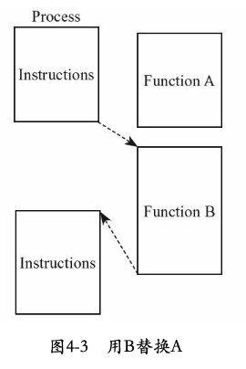


在4-3中，进程先执行一些指令，在原本执行A的地方跳转到函数B的位置执行B，同时A的代码被MSHookFunction保存了下来。**在函数B中，可以选择是否执行A，以及何时执行A**。


Theos只是对MobileHooker作了一层封装，增强了它的易用性，其底层实现仍完全基于MobileHooker


### 4.1.2 MobileLoader

MobileLoader的作用是加载第三方动态链接库，也就是tweak。

在iOS启动时，由launchd将MobileLoader载入内存，然后MobileLoader会dlopen所有/Library/MobileSubstrate/DynamicLibraries/目录下的动态链接库；此外，还应该编写一个与自己的动态链接库名字相同的配置文件，以plist作为扩展名，指定动态链接库的作用范围。


plist文件的作用和App中的Info.plist类似，都记录一些配置信息，它描述了tweak的作用范围。这个plist文件支持3种格式，分别是XML、二进制文件和OpenStep（即常见的property list格式），这里着重讲解最为常见的OpenStep格式，可以用Xcode打开


**iOSRE.plist的最外层是一个Dictionary，只有一个名为"Filter"的键**:

- Bundles，指定若干bundle identifier为tweak的作用对象，如图所示

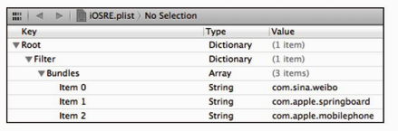


按照图3-18中的配置，tweak的作用对象是三个App，即新浪微博客户端、SpringBoard和电话程序


- Classes，指定若干class为tweak的作用对象，如图3-19所示

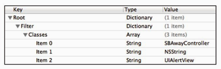

tweak的作用对象是三个class，即SBAwayController、NSString和UIAlertView。


- Executables，指定若干可执行文件为tweak的作用对象，如图3-20所示

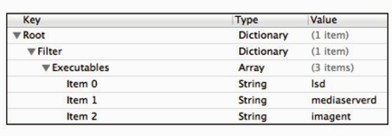

按照图3-20中的配置，tweak的作用对象是三个可执行文件，即lsd、mediaserverd和imagent。


这三类array可以混合使用

但saurik在设计bundle filter时脑子一热，犯了个小错误（大神也是人，是人就会犯错）：按图3-21的混合配置方式，一个文件只有满足Filter中所有array下的至少一个条件，tweak才能生效。这样显然是不合理的，所以saurik添加了一个Mode键，将其值设置为Any，那么文件满足Filter中的任一条件，就能成为tweak的作用对象


## 4.13 Safe mode

iOS程序员的水平参差不齐，程序崩溃在所难免。但因tweak是动态链接库，寄生在别的可执行程序里，一旦出错，可能会导致整个程序崩溃，所以MobileSubstrate引入了Safe mode，它会捕获SIGTRAP、SIGABRT、SIGILL、SIGBUS、SIGSEGV、SIGSYS这6种信号，然后进入安全模式；在安全模式里，所有第三方插件均被禁用，便于用户查错并修复程序。


## 4.5 Cycript

Cycript是由saurik推出的一款脚本语言，可以看做是Objective-JavaScript

Cycript最为贴心和实用的功能是它可以帮助我们轻松测试函数效果，整个过程安全无副作用，效果十分显著


可通过在MobileTerminal中执行或ssh登录到iOS设备上，输入cycript，出现"cy#"提示符，说明已成功启动Cycript


通过进程注入方式调用Cycript测试函数的步骤很简单，以SpringBoard为例，首先找到进程名或PID

```
ps ax | grep 
```

SpringBoard进程的PID是15127。接下来输入"cycript-p 15127"或"cycript-p SpringBoard"，把Cycript钩到SpringBoard上，这时，Cycript就已经运行在SpringBoard进程里，可以开始测试了。


我们都知道，UIAlertView是iOS中使用最多的弹框类。使用Objective-C语言，弹出一个对话框只需要3行代码、

```
UIAlertView *alertView = [[UIAlertView alloc] initWithTitle:@"iOSRE"  “message:@"snakeninny" delegate:nil cancelButtonTitle:@"OK"  otherButtonTitles:nil];
[alertView show];
[alertView release];
```


Cycript是脚本语言，所有对象都声明为var，其他调用跟Objective-C语言比较类似，用几次就可以学会，容易上手。将上面的Objective-C语言转化成Cycript非常简单

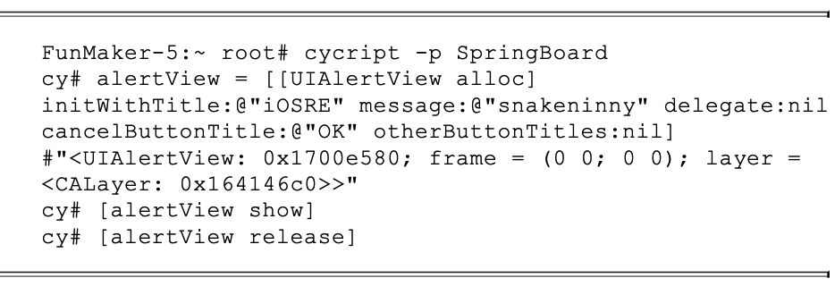


*********


## 5.1　tweak的作用原理

依据维基百科的定义，tweak指的是对电子系统进行轻微调整来增强其功能的工具；在iOS中，tweak特指那些能够增强其他可执行程序功能的动态链接库，是越狱iOS的重要组成部分。


正是因为tweak的存在，越狱iOS用户才能依照自己的喜好打造独一无二的个性化系统，iOS开发者才有机会站在优秀软件的肩膀上为它们添砖加瓦，丰富它们的功能，而这些便利都是原版iOS和App Store无法提供的。Cydia中最受欢迎的软件几乎全是创意各异的tweak，如Activator、KuaiDial、Velox等。


一般来说，tweak的核心是各种hook，绝大多数的hook是针对OC方法的。


Objective-C是一门典型的面向对象语言。iOS系统是由一个个小的组件构成的，这些组件其实就是一个个对象。举个例子，iOS桌面上的每个图标、解锁滑块和提醒横幅都是对象；除了这些用户能够看到的对象以外，还有很多对象一直在后台工作，为前台对象提供各种支持。


## 5.2 tweak的编写套路

只有理解了tweak的工作原理，才能在编写tweak时清楚地知道自己想干什么、在干什么。一般来说，编写tweak会用到C、C++和Objective-C三种语言


每次越狱发布后，都会有人把头文件发布出来

Google􏱐􏴹一下iOS private headers即可找到链接，省去了自己􏷶class dump的麻烦


### 5.2.2　分析文件，寻找切入点

当我们知道自己想要实现什么功能后，就要开始寻找实现这个功能的二进制文件，用到的方法一般有以下四种。


1.固定位置

现阶段我们的逆向目标一般是dylib、bundle或daemon，它们在系统中的位置几乎是固定的：

- 基于MobileSubstrate的dylib全部位于/Library/MobileSubstrate/DynamicLibraries/下，几乎不费吹灰之力就可以轻松定位。

- bundle主要分为App和framework两类，其中App Store App全部位“于/var/mobile/Applications下，framework全部位于/System/Library/Frameworks或/System/Library/PrivateFrameworks下；其他类型的App，如PreferenceBundle和WeeApp的位置可通过Cydia记录定位

- iOS中每个daemon的作用只要在网上稍加搜索即可查到


2. 

通过dpkg -i命令安装的软件，其软件包里的内容会被Cydia如实记录，查看方法是在Cydia的“install”项中选择“expert”


4. grep

当我们需要了解某个类被哪些程序引用，或定位一个framework中某个函数的调用者时，grep能够快速缩小查找范围。

例如想知道哪些地方调用了[IMDAccount initWithAccountID:defaults:service:]􏳶􏴬􏴭，可以ssh􏴒到iOS后使用􏶜􏱄􏱅grep一下􏺼􏶸􏸓􏶘􏱐 􏴹􏳶􏵽􏴹􏰓


在找到含有自己目标功能的二进制文件之后，可以通过class-dump导出其中的Objective-C函数定义，然后在这一堆头文件中寻找自己感兴趣的函数，具体做法可分为以下两种，都比较简单，读者可以自行选择


#### 5.2.4　测试函数功能

Objective-C函数的功能测试相对C/C++函数要简单得多，有MobileSubstrate和Cycript两种方法可供选择。


在测试函数功能时，主要利用MobileSubstrate来hook住一个函数，从而判断这个函数的调用时机。例如，我们怀疑SBScreenShotter中的saveScreenshot:在截屏时得到调用，于是撰写以下代码来验证：

```
%hook SBScreenShotter

- (void)saveScreenshot:(BOOL)screenshot
{
    %orig;
    NSLog(@"iOSRE: saveScreenshot: is called");
}
%end
```

将Filter设置成"com.apple.springboard"，用Theos编译打包成deb，安装在iOS中

 

ssh进iOS，然后输入下面的指令

```
grep iOSRE /var/log/syslog
```


Cycript

先ssh到iOS，然后输入如图5-19所示的代码，按Enter键。

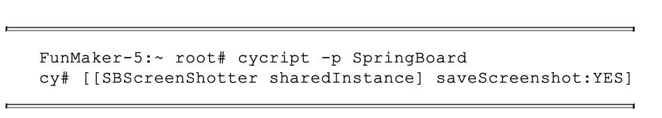


#### 5.2.5 解析函数参数

在上面的例子中，函数的参数明确，函数名的含义明显，但这里还是拿不准在调用时到底是传YES还是NO，只能靠猜。

浏览class-dump出的头文件时，你会发现绝大多数函数的参数类型是id，也就是Objective-C里的泛型，它是在运行时动态决定的，猜都没法猜。


还记得我们是怎样判断函数调用时机的吧？既然能打印一个自定义字符串，就完全能打印出函数参数的信息——description函数能够把对象的内容表示成一个NSString，object_getClassName()函数能够把对象的类名表示成一个char *，两者可分别用%@和%s打印出来，这就为解析参数提供了足够参考。


```
%hook SBScreenFlash

-(void)flashColor:(id)color;
{
    %orig;
    NSLog(@"iOSRE: flashColor: %s, %@", object_getClassName(color),  color);
// [color description]可以直接写成color
}

%end

```


查看结果

```
FunMaker-5:~ root# grep iOSRE: /var/log/syslog
Nov 24 16:40:33 FunMaker-5 SpringBoard[2926]: iOSRE: flashColor: UICached DeviceWhiteColor, UIDeviceWhiteColorSpace 1 1
```

可以看出，color是一个UICachedDeviceWhiteColor对象，它的描述是"UIDevice WhiteColorSpace 11"。根据命名规则，UICachedDeviceWhiteColor是UIKit中的一个类，但在文档中搜索不到这个类，因此可以断定它是个私有类。

在class-dump出的UIKit头文件中利用5.2.3节介绍的方法找到UICachedDeviceWhiteColor.h


#### 5.2.6　class-dump的局限性

然对flashColor:进行hook操作，传入自定义的UIColor对象可以成功改变闪光颜色，但是我们还想知道，原函数的UICachedDeviceWhiteColor是谁传进去的，即flashColor:的调用者是谁。

就好像我们正身处逆向工程这片茂密的原始森林中，class-dump给我们提供了可以落脚的小屋，但要走出这片森林，还需要一张地图和一个指南针——它们就是IDA和GDB。


## 第6章　ARM汇编相关的iOS逆向理论基础

Objective-C代码在经过编译后形成机器码，它们由iDevice的CPU直接执行。别说编写，阅读机器码都已经是一个非常恼人的工作；好在Objective-C和机器码之间有汇编语言这座桥，它的可读性虽然远不如Objective-C，但比机器码要强多了


#### 6.1.1　基本概念

在高级语言，如Objective-C和C/C++里，操作对象是变量；在ARM汇编里，操作对象是寄存器（register）、内存和栈（stack）。其中，寄存器可以看成是CPU自带的变量，它们的数量一般是很有限的；**当我们需要更多变量时，就可以把它们放在一个个内存段中**；不过，数量上去了，质量也下来了，对内存的操作比对寄存器的操作要慢得多。**不管是寄存器还是内存，它们存放的都是全局变量，牵一发而动全身；如果你要定义本地变量，就要用到栈**。


处理器中名为Program Counter（简称PC）的寄存器用于存放下一条指令的地址。一般情况下，计算机一条接一条地顺序执行指令，处理器执行完一条指令后将PC加1，让它指向下一条指令


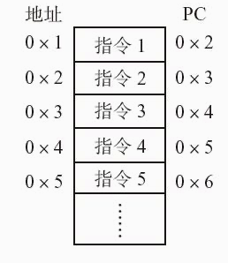


指令的执行顺序被打乱，变成指令1、指令5、指令4、指令2、指令3、指令6，光怪陆离，百花齐放。这种“乱序”的学名叫“分支“（branch），或“跳转”（jump），它使得循环和subroutine成为可能

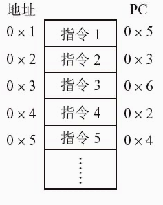


在实际情况中，满足一定条件才得以触发的分支是最实用的，这种分支称为条件分支。if else和while都是基于条件分支实现的。在ARM汇编中，分支的条件一般有4种：

❏操作结果为0（或不为0）。

❏操作结果为负数。

❏操作结果有进位。

❏运算溢出（比如两个正数相加得到的数超过了寄存器位数）。

**这些条件的判断准则（flag）**存放在程序状态寄存器（Program Status Register，简称PSR）中，数据处理相关指令会改变这些flag，分支指令再根据这些flag决定是否跳转。


#### 6.12 ARM和THUMB

ARM处理器用到的指令集分为ARM和THUMB两种，ARM指令长度均为32bit，THUMB指令长度均为16bit。

所有指令可大致分为3类，**分别是数据操作指令、内存操作指令和分支指令**。


1. 数据操作

数据操作指令有两条规则：

（1）所有操作数均为32bit。

（2）所有结果均为32bit，且只能存放在寄存器中。


总的来说，数据操作指令的基本格式是：

``op{cond}{s} Rd, Rn, Op2``


其中，"cond"和"s"是两个可选后缀；

"cond"的作用是指定指令"op"在什么条件下执行，共有17种条件：

```
EQ                结果为0（EQual to 0）
NE                结果不为0（Not Equal to 0）
“CS                有进位或借位（Carry Set）
HS                同CS（unsigned Higher or Same）
CC                没有进位或借位（Carry Clear）
LO                同CC（unsigned LOwer）
MI                结果小于0（MInus）
PL                结果大于等于0（PLus）
VS                溢出（oVerflow Set）
VC                无溢出（oVerflow Clear）
HI                无符号比较大于（unsigned HIgher）
LS                无符号比较小于等于（unsigned Lower or Same）
GE                有符号比较大于等于（signed Greater than or Equal）
LT                有符号比较小于（signed Less Than）
GT                有符号比较大于（signed Greater Than）
LE                无符号比较小于等于（signed Less than or Equal）
AL                无条件（ALways，默认）
```


s的作用是指定指令op是否设置flag，共有4种flag：

```
N（Negative）
如果结果小于0则置1，否则置0；

Z（Zero）
如果结果是0则置1，否则置0；

C（Carry）
对于加操作（包括CMN）来说，如果产生进位则置1，否则置0；对于减操作（包括 CMP）来说，Carry相当于Not-Borrow，如果产生借位则置0，否则置1；对于有移位 操作的非加/减操作来说，C置移出值的最后一位；对于其他的非加/减操作来说，C的 值一般不变；

V（oVerflow）
如果操作导致溢出，则置1，否则置0。

```

需要注意一点，C flag表示无符号数运算结果是否溢出；V flag表示有符号数运算结果是否溢出。


数据操作指令可以大致分为以下4类：

- 算术操作中，ADD和SUB为基础操作，其他均为两者的变种
- 逻辑操作指令
- 比较 

```
CMP R1, R2                ; 执行R1 - R2并依结果设置flag
CMN R1, R2                ; 执行R1 + R2并依结果设置flag
TST R1, R2                ; 执行R1 & R2并依结果设置flag
TEQ R1, R2                ; 执行R1 ^ R2并依结果设置flag
```

**比较操作其实就是改变flag的算术操作或逻辑操作，只是操作结果不保留在寄存器里而已**

- 乘法

乘法操作的操作数必须来自寄存器。


2. 内存操作指令

内存操作指令的基本格式如下：

``op{cond}{type} Rd, [Rn,?Op2]``
**其中Rn是基址寄存器，用于存放基地址**；cond的作用与数据操作指令相同；type指定指令op操作的数据类型，共有4种：

```
B（unsigned Byte）
无符号byte（执行时扩展到32bit，以0填充）；

SB（Signed Byte）
有符号byte（仅用于LDR指令；执行时扩展到32bit，以符号位填充）；

H（unsigned Halfword）
无符号halfword（执行时扩展到32bit，以0填充）；

SH（Signed Halfword）
有符号halfword（仅用于LDR指令；执行时扩展到32bit，以符号位填充）
```


**如果不指定type，则默认数据类型是word**。

ARM内存操作基础指令只有两个：

- LDR（LoaD Register）将数据从内存中读出来，存到寄存器中；
- STR（STore Register）将数据从寄存器中读出来，存到内存中。

此外，**LDR和STR的变种LDRD和STRD还可以操作双字**（Doubleword），即一次性操作2个寄存器。


还可以通过LDM（LoaD Multiple）和STM（STore Multiple）进行块传输，一次性操作多个寄存器。块传输指令的基本格式是

``op{cond}{mode}Rd{!},reglist``

其中Rd是基址寄存器，

需要特别注意的是，LDM和STM的操作方向与LDR和STR完全相反：

- **LDM是把从Rd开始，地址连续的内存数据存入reglist中**，
- **STM是把reglist中的值存入从Rd开始，地址连续的内存**


cond的作用与数据操作指令相同。mode指定Rd值的4种变化规律如下：

```
IA（Increment After）
每次传输后增加Rd的值；

IB（Increment Before）
每次传输前增加Rd的值；

DA（Decrement After）
每次传输后减少Rd的值；

DB（Decrement Before）
每次传输前减少Rd的值

```


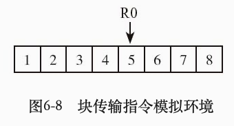

```
foo():
        LDMIA R0, {R4 – R6}                         ; 
R4 = 5, R5 = 6, R6 = 7
        LDMIB R0, {R4 – R6}                         ; 
R4 = 6, R5 = 7, R6 = 8
```

R0中的5 MOV到了R4。mode对每个寄存器都生效


3. 分支指令

分支指令可以分为无条件分支和条件分支两种。

❏无条件分支

``B Label               ; PC = Label``


在条件分支指令前会有一条数据操作指令来设置flag，分支指令根据flag的值来决定代码走向


#### 4.THUMB指令

THUMB指令集是ARM指令集的一个子集，**每条THUMB指令均为16bit；因此THUMB指令比ARM指令更节省空间，且在16位数据总线上的传输效率更高**。除了b之外，所有THUMB指令均无法条件执行


大多数THUMB指令只能使用R0～R7这8个寄存器。相对于ARM指令，THUMB指令的特点如下。

❏指令数量减少

既然THUMB只是一个子集，指令数量必然会减少。例如，乘法指令中只有MUL保留了下来，其他的都被精简了。

❏无条件执行

除分支指令外，其他指令无条件执行。

❏所有指令默认附带s

即所有THUMB指令都会设置flag

❏不支持数据写回

除了LDMIA和STMIA外，其他THUMB指令均不支持数据写回，即“!”不可用


#### 6.1.3　ARM调用规则

了解了常用的ARM指令后，相信大家已经能够基本读懂一个函数的汇编代码了。当一个函数调用另一个函数时，常常需要传递参数和返回值；如何传递这些数据，称为ARM汇编的调用规则。


在6.1.1节提到在执行一段代码时，其前后栈地址应该是不变的，这个操作是通过被执行代码块的前言（prologs）和后记（epilogs）完成的。前言所做的工作主要有：

- 将LR入栈；
- 将R7入栈；
- R7=SP；
- 将需要保留的寄存器原始值入栈；
- 为本地变量开辟空间。


SS:存放栈的段地址；
SP:堆栈寄存器SP(stack pointer)存放栈的偏移地址;


后记所做的主要工作跟前言正好相反：

- 释放本地变量占用的空间；
- 将需要保留的寄存器原始值出栈；

- 将R7出栈；

- 将LR出栈，PC =LR。

前言和后记中的这些工作并不是必需的，如果这段代码根本就没有用到栈，就不需要“保留寄存器原始值”这一步了。在阅读ARM汇编代码的过程中前言与后记的影响不大，大家稍作了解即可。


**函数的前4个参数存放在R0～R3中，其他参数存放在栈中；返回值放在R0中**。

```
int TestFunction(void)
{
    NSLog(@"%d, %d, %d, %d, %d", 1, 2, 3, 4, 5);
    return 6;
}
```

BLX _NSLog执行NSLog()函数，它的6个参数分别存放在R0、R1、R2、R3、[SP,#0xC +var_C]和[SP,#0xC +var_8]中，返回值存放在R0里。


