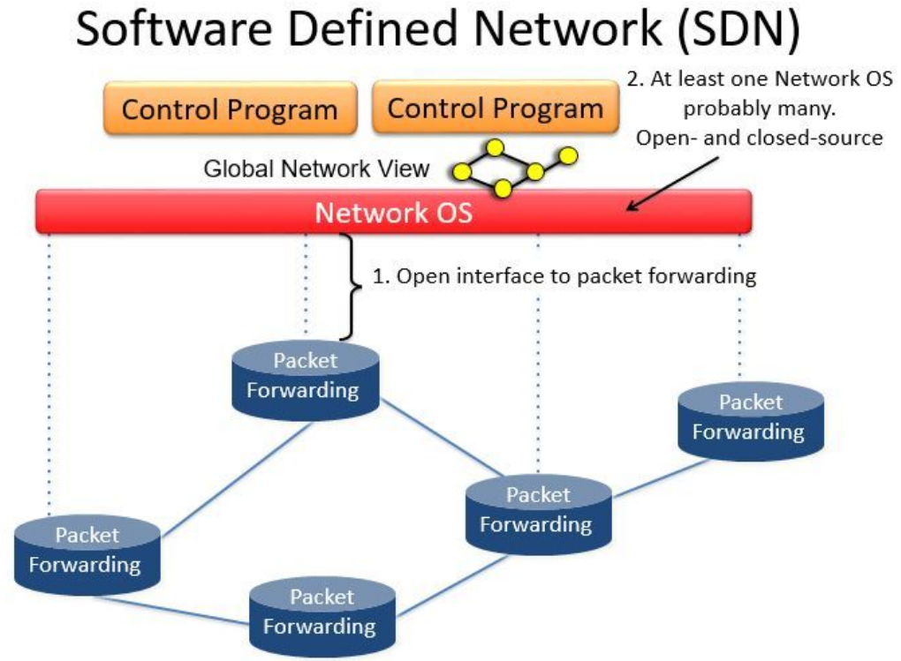
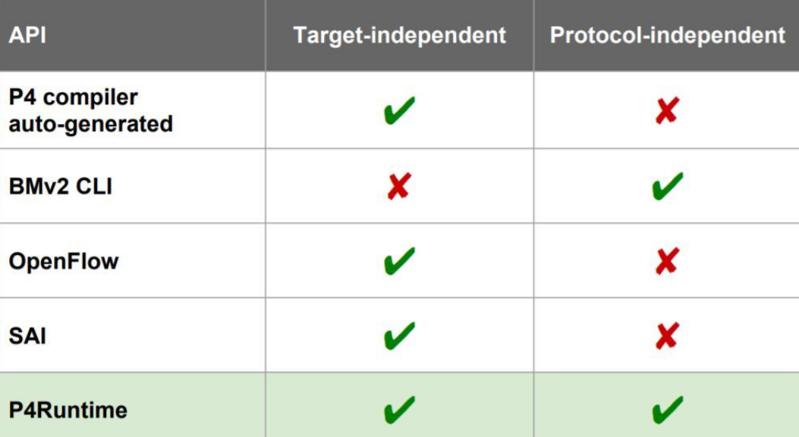
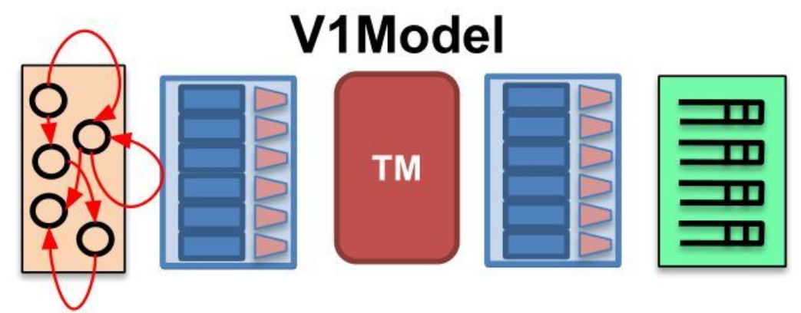
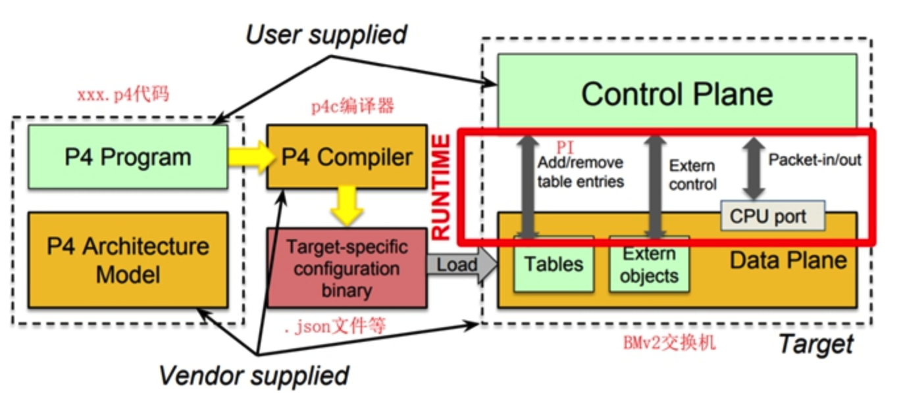
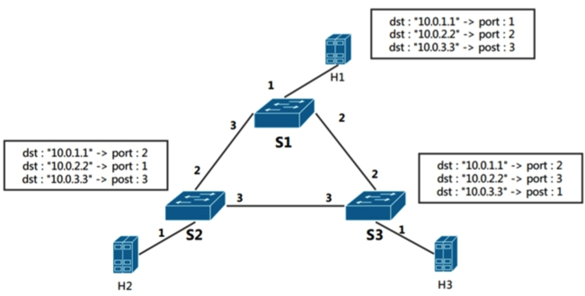

# P4
http://mininet.org/walkthrough/
## 从OpenFlow说起

OpenFlow在SDN中扮演的角色:



SDN的一个重要概念就是控制平面和数据平面的分离，以及集中式的控制平面，这个集中的控制平面就是我们所说的**控制器**。

那么控制平面与数据平面分离之后，如何像往常一样管理数据平面呢？因此，**在分离后的控制平面和数据平面之间，只能通过一个特定的协议进行交互**，这个协议就是我们的OpenFlow协议。

OpenFlow必须是一个 target-independent 的协议，所谓target-independent就是与 特定的交换机无关，能够提供一种抽象，从而可以以统一的接口管理网络中所有的设备，从而实现一个逻辑集中的控制平面。

OpenFlow作为一种南向协议，其与其他南向接口的对比如下:



OpenFlow虽然实现了Target-independent，但是没有实现Protocol-independent。 这个是OpenFlow的最主要的缺陷之一，这也是引入P4的最主要的原因。


什么是Protocol-independent呢:

**OpenFlow的缺陷**:OpenFlow虽然为SDN奠定了基础。但是在进行应用开发的时候有一个很大的局限，就是OpenFlow没有真正做到协议不相关。也就是说，**OpenFlow只能依据现有的协议来定义流表项**。打个比方，就好像OpenFlow给了我们几个固定形状的积木，让我们自行组装，却不能让我们自己定义积木的形状。 这就是OpenFlow的局限所在.

举个例子：OpenFlow 1.0 的时候有12个字段，这些字段分别就是我们熟悉的，IP地址，MAC地址，等等。但是很快发现，单单这12个字段不能满足现实网络世界中各种需求（在网络中的协议有很多种）。所以到OpenFlow1.3的时候字段增加到40个，现在OpenFlow1.5甚至更多。

这样带来的麻烦有很多，一是匹配效率和空间占用的问题。二是特定的OpenFlow交换机生产出来后，无法支持新的协议字段，只能在现有协议上进行开发。最终只能面临淘汰。

**如果我们可以自定义协议字段的类型，甚至实现自定义动作的类型，那么我们就不需要反复修正协议本身，SDN的架构也将更加灵活**。这个**自定义协议字段类型**，**自定义动作类型**就是我们所说的数据面编程。

数据面编程就是我们自己定义匹配字段，自己定义动作类型，从而自己定义流表，进而形成流水线（pipline）。基于这种初衷，P4应运而生。


## P4

P4(**P**rogramming **P**rotocol-Independent **P**acket **P**rocessors)是一种数据面的高级编程语言。他可以克服OpenFlow的局限。通过P4语言，我们可以定义我们想要的数据面。进而再通过南向协议添加流表项。


P4 与 OpenFlow 的关联与区别:

**P4虽然弥补了OpenFlow的不足，但是P4和OpenFlow的定位是截然不同的！** OpenFlow提供了一种控制器和数据面的**动态交互**的协议。是一种南向协议。

而P4只是一个数据面的编程语言。


通过P4，我们可以定义各种各样形状的积木，而通过南向协议，我们可以组装这些积木来实现特定的功能。也就是说，**写好P4代码并不是全部，我们还需要写相应的控制面代码才能使网络正常工作**。

与OpenFlow对应的是**P4 Runtime**。 还记的上面的那张图吗，为了实现协议无关。P4的设计者们还提供了一个南向协议——P4 runtime。 **P4 runtime与OpenFlow功能类似**，但是P4 runtime可以充分利用P4协议无关的特性，”与P4更搭配。

### V1Model



这是P4中提供的最简单最易理解的编程结构，V1Model。可以看到它由5个模块组成，他们的名字分别是(从左到右)：

- Parser: 解析器， 解析并且提取数据包头的各个字段。
- Ingress： Ingress处理，在这里定义Ingress流水线。
- TM： Traffic manager，有一些队列，用于流量控制（一些队列相关的metadata在此更新）。
- Egress： Egress, 在这里定义Egress流水线。
- Deparser：用于重组数据包，因为数据包在处理过程中经历了分解和处理。所以最后转发的时候需要重组一下。

P4为我们提供了上述抽象，我们就可以把所有的交换机理解为上述的模型，然后按照上述模型进行开发就可以了。所以，按照上述模型，P4语言的代码结构通常为这样:


### Git仓库
├── behavioral-model  ## BMv2 软件交换机
├── grpc              ## 作为BMv2的依赖
├── mininet           ## mininet 网络仿真
├── p4c                  ## p4c 编译器
├── PI                ## PI P4 runtime库
├── protobuf          ## 作为依赖
└── tutorials         #### 教程目录



如图，我们写好xxx.p4代码，通过 p4c 这个 p4 compiler 将p4代码**编译成为p4交换机可以理解的各种”机器代码”**。如果目标交换机是 bmv2 , 那么p4c将生成 .json文件。

PI是P4 runtime的实现，用于Control Plane对数据平面的控制。


以exercises/basic 为例子
basic
├── basic.p4   # 要编写的p4代码
├── build      # 生成文件的目录
├── logs       # 日志文件， 在调试的时候真的非常重要！
├── Makefile   ### 通过Makefile 来调用utils下的脚本!
├── pcaps      # 生成的pcap包，可以使用wireshark等工具来分析
├── README.md  # 详细的指导
├── receive.py ## 利用scapy写的抓取和分析数据包的工具
├── s1-runtime.json  #
├── s2-runtime.json  # 
├── s3-runtime.json  #
├── send.py    ## 利用scapy写的构建和发送数据包的工具
├── solution   # 这里有这个例子的示例代码（答案）
└── topology.json  # 描述拓扑的json文件


behavioral-model简称BMv2. 是一款支持P4的软件交换机。其设计初衷是完全支持P4语言，从而用于功能性试验和学习，而性能不是第一目标（与OVS不同）。BMv2可以和Mininet集成。BMv2提供两种控制接口，一种是基于thirft的CLI接口（命令行），另一种是基于gRPC和protobuf的P4 runtime。显然，一种是分布式控制平面，一种是集中式控制平面。


### Basic example 
使用IPv4转发时，交换机必须对每个数据包执行以下操作：
1. 更新源和目标MAC地址
2. 减少IP报头中的生存时间（TTL）
3. forward the packet out the appropriate port


交换机将只有一个表，控制平面将使用静态规则填充该表。Each rule will map an IP address to the MAC address and output port for the next hop下一跳。我们已经定义了控制平面规则，因此您只需要实现P4程序的数据平面逻辑即可。

Our P4 program will be written for the V1Model architecture implemented on P4.org's **bmv2 software switch**. 


开始运行：调用make run，我们可以运行当前目录下（以basic目录为例）的代码，它将执行以下几个步骤:
1. 编译basic.p4 代码，生成basic.json
2. 解析topology.json， 并且构建相应的mininet仿真拓扑，按照该拓扑启动一台或者多台BMv2交换机，以及一些host
3. 启动BMv2的同时会将p4代码编译产生的json文件导入
4. 启动BMv2后会解析 sN-runtime.json 文件，将其载入 交换机sN**流表之中**
5. 进入mininet命令行，同时开始记录log以及搜集pcap文件
6. 在新版本的tutorials中，载入静态流表项时采用了runtime方法，而非之前的CLI方法，我们查看一下s1-runtime.json的部分

```
....
{
"table": "MyIngress.ipv4_lpm",
"match": {
"hdr.ipv4.dstAddr": ["10.0.1.1", 32]
},
"action_name": "MyIngress.ipv4_forward",
"action_params": {
"dstAddr": "00:00:00:00:01:01",
"port": 1
}
}
....
```
这是一个json文件，可以看到，其作用是定义一个个具体的流表项，标明了流表项所处的位置，匹配域，匹配模式，动作名，以及动作参数。这些字段都依赖于我们P4代码中所自定义的流表，匹配域和动作


开始写TODO部分：
先看一下头文件
```
#include <core.p4>
#include <v1model.p4>
```
可见使用的是v1_model。


再看一下main入口
```
V1Switch(
MyParser(),    // 解析数据包，提取包头 
MyVerifyChecksum(),  // 校验和验证
MyIngress(),   // 输入处理
MyEgress(),    // 输出处理
MyComputeChecksum(),  // 计算新的校验和
MyDeparser()   // 逆解析器
) main;
```

根据需求，我们需要定义 ipv4数据包头以及其下层的以太网包头结构。

```
header ethernet_t {
macAddr_t dstAddr;   // macAddr_t 是 typedef bit<48> 的自定义类型
macAddr_t srcAddr;
bit<16>   etherType;
}

header ipv4_t {
bit<4>    version;
bit<4>    ihl;
bit<8>    diffserv;
bit<16>   totalLen;
bit<16>   identification;
bit<3>    flags;
bit<13>   fragOffset;
bit<8>    ttl;
bit<8>    protocol;
bit<16>   hdrChecksum;
ip4Addr_t srcAddr;
ip4Addr_t dstAddr;
}
struct metadata {
/* 这个例子用不到metadata */
}
```
MyParser() 解析数据包
parser是一个有限状态机(看代码中的state)。从 start 状态开始，每一个状态便解析一种协议，然后根据低层协议的类型字段，选择解析高一层协议的状态，然后transition到该状态解析上层协议，最后transition到accept。
```
parser MyParser(packet_in packet,
out headers hdr,
inout metadata meta,
inout standard_metadata_t standard_metadata) {

state start {
transition parse_ethernet;  //转移到解析以太包头的状态
}

state parse_ethernet {
packet.extract(hdr.ethernet);   //根据我们定义的数据结构提取以太包头
transition select(hdr.ethernet.etherType) {  // 根据协议类型选择下一个状态
// 类似于switch
0x0800: parse_ipv4;   //如果是0x0800，则转换到parse_ipv4状态
default: accept;      // 默认是接受，进入下一步处理
}


state parse_ipv4 {
packet.extract(hdr.ipv4); //提取ip包头
transition accept;
}
}
}
```
MyIngress() 在Ingress中，我们要实现一个转发功能，因此需要定义一个用于转发的流表
```
control MyIngress(inout headers hdr,
inout metadata meta,
inout standard_metadata_t standard_metadata) {

//我们需要自己实现以下几个动作:
action drop() {
//内置函数，将当前数据包标记为即将丢弃的数据包
mark_to_drop(standard_metadata);
}

action ipv4_forward(macAddr_t dstAddr, egressSpec_t port) {
/* TODO: fill out code in action body */
//这里就是需要我们写代码的地方了
 //转发需要以下几个步骤
  standard_metadata.egress_spec = port;  //即将输出的端口从控制面参数中获取
  hdr.ethernet.srcAddr = hdr.ethernet.dstAddr;   //原数据包的源地址改为目的地址
  hdr.ethernet.dstAddr = dstAddr;        //目的地址改为控制面传入的新的地址
  hdr.ipv4.ttl = hdr.ipv4.ttl - 1;       //ttl要减去1
}


定义一个用于转发的流表
table ipv4_lpm {
key = {   //流表拥有的匹配域
hdr.ipv4.dstAddr: lpm;
// 匹配字段是数据包头的ip目的地址
// lpm 说明匹配的模式是 Longest Prefix Match，即最长前缀匹配 
// 当然还有 exact(完全匹配)， ternary(三元匹配)
}

actions = {
ipv4_forward;   //流表拥有的动作类型集合
drop;
NoAction; // 空动作
}
size = 1024;  //流表可以容纳多少流表项
default_action = NoAction();
}

apply {
/* TODO: fix ingress control logic
*  - ipv4_lpm should be applied only when IPv4 header is valid
*/
ipv4_lpm.apply();
}
}
```

dstAddr（目的地址改为控制面传入的新的地址）
控制面指令在哪里呢？

看一下s1-runtime.json
```
{
"table": "MyIngress.ipv4_lpm",   
"match": {
"hdr.ipv4.dstAddr": ["10.0.1.1", 32]
},
"action_name": "MyIngress.ipv4_forward",
"action_params": {
"dstAddr": "00:00:00:00:01:01",
"port": 1
}
}
```

再回顾一下
```
定义一个用于转发的流表
table ipv4_lpm {
```
table name 就是我们在p4代码中自定义的转发表。而动作也按照我们编写的动作代码传入了相应的参数。




这个例子简化了控制层的部分：P4程序定义了一个数据包处理管道pipeline，但是每个表中的规则都是由控制平面插入的。
在本练习中，我们已经为您实现了控制平面逻辑。


数据平面：维护一个由一系列流表组成的(pipeline，流水线)。当数据包经过交换机时，首先会走的是数据平面，即去匹配这些表。根据匹配到的相应的规则（action），如output, drop。从不同的端口转发或者丢弃。

控制平面：不管是分布式的控制平面，还是集中式的控制平面。控制平面可以理解为网元设备的操作系统。他可以写一些程序，里面含有特定的算法，向数据平面添加相应的转发规则。也就是说，控制平面相当于网元设备的大脑，当数据平面不知道如何转发一个数据包时，会向大脑询问，大脑根据自己对网络拓扑的”认知“，向数据平面返回指定的规则，数据平面记录这条规则，在之后的转发过程中，就不再询问自己的大脑（速率较慢），而是根据“肌肉记忆”直接转发。
