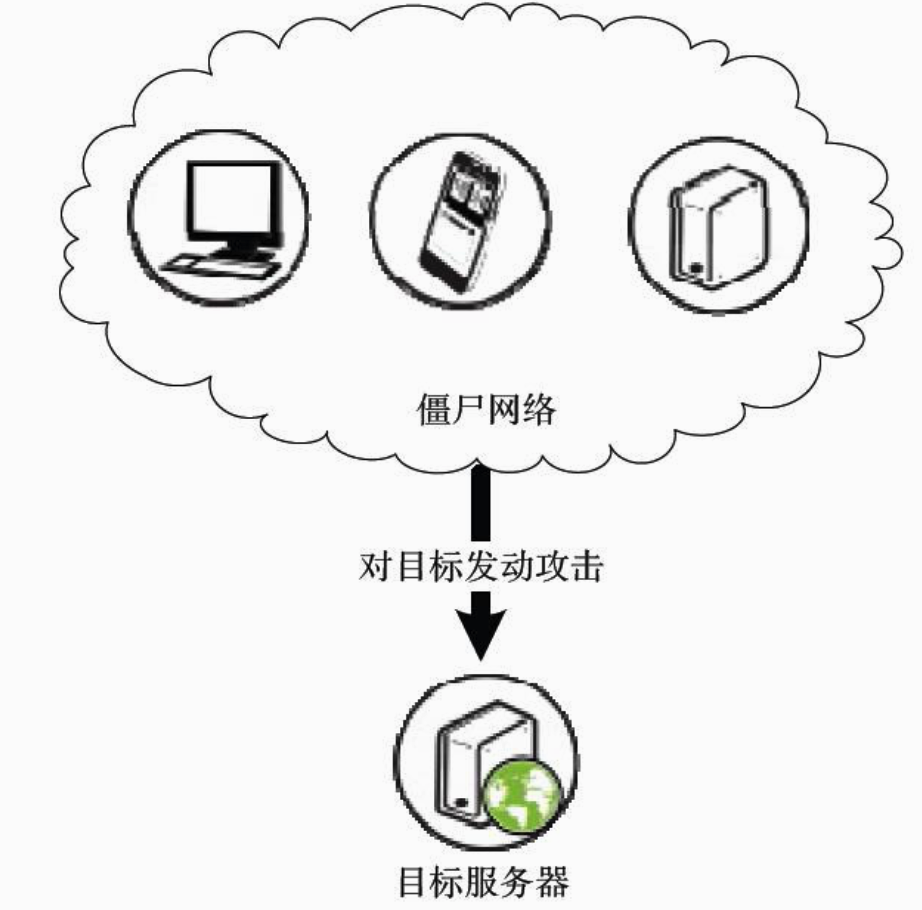
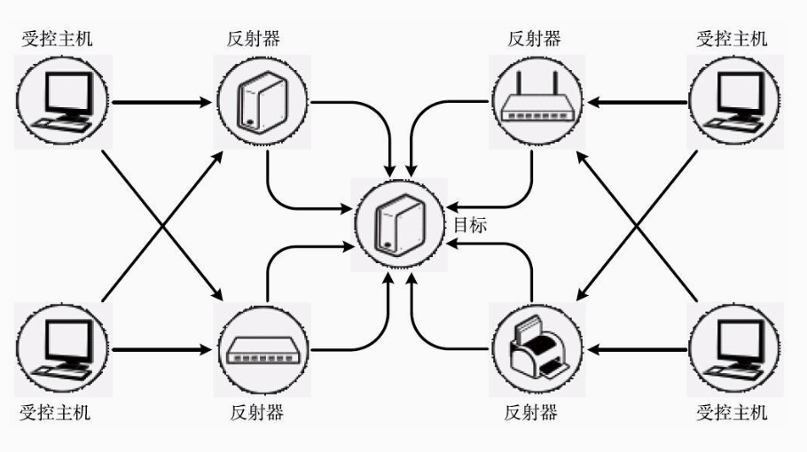
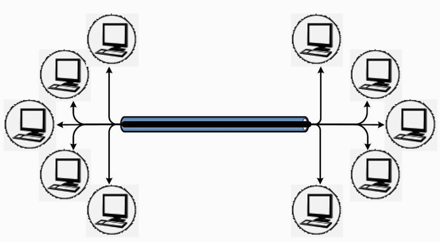
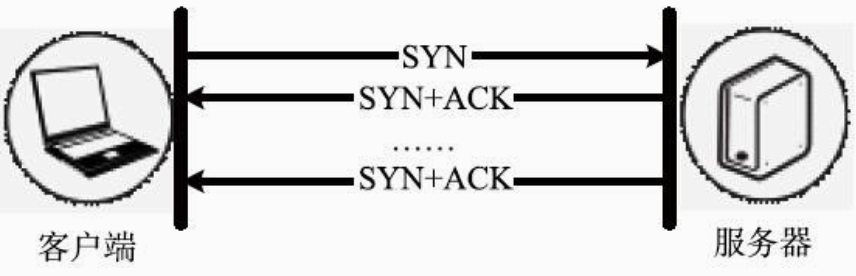

### 第一次拒绝服务攻击

第一次拒绝服务攻击发生在1996年9月6日下午5:30。Panix，这个纽约市历史最悠久、规模最大的互联网服务提供商成为了攻击的受害者。公司的邮件、新闻、Web和域名服务器等同时遭受攻击，据《时代杂志》报道，至少6000名用户因此而无法收取邮件。

攻击者采用的方法非常简单：不断向服务器发送连接请求（TCP SYN请求），速度高达每秒150次。服务器忙于应对这些请求，从而无法回应正常的用户。这种攻击方式后来被称为“SYN FLOOD攻击”, 是拒绝服务攻击的一种。即使到现在，SYN FLOOD攻击也经常被使用。此外，攻击者还采用了随机伪造源地址的方式。**一方面，这使得攻击来源难以追踪；另一方面，随机的源地址也使得过滤和阻断攻击变得非常困难**。

### 1.1.4 根域名服务器的危机

域名服务采用类似目录树的层次结构，当一台域名服务器遇到未知的域名时，就会向上级服务器询问。而这棵树的顶端，就是13台根域名服务器。根域名服务器是互联网的关键基础部件，在理论上，针对它们的攻击可以影响全球的域名系统。

2002年10月21日，美国东部时间下午4:45开始，这13台根域名服务器遭受到有史以来最为严重、规模最为庞大的一次网络袭击，攻击持续到6:00。此次事件正是一次分布式拒绝服务攻击，超过常规数量30～40倍的数据猛烈地向这些服务器袭来，目标是全部的13台服务器，持续大约1个小时。造成的后果是9台服务器不能正常运行，其中7台丧失了对网络通信的处理能力，另外2台也紧随其后陷于瘫痪。
对每个根服务器的攻击流量大约为50～100Mbit/s（兆比特每秒），100～200Kpps（千数据包每秒）。总流量为900Mbit/s（兆比特每秒），1.8Mpps（千数据包每秒）。发送的数据包包括ICMP、TCP SYN和UDP。攻击的源地址是随机产生的，但基本都位于当时路由表中存在的网段内。
之后，随着技术的发展，根服务器都采用了Anycast和负载均衡技术进行防御。现在，影响其运行已经远比当时困难。

# 2 DDoS攻击的来源

绝大部分的分布式拒绝服务攻击都是从僵尸网络（Botnet）产生的。

### 2.1.1 演化和发展趋势

1999年6月，在因特网上出现的PrettyPark首次使用了IRC协议构建命令与控制信道，从而成为第一个IRC僵尸网络。

随着僵尸网络防御技术的不断演进，僵尸网络的传播和组建受到了一定遏制，黑客为了让僵尸网络更具隐蔽性和抗打击性，开始不断地尝试对其组织形式进行创新和发展，相继出现了基于超文本传输协议（HyperText Transfer Protocol，HTTP）及P2P协议构建命令与控制信道的僵尸网络。例如，专注银行窃密的Zeus采用的是HTTP，而主机感染数庞大的Zeroaccess僵尸网络则采用了P2P协议。

### 2.2 僵尸网络的组建
“僵尸网络由大量功能节点共同组成，这些节点可能是普通PC、服务器或者移动设备

误区：DDoS攻击都来自PC组成的僵尸网络

“DDoS攻击都是由僵尸网络发起的”，这几乎是一个安全领域的“常识”。然而，事实并非如此，至少并不完全是由PC组成的僵尸网络发起的。

随着技术的进步，服务提供商所使用的高性能服务器在处理性能和带宽方面快速提升，而传统的由PC组成的僵尸网络却发展缓慢。除了处理能力方面的因素外，PC通常只有非常有限的带宽资源，而可供利用的时间也很不确定。于是，一些“黑客”开始把目光移向高性能服务器，在“燕子行动”中，他们就这样做了。

“通常，僵尸程序将一台普通PC变成僵尸网络的节点，一般要经历四个步骤，即感染传播、安装执行、接入僵尸网络以及命令执行。

(1)感染传播

僵尸程序所用的感染传播手段与其他恶意程序（蠕虫、木马、后门等）类似，通常包括带有欺骗性质的电子邮件、网页挂马、自动化的漏洞扫描、即时通信、内网的文件共享和移动存储感染，以及最新出现的网络存储与共享等。。通过上述手段，僵尸程序就极有可能感染那些没有防护措施或防护措施弱的普通PC，进而将其发展成为僵尸网络中的一员。

(2)安装执行

僵尸程序一旦在受害主机上执行，就会进行一系列的自我复制、实现自启动以及隐藏等行为。通常僵尸程序会将自身复制到系统特定的目录下并设置其隐藏属性，部分程序还会修改文件生成时间，创建或修改注册表以保证程序开机自启动，如服务创建等。为了避免侦测，多数僵尸程序都进行了免杀处理，并采用远程代码注入的方式，以免产生新进程。

(3)接入僵尸网络

当僵尸程序在受害者主机上完成各种安装和隐藏后，便通过解析内置的域名和端口进行通信，构建C&C通道加入僵尸网络，而这大多是通过发送搜集的被感染系统主机信息开始的。

(4)命令执行

接入僵尸网络的僵尸程序将执行Botmaster预先设置好的指令，如对特定目标发动DDoS攻击等。在没有收到指令时，僵尸程序会静静等待（这时用Wireshark捕获可见大量的保活数据包），直到Botmaster有指令下发为止。

通过上面的四个步骤，一台普通PC就变成了任人宰割的僵尸主机（又称“肉鸡”），也成为黑客攻击或再入侵的跳板。

事实上，随着网络犯罪独有系统的完善，已经出现了“肉鸡”销售服务，上述过程也得到了大大简化。”

## 第 3 章 DDoS攻击的方法
分布式拒绝服务攻击的目的主要在于资源占用和资源消耗，它通过向服务提供者发起大量请求或者**长时间占用资源**的方式来达到拒绝服务的目的。这种攻击从表面上看都是合理的请求，因此无法通过系统升级和打补丁的方式阻止，也不能使用入侵检测系统进行防御。

依据消耗目标资源的不同，将分布式拒绝服务攻击分为攻击网络带宽资源、攻击系统资源和攻击应用资源三类。

## 3.1攻击网络带宽资源
消耗网络带宽资源的分布式拒绝服务攻击，利用受控主机发送**大量的网络数据包**，占满被攻击目标的全部带宽，从而使正常的请求无法得到及时有效的响应，造成拒绝服务。

### 3.1.1 直接攻击

1.ICMP/IGMP洪水攻击
攻击者使用受控主机向被攻击目标发送大量的ICMP/IGMP报文，进行洪水攻击以消耗目标的带宽资源。这种类型的攻击出现得很早，使用hping等工具就能够简单地发起攻击。但现在使用这种方法发动的攻击已不多见，被攻击目标可以在其网络边界直接过滤并丢弃ICMP/IGMP数据包使攻击无效化。

2.UDP洪水攻击
利用UDP数据报文，攻击者也可以发动洪水攻击。UDP洪水攻击和ICMP/IGMP洪水攻击的原理基本相同。通常，攻击者会使用小包和大包两种方式进行攻击。

小包是指64字节大小的数据包，这是以太网上传输数据帧的最小值。**在相同流量下，单包体积越小，数据包的数量就越多**。由于交换机、路由器等网络设备需要对每一个数据包进行**检查和校验**，因此使用UDP小包攻击能够最有效地增大网络设备处理数据包的压力，**造成处理速度的缓慢和传输延迟**等拒绝服务攻击的效果。

大包是指1500字节以上的数据包，其大小超过了以太网的最大传输单元（MTU）。使用UDP大包攻击，**能够有效地占用网络接口的传输带宽，并迫使被攻击目标在接收到UDP数据时进行分片重组**，造成网络拥堵，服务器响应速度变慢。

有相当多的工具都能够发动UDP洪水攻击，如hping、LOIC等。**但UDP洪水攻击完全依靠受控主机本身的网络性能，因此通常对攻击目标带宽资源的消耗并不太大**。

### 3.1.2 反射和放大攻击
攻击者可以使用ICMP洪水攻击、UDP洪水攻击等方式直接对被攻击目标展开消耗网络带宽资源的分布式拒绝服务攻击，**但这种方式不仅低效，还很容易被查到攻击的源头**。虽然攻击者可以使用伪造源IP地址的方式进行隐藏，但更好的方式是使用反射攻击技术。

反射攻击又被称为DRDoS（Distributed Reflection Denial of Service，分布式反射拒绝服务）攻击，指利用路由器、服务器等设施对请求产生应答，从而反射攻击流量并隐藏攻击来源的一种分布式拒绝服务攻击技术。

在进行反射攻击时，攻击者使用受控主机发送大量的数据包，这些数据包的特别之处在于，其目的IP地址指向作为反射器的服务器、路由器等设施，**而源IP地址则被伪造成被攻击目标的IP地址**。反射器在收到数据包时，**会认为该数据包是由被攻击目标所发来的请求**，因此会将响应数据发送给被攻击目标。当大量的响应数据包涌向攻击目标时，就会耗尽目标的网络带宽资源，造成拒绝服务攻击。

发动反射攻击需要在互联网上找到大量的反射器，某些种类的反射攻击并不难实现。例如，对于ACK反射攻击，只需要找到互联网上开放TCP端口的服务器即可，而这种服务器在互联网上的存在是非常广泛的。

发动反射攻击通常会使用无须认证或握手的协议。反射攻击需要将请求数据的源IP地址伪造成被攻击目标的IP地址，**如果使用的协议需要进行认证或者握手，则该认证或握手过程没有办法完成**，也就不能进行下一步的攻击。因此，绝大多数的反射攻击都是使用基于UDP协议的网络服务进行的。

#### 利用反射原理进行的放大攻击
放大攻击是一种特殊的反射攻击，其特殊之处在于反射器对于网络流量具有放大作用

1.ACK反射攻击

如果攻击者将SYN的源IP地址伪造成被攻击目标的IP地址，服务器的应答也就会直接发送给被攻击目标。由于使用TCP协议的服务在互联网上广泛存在，攻击者可以通过受控主机向大量不同的服务器发送伪造源IP地址的SYN请求，从而使服务器响应的大量ACK应答数据涌向被攻击目标，占用目标的网络带宽资源并造成拒绝服务。

在发动ACK反射攻击时，首先需要进行扫描，获得大量的反射器地址，并分别向这些反射器发送伪造源地址的SYN请求数据。

2.DNS放大攻击

通常，DNS响应数据包会比查询数据包大，因此攻击者利用普通的DNS查询请求就能够发动放大攻击，并将攻击流量放大2～10倍。但更有效的方法是使用RFC 2671中定义的DNS扩展机制EDNS0。

在EDNS0中，扩展了DNS数据包的结构，增加了OPT RR字段。**在OPT RR字段中，包含了客户端能够处理的最大UDP报文大小的信息**。服务端在响应DNS请求时，解析并记录下客户端能够处理的最大UDP报文的大小，**并根据该大小生成响应的DNS报文**。

攻击者能够利用dig（Domain Information Groper）和EDNS0进行高效的DNS放大攻击。攻击者向广泛存在的开放DNS解析器发送dig查询命令，将OPT RR字段中的UDP报文大小设置为很大的值（如4096），**并将请求的源IP地址伪造成被攻击目标的IP地址**。DNS解析器收到查询请求后，**会将解析的结果发送给被攻击目标**。当大量的解析结果涌向目标时，就会导致目标网络拥堵和缓慢，造成拒绝服务攻击。

攻击者发送的DNS查询请求数据包大小一般为60字节左右，而查询返回结果的数据包大小通常为3000字节以上，因此，使用该方式进行放大攻击能够达到50倍以上的放大效果，这种放大效应所产生的攻击效果是非常惊人的，只要攻击的发起端能够发出2Gbit/s的带宽，就能够在目标网络处产生100Gbit/s的带宽消耗。

与ACK反射攻击类似，发动DNS放大攻击也需要先进行扫描，以获得大量的开放DNS解析器的地址，并向这些开放DNS解析器发送伪造源地址的查询命令来放大攻击流量。

3.NTP放大攻击
网络时间协议（Network Time Protocol，NTP）是用来使计算机时间同步化的一种协议，**它可以使计算机与时钟源进行同步化并提供高精准度的时间校正**，NTP使用UDP 123端口进行通信。

在NTP协议的服务器实现上，通常会实现一系列Mode 7的调试接口，**而接口中的monlist请求能够获取到与目标NTP服务器进行同步的最后600个客户端的IP地址等信息**。这意味着，只需要发送一个很小的请求包，就能够触发大量连续的包含IP地址信息等数据的UDP响应数据包。

实际上，monlist请求返回的数据量与一段时间内和NTP服务器交互的客户端数量有关。由于NTP服务使用的是UDP单包通信，**因此攻击者可以将伪造源IP地址的UDP请求包发送给NTP放大器**，伪造客户端与NTP服务器的交互，**增加“和NTP服务器交互的客户端的数量”，以此来增加monlist请求的响应数据量并增大NTP放大器的放大倍数**。只要向NTP放大器发送600个不超过64字节的请求包（约40KB数据），就能够快速地将NTP放大器的放大倍数提高到700倍以上，并在该服务器的NTP服务关闭或重新启动之前一直保持这么大的放大倍数。

4.SNMP放大攻击
简单网络管理协议（Simple Network Management Protocol，SNMP）是目前网络中应用最为广泛的网络管理协议，它提供了一个管理框架来监控和维护互联网设备。SNMP协议使用UDP 161端口进行通信。

利用SNMP协议中的默认通信字符串和GetBulk请求，攻击者能够开展有效的SNMP放大攻击。

由于SNMP的效果很好，网络硬件厂商开始把SNMP加入到它们制造的每一台设备，这导致各种网络设备上都可以看到默认启用的SNMP服务，从交换机到路由器，从防火墙到网络打印机，无一例外。同时，许多厂商安装的SNMP都采用了默认的通信字符串（Community String），这些通信字符串是程序获取设备信息和修改配置必不可少的。最常见的默认通信字符串是public和private，除此之外还有许多厂商私有的默认通信字符串。几乎所有运行SNMP的网络设备上，都可以找到某种形式的默认通信字符串。

攻击者向广泛存在并开启了SNMP服务的网络设备发送GetBulk请求，使用默认通信字符串作为认证凭据，并将源IP地址伪造成攻击目标的IP地址。设备收到GetBulk请求后，会将响应结果发送给攻击目标。当大量的响应结果涌向攻击目标时，就会导致攻击目标网络拥堵和缓慢，造成拒绝服务攻击。

攻击者发送的GetBulk请求数据包约为60字节，而请求的响应数据能够达到1500字节以上，因此，使用该方式进行放大攻击能够达到25倍以上的放大效果。在发动SNMP放大攻击时，同样需要先进行网络扫描以找到开放了SNMP协议的网络设备。虽然开放SNMP协议的网络设备很多，但是在扫描到这些设备之后还需要对它们所使用的默认字符串进行猜测。

### 3.1.3 攻击链路
攻击链路与前面介绍的几种攻击方法有所不同，其攻击的目标并不是作为互联网端点的服务器的带宽资源，**而是骨干网上的链路的带宽资源**。

Coremelt是安全研究人员在2009年提出的一种针对链路的分布式拒绝服务攻击方法。攻击者需要控制一个分布足够广泛的僵尸网络来发动Coremelt攻击。

首先，攻击者通过traceroute等手段来判断各个僵尸主机和将要攻击的链路之间的位置关系，并根据结果将僵尸主机分为两个部分。然后，攻击者控制僵尸主机，使其与链路另一侧的每一台僵尸主机进行通信并收发大量数据，这样，大量的网络数据包就会经过骨干网上的被攻击链路，造成网络拥堵和延时。

## 3.2 攻击系统资源
有时候，人们会错误地将SYN洪水攻击认为是消耗网络带宽资源的DDoS攻击，而事实上，这种攻击的主要危害在于耗尽系统连接表资源。相同攻击流量的SYN洪水攻击会比UDP洪水攻击的危害更大。

### 3.2.1 攻击TCP连接
TCP连接包括三个阶段：连接创建、数据传送和连接终止。由于在协议的设计过程当中只专注于协议的可用性，而没有对协议的安全性进行比较周密和详细的考虑，因此TCP协议存在很多安全缺陷和安全性问题。

TCP连接的三个阶段都容易受到拒绝服务攻击的影响，我们会在这里对这些攻击手段分别进行介绍。

1.TCP连接洪水攻击——指建立很多的TCP连接
在三次握手进行的过程中，**服务器会创建并保存TCP连接的信息，这个信息通常被保存在连接表结构中**。但是，连接表的大小是有限的，一旦服务器接收到的连接数量超过了连接表能存储的数量，服务器就无法创建新的TCP连接了。

攻击者可以利用大量受控主机，通过快速建立大量恶意的TCP连接占满被攻击目标的连接表，使目标无法接受新的TCP连接请求，从而达到拒绝服务攻击的目的。

2.SYN洪水攻击
SYN洪水攻击是最经典的一种拒绝服务攻击方式。这种攻击方式在2000年以前就出现过，直到现在依然被攻击者大规模地广泛使用。近年来，**SYN洪水攻击仍然占据全部分布式拒绝服务攻击的三分之一以上**。

在建立TCP连接的过程中，如果在服务器返回SYN+ACK报文后，客户端由于某种原因没有对其进行确认，这时服务器端就需要重传SYN+ACK报文，并等待客户端的确认报文直到TCP连接超时。这种等待客户端确认的连接状态通常被称为半开连接

在连接超时之前，半开连接会一直保存在服务器的连接表中。

由于连接表的大小是有限的，如果在短时间内产生大量的半开连接，而这些连接又无法很快地结束，连接表就会迅速被占满，导致新的TCP连接无法建立。

攻击者在发送TCP SYN报文时，可以在收到服务器端返回的SYN+ACK报文后，跳过最后的ACK报文发送，使连接处于半开状态。
**但是这样会很明显地暴露出进行SYN洪水攻击的攻击者的IP地址，同时响应报文会作为反射流量占用攻击者的带宽资源。所以更好的方式是攻击者将SYN报文的源IP地址随机伪造成其他主机的IP地址或不存在的IP地址**，这样攻击目标会将应答发送给被伪造的IP地址，从而占用连接资源并隐藏攻击来源。

3.PSH+ACK洪水攻击
“在TCP数据传输的过程中，可以通过设置PSH标志位来表示当前数据传输结束，需要服务端进行处理。”
