### 1.11第一次拒绝服务攻击

第一次拒绝服务攻击发生在1996年9月6日下午5:30。Panix，这个纽约市历史最悠久、规模最大的互联网服务提供商成为了攻击的受害者。公司的邮件、新闻、Web和域名服务器等同时遭受攻击，据《时代杂志》报道，至少6000名用户因此而无法收取邮件。

攻击者采用的方法非常简单：不断向服务器发送连接请求（TCP SYN请求），速度高达每秒150次。服务器忙于应对这些请求，从而无法回应正常的用户。这种攻击方式后来被称为“SYN FLOOD攻击”, 是拒绝服务攻击的一种。即使到现在，SYN FLOOD攻击也经常被使用。此外，攻击者还采用了随机伪造源地址的方式。**一方面，这使得攻击来源难以追踪；另一方面，随机的源地址也使得过滤和阻断攻击变得非常困难**。

### 1.1.4 根域名服务器的危机

域名服务采用类似目录树的层次结构，当一台域名服务器遇到未知的域名时，就会向上级服务器询问。而这棵树的顶端，就是13台根域名服务器。根域名服务器是互联网的关键基础部件，在理论上，针对它们的攻击可以影响全球的域名系统。

2002年10月21日，美国东部时间下午4:45开始，这13台根域名服务器遭受到有史以来最为严重、规模最为庞大的一次网络袭击，攻击持续到6:00。此次事件正是一次分布式拒绝服务攻击，超过常规数量30～40倍的数据猛烈地向这些服务器袭来，目标是全部的13台服务器，持续大约1个小时。造成的后果是9台服务器不能正常运行，其中7台丧失了对网络通信的处理能力，另外2台也紧随其后陷于瘫痪。
对每个根服务器的攻击流量大约为50～100Mbit/s（兆比特每秒），100～200Kpps（千数据包每秒）。总流量为900Mbit/s（兆比特每秒），1.8Mpps（千数据包每秒）。发送的数据包包括ICMP、TCP SYN和UDP。攻击的源地址是随机产生的，但基本都位于当时路由表中存在的网段内。
之后，随着技术的发展，根服务器都采用了Anycast和负载均衡技术进行防御。现在，影响其运行已经远比当时困难。

# 2 DDoS攻击的来源

绝大部分的分布式拒绝服务攻击都是从僵尸网络（Botnet）产生的。

### 2.1.1 演化和发展趋势

1999年6月，在因特网上出现的PrettyPark首次使用了IRC协议构建命令与控制信道，从而成为第一个IRC僵尸网络。

随着僵尸网络防御技术的不断演进，僵尸网络的传播和组建受到了一定遏制，黑客为了让僵尸网络更具隐蔽性和抗打击性，开始不断地尝试对其组织形式进行创新和发展，相继出现了基于超文本传输协议（HyperText Transfer Protocol，HTTP）及P2P协议构建命令与控制信道的僵尸网络。例如，专注银行窃密的Zeus采用的是HTTP，而主机感染数庞大的Zeroaccess僵尸网络则采用了P2P协议。

### 2.2 僵尸网络的组建
“僵尸网络由大量功能节点共同组成，这些节点可能是普通PC、服务器或者移动设备

误区：DDoS攻击都来自PC组成的僵尸网络

“DDoS攻击都是由僵尸网络发起的”，这几乎是一个安全领域的“常识”。然而，事实并非如此，至少并不完全是由PC组成的僵尸网络发起的。

随着技术的进步，服务提供商所使用的高性能服务器在处理性能和带宽方面快速提升，而传统的由PC组成的僵尸网络却发展缓慢。除了处理能力方面的因素外，PC通常只有非常有限的带宽资源，而可供利用的时间也很不确定。于是，一些“黑客”开始把目光移向高性能服务器，在“燕子行动”中，他们就这样做了。

“通常，僵尸程序将一台普通PC变成僵尸网络的节点，一般要经历四个步骤，即感染传播、安装执行、接入僵尸网络以及命令执行。

(1)感染传播

僵尸程序所用的感染传播手段与其他恶意程序（蠕虫、木马、后门等）类似，通常包括带有欺骗性质的电子邮件、网页挂马、自动化的漏洞扫描、即时通信、内网的文件共享和移动存储感染，以及最新出现的网络存储与共享等。。通过上述手段，僵尸程序就极有可能感染那些没有防护措施或防护措施弱的普通PC，进而将其发展成为僵尸网络中的一员。

(2)安装执行

僵尸程序一旦在受害主机上执行，就会进行一系列的自我复制、实现自启动以及隐藏等行为。通常僵尸程序会将自身复制到系统特定的目录下并设置其隐藏属性，部分程序还会修改文件生成时间，创建或修改注册表以保证程序开机自启动，如服务创建等。为了避免侦测，多数僵尸程序都进行了免杀处理，并采用远程代码注入的方式，以免产生新进程。

(3)接入僵尸网络

当僵尸程序在受害者主机上完成各种安装和隐藏后，便通过解析内置的域名和端口进行通信，构建C&C通道加入僵尸网络，而这大多是通过发送搜集的被感染系统主机信息开始的。

(4)命令执行

接入僵尸网络的僵尸程序将执行Botmaster预先设置好的指令，如对特定目标发动DDoS攻击等。在没有收到指令时，僵尸程序会静静等待（这时用Wireshark捕获可见大量的保活数据包），直到Botmaster有指令下发为止。

通过上面的四个步骤，一台普通PC就变成了任人宰割的僵尸主机（又称“肉鸡”），也成为黑客攻击或再入侵的跳板。

事实上，随着网络犯罪独有系统的完善，已经出现了“肉鸡”销售服务，上述过程也得到了大大简化。”

## 第 3 章 DDoS攻击的方法
分布式拒绝服务攻击的目的主要在于资源占用和资源消耗，它通过向服务提供者发起大量请求或者**长时间占用资源**的方式来达到拒绝服务的目的。这种攻击从表面上看都是合理的请求，因此无法通过系统升级和打补丁的方式阻止，也不能使用入侵检测系统进行防御。

依据消耗目标资源的不同，将分布式拒绝服务攻击分为攻击网络带宽资源、攻击系统资源和攻击应用资源三类。

## 3.1攻击网络带宽资源
消耗网络带宽资源的分布式拒绝服务攻击，利用受控主机发送**大量的网络数据包**，占满被攻击目标的全部带宽，从而使正常的请求无法得到及时有效的响应，造成拒绝服务。

### 3.1.1 直接攻击

1.ICMP/IGMP洪水攻击
攻击者使用受控主机向被攻击目标发送大量的ICMP/IGMP报文，进行洪水攻击以消耗目标的带宽资源。这种类型的攻击出现得很早，使用hping等工具就能够简单地发起攻击。但现在使用这种方法发动的攻击已不多见，被攻击目标可以在其网络边界直接过滤并丢弃ICMP/IGMP数据包使攻击无效化。

2.UDP洪水攻击
利用UDP数据报文，攻击者也可以发动洪水攻击。UDP洪水攻击和ICMP/IGMP洪水攻击的原理基本相同。通常，攻击者会使用小包和大包两种方式进行攻击。

小包是指64字节大小的数据包，这是以太网上传输数据帧的最小值。**在相同流量下，单包体积越小，数据包的数量就越多**。由于交换机、路由器等网络设备需要对每一个数据包进行**检查和校验**，因此使用UDP小包攻击能够最有效地增大网络设备处理数据包的压力，**造成处理速度的缓慢和传输延迟**等拒绝服务攻击的效果。

大包是指1500字节以上的数据包，其大小超过了以太网的最大传输单元（MTU）。使用UDP大包攻击，**能够有效地占用网络接口的传输带宽，并迫使被攻击目标在接收到UDP数据时进行分片重组**，造成网络拥堵，服务器响应速度变慢。

有相当多的工具都能够发动UDP洪水攻击，如hping、LOIC等。**但UDP洪水攻击完全依靠受控主机本身的网络性能，因此通常对攻击目标带宽资源的消耗并不太大**。

### 3.1.2 反射和放大攻击
攻击者可以使用ICMP洪水攻击、UDP洪水攻击等方式直接对被攻击目标展开消耗网络带宽资源的分布式拒绝服务攻击，**但这种方式不仅低效，还很容易被查到攻击的源头**。虽然攻击者可以使用伪造源IP地址的方式进行隐藏，但更好的方式是使用反射攻击技术。

反射攻击又被称为DRDoS（Distributed Reflection Denial of Service，分布式反射拒绝服务）攻击，指利用路由器、服务器等设施对请求产生应答，从而反射攻击流量并隐藏攻击来源的一种分布式拒绝服务攻击技术。

在进行反射攻击时，攻击者使用受控主机发送大量的数据包，这些数据包的特别之处在于，其目的IP地址指向作为反射器的服务器、路由器等设施，**而源IP地址则被伪造成被攻击目标的IP地址**。反射器在收到数据包时，**会认为该数据包是由被攻击目标所发来的请求**，因此会将响应数据发送给被攻击目标。当大量的响应数据包涌向攻击目标时，就会耗尽目标的网络带宽资源，造成拒绝服务攻击。

发动反射攻击需要在互联网上找到大量的反射器，某些种类的反射攻击并不难实现。例如，对于ACK反射攻击，只需要找到互联网上开放TCP端口的服务器即可，而这种服务器在互联网上的存在是非常广泛的。

发动反射攻击通常会使用无须认证或握手的协议。反射攻击需要将请求数据的源IP地址伪造成被攻击目标的IP地址，**如果使用的协议需要进行认证或者握手，则该认证或握手过程没有办法完成**，也就不能进行下一步的攻击。因此，绝大多数的反射攻击都是使用基于UDP协议的网络服务进行的。

#### 利用反射原理进行的放大攻击
放大攻击是一种特殊的反射攻击，其特殊之处在于反射器对于网络流量具有放大作用

1.ACK反射攻击

如果攻击者将SYN的源IP地址伪造成被攻击目标的IP地址，服务器的应答也就会直接发送给被攻击目标。由于使用TCP协议的服务在互联网上广泛存在，攻击者可以通过受控主机向大量不同的服务器发送伪造源IP地址的SYN请求，从而使服务器响应的大量ACK应答数据涌向被攻击目标，占用目标的网络带宽资源并造成拒绝服务。

在发动ACK反射攻击时，首先需要进行扫描，获得大量的反射器地址，并分别向这些反射器发送伪造源地址的SYN请求数据。

2.DNS放大攻击

通常，DNS响应数据包会比查询数据包大，因此攻击者利用普通的DNS查询请求就能够发动放大攻击，并将攻击流量放大2～10倍。但更有效的方法是使用RFC 2671中定义的DNS扩展机制EDNS0。

在EDNS0中，扩展了DNS数据包的结构，增加了OPT RR字段。**在OPT RR字段中，包含了客户端能够处理的最大UDP报文大小的信息**。服务端在响应DNS请求时，解析并记录下客户端能够处理的最大UDP报文的大小，**并根据该大小生成响应的DNS报文**。

攻击者能够利用dig（Domain Information Groper）和EDNS0进行高效的DNS放大攻击。攻击者向广泛存在的开放DNS解析器发送dig查询命令，将OPT RR字段中的UDP报文大小设置为很大的值（如4096），**并将请求的源IP地址伪造成被攻击目标的IP地址**。DNS解析器收到查询请求后，**会将解析的结果发送给被攻击目标**。当大量的解析结果涌向目标时，就会导致目标网络拥堵和缓慢，造成拒绝服务攻击。

攻击者发送的DNS查询请求数据包大小一般为60字节左右，而查询返回结果的数据包大小通常为3000字节以上，因此，使用该方式进行放大攻击能够达到50倍以上的放大效果，这种放大效应所产生的攻击效果是非常惊人的，只要攻击的发起端能够发出2Gbit/s的带宽，就能够在目标网络处产生100Gbit/s的带宽消耗。

与ACK反射攻击类似，发动DNS放大攻击也需要先进行扫描，以获得大量的开放DNS解析器的地址，并向这些开放DNS解析器发送伪造源地址的查询命令来放大攻击流量。

3.NTP放大攻击
网络时间协议（Network Time Protocol，NTP）是用来使计算机时间同步化的一种协议，**它可以使计算机与时钟源进行同步化并提供高精准度的时间校正**，NTP使用UDP 123端口进行通信。

在NTP协议的服务器实现上，通常会实现一系列Mode 7的调试接口，**而接口中的monlist请求能够获取到与目标NTP服务器进行同步的最后600个客户端的IP地址等信息**。这意味着，只需要发送一个很小的请求包，就能够触发大量连续的包含IP地址信息等数据的UDP响应数据包。

实际上，monlist请求返回的数据量与一段时间内和NTP服务器交互的客户端数量有关。由于NTP服务使用的是UDP单包通信，**因此攻击者可以将伪造源IP地址的UDP请求包发送给NTP放大器**，伪造客户端与NTP服务器的交互，**增加“和NTP服务器交互的客户端的数量”，以此来增加monlist请求的响应数据量并增大NTP放大器的放大倍数**。只要向NTP放大器发送600个不超过64字节的请求包（约40KB数据），就能够快速地将NTP放大器的放大倍数提高到700倍以上，并在该服务器的NTP服务关闭或重新启动之前一直保持这么大的放大倍数。

4.SNMP放大攻击
简单网络管理协议（Simple Network Management Protocol，SNMP）是目前网络中应用最为广泛的网络管理协议，它提供了一个管理框架来监控和维护互联网设备。SNMP协议使用UDP 161端口进行通信。

利用SNMP协议中的默认通信字符串和GetBulk请求，攻击者能够开展有效的SNMP放大攻击。

由于SNMP的效果很好，网络硬件厂商开始把SNMP加入到它们制造的每一台设备，这导致各种网络设备上都可以看到默认启用的SNMP服务，从交换机到路由器，从防火墙到网络打印机，无一例外。同时，许多厂商安装的SNMP都采用了默认的通信字符串（Community String），这些通信字符串是程序获取设备信息和修改配置必不可少的。最常见的默认通信字符串是public和private，除此之外还有许多厂商私有的默认通信字符串。几乎所有运行SNMP的网络设备上，都可以找到某种形式的默认通信字符串。

攻击者向广泛存在并开启了SNMP服务的网络设备发送GetBulk请求，使用默认通信字符串作为认证凭据，并将源IP地址伪造成攻击目标的IP地址。设备收到GetBulk请求后，会将响应结果发送给攻击目标。当大量的响应结果涌向攻击目标时，就会导致攻击目标网络拥堵和缓慢，造成拒绝服务攻击。

攻击者发送的GetBulk请求数据包约为60字节，而请求的响应数据能够达到1500字节以上，因此，使用该方式进行放大攻击能够达到25倍以上的放大效果。在发动SNMP放大攻击时，同样需要先进行网络扫描以找到开放了SNMP协议的网络设备。虽然开放SNMP协议的网络设备很多，但是在扫描到这些设备之后还需要对它们所使用的默认字符串进行猜测。

### 3.1.3 攻击链路
攻击链路与前面介绍的几种攻击方法有所不同，其攻击的目标并不是作为互联网端点的服务器的带宽资源，**而是骨干网上的链路的带宽资源**。

Coremelt是安全研究人员在2009年提出的一种针对链路的分布式拒绝服务攻击方法。攻击者需要控制一个分布足够广泛的僵尸网络来发动Coremelt攻击。

首先，攻击者通过traceroute等手段来判断各个僵尸主机和将要攻击的链路之间的位置关系，并根据结果将僵尸主机分为两个部分。然后，攻击者控制僵尸主机，使其与链路另一侧的每一台僵尸主机进行通信并收发大量数据，这样，大量的网络数据包就会经过骨干网上的被攻击链路，造成网络拥堵和延时。

## 3.2 攻击系统资源
有时候，人们会错误地将SYN洪水攻击认为是消耗网络带宽资源的DDoS攻击，而事实上，这种攻击的主要危害在于耗尽系统连接表资源。相同攻击流量的SYN洪水攻击会比UDP洪水攻击的危害更大。

### 3.2.1 攻击TCP连接
TCP连接包括三个阶段：连接创建、数据传送和连接终止。由于在协议的设计过程当中只专注于协议的可用性，而没有对协议的安全性进行比较周密和详细的考虑，因此TCP协议存在很多安全缺陷和安全性问题。

TCP连接的三个阶段都容易受到拒绝服务攻击的影响，我们会在这里对这些攻击手段分别进行介绍。

1.TCP连接洪水攻击——指建立很多的TCP连接
在三次握手进行的过程中，**服务器会创建并保存TCP连接的信息，这个信息通常被保存在连接表结构中**。但是，连接表的大小是有限的，一旦服务器接收到的连接数量超过了连接表能存储的数量，服务器就无法创建新的TCP连接了。

攻击者可以利用大量受控主机，通过快速建立大量恶意的TCP连接占满被攻击目标的连接表，使目标无法接受新的TCP连接请求，从而达到拒绝服务攻击的目的。

2.SYN洪水攻击  SYN FLOOD
SYN洪水攻击是最经典的一种拒绝服务攻击方式。这种攻击方式在2000年以前就出现过，直到现在依然被攻击者大规模地广泛使用。近年来，**SYN洪水攻击仍然占据全部分布式拒绝服务攻击的三分之一以上**。

在建立TCP连接的过程中，如果在服务器返回SYN+ACK报文后，客户端由于某种原因没有对其进行确认，这时服务器端就需要重传SYN+ACK报文，并等待客户端的确认报文直到TCP连接超时。这种等待客户端确认的连接状态通常被称为半开连接

在连接超时之前，半开连接会一直保存在服务器的连接表中。

由于连接表的大小是有限的，如果在短时间内产生大量的半开连接，而这些连接又无法很快地结束，连接表就会迅速被占满，导致新的TCP连接无法建立。

攻击者在发送TCP SYN报文时，可以在收到服务器端返回的SYN+ACK报文后，跳过最后的ACK报文发送，使连接处于半开状态。
**但是这样会很明显地暴露出进行SYN洪水攻击的攻击者的IP地址，同时响应报文会作为反射流量占用攻击者的带宽资源。所以更好的方式是攻击者将SYN报文的源IP地址随机伪造成其他主机的IP地址或不存在的IP地址**，这样攻击目标会将应答发送给被伪造的IP地址，从而占用连接资源并隐藏攻击来源。

3.PSH+ACK洪水攻击
在TCP数据传输的过程中，可以通过设置PSH标志位来表示当前数据传输结束，需要服务端进行处理。

同样，当服务端接收到了一个设置了PSH+ACK标志的报文时，意味着当前数据传输已经结束，因此需要立即将这些数据递交给服务进程并清空接收缓冲区，而无须等待判断是否还会有额外的数据到达。

由于带有PSH标志位的TCP数据包会强制要求接收端将接收缓冲区清空并将数据提交给应用服务进行处理，因此当攻击者利用受控主机向攻击目标发送大量的PSH+ACK数据包时，被攻击目标就会消耗大量的系统资源不断地进行接收缓冲区的清空处理，导致无法正常处理数据，从而造成拒绝服务。

单独使用PSH+ACK洪水攻击对服务器产生的影响并不十分明显，更有效的方式是SYN洪水攻击与ACK洪水攻击相结合，这样能够绕过一部分防护设备，增强攻击的效果。

4.RST洪水攻击

在TCP连接的终止阶段，通常是通过带有FIN标志报文的四次交互（TCP四次挥手）来切断客户端与服务器的TCP连接。但是当客户端或服务器其中之一出现异常状况，无法正常地完成TCP四次挥手以终止连接时，就会使用RST报文将连接强制中断。

TCP RST攻击
在TCP连接中，RST表示复位，用来在异常时关闭连接。发送端在发送RST报文关闭连接时，不需要等待缓冲区中的数据报全部发送完毕，而会直接丢弃缓冲器的数据并发送RST报文；同样，接收端在收到RST报文后，也会清空缓冲区并关闭连接，并且不必发送ACK报文进行确认。

攻击者可以利用RST报文的这个特性，发送伪造的带有RST标志位的TCP报文，强制中断客户端与服务器的TCP连接。
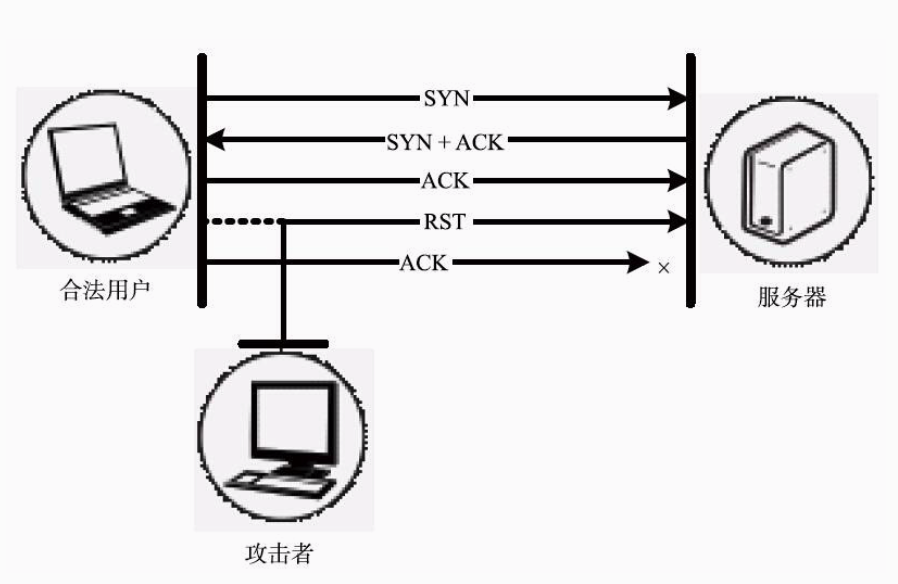
很多情况下，攻击者不会与被攻击客户端或服务器处于同一内网，导致发动TCP RST攻击时难以获取端口和序列号。在这种情况下，攻击者可以利用大量的受控主机猜测端口和序列号，进行盲打，发动RST洪水攻击。只要在数量巨大的RST报文中有一条与攻击目标的端口号相同，并且序列号落在目标的接收窗口之中，就能够中断连接。

5.Sockstress攻击
**误区：DDoS攻击都是洪水攻击**

在提到DDoS攻击时，人们通常会条件反射性地想到UDP洪水攻击、SYN洪水攻击、RST洪水攻击等，并会由此认为DDoS攻击都是洪水攻击。

事实上，洪水攻击确实占据了DDoS攻击方法中相当大的比例，但并不是所有的DDoS攻击都是洪水攻击。除了洪水攻击外，还有一些被称为慢速攻击（Low and Slow Attack）的攻击方法。

慢速攻击则有所不同，它会缓慢而坚定地发送请求并长期占用，**一点一滴地蚕食目标的资源**。

在TCP传输数据时，并不是将数据直接递交给应用程序处理，而是先临时存储在接收缓冲区中，该接收缓冲区的大小是由TCP窗口表示的。如果TCP窗口大小为0，则表示接收缓冲区已被填满，发送端应该停止发送数据，直到接收端的窗口发生了更新。Sockstress攻击就是利用该原理长时间地维持TCP连接，以达到拒绝服务攻击的目的。

Sockstress攻击首先会完成TCP三次握手以建立TCP连接，但是在三次握手的最后一次ACK应答中，**攻击者将其TCP窗口大小设置为0，随后进行一次数据请求**。攻击目标在传输数据时，发现接收端的TCP窗口大小为0，就会停止传输数据，**并发出TCP窗口探测包**，询问攻击者其TCP窗口是否有更新。由于攻击者没有更改TCP窗口的大小，被攻击目标就会一直维持TCP连接等待数据发送，并不断进行窗口更新的探测。如果攻击者利用大量的受控主机进行Sockstress攻击，被攻击目标会一直维持大量的TCP连接并进行大量窗口更新探测，其TCP连接表会逐渐耗尽，无法接受新的连接而导致拒绝服务。

Sockstress攻击的另一种方式是将TCP窗口设置为一个非常小的值，例如4字节。这样攻击目标将不得不把需要发送的数据切分成大量4字节大小的分片，这会极大地消耗目标的内存和处理器资源，造成系统响应缓慢和拒绝服务。

### 3.2.2 攻击SSL连接
如果使用RSA系列的公钥密码算法，那么服务器端所要消耗的资源都会比客户端多。

1.THC SSL DoS攻击
在进行SSL数据传输之前，通信双方首先要进行SSL握手，以协商加密算法交换加密密钥，进行身份认证。通常情况下，这样的SSL握手过程只需要进行一次即可，但是在SSL协议中有一个Renegotiation选项，通过它可以进行密钥的重新协商以建立新的密钥。

THC SSL DoS攻击是安全研究人员在2011年提出的一种针对SSL的拒绝服务攻击方法。这种方法就是利用Renegotiation选项，造成被攻击目标资源耗尽。在进行SSL连接并握手之后，攻击者反复不断地进行密钥重新协商过程，**而密钥重协商过程需要服务器投入比客户端多15倍的CPU计算资源。攻击者只需要一台普通的台式机就能够拖慢一台高性能服务器**，而如果有大量主机同时进行攻击，则会使服务器忙于协商密钥而完全停止响应。
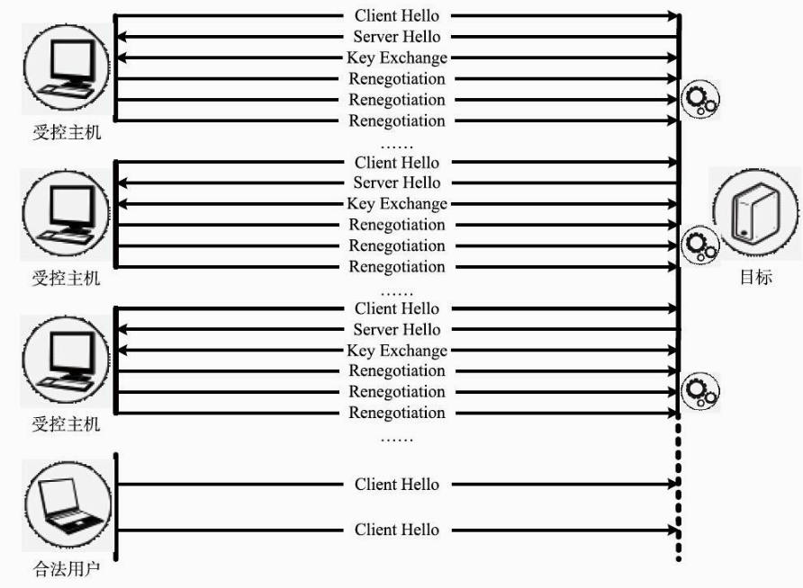
另外，即使服务器不支持Renegotiation，攻击者依然可以通过另行打开新的SSL连接的方式来制造类似的攻击效果。

2.SSL洪水攻击
在SSL握手的过程中，服务器会消耗较多的CPU计算资源进行加解密，并进行数据的有效性检验。对于客户端发过来的数据，服务器需要先花费大量的计算资源进行解密，之后才能对数据的有效性进行检验。重要的是，**不论数据是否是有效的，服务器都必须先进行解密才能够做检查**。

对于SSL洪水攻击，比较好的方式是在数据传输之前，进行SSL握手的过程中发动攻击。攻击者并不需要完成SSL握手和密钥交换，而只需要在这个过程中让服务器去解密和验证，就能够大量地消耗服务器的计算资源，因此，攻击者可以非常容易地构造密钥交换过程中的请求数据，达到减少客户端计算量的目的。

## 3.3 攻击应用资源
近年来，消耗应用资源的分布式拒绝服务攻击正逐渐成为拒绝服务攻击的主要手段之一。而由于DNS和Web服务的广泛性和重要性，这两种服务也就成为了消耗应用资源的分布式拒绝服务攻击的最主要的攻击目标。

### 3.3.1 攻击DNS服务

DNS服务是互联网的一项核心服务。通过使用DNS，人们在访问网站时不需要记忆其IP地址，而只须输入其域名即可。在IPv6网络环境下，由于IP地址由原来的32位扩展到了128位，变得更加难以记忆，DNS服务也就变得更加重要。当DNS服务的可用性受到威胁时，互联网上的大量设备都会受到影响甚至无法正常运行。

1.DNS QUERY洪水攻击

DNS QUERY洪水攻击是指向DNS服务器发送大量查询请求以达到拒绝服务效果的一种攻击方法。

DNS查询和解析过程

当客户端向DNS服务器查询某域名时，DNS服务器会首先检查其本地缓存中是否有该域名的记录，如果缓存中有该域名的记录（即命中），则直接将缓存中记录的IP地址作为非权威应答返回给客户端。如果在缓存中没有找到该域名的记录，则会进行迭代查询，从根域名开始，逐级进行域名解析，直到解析出完整的域名，之后服务器会将域名解析结果作为应答发送给客户端，并生成一条解析记录保存到缓存中。
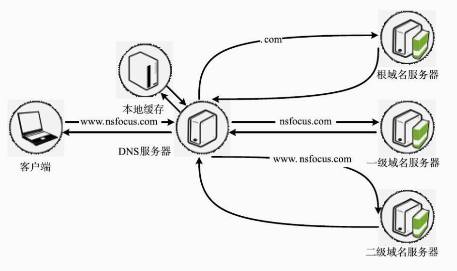
例如，对www.nsfocus.com这个域名进行解析，如果在缓存中没有查到其记录，DNS服务器会首先向根域名服务器查询.com的域名解析服务器，然后向.com域名服务器查询nsfocus.com的域名解析服务器，最后向nsfocus.com域名解析服务器查询得到www.nsfocus.com的域名解析结果，并将结果返回给发起查询的客户端。

进行DNS QUERY洪水攻击的要点在于每一个DNS解析请求所查询的域名应是不同的，这样可以比较有效地避开DNS服务器缓存中的解析记录，达到更好的资源消耗效果。

2.DNS NXDOMAIN洪水攻击
不存在的域名（NXDOMAIN即Non-eXistent Domain）。

在进行DNS NXDOMAIN洪水攻击时，DNS服务器会进行多次域名查询，同时，其缓存会被大量NXDOMAIN记录所填满，导致响应正常用户的DNS解析请求的速度变慢。

### 3.3.2 攻击Web服务
1.HTTP洪水攻击
如果攻击者利用大量的受控主机不断地向Web服务器恶意发送大量HTTP请求，要求Web服务器处理，就会完全占用服务器的资源，造成其他正常用户的Web访问请求处理缓慢甚至得不到处理，导致拒绝服务。这就是HTTP洪水攻击。

**由于HTTP协议是基于TCP协议的，需要完成三次握手建立TCP连接才能开始HTTP通信，因此进行HTTP洪水攻击时无法使用伪造源IP地址的方式发动攻击**。这时，攻击者通常会使用HTTP代理服务器。HTTP代理服务器在互联网上广泛存在。

与DNS服务类似，Web服务也存在缓存机制。如果攻击者的大量请求都命中了服务器缓存，那么这种攻击的主要作用仅体现在消耗网络带宽资源上，对于计算和IO资源的消耗是非常有限的。因此，高效的HTTP洪水攻击应不断发出针对不同资源和页面的HTTP请求，**并尽可能请求无法被缓存的资源（如关键词搜索结果、用户相关资料等），从而加重服务器的负担，增强攻击效果**。

此外，如果Web服务器支持HTTPS，那么进行HTTPS洪水攻击是更为有效的一种攻击方式。一方面，在进行HTTPS通信时，Web服务器需要消耗更多的资源用来进行认证和加解密；另一方面，一部分防护设备无法对HTTPS通信数据流进行处理，也会导致攻击流量绕过防护设备，直接对Web服务器造成攻击。

HTTP洪水攻击是目前对Web服务威胁最大的攻击之一，有大量的攻击工具支持HTTP洪水攻击，发动简单其效果明显，已经成为攻击者使用的主要攻击方式之一。

2.Slowloris攻击
在HTTP协议中规定，HTTP头部以连续的“\r\n\r\n”作为结束标志。许多Web服务器在处理HTTP请求的头部信息时，会等待头部传输结束后再进行处理。因此，如果Web服务器没有接收到连续的“\r\n\r\n”，就会一直接收数据并保持与客户端的连接。利用这个特性，攻击者能够长时间与Web服务器保持连接，并逐渐耗尽Web服务器的连接资源。
攻击者在发送HTTP GET请求时，缓慢地发送无用的header字段，并且一直不发送“\r\n\r\n”结束标志，这样就能够长时间占用与Web服务器的连接并保证该连接不被超时中断。然而，Web服务器能够处理的并发连接数是有限的，如果攻击者利用大量的受控主机发送这种不完整的HTTP GET请求并持续占用这些连接，就会耗尽Web服务器的连接资源，导致其他用户的HTTP请求无法被处理，造成拒绝服务。

攻击者使用Slowloris、slowhttptest等工具就可以简单地发动Slowloris攻击。在Slowloris攻击方法出现以后，IIS、nginx等一部分Web服务器软件针对该攻击方法进行了修改，但是Apache、dhttpd等Web服务器软件依然会受到Slowloris攻击的影响。

3.慢速POST请求攻击
在HTTP头部信息中，可以使用Content-Length字段来指定HTTP消息实体的传输长度。**当Web服务器接收到的请求头部中含有Content-Length字段时，服务器会将该字段的值作为HTTP BODY的长度**，持续接收数据并在达到Content-Length值时对HTTP BODY的数据内容进行处理。利用这个特性，攻击者能够长时间与Web服务器保持连接，并逐渐耗尽Web服务器的连接资源。

攻击者在发送HTTP POST请求时，在请求头部中将Content-Length设置为一个很大的值（例如10000），并将HTTP BODY以非常缓慢的速度一个字节一个字节的向Web服务器发送。这样，Web服务器就需要一直维持与客户端的连接并等待数据传输结束。由于Content-Length被设置成了很大的值，而HTTP BODY的传输速度又非常缓慢，攻击者就可以长时间占用这个连接。**通过间隔性地发送单字节的HTTP BODY内容，攻击者能够确保连接不因超时而导致中断**。

攻击者可以使用slowhttptest等攻击发动慢速POST请求攻击。与Slowloris攻击有所不同，由于HTTP协议设计上的原因，所有的Web服务器软件都会受到慢速POST请求攻击的影响.

# 6、DDoS攻击的治理和缓解

## 6.1 攻击的治理
### 6.1.2 地址伪造攻击的治理

在当前的互联网环境中，伪造地址发起网络攻击是一件非常容易的事。这一现象给DDoS的治理和防护带来了诸多困难。

1.CERT Advisory CA-1996-21

TCP SYN Flooding and IP Spoofing Attacks”的CA-1996-21号公告。

具体而言，就是互联网服务提供商在网络出入口处的路由器上，对符合以下条件的数据包进行过滤：

·从外部接口进入内部网络的数据包，但源地址属于内部网络；

·由内部网络向外发送的数据包，但是源地址不属于内部网络。

SYN FLOOD通常，客户端在短时间内伪造大量不存在的IP地址，向服务器不断地发送syn包，服务器回复确认包，并等待客户的确认，由于源地址是不存在的，服务器需要不断的重发直至超时，这些伪造的SYN包将长时间占用未连接队列，正常的SYN请求被丢弃，目标系统运行缓慢，严重者引起网络堵塞甚至系统瘫痪。

2.RFC 2827

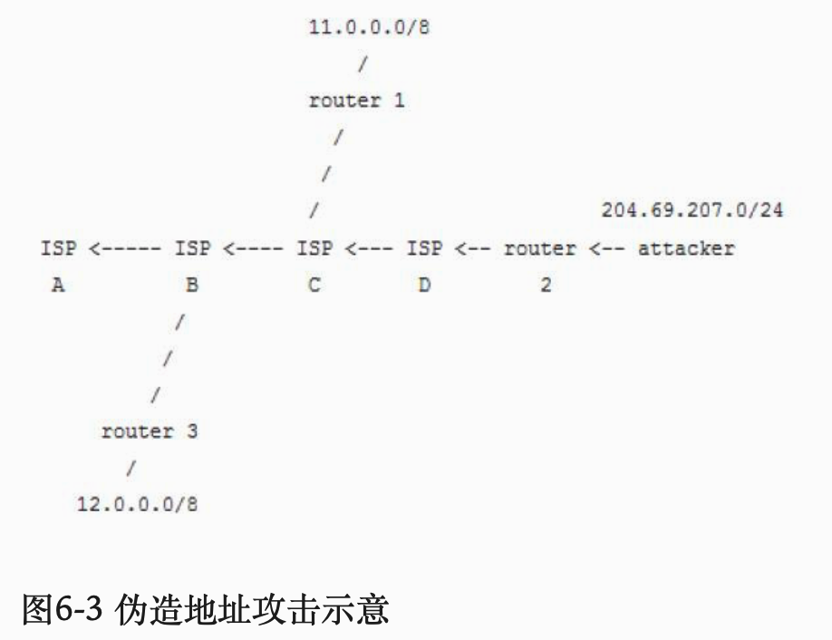

如图6-3所示。攻击者位于204.69.207.0/24网段，属于ISP D的区域中，通过路由器“router 2”，试图攻击其他主机。如果“router2”执行了入口流量过滤，只允许源地址在204.69.207.0/24网段内的数据包流出，反之则全部禁止，那么攻击将无法进行。

可以使用伪造的IP发送出方向的包，但返程流量全部会流到合法的用户主机（如果存在），即使不存在，也不会流到你的主机。

4.分布式过滤方法

其原理是路由器根据数据包的源地址和目的地址判断其转发路径是否经过自己。如果不经过，则丢弃该数据包。

虽然类似的方法已广泛提出，但伪造地址攻击并未得到有效遏制，主要是因为ISP缺乏采用这些技术的动力。各国政府完善相应法规并执行监管，才是杜绝地址伪造的必由之路。

### 6.1.3 攻击反射点的治理

治理反射点最直接有效的方法是提高DNS服务器的安全性。

1.Open Resolver Project
Open Resolver Project提供查询功能，使用者可以查询任何网段中开放的地址解析器，查询结果包括从多个地址向其发送请求的响应结果。如果一个DNS服务器可以被从任意地址访问，并无限速地回应查询请求，那么它就可以被用作DDoS攻击的反射点。

2.RRL

2013年7月25日，互联网系统协会（Internet Systems Consortium，ISC）宣布，为了防御利用DNS发起的反射式DDoS攻击，最新版的BIND软件增加了响应速率限制（Response Rate Limiting，RRL）模块，并声称这会是缓解DNS反射攻击的最有效方法。

## 6.2 攻击的缓解

本章的前半部分介绍了通过治理对抗DDoS攻击的方法，大部分的治理方法需要在DDoS攻击发生之前就配置，并且需要**世界范围内的网络运营商、网络公司和网络组织进行有效合作，才能达到较好的对抗效果**。

误区：防火墙和入侵检测/防御系统能够缓解DDoS攻击

防火墙是最常用的安全产品，但是防火墙的设计原理中并没有考虑针对DDoS攻击的缓解。传统的防火墙是以高强度的检查作为代价来进行防护的，检查的强度越高，计算的代价越大。**而DDoS攻击中的海量流量会造成防火墙性能急剧下降，不能有效地完成包转发的任务**。同时，**传统防火墙一般都部署在网络入口位置，虽然这在某种意义上保护了网络内部的所有资源，但是往往也成为DDoS攻击的目标**。

入侵检测/防御系统是应用最广泛的攻击检测/防护工具，但在面临DDoS攻击时，入侵检测/防御系统通常也不能满足要求。入侵检测/防御系统一般是基于规则进行应用层攻击的检测，在其设计之初就是作为一种基于特征的应用层攻击检测设备。但是目前的DDoS攻击大部分采用基于合法数据包的攻击流量，因此入侵检测/防御系统无法对DDoS攻击进行基于特征的有效检测。同时，入侵检测/防御系统也面临着和防火墙同样的性能问题。

缓解DDoS攻击的主要方法是对网络流量进行清洗，即设法将恶意的网络流量从全部流量中去掉，**只将正常的网络流量交付该服务器**。然而，随着分布式拒绝服务攻击的流量不断增大，单一的流量清洗设备和流量清洗中心已经无法处理如此大规模的网络流量了，因此，面对当今的DDoS攻击时，在进行流量清洗前还需要进行流量稀释。

### 6.2.1 攻击流量的稀释

目前比较流行的攻击流量稀释的方法是使用内容分发网络（Content Delivery Network，CDN）或任播（Anycast）技术。

CDN技术的初衷是提高互联网用户对网站静态资源的访问速度，但是由于分布式多节点的特点，它也能够对分布式拒绝服务攻击的流量产生稀释的效果。
**所谓CDN，就是在互联网范围内广泛设置多个节点作为代理缓存，并将用户的访问请求导向最近的缓存节点**，以加快访问速度的一种技术手段。

那么，用户的访问请求是如何被导向最近的缓存节点的呢？这通常通过智能DNS来实现。在许多情况下，对于资源和服务的访问请求是以域名的形式发出的，传统的域名解析系统会将同一域名的解析请求解析成一个固定的IP地址，**因此，整个互联网对于该域名的访问都会被导向这个IP地址**。
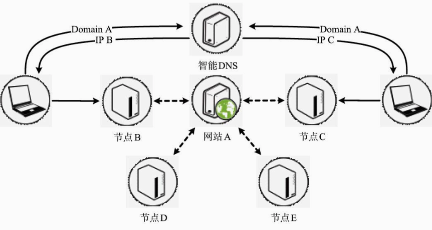

智能DNS则有所不同。**在智能DNS系统中，一个域名会对应一张IP地址表**，当收到域名解析请求时，智能DNS会查看解析请求的来源，并给出地址表中距离请求来源最接近的IP地址，**这个地址通常也就是最接近用户的CDN缓存节点的IP地址**。在用户收到域名解析应答时，认为该CDN节点就是他请求的域名所对应的IP地址，并向该CDN节点发起服务或资源请求。

**CDN节点在收到用户的请求时，会在其存储的缓存内容中寻找用户请求的资源，如果找到，就直接将资源响应给用户；如果在CDN节点中找不到用户请求的资源，则CDN节点会作为代理服务器向源站请求该资源，获取资源后将结果缓存并返回给用户**。对于有大量静态资源的网站，使用CDN进行代理缓存一般能够减少源站80%的访问流量。

不过，利用智能DNS实现的CDN技术只能分散和稀释通过域名发起的分布式拒绝服务攻击的流量，如果攻击者直接通过IP而不是通过域名进行攻击，那么不会进行智能DNS解析，**攻击流量也无法分散到各个CDN节点上。更好的流量稀释方法是使用Anycast技术**。

#### Anycast
Anycast技术是一种网络寻址和路由方法。通过使用Anycast，一组提供特定服务的主机可以使用相同的IP地址，同时，服务访问方的请求报文将会被IP网络路由到这一组目标中拓扑结构最近的一台主机上。

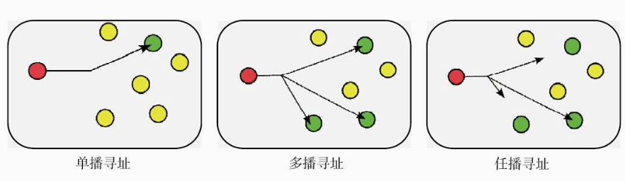
网络寻址
在IP网络中，存在三种寻址方法：单播寻址、多播寻址和任播寻址

Anycast寻址（任播寻址）：
在任播寻址中，网络地址和网络节点也是一对多的关系，每一个目的地址对应一群接收节点，但消息只会发送给拓扑结构上最近的节点。

Anycast通常是通过在不同的节点处同时使用BGP协议向外声明同样的目的IP地址的方式实现的。如图6-12所示，服务器A和服务器B是Anycast的两个节点，它们通过BGP协议同时向外声明其IP地址为10.0.0.1。
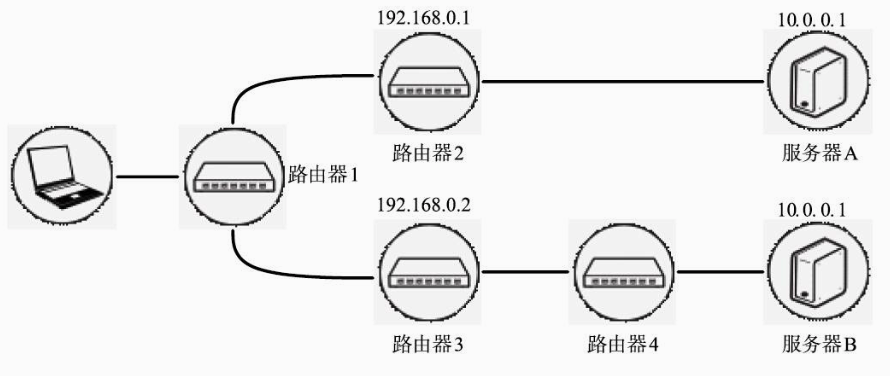

当客户端位于路由器1的网络内时，它将会通过路由器1来选择路由的下一跳。而在路由器1看来，到达服务器IP地址10.0.0.1的网络拓扑如图6-13所示。显然，转发到路由器2的距离更短，因此，路由器1会将请求报文转发给路由器2而不是路由器3，从而实际上发送给了服务器A，达到发送给Anycast之中“最近”节点的目的。
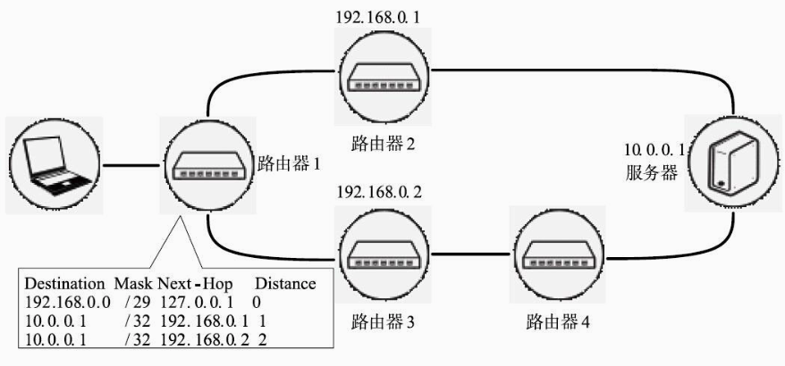

对无状态的服务Anycast通常用来提供高可用性保障和负载均衡，例如DNS服务。几乎全部的互联网根域名服务器都部署了Anycast。在各大洲不同位置的A、C、E、F、I、J、K、L和M根域名服务器都使用了Anycast寻址技术，以提供一种分布式的服务。同时，许多商业DNS服务提供商也部署了Anycast寻址以便提高查询性能，保障系统冗余并实现负载均衡。

Anycast通常具有高度的可靠性，它可以提供自动故障恢复。Anycast应用通过外部“心跳”来监测服务器的功能，如果服务器出现故障，就会立即撤销服务器的路由公告。

使用Anycast技术能够稀释分布式拒绝服务攻击流量。在Anycast寻址过程中，流量会被导向网络拓扑结构上最近的节点，在这个过程中，攻击者并不能对攻击流量进行操控，因此攻击流量将会被分散并稀释到最近的节点上，每一个节点上的资源消耗都会减少（见图6-14）。

6.2.2 攻击流量的清洗

流量清洗也需要考虑漏报率和误报率的问题。

1.IP信誉检查

IP信誉检查原本是用于识别和对抗垃圾邮件的一种技术，不过这种技术也可以用来在网络层进行流量清洗。

IP信誉机制是指为互联网上的IP地址赋予一定的信誉值，那些过去或现在经常被作为僵尸主机发送垃圾邮件或发动拒绝服务攻击的IP地址会被赋予较低的信誉值，说明这些IP地址更有可能成为网络攻击的来源。

IP信誉检查的极端情况就是IP黑名单机制，即如果数据包的来源存在于黑名单之中，则不进行任何处理，直接丢弃该数据包。这种方式一般会造成较多的误报，影响正常服务的运行。

2.攻击特征匹配
在大多数情况下，发动分布式拒绝服务攻击需要借助攻击工具。为了提高发送请求的效率，攻击工具发出的数据包通常是由编写者伪造并固化到工具当中的，而不是在交互过程中产生的，因此一种攻击工具所发出的数据包载荷会具有一些特征。

流量清洗设备可以将这些数据包载荷中的特征作为指纹，来识别工具发出的攻击流量。

指纹识别可以分为静态指纹识别和动态指纹识别两种。
静态指纹识别是指预先将多种攻击工具的指纹特征保存在流量清洗设备内部，设备将经过的网络数据包与内部的特征库进行比对，直接丢弃符合特征的数据包；**动态指纹识别则需要清洗设备对流过的网络数据包进行学习，在学习到若干个数据包的载荷部分之后，将其指纹特征记录下来**，后续命中这些指纹特征的数据包会被丢弃，而长期不被命中的指纹特征会逐渐老化直至消失。

3.速度检查与限制
一些攻击方法在数据包载荷上可能并不存在明显的特征，没有办法进行攻击特征匹配，但却在请求数据包发送的频率和速度上有着明显的异常。这些攻击方法可以通过速度检查与限制来进行清洗。

例如，在受到THC SSL DoS攻击时，会在同一个SSL会话中多次进行加密密钥的重协商，而正常情况下是不会反复重协商加密密钥的。

再如，在受到Slowloris和慢速POST请求攻击时，客户端和服务器之间会以非常低的速率进行交互和数据传输。流量清洗设备在发现HTTP的请求长时间没有完成传输时，就可以将会话中断。

此外，对于UDP洪水攻击等一些没有明显特征、仅通过大流量进行攻击的方法，可以通过限制流速的方式对其进行缓解。

4.TCP代理和验证
SYN洪水攻击等攻击方式都是利用TCP协议的弱点，将被攻击目标的连接表占满，使其无法创建新的连接而达到拒绝服务攻击的目的。流量清洗设备可以通过TCP代理和验证的方法来缓解这种攻击造成的危害。

在一个TCP SYN请求到达流量清洗设备后，设备并不将它交给后面的服务器，而是直接回复一个SYN+ACK响应，并等待客户端回复。
如果SYN请求来自合法的用户，那么他会对SYN+ACK进行响应，这时流量清洗设备会代替用户与其保护的服务器建立起TCP连接，并将这个连接加入信任列表当中（见图6-18）。之后，合法的用户和服务器之间就可以透过流量清洗设备，进行正常数据通信。对于用户来说整个过程是完全透明的，正常的交互没有受到任何影响。
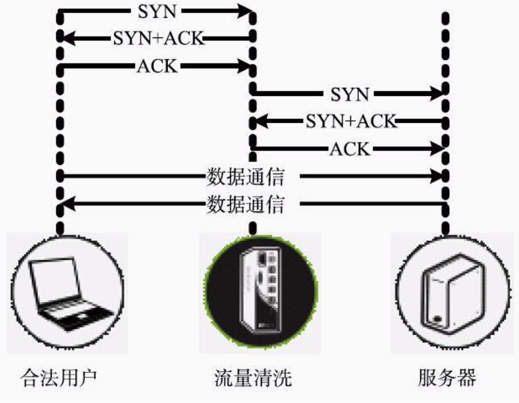

而如果这个SYN请求来自攻击者，那么他通常不会对SYN+ACK进行应答，从而形成半开连接。这样流量清洗设备会暂时保留这个半开连接，并在经过短暂的超时时间之后丢弃这个连接。

5.协议完整性验证

为了提高发送攻击请求的效率，**大多数的攻击方法都会只发送攻击请求，而不接收服务器响应的数据**，或者无法完全理解和处理响应数据。因此，**如果能够对请求来源进行交互式验证**，就可以检查请求来源协议实现的完整性。

例如，可以使用HTTP协议中的302重定向来验证请求的来源是否接收了响应数据并完整实现了HTTP协议的功能。HTTP的302状态码表示被请求的资源被临时转移，并会给出一个转移后的地址。正常的合法用户在接收到302重定向后会顺着跳转地址寻找对应的资源
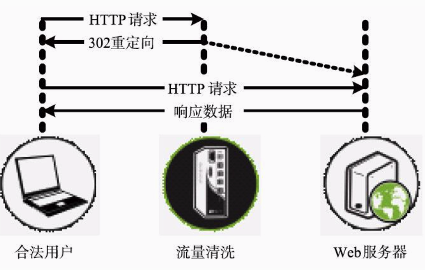

6.客户端真实性验证
对基于页面的Web服务，可以通过检查客户端是否支持JavaScript来验证请求是否来自真实的浏览器客户端。当收到HTTP请求时，流量清洗设备会使用JavaScript等脚本语言发送一条简单的运算操作。如果请求是由真实的浏览器发出的，那么浏览器会进行正确运算并返回结果，流量清洗设备进行结果验证后就会让浏览器跳转到Web服务器上真正的资源位置，不会影响正常用户的访问（见图6-24）。
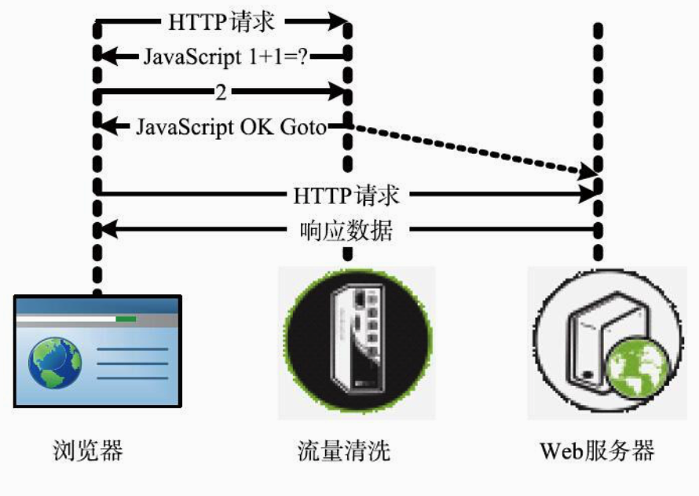

当然，攻击者也可以牺牲工具的一部分攻击效率，并在工具中加入JavaScript的解析和执行功能，以便通过JavaScript验证。这时，则需要使用验证码进行人机识别。
