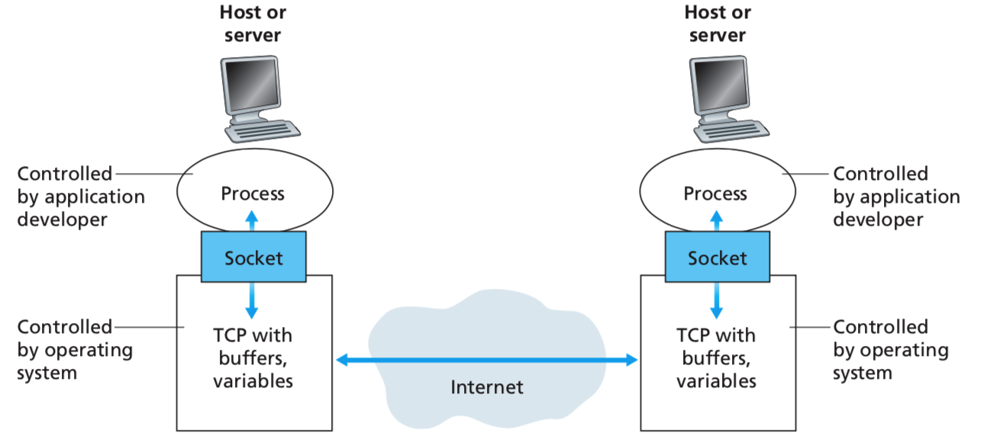
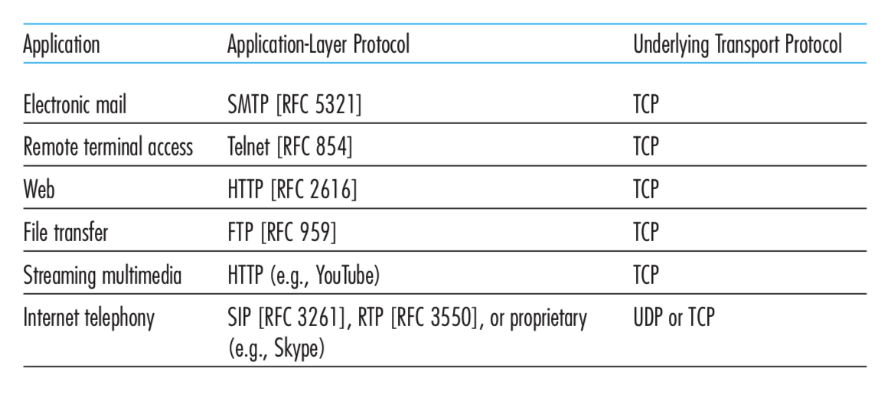
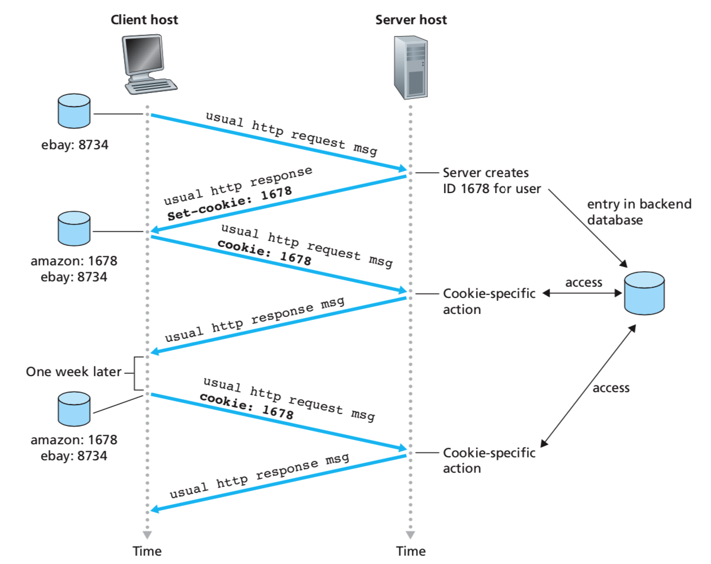
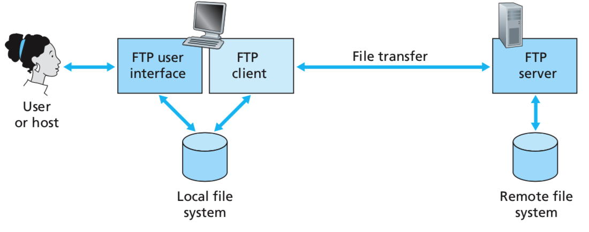
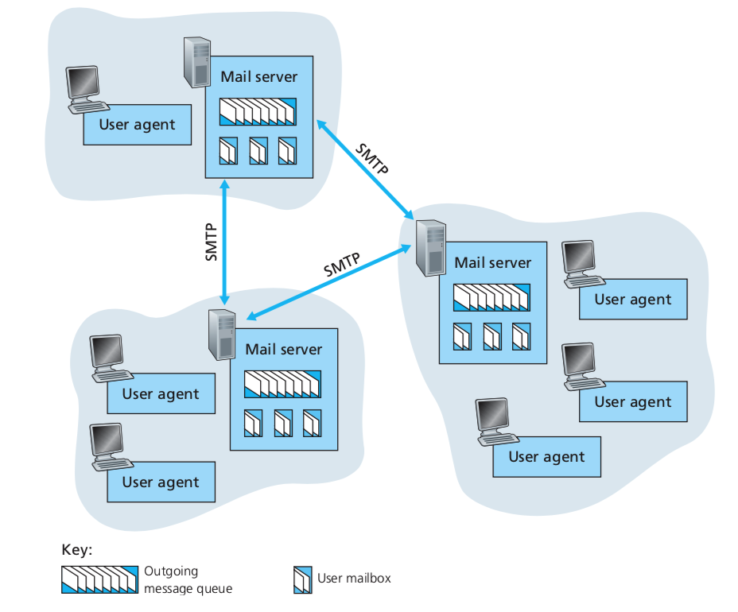
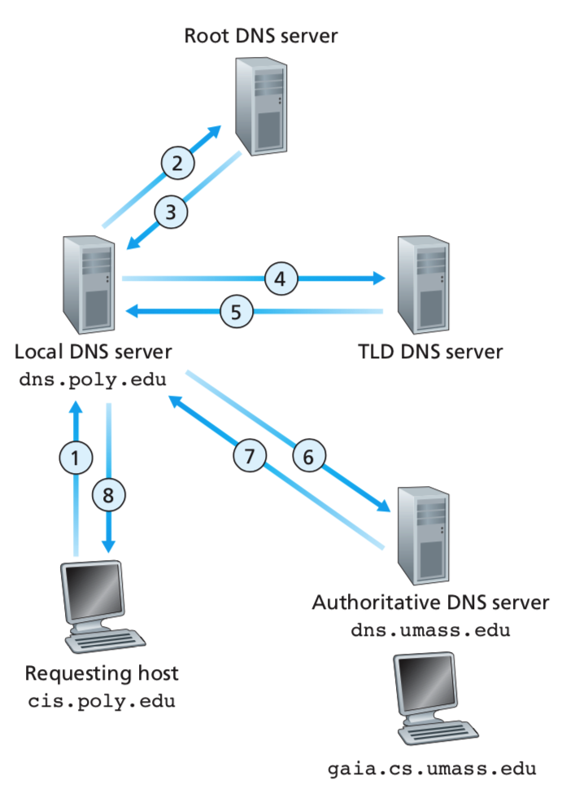

# Chapter2、Application Layer
## 2.1、网络应用原理
two predominant architectural paradigms used in modern network applications: 
the **client-server** architecture  and  the **peer-to-peer (P2P)** architecture

Another characteristic of the client-server architecture is that the server has a 固定的, well-known address, called an IP address

一些具有客户端-服务器体系结构的知名应用程序包括Web，FTP，Telnet和电子邮件

通常，在客户端服务器应用程序中，单服务器主机无法满足来自客户端的所有请求。例如，如果一个流行的社交网站只有一台服务器来处理所有请求，则很快就会变得不堪重负。因此，通常使用容纳大量主机的数据中心来创建功能强大的虚拟服务器virtual server。

In a P2P architecture, there is minimal (or no) **reliance** on dedicated servers in data centers. 
当今，许多最流行且流量密集的应用程序都基于P2P架构。对等辅助的下载加速（例如Xunlei），互联网电话（例如Skype）
P2P架构最引人注目的功能之一就是其可伸缩性self-scalability.。例如，在P2P文件共享应用程序中，尽管每个对等方都通过请求文件来产生工作量，但每个对等方还通过将文件分发给其他对等方来增加系统的服务容量。

大多数住宅ISP（包括DSL和电缆ISP）的大小已确定为“非对称”带宽使用，也就是说，**下游流量要比上游流量大得多**。但是P2P视频流和文件分发应用程序将上游流量从服务器转移到住宅ISP，从而给ISP带来很大压力。未来的P2P应用程序需要设计成对ISP友好

在某些应用程序中，例如在P2P文件共享中，进程既可以是客户端，也可以是服务器。
在会话开始时最初与另一个进程联系被标记为客户端。等待联系以开始会话的进程是服务器。

进程通过称为socket的软件接口向网络发送消息，并从网络接收消息。
**socket是主机内Application层与传输层之间的接口**。由于套接字是构建网络应用程序所用的**编程接口**。
the door between the process and the TCP connection;

应用程序开发人员可以控制socket的应用程序层一侧的所有内容，**但几乎不能控制套接字的传输层一侧**。应用程序开发人员在传输层方面的唯一控制权是
- 传输协议的选择
- 也许能够修复一些传输层参数（例如最大缓冲区和最大段大小）的能力

To identify the receiving process, two pieces of information need to be specified: 
- the address of the host 
- an identifier that specifies the receiving process in the destination host.

the host is identified by its IP address
**IPv6采用128位元的地址，而IPv4使用的是32位元**

Web server is identified by port number 80. 
A mail server process **(using the SMTP protocol)** is identified by port number 25.
multimedia applications such as conversational audio/video that can tolerate some amount of data loss. 

TCP：
connection-oriented service and a reliable data transfer
面向连接的服务和可靠的数据传输

The connection is a full-duplex connection in that the two processes can send messages to each other over the connection at the same time.
该连接是全双工连接，因为两个进程可以同时通过连接向彼此发送消息。

TCP和UDP都不提供任何加密 encryption
**TCP-enhanced-with-SSL provides critical process-to-process security services**

today’s Internet can often provide satisfactory service to time-sensitive applications, but it cannot provide any timing or throughput guarantees.

由于许多**防火墙配置为阻止（大多数类型的）UDP通信**，因此，Internet电话应用程序通常被设计为在UDP通信失败时**使用TCP作为备份**。

### 2.1.5、应用层协议
如果浏览器开发人员遵循HTTP RFC的规则，则浏览器将能够从也遵循HTTP RFC规则的任何Web服务器中检索网页。
许多其他应用层协议是专有的，有意在公共领域不可用。例如，Skype使用专有的应用程序层协议。

## 2.2、The Web and HTTP
客户端程序和服务器程序。在不同的终端系统上执行的客户端程序和服务器程序通过交换HTTP消息相互通信。 **HTTP定义了这些消息的结构以及客户端和服务器如何交换消息**。

**网页由对象组成。一个对象就是一个文件**，例如一个HTML文件，一个JPEG图像，一个Java applet或一个视频剪辑，可以通过单个URL进行寻址。大多数网页由基本HTML文件和几个引用的对象组成。例如，如果一个网页包含HTML文本和五个JPEG图像，则该网页具有六个对象。

**HTTP客户端首先启动与服务器的TCP连接**。建立连接后，浏览器和服务器进程将**通过其套接字接口访问TCP. 然后通过套接字发送HTTP请求**。

**Although HTTP uses persistent connections in its default mode**, HTTP clients and servers can be configured to use non-persistent connections instead.

服务器关闭HTTP连接：
The HTTP server process tells TCP to close the TCP connection. (**But TCP doesn’t actually terminate the connection until** it knows for sure that the client has received the response message intact.)

HTTP非持久性连接：**其在服务器发送对象后关闭每个TCP连接**。请注意，每个TCP连接仅传输**一个请求消息和一个响应消息（HTTPRequest / HTTPResponse）**。

非持久连接有一些缺点。首先，必须为每个请求的对象建立并维护一个全新的连接。对于这些连接中的每一个，必须分配TCP缓冲区，并且必须在客户端和服务器中都保留TCP变量。**This can place a significant burden on the Web server**

### 2.2.4、cookie
cookie技术具有四个组成部分：
1. HTTP响应消息中的cookie标头行； 
2.  HTTP请求消息中的cookie头行； 
3. 保存在用户终端系统上并由用户浏览器管理的cookie文件； 
4. 网站上的后端数据库

（在这之前他已经有了ebay的cookie）当请求进入Amazon Web服务器时，服务器将创建一个唯一的标识号，并在其**后端数据库**中创建一个由该标识号索引的条目
**后端：back-end database**

Amazon Web服务器响应Susan的浏览器，在HTTP响应中包括Set-cookie。

Susan的浏览器收到HTTP响应消息时，会看到cookie。然后，**浏览器在其管理的特殊cookie文件上添加一行**。该行在Set-cookie：标头中包含服务器的主机名和标识号。

随着Susan继续浏览Amazon网站，每次她请求一个网页时，她的浏览器都会查询她的cookie文件，提取该站点的cookie。

通过这种方式，Amazon服务器可以跟踪Susan在Amazon站点上的活动，但它确切地知道用户1678访问了哪些页面，以什么顺序，在什么时间。
cookie的安全性并不是太好。

### 2.2.5、Web缓存
A Web cache—also called **a proxy server**

如果代理中没有该对象，则代理将打开与原始服务器的TCP连接。然后，代理将对对象的HTTP请求发送到服务器的TCP连接中。收到此请求后，原始服务器将HTTP响应内的对象发送到代理。
当代理接收到对象时，它将副本存储在其本地存储中，并在HTTP响应消息中将副本发送到客户端浏览器。

通常，**代理是由ISP购买和安装的**。

Web缓存（代理）可以大大减少客户端请求的响应时间，特别是如果客户端和原始服务器之间的瓶颈带宽远小于客户端和缓存之间的瓶颈带宽。Web缓存可以从整体上显着减少Internet中的Web流量，从而提高所有应用程序的性能。

## 2.3、FTP

用户首先提供**远程主机的主机名**，从而导致本地主机中的FTP客户端进程与远程主机中的**FTP服务器进程建立TCP连接**。
然后，用户提供用户ID和密码，**它们作为FTP命令的一部分通过TCP连接发送**。服务器授权用户后，用户会将存储在本地文件系统中的一个或多个文件复制到远程文件系统中。

FTP 与 HTTP的相同点：They both run on top of TCP

不同点：**FTP uses two parallel TCP connections to 传输文件**，控制连接和数据连接

FTP用了两个TCP连接：
1. **控制连接用于在两个主机之间发送控制信息**，诸如用户ID，密码，更改远程目录的命令以及“放置”和“获取”文件的命令之类的信息。
2. **数据连接data connection用于实际发送文件**。

过程：
session 会话
When a user starts an FTP session with a remote host, the client side of FTP (user) first initiates a control TCP connection with the server side (remote host) on **server port number 21**

当服务器端通过控制连接接收到用于文件传输的命令时，服务器端将启动到客户端的TCP数据连接。

FTP通过数据连接仅发送一个文件，然后关闭数据连接。如果在同一会话中用户想要传输另一个文件，则FTP打开另一个数据连接。因此，使用FTP，控制连接在用户会话的整个过程中保持打开状态，但是会为会话中传输的每个文件创建一个新的数据连接（即，**控制连接是持久的，但数据连接是非持久的**）

## 2.5、SMTP
The Simple Mail Transfer Protocol

user agents, mail servers, and the Simple Mail Transfer Protocol (SMTP)。

当爱丽丝撰写完邮件后，她的**用户代理**会将邮件发送到**邮件服务器**，邮件将被放置在邮件服务器的传出邮件队列中。当Bob想要阅读邮件时，**他的用户代理从邮件服务器**中的邮箱中检索该邮件。
邮件服务器构成了电子邮件基础结构的核心。

SMTP是Internet电子邮件的主要应用程序层协议。**它使用TCP可靠的数据传输服务将邮件从发件人的邮件服务器传输到收件人的邮件服务器**。每个服务器既是客户端又是服务器。

过程：
1、Alice invokes her user agent for e-mail, provides Bob’s e-mail address (bob@someschool.edu), composes a message, and instructs the user agent to send the message.
2、爱丽丝的用户代理将邮件发送到她的邮件服务器，并将其放置在邮件队列中。
3、The client side of SMTP, running on Alice’s mail server, sees the message in the message queue. **It opens a TCP connection to an SMTP server unning on Bob’s mail server**.
4、After some initial **SMTP handshaking**, the SMTP client sends Alice’s message into the TCP connection.
5、在Bob的邮件服务器上，SMTP的服务器端接收到该消息。然后，鲍勃的邮件服务器将邮件放在鲍勃的邮箱中。Bob会在方便时调用其用户代理来阅读消息。

**SMTP通常不使用intermediate中间邮件服务器**，即使两个邮件服务器位于世界的另一端，也可以发送邮件。

SMTP has TCP establish a connection to **port 25** at the server SMTP.

### 2.52、与HTTP对比
持久HTTP和SMTP都使用持久连接。
HTTP is mainly a **pull** protocol—someone **loads** information on a Web server and users use HTTP to pull the information from the server at their convenience.
the TCP connection is **initiated by the machine that wants to receive the file**.

SMTP is primarily a **push** protocol—the sending mail server pushes the file to the receiving mail server. TCP connection is ini- tiated by the machine that wants to send the file.

## 2.6、DNS服务
The DNS servers are often UNIX machines running the Berkeley Internet Name Domain software.  **The DNS protocol runs over UDP and uses port 53**.

步骤
1. 同一用户计算机运行DNS应用程序的客户端
2. 浏览器从URL中提取主机名www.someschool.edu。并将主机名传递给DNS客户端。
3. DNS客户端将包含主机名的查询发送到DNS服务器。
4. DNS客户端最终收到答复，其中包括目的的IP地址
5. 浏览器从DNS接收到IP地址后，便可以启动TCP连接到位于该IP地址的端口80的HTTP服务器进程

像HTTP，FTP和SMTP一样，DNS协议是应用程序层协议，因为它（1）使用客户端-服务器范例在通信的最终系统之间运行，并且（2）依赖于基础的端到端传输协议进行传输通信终端系统之间的DNS消息。

2.6.2、DNS 如何工作
**DNS是如何在Internet中实现分布式数据库的绝妙示例**。
DNS使用了大量服务器，这些服务器以分层的方式组织并分布在世界各地。**没有一个DNS服务器具有Internet中所有主机的所有映射**。相反，映射分布在DNS服务器之间。

分层：
- root DNS servers,
- top-level domain (TLD) DNS servers 顶级域名
- authoritative DNS servers权威DNS服务器

根DNS服务器。在Internet中，有13个根DNS服务器（只需virtual server），其中大多数位于北美。

顶级域（TLD）服务器。这些服务器负责com，org，net，edu和gov等顶级域名，以及uk，fr，ca和jp等所有国家/地区顶级域名。

权威DNS服务器：每个在Internet上具有可公开访问的主机的组织，都必须提供可公开访问的DNS记录，以将这些主机的名称映射到IP地址。The organization can pay to have these records stored in an authoritative DNS server of some service provider. 

There is another important type of DNS server called the **local DNS server**.  A local DNS server does not strictly belong to the hierarchy of servers but is nevertheless **central to the DNS architecture**. 
Each ISP—such as a university, an academic department, an employee’s company, or a residential ISP—**has a local DNS serve**.

**ISP provides the host with the IP addresses of one or more of its local DNS servers (typically through DHCP, which is discussed in Chap- ter 4)**.

例子：
假设主机cis.poly.edu需要gaia.cs.umass.edu的IP地址。
假设Polytechnic的本地DNS服务器称为dns.poly.edu，而权威DNS服务器for  gaia.cs.umass.edu的称为dns.umass.edu

步骤：
1. 主机cis.poly.edu首先向其**local本地DNS服务器**dns.poly.edu发送DNS查询消息。查询消息包含要翻译的主机名，即gaia.cs.umass.edu。**本地DNS服务器将查询消息转发到根DNS服务器**。

2. 根DNS服务器记下edu后缀，并向本地DNS服务器返回**负责edu的TLD服务器**的IP地址列表---顶级域名。

3. 然后，本地DNS服务器将查询消息重新发送到这些TLD服务器**之一**。 TLD服务器记下umass.edu后缀，并以马萨诸塞大学的**权威DNS服务器**的IP地址dns.umass.edu进行响应。

4. 本地DNS服务器将查询消息直接重新发送到dns.umass.edu，后者以gaia.cs.umass.edu的IP地址进行响应。

**一共发了4*2 = 8条DNS消息**

If a hostname/IP address pair is **cached** in a DNS server and another query arrives to the DNS server for the same hostname, the DNS server can provide the desired IP address,**even if it is not authoritative for the hostname**.

### 2.6.4、Inserting Records into the DNS Database
记录是如何首先进入DNS数据库的：

假设您刚刚创建了一家令人兴奋的新创业公司，名为Network Utopia。您肯定要做的第一件事就是在注册商处注册域名networkutopia.com。

注册商是一个商业实体，**它验证域名的唯一性，将域名输入DNS数据库**，并向您收取少量服务费用。

当您向某个注册商注册域名networkutopia.com时，还需要向注册商提供主要和次要权威DNS服务器的名称和IP地址。
假设名称和IP地址为dns1.networkutopia.com，dns2.networkutopia.com，212.212.212.1和212.212.2.12。

**For each of these two authoritative DNS servers**, the registrar would then make sure that a Type NS and a Type A record are entered **into the TLD com servers**. Specifically, for the primary authoritative server for networkutopia.com, the registrar would insert the following two resource records into the DNS system:
(networkutopia.com, dns1.networkutopia.com, NS)
(dns1.networkutopia.com, 212.212.212.1, A)
