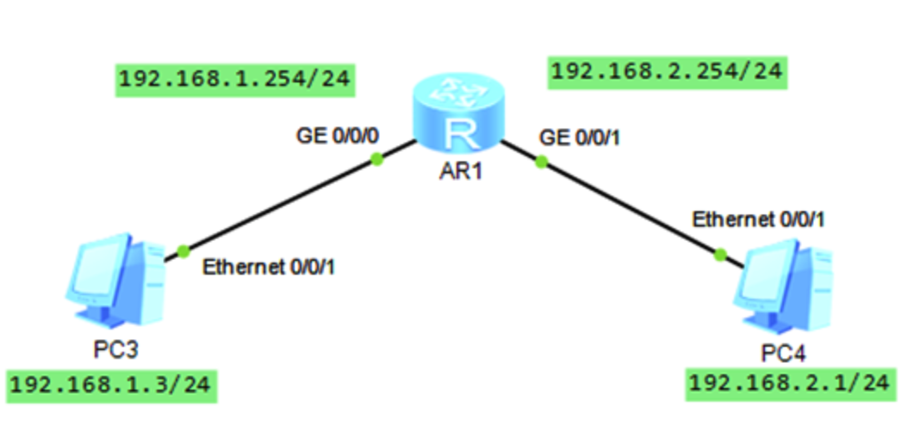

# 6 链路层

在本章中，我们把任何运行链路层（即第2层）协议的设备都称为节点。节点包括主机，路由器，交换机和WiFi接入点。
把沿通信路径连接**相邻节点的通信通道称为链路**


### 6.1.1链路层提供的服务
1. 将每个网络层数据报封装在链路层帧内。

 2. A medium access control (MAC) protocol specifies the rules by which a frame is transmitted onto the link. 

3. Reliable delivery: 链路层可靠的传递服务通常用于容易出错的链接，**例如无线链接**，目的是在发生错误的链接上本地纠正错误，而不是强制端到端。但是，**对于包括光纤，同轴电缆和许多双绞铜线链路在内的低误码链路，链路层可靠的传送可以被认为是不必要的开销**。因此，**许多有线链路层协议无法提供可靠的传送服务**。

4. Error detection and correction. This is done by having the transmitting node include error-detection bits in the frame, and having the receiving node perform an error check. Recall from Chapters 3 and 4 that the Internet’s transport layer and network layer also provide a limited form of error detection—the Internet checksum. Error detection in the link layer is usually more sophisticated and is implemented in hardware.


### 6.1.2 Where Is the Link Layer Implemented?

The link layer is implemented in a network adapter, also sometimes known as a **network interface card (NIC)**. 
At the heart of the network adapter is the link-layer controller, usually a single, special-purpose **chip** that implements many of the link-layer services

## 6.3 Multiple Access Links and Protocols

网络链接有两种类型：点对点链接和广播链接broadcast link。

点对点链路由链路一端的单个发送者和链路另一端的单个接收者组成。
已经为点对点链接设计了许多链接层协议，譬如说point-to-point protocol (PPP) and high-level data link control (HDLC)

broadcast link：可以具有多个发送和接收节点， all connected to the same, single, shared broadcast channel。 此处使用术语“广播”是因为当任何一个节点发送帧时，频道将广播该帧，而其他节点中的每个节点都会收到一个副本。


**以太网和无线LAN是广播链路层技术的示例。**


从某种意义上说，碰撞帧的信号变得密不可分。因此，冲突中涉及的所有帧都丢失了，并且在冲突间隔期间浪费了广播信道。So **coordination job is the responsibility of the multiple access protocol.**

在多种链路层技术中已经实现了数十种多重访问协议，我们可以把它们大致分成三类：
channel partitioning protocols, random access protocols, and taking-turns protocols. 

### 信道划分协议channel partitioning protocols
理想情况下，速率为R比特/秒的广播信道的Multiple Access Links协议应具有以下理想特性：
1. 当只有一个节点有要发送的数据时，该节点的吞吐量为R bps。
2. M个节点有要发送的数据时，每个节点的吞吐量为R / M bps。(平均传输速率)

时分多路复用（TDM）。将时间划分为N个时间帧：
1. 消除碰撞，非常公平。
2. 结点被限制于R/N的平均速率。
3. 结点必须等待，及时只有一个结点需要发送帧。


频分多路复用（FDM）。将信道划分为N个不同频段，每个频段R/N带宽。
1. 类似FDM。FDM divides the R bps channel into different frequencies 


码分多址（Code Division Multiple Access, CDMA），为每个结点分配不同的编码。
使得不同结点能够同时传输，而不相互干扰。与无线信道紧密相关。

假设ABC共享一个信道 ， 0101是它们各自的编码
A    ( 0 1 0 1 )
B    ( 0 0 1 1 )
C    ( 0 0 0 0 )

3个码片必须正交，即相乘为零。并且为了方便，接惯例将码片中的0写为-1，将1写为+1
A    (-1 +1 -1 +1)
B    (-1 -1 +1 +1)
C    (-1 -1 -1 -1)

送比特 1 时，就发送原序列（以A为例，发送(-1 +1 -1 +1)）
发送比特 0 时，就发送序列相反的序列（以A为例，发送(+1 -1 +1 -1)）
什么都不发送时，就为0。

A发送的信号为比特0，B发送比特1，C发送比特0：
A    (-1) * (-1 +1 -1 +1)    (1 -1 +1 -1)
B    ( 1) * (-1 -1 +1 +1)    (-1 -1 +1 +1)
C    (-1) * (-1 -1 -1 -1)     (1 +1 +1 +1)
                                       (1 -1 +3 +1)
```
A =1/4∗(−1+1−1+1)∗(1−1+3+1)=−1
所以A的信号是0
```

### 随机接入协议

特点：
1. 一个传输结点总是以信道的全部速率发送。
2. 当有碰撞时，涉及碰撞的结点反复重发帧。
3. 重发之前等待一个随机时延

CSMA/CD：载波监听多路访问
适配器操作：
1. 从网络层收到数据报，成帧，放入适配器缓存。
2. 适配器侦听信道，若信道空闲（无信号能量从广播信道进入适配器），传输帧；否则，等待直到侦听到信道空闲。
3. **传输过程中监视信道**。如果传输整个帧未碰撞（检测到来自其他适配器的信号能量）,完成传输；否则，中止传输，**等待一个随机时间量，返回2，开始侦听**。

碰撞之后等待的时间量可用二进制指数后退算法，用于以太网和DOCSIS中。
1. 从{0,1…2^n-1}（n为经历的碰撞次数）中随机选择一个整数K，对于以太网，等待K*512比特时间。
2. 碰撞的结点数多，间隔时间多。
3. 一个帧经历的碰撞多，间隔时间的选择范围越大。


如何检测到冲突？如何认为自己的消息没有遇到冲突呢？

检测到冲突其实很简单。消息发送的过程中主机进行监听，**如果发现信道上面的电平值和自己发送端的电平值不相同**，那么它就认为自己发送的时候有别人进行发送，也就是说信道发生了冲突。

## 6.4 Switched Local Area Networks


实际上，具有链接层地址的不是主机和路由器，而是具有链接层地址的适配器（NIC）
尽管MAC地址被设计为永久的，但现在可以通过软件更改适配器的MAC地址

IEEE manages the MAC address space. In particular, when a company wants to manufacture adapters, it purchases a chunk of the address space consisting of 224
addresses for a nominal fee. 


当NIC要将帧发送到某个目标适配器时，发送NIC将目标适配器的MAC地址插入帧中，然后将帧发送到LAN中。a switch occasionally broadcasts an incoming frame onto all of its interfaces. an adapter may receive a frame that isn’t addressed to it. Thus, when an adapter receives a frame, it will check to see whether the destination MAC address in the frame matches its own MAC address. 

有时发送NIC确实希望LAN上的所有其他适配器接收和处理将要发送的帧。在这种情况下，发送适配器将特殊的MAC广播地址插入帧的目标地址字段。对于使用6字节地址的LAN，广播地址是48个连续的1（即FF-FF-FF-FF-FF-FF-FF，以十六进制表示）。

以太网广播地址为48个连续的1。

### ARP
地址解析协议（Address Resolution Protocol, ARP），将IP地址映射到MAC地址。

如何得到目标主机的MAC地址：
An ARP module in the sending host takes any IP address on the same LAN as input, and returns the corresponding MAC address. I

ARP将IP地址解析为MAC地址。**它在许多方面类似于DNS**，后者将主机名解析为IP地址。但是，两个解析器之间的一个重要区别是DNS解析Internet上任何地方的主机的主机名，而ARP只解析同一子网中的主机和路由器接口的IP地址。如果加利福尼亚的某个节点尝试使用ARP来解析密西西比州某个节点的IP地址，则ARP会返回错误。


ARP协议如何工作：
**每个主机和路由器的内存中都有一个ARP表，其中包含IP地址到MAC地址的映射。**
 ARP表还包含一个生存时间（TTL）值，该值指示何时从表中删除每个映射。


ARP数据包具有多个字段，包括sending and receiving IP and MAC addresse。 

如果ARP表当前没有目的地的条目怎么办？
NIC将ARP数据包封装在链路层帧中，使用广播地址作为帧的目标地址，即FF-FF-FF-FF-FF-FF。，然后将帧发送到子网中。

子网上的所有其他适配器（NIC）都接收到包含ARP查询的帧，并且（由于广播地址）每个适配器将帧中的ARP数据包**传递到其ARP模块**。每个ARP模块都会检查其IP地址是否与ARP数据包中的目标IP地址匹配。匹配的那个将具有所需映射的响应ARP数据包发送回查询主机。然后，**查询主机222.222.222.220可以更新其ARP表并发送其IP数据报**，该IP数据报封装在链路层帧中，其目的MAC是响应较早ARP查询的主机或路由器的目的MAC。


ARP可以看作是链路层协议，也可以看作是一种网络层协议

#### Sending a Datagram off the Subnet
主机向子网之外主机发送数据报，目的IP地址为子网之外的主机，目的MAC地址为第一跳路由器接口的MAC地址。路由器接收到数据报后，查询路由器转发表，决定要被转发的端口，之后数据报被封装为新的帧从该端口发出。


需要注意的是：每个主机只有一个IP地址和一个适配器。但是，**路由器的每个接口都有一个IP地址**。
对于每个路由器接口，**还有一个ARP模块（在路由器中）和一个适配器**。由于图6.19中的路由器具有两个接口，因此它具有两个IP地址，两个ARP模块和两个适配器。

拓扑：


在192.168.1.0网段抓包


在192.168.2.0网段抓包


#### ARP补充
大部分的广播包，它们有一个共同特征：二层封装时目的MAC是全f（ffff.ffff.ffff）或三层封装时目的IP是全1（255.255.255.255）。可以这样更方便的记住：目的地址最大的，就是广播。
ARP请求是通过广播方式来实现的，那么，PC2返回ARP回应包，是否也需要通过广播来实现呢？答案是否定的。


知乎：车小胖的回答
计算机之间通信人为设定一个准则，这个准则是什么呢？
如果两台计算机在一个相同网段，不需要辅助设备（网关）的帮助，可以直接通信。
如果两台计算机在不同网段，则一定需要辅助设备（网关）的接力帮助，实现间接通信。

相同网段
计算机A如果想和计算机B通信，用自己的网络掩码的二进制长度，遮掩自己的IP地址，IP地址被遮住的数字即为自己的网段。

网关
网关专门是为不同网段通信设计的硬件设备，它的存在使得不同网段通信成为可能，充当网关的硬件设备，**通常有路由器、三层交换机、防火墙**。


ARP欺骗：
当B返回的ARP响应包告诉A自己的mac后，C又返回一个ARP说自己是B，由于A没有真伪的辩证能力，所以只能后者覆盖前者，所以A错把C当成了A，然后B也啥都不知道，所以A发给B的东西都先发给了C

然后，假如上面的B是网关，那么C就可以控制A访问外面的网页，然后控制A的带宽。但是此时A是什么都不知道的，因为它的ARP缓冲表里默认C就是B，即网关。

