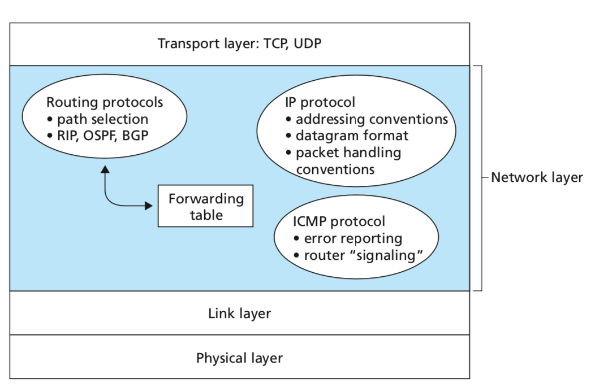

# 网络层

## 4.4、The Internet Protocol (IP)

Internet的网络层包含三个主要组件。
第一部分是IP协议，这是本节的主题。
第二个主要组件是路由组件，它确定数据报从源到目标所遵循的路径。前面我们提到过，路由协议会​​计算用于通过网络转发数据包的转发表。
最后一个组件是网络层错误和信息报告协议，即Internet控制消息协议（ICMP）

### 4.4.2、IPv4 Addressing
subnet 子网

主机通常只有一个进入网络的链接

Each IP address is 32 bits long 4字节, and there are thus a total of 2^32 possible IP addresses. B

全球Internet中每个主机和路由器上的每个接口都必须具有一个全局唯一的IP地址（**NAT后面的接口除外**）

IP addressing assigns an address to this subnet: 223.1.1.0/24, where the /24 notation, sometimes known as a subnet mask 子网掩码。
The remaining 32-x bits of an address can be thought of as distinguishing among the devices within the organization（组织内仍然能够继续划分子网）。

在采用CIDR之前，IP地址的网络部分被限制为8位，16位或24位长，这是一种称为分类寻址的寻址方案，因为子网具有8位，16位和24位子网地址分别称为A，B和C类网络。
C类（/ 24）子网最多只能容纳2^8 – 2 = 254台主机（28 = 256个地址中的两个保留给特殊用途）

**255.255.255.255：当主机发送目标地址为255.255.255.255的数据报时，该消息将传递到同一子网中的所有主机。**

#### Obtaining a Block of Addresses
为了获得在组织的子网中使用的IP地址块，网络管理员可以首先联系其ISP
```
ISP’s block      200.23.16.0/20  11001000 00010111 00010000 00000000

Organization 0   200.23.16.0/23  11001000 00010111 00010000 00000000

Organization 1   200.23.18.0/23  11001000 00010111 00010010 00000000

Organization 2   200.23.20.0/23  11001000 00010111 00010100 00000000
... ...
Organization 7   200.23.30.0/23  11001000 00010111 00011110 00000000
```
