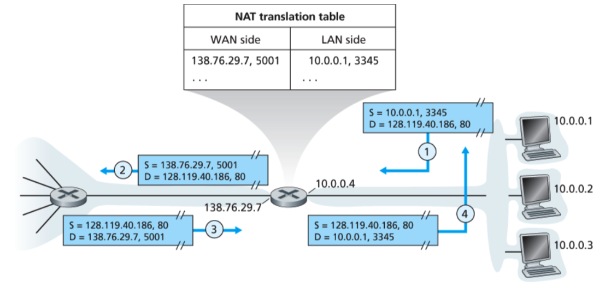

# 网络层

Internet的网络层包含三个主要组件。
第一部分是IP协议.
第二个主要组件是路由组件，它确定数据报从源到目标所遵循的路径。前面我们提到过，路由协议会​​计算用于通过网络转发数据包的转发表。
最后一个组件是网络层错误和信息报告协议，即Internet控制消息协议（ICMP）

### 4.3.2 IP分段

并非所有链路层协议都可以承载相同大小的网络层数据包。一些协议可以承载大数据报，而其他协议只能承载小数据报。 以太网帧最多可以承载1,500字节的数据。

链路层帧可以承载的最大数据量称为最大传输单位（MTU —maximum transmission unit）。

因为每个IP数据报都封装在链路层帧中，**以便从一个路由器传输到下一个路由器**，所以链路层协议的MTU对IP数据报的长度设置了硬限制。对IP数据报的大小进行硬限制不是什么大问题，问题在于，**发送方和目标之间的路由上的每个链路都可以使用不同的链路层协议，并且这些协议中的每个都可以具有不同的MTU**。

因此需要对IP数据报分段.


片段在到达目的地的传输层之前需要重新组装。实际上，TCP和UDP都希望从网络层接收完整的，无碎片的段。 IPv4的设计者认为，在路由器中重组数据报将给协议带来巨大的复杂性，并削弱路由器的性能。 设计者决定由终端系统来重组数据包。

当目标主机从同一源接收到一系列数据报时，**它需要确定这些数据报中是否有一些是某些原始的较大数据报的片段**。如果某些数据报是片段，**则它必须进一步确定何时接收到最后一个片段**，以及如何将其接收到的片段重新拼凑在一起以形成原始数据报。

 the designers of IP (version 4) put **identification, flag, and fragmentation offset fields** in the IP datagram header.

When a **router** needs to **fragment a datagram**, each resulting datagram is stamped with the **source address, destination address, and identification number** of the original datagram. 

When the destination receives a series of datagrams from the same sending host, **it can examine the identification numbers of the datagrams** to determine which of the datagrams are actually fragments of the same larger datagram. 

the last fragment has a flag bit set to 0, whereas all the other fragments have this flag bit set to 1.

Also, in order for the destination host to determine whether a fragment is missing (and also to be able to reassemble the fragments in their proper order), the **offset field is used to specify where the fragment fits within the original IP datagram**.


### 4.3.3 IPv4 Addressing
在讨论IP寻址之前，我们需要说几句有关主机和路由器如何连接到Internet的信息。**主机通常只有一个进入网络的链接；当主机中的IP要发送数据报时，它会通过此链接发送数据报**。
由于路由器的工作是在一个链路上接收数据报，并在其他链路上转发数据报，因此路由器必须具有两个或多个与其连接的链路。

Each IP address is 32 bits long 4字节, and there are thus a total of 2^32 possible IP addresses. B

全球Internet中每个主机和路由器上的每个接口都必须具有一个全局唯一的IP地址（**NAT后面的接口除外**）


左边的三个主机以及它们所连接的路由器接口的IP地址均采用223.1.1.xxx的形式
它们四个还通过**不包含路由器的网络相互互连**。该网络可以通过以太网LAN互连，在这种情况下，接口**可以通过以太网交换机（如第六章所述）或无线接入点（如第七章所述）互连**。

用IP术语来说，将三个主机接口和一个路由器接口互连的网络形成一个子网 subnet

IP addressing assigns an address to this subnet: 223.1.1.0/24, where the /24 notation, sometimes known as a subnet mask 子网掩码。指示32位数量的最左边的24位定义了子网地址。
The remaining 32-x bits of an address can be thought of as distinguishing among the devices within the organization（组织内仍然能够继续划分子网）。

when a router outside the organization forwards a datagram whose destination address is inside the organization, only the leading x bits of the address need be considered.这大大减少了这些路由器中转发表的大小


在采用CIDR之前，IP地址的网络部分被限制为8位，16位或24位长，这是一种称为分类寻址的寻址方案，因为子网具有8位，16位和24位子网地址分别称为A，B和C类网络。
C类（/ 24）子网最多只能容纳2^8 – 2 = 254台主机（28 = 256个地址中的两个保留给特殊用途）

**255.255.255.255：当主机发送目标地址为255.255.255.255的数据报时，该消息将传递到同一子网中的所有主机。**

#### Obtaining a Block of Addresses
为了获得在组织的子网中使用的IP地址块，**网络管理员可以首先联系其ISP**
```
ISP’s block      200.23.16.0/20  11001000 00010111 0001/0000 00000000

Organization 0   200.23.16.0/23  11001000 00010111 0001/0000 00000000

Organization 1   200.23.18.0/23  11001000 00010111 0001/0010 00000000

Organization 2   200.23.20.0/23  11001000 00010111 0001/0100 00000000
... ...
Organization 7   200.23.30.0/23  11001000 00010111 0001/1110 00000000
```

显然，ISP本身也必须有一种获取地址块的方法。是否有全球机构对管理IP地址空间以及向ISP和其他组织分配地址块负有最终责任？确实有:

IP addresses are managed under the authority of the Internet Corporation for Assigned Names and Numbers (ICANN) .
ICANN组织[NTIA 1998]的作用不仅在于分配IP地址，还在于管理DNS根服务器。


#### DHCP
Once an organization has **obtained a block of addresses**, it can assign individual IP addresses to the host and router interfaces in its organization. 

DHCP allows a host to obtain (be allocated) an IP address automatically


网络管理员可以配置DHCP，以便给定的主机每次连接到网络时都收到相同的IP地址，或者可以为主机分配一个临时IP地址，该地址在每次主机连接到网络时都将不同。
除了分配主机IP地址之外，DHCP还允许主机学习其他信息，例如其子网掩码，其第一跳路由器的地址（通常称为默认网关）以及其本地DNS服务器的地址。


在最简单的情况下，每个子网（图4.20的寻址方式）都将有一个DHCP服务器。如果子网中没有服务器，DHCP relay agent (typically a router) that knows the address of a DHCP server for that network is needed **注意：通常是路由器**。


the DHCP protocol is a four-step proces
1. DHCP server discovery.：新到达的主机的首要任务是找到要与之交互的DHCP服务器。 **DHCP discover message, which a client sends within a UDP packet to port 67**.  但是此时还没有连入网络，还不知道IP，但是该数据报应该发送给谁？所以DHCP客户端将创建一个IP数据报，其中包含DHCP server discovery message以及广播目标**IP地址255.255.255.255和“此主机”源IP地址0.0.0.0**。链路层将该帧广播到连接到子网的所有节点

2. DHCP server offer：DHCP服务器使用DHCP offer 消息响应客户端，**该消息将广播到子网中的所有节点，再次使用IP广播地址255.255.255.255**。  为什么还需要广播呢———因为子网上可以存在多个DHCP服务器  。每条offer消息均包含接收到的发现消息的事务ID，为客户端建议的IP地址，网络掩码以及IP地址租用时间（该IP地址将有效的时间）

3. DHCP request：新到达的客户端将从一个或多个offer 中进行选择，并以DHCP请求消息响应其选择的提议，并回显配置参数。**choose from among one or more server offers and respond to its selected offer with a DHCP request message**,

4. DHCP ACK：服务器用DHCP ACK消息响应DHCP请求消息，确认请求的参数。

DHCP的缺点：移动性问题
Since a new IP address is obtained from DHCP each time a node connects to a new subnet, a TCP connection to a remote application **cannot be maintained as a mobile node moves between subnets**.这会在第6章讨论

### 4.3.4 Network Address Translation (NAT)

随着小型办公室，家庭办公室（SOHO）子网的激增，这似乎暗示着，每当这些地方要安装LAN  local area network来连接多台计算机时，ISP就需要分配一定范围的地址以覆盖所有SOHO的IP设备（包括电话，平板电脑，游戏设备，IP电视，打印机等）。



NAT路由器在外部世界上表现为具有单个IP地址的单个设备。在图4.25中，离开家用路由器进入较大Internet的所有流量的源IP地址为138.76.29.7，所有进入家用路由器的流量都必须具有目标地址138.76.29.7。从本质上讲，启用NAT的路由器对外界隐藏了家庭网络的详细信息。 

您可能会想知道家用网络计算机在哪里获得地址，路由器在哪里获得其单个IP地址：
通常，答案是相同的-DHCP！路由器从ISP的DHCP服务器获得地址，**而路由器运行DHCP服务器向家庭网络的地址空间内的计算机提供地址**。the router runs a DHCP server to provide addresses to computers within the NAT-DHCP-router-controlled home network’s address space.

WAN : Wide area network
如果所有从WAN到达NAT路由器的数据报都具有相同的目标IP地址（**NAT路由器的WAN侧接口的目标IP地址**），那么路由器如何知道将给定数据报转发到的内部主机？————**在NAT路由器上使用NAT转换表，并在表项中包括端口号和IP地址**。


安全问题：
攻击者知道您网络的IP地址范围后，便可以轻松地将IP数据报发送到您范围内的地址。防御恶意数据包攻击的两种流行的防御机制是防火墙和入侵检测系统作为。
网络管理员，您可以首先尝试在网络和Internet之间安装防火墙。 （当今，大多数访问路由器都具有防火墙功能。）防火墙检查数据报和段头字段，拒绝可疑数据报进入内部网络。例如，可以将防火墙配置为阻止所有ICMP回显请求数据包。从而防止攻击者在您的IP地址范围内进行传统的端口扫描。

当数据包通过IDS时，IDS尝试将标头字段和有效负载与其签名数据库中的签名进行匹配。如果找到这样的匹配项，则会创建警报。
会在第八章继续讨论


### TODO:ICMP

在IP通信中，经常有数据包到达不了对方的情况。原因是，在通信途中的某处的一个路由器由于不能处理所有的数据包，就将数据包一个一个丢弃了。在错误发生的现场，为了联络而飞过来的信鸽就是ICMP 报文。

RFC792 的开头部分里写着“ICMP 是IP 的不可缺少的部分，所有的IP 软件必须实现ICMP协议。也是，ICMP 是为了分担IP 一部分功能而被制定出来的。

在RFC，将ICMP 大致分成两种功能：**差错通知和信息查询**。

**ICMP 的内容是放在IP 数据包的数据部分里来互相交流的。**

#### ICMP实现之MTU

首先，向通信对方送IP 数据包时，**先设置IP 首部的分片禁止标志然后再送**。这是路径MTU 探索的基本。假如，发送方将大于1000 字节的数据包送了出去，通信路径上有MTU 从1500 字节变成1000 字节的地方。因此，那个路由器将不允许超过1000 字节的数据包通过。**路由器尝试着将IP 数据包分片**。但是因为数据包的分片禁止标志是有效的，所以不能分片。该路由器就将该IP 数据包丢弃，**并用ICMP 通知送信方“想分片，但不能分片”**。路由器将在数据选项部里填入不分片就能通过的MTU 大小。发送方收到该ICMP 报文后就知道了不分片就能够传送的数据大小

#### ICMP实现之ping命令

客户端：ICMP echo message
服务端：ICMP echo reply message

在规定的时候间内，源主机如果没有接到 ICMP 的应答包，则说明目标主机不可达；如果接收到了 ICMP 应答包，则说明目标主机可达。此时，源主机会检查，用当前时刻减去该数据包最初从源主机上发出的时刻，就是 ICMP 数据包的时间延迟。
 
 这只是最简单的，同一个局域网里面的情况。如果跨网段的话，还会涉及网关的转发、路由器的转发等等。但是对于 ICMP 的头来讲，是没什么影响的。会影响的是根据目标 IP 地址，选择路由的下一跳，还有每经过一个路由器到达一个新的局域网，需要换 MAC 头里面的 MAC 地址。

