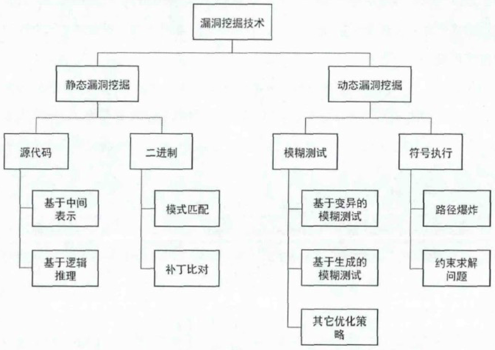
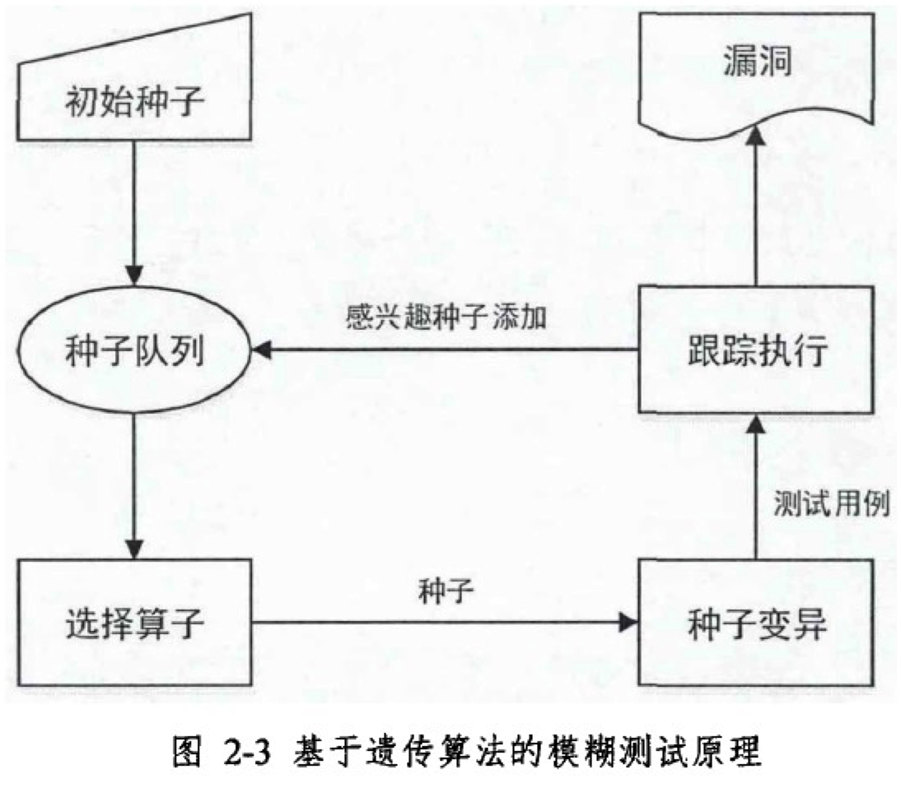
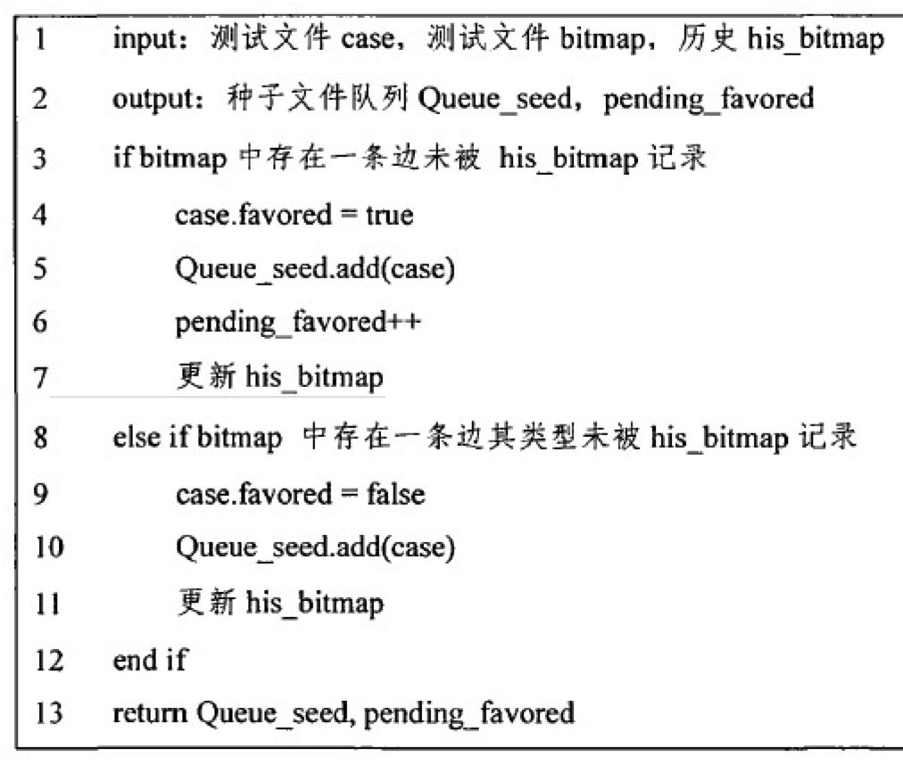
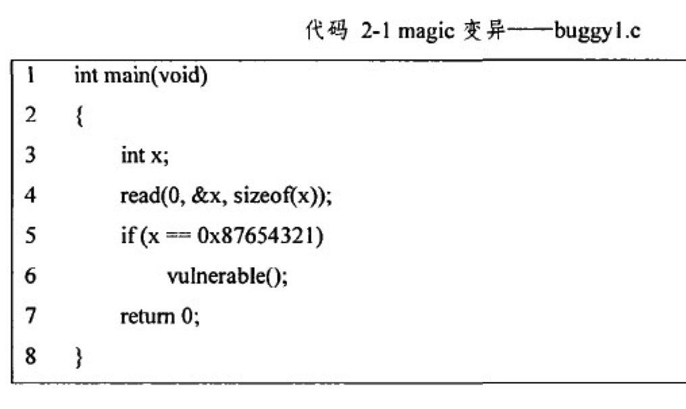
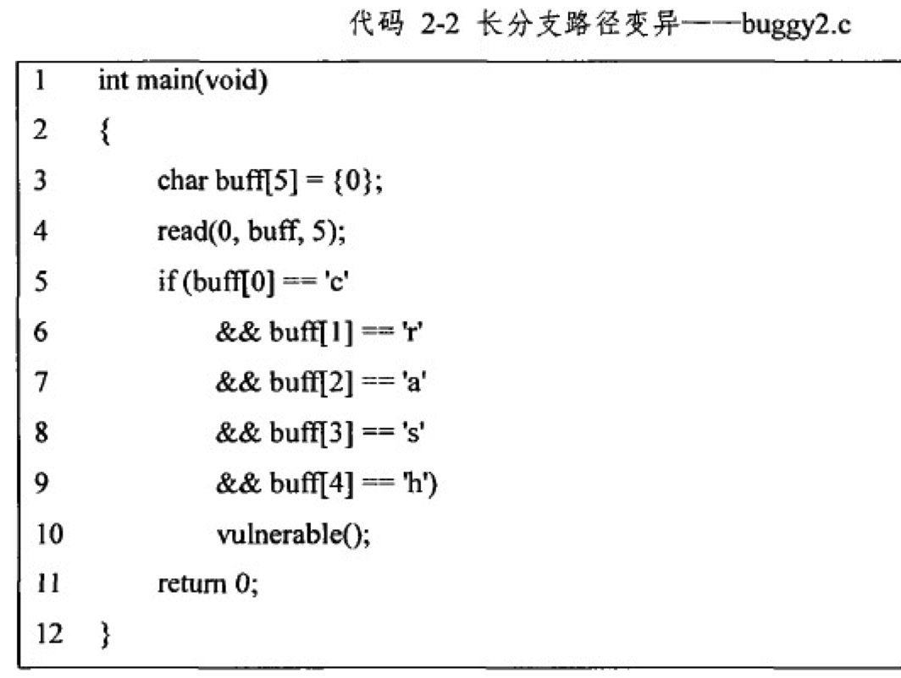

AFL依赖**编译时代码注入**和**运行时代码注入**两种方法来收集程序

源码编译主要经过两个步骤，源代码到**汇编再到二进制代码**，编译时代码注入在**第二个阶段**完成，实现方法是使用一个重新封装的clang编译器来控制编译过程。在汇编阶段，**先找到所有分支**，并在代码分支处插入桩汇编代码，因此编译出来的程序就是被插桩处理后的程序。

**运行时注入使用修改过的ＱＥＭＵ来作为后端运行平台**，解决了无源码FUZZ的问题

软件安全漏洞是指在软件设计或代码实现过程中留下的弱点或缺陷。攻击者通过这些漏洞，能够产生特定的外部输入触发漏洞，从而窃取系统信息或进行恶意破坏。

## 1.2 国内外研究现状

漏洞挖掘技术可分为３中类型：白盒测试、黑盒测试和灰盒测试。白盒测试是一种完全透明的测试方法，测试人员能够获取程序的所有资源，包括软件产品、软件源码、设计文档、接口参数等。

黑盒测试与白盒测试完全相反，测试人员不需要获取程序的详细信息，只需要针对该程序展开通用性的测试，因此黑盒测试存在很大的随机性和盲目性。

灰盒测试介于白盒测试和黑盒测试之间，测试人员往往能通过反汇编获取程序的二进制代码。

### 1.2.2 动态漏洞分析

动态漏洞挖掘分析是指在分析过程中执行目标程序，结合执行过程和结果进行漏洞挖掘的方法。常用的动态漏洞分析技术有模糊测试和符号执行。

模糊测试是一种自动化或半自动化的漏洞挖掘技术。**它通过生成大量随机的测试用例，以触发目标程序包含的潜在错误**。

模糊测试的设计者希望通过计算机高性能的计算能力，产生大量测试用例，并能高效的执行，通过监测执行获得模糊测试的结果。模糊测试常采用黑盒或者灰盒模型，对程序源码的依赖较低。

按照输入样本的构造方式，可以将模糊测试技术分为２种：基于变异的模糊测试和基于生成的模糊测试。

基于变异的模糊测试技术是**在已测试的输入样本上根据特定变异策略进行变异**。

而**基于生成的模糊测试**技术是在已知程序输入样本格式的基础上，进行新输入样本的构造。

１）基于变异的模糊测试
AFL，honggfuzz

这些工具在变异策略上各有特色，下面介绍４种典型的变异策略:

- AFL 等工具采用遗传变异算法生成测试用例。AFL通过一个反馈回路，在**生成新的测试用例时**考虑种子文件的执行情况，使得变异能尽可能在**能产生新路径访问的**测试用例上产生，提高变异后程序发现新路径、新覆盖率的可能性。

#### 1.2.2.2 符号执行

由于符号执行每次都针对一条新的路径进行求解，所以符号执行不会面临模糊测试中随时间增长覆盖率增长缓慢的情况

# 第２章 相关技术研究

控制流图可以用有向图Ｇ＝（Ｖ，Ｅ）表示。Ｖ代表图中节点的集合，每个节点代表程序中的一个基本块（**即中间无跳转的一段代码**），本文主要针对二进制程序的模糊测试，所以基本块的基本组成单位是汇编指令；

Ｅ是图中边的集合，每条边表示基本块的跳转方向。

TODO：

### 2.2.1模糊测试概述
模糊测试的原理是生成大量的随机测试用例，监控目标程序执行这些测试用例的过程中是否发生异常来判断是否有漏洞。

通常情况下，**模糊测试系统所生成的测试用例对于目标程序的覆盖率越高，发现漏洞的概率越大**，因此模糊测试的关键点之一就是生成高代码覆盖率的测试用例。

如果已知数据格式规范，则采用基于生成的模糊测试可以获得更多满足格式要求的测试用例，更容易达到高的代码覆盖率。

### 2.2.2 跟踪执行
目标程序的跟踪执行主要有２个方面的工作：

一是监控当前测试用例是否会导致目标程序崩溃；二是记录测试用例执行时的路径，用于评估当前测试用例的执行情况，可用于后续分析。

监控目标程序是否崩溃的方法比较简单。程序会通过一个错误信号反馈程序运行过程中发生的崩溃行为，错误信号包括SIGSEGV，SIGILL等。

所以只需要通过接收目标程序运行时产生的信号，就可以判断出程序运行过程中有没有发生崩溃。

一个程序可以被划分为多个基本块，**程序的执行过程就可以看作是不断的执行一个基本块然后跳转到下一个基本块执行的过程**。

在基本块执行过程中，通过记录当前正在执行的基本块地址可以获得程序的执行路径。由于每个基本块的入口和出口都只有一个，并且基本块的执行过程只能从入口处开始，从出口处结束，因此基本块可以使用基本块的入口地址表示。

### 2.2.3 种子文件处理

AFL维护了一个种子文件队列，用于保存感兴趣的种子文件。种子文件队列，AFL还维护了一个历史his_bitmap用于保存历史测试用例能访问到的所有边。

在一次测试用例跟踪执行后，会将当前测试用例生成的bitmap和历史his_bitmap进行比较。**如果有发现新的边**或者有新的执行次数类型，则将该测试用例添加到种子文件队列中。

### 2.2.5 基于变异的模糊测试系统的局限

当输入为0x87654321时会触发崩溃。但是通过模糊测试变异出0x87654321的概率为1/2^32,所以在合理时间范围内不可能通过模糊测试变异出该值

假设在AFL进行变异时，已经变异出５条路径（即存在５个种子文件），其中最深的路径已经变异出“ｃｒａｓｊ”

而在变异“ｃｒａｓｊ”对应的种子文件时，仍会从第一个字节开始变异，可能会变异出类似“ｆｒａｓｊ”、“ｃｘａｓｊ”等字符串

### 3.2.1 控制流图生成与导入

具体的，本文在控制流图导入时，采用了系统调用屏蔽、基本块合并、有向图哈希化等３个优化方法

１）系统调用屏蔽
在大多数模糊测试系统中，为了提高分析的效率，**一般假设系统调用和标准库中不存在漏洞**，将分析着重于用户代码，所以这些模糊测试系统**不跟踪系统调用和一些标准库产生的路径**。

为此，本文在导入控制流图时，对系统调用等进行了屏蔽.

3）有向图哈希化

**控制流图提供了基本块之间的父子关系**，可以方便的建立控制流图的有向图模型，并通过图理论中的操作方式，可以访问到任意基本块。

然而，通过图理论的操作方式，访问效率很低，在模糊测试过程中，需要频繁的访问图中的基本块，需要一个更加高效的组织结构。本文通过在有向图的基础上，新增一个哈希表的方式，可以通过基本块的入口地址，以时间复杂度０（１）的方式访问基本块。

### 3.2.2 候选节点
结合控制流图的模糊测试的主要思想是使用控制流图引导模糊测试往未探索的程序空间进行。

为了量化未探索的程序空间，本文提出了候选节点概念。

本文中的定义：将控制流图中已经被访问到，但是至少存在一个子节点未被访问的节点定义为候选节点

AFL模糊测试系统中提供了２种方法来记录程序的执行路径。一种方法是**编译时插桩**，通过特定的编译器（例如ＡＦＬ提供了a f l-gcc、afl-g++、afl-clang等编译器），对源码进行重新编译，并在合适的位置插入桩代码来实现二进制程序的执行路径. **但是该方法需要提供程序的源码**，在现实情况下，往往无法获取一个二进制文件的源码

AFL通过一个**模拟器（quick emulator，QEMU）**实现二进制程序的执行与跟踪。

通过QEMU用户模式执行一个二进制程序时，**目标程序会被QEMU划分成多个基本块进行执行**，它的划分方式与控制流图中基本块划分的方式一致。因此，在执行基本块之前，**通过插桩方式**添加并执行一段**能够输出将要执行的基本块信息的代码**。就可以得到基本块的执行序列，**恢复出测试用例的执行路径**。

在程序控制流图中，基本块ｂ是控制流图中的一个节点，使用基本块的入口地址代表ｂ，则程序的执行路径可以表示为基本块的序列

则可以定义程序执行过程中两个基本块之间的跳转关系为ｅ＝（b k，bk＋１），ｅ代表了程序控制流图中的有向边。

将程序的执行路径使用边ｅ表示，则可以表示为：E =(e1,e2,e3,e4 ……)

考虑到E中很多边ｅ存在重复执行的情况，即重复执行节点bj到bk的跳转，可以通过边的出现次数来合并这些边的集合，减小插桩信息的输出量。

为了方便编程和减少插桩信息的输出量，ＡＦＬ提供了一个64KB大小的bitmap来记录边的集合，每条边使用一个字节记录其访问的次数.

**测试时，每一个测试用例都会生成一个bitmap**

