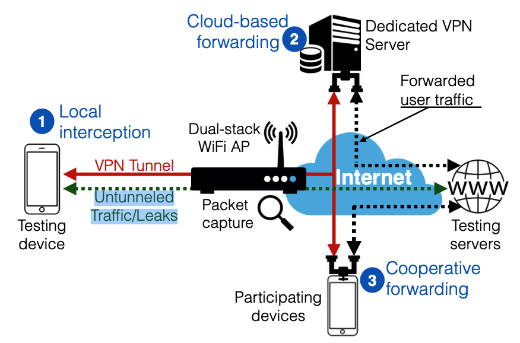

自2011年10月发布Android 4.0版以来，移动应用程序开发人员可以使用本机支持通过Android VPN Service类创建VPN客户端。Android app developers only have to request the BIND_VPN_SERVICE permission (the “VPN permission”) to create such clients.

Android的官方文档强调了VPN permission引发的严重安全问题：它允许应用拦截并完全控制用户的流量。恶意的应用程序开发人员可能会滥用它来获取用户的个人信息。


在本文中，我们对从140万个Google Play应用程序中提取的283个Android VPN应用程序进行了深入分析。为了阐明和表征VPN应用程序的行为及其对用户隐私和安全性的影响，我们开发了一套测试框架：


## 2.ANDROID’S VPN PERMISSION

The BIND_VPN_SERVICE permission allows the requesting app to intercept, manipulate and **forward all user’s traffic to a remote proxy or VPN server** of their choice or to implement proxies in localhost


Android’s VPN API exposes a virtual network interface to the requesting app. 

Android limits the creation and ownership of the virtual interface to only one app at a given time.


由于允许第三方应用程序拦截所有用户流量的特殊安全和隐私风险，每当应用程序使用VPN权限创建虚拟接口时，Android都会生成两条警告以通知用户：

-  一个系统对话框，要求用户批准创建虚拟界面，
- a system-generated notification


#### 2.2 Custom VPN permissions:

Android’s native VPN support has enabled 专有VPN解决方案 for 企业客户端

企业解决方案（也称为移动设备管理解决方案或MDM）在Android的VPN许可之上实现自己的隧道协议，以保护和简化对企业或专用网络的远程访问。

Android’s permission model allows MDM providers to share their VPN technologies with other apps by defining custom permissions. 


适用于官方VPN permissions的 security guarantees也适用于自定义VPN权限，因为MDM解决方案负责请求Android的BIND_VPN_SERVICE权限。


## 3. DISCOVERING VPN APPS ON GOOGLE PLAY

### 3.1 Detection Method

为了正确地大规模识别启用VPN的应用程序（either those using Android’s official permission or any of the custom VPN permissions ），我们必须抓取Google Play来下载每个应用程序的可执行文件，然后将其反编译为详细检查其AndroidManifest文件。


For free apps, we use Google Play Unofficial Python API

whereas for paid apps, we use Raccoon APK Downloader to obtain the binaries after paying their required fee.

Finally, after having downloaded each app’s executable, we use ApkTool2 to decompile, extract and analyze each app’s source code and their AndroidManifest file.

### 3.3 VPN App Classification

67％的Android VPN应用程序声称提供了传统的VPN服务，包括增强的安全性和隐私，反监视或访问经过地理过滤或审查的内容的隧道。

第二个最常见的类别是企业MDM解决方案（占应用程序的10％）

其次是流量优化工具（占应用程序的4％）和通信工具（占应用程序的3％），creating mesh networks and VLANs（通常用于在线游戏）。

防病毒软件应用程序（Qihoo 360）也可以利用VPN权限来执行流量分析，以阻止恶意流量，，并在用户通过不安全或可查询的WiFi网络连接时通过可信服务器安全地转发用户流量。

Other uses of the VPN permis- sion are traffic filters and traffic loggers


## 4 静态分析

本节 analyze the source code for each VPN Android app using static analysis. 


Many other permissions may appear unusual requirements for VPN apps. However, VPN apps may provide additional and richer features to their users beyond a typical VPN tunnel.

we manually checked the legitimacy合法性 of these requests by inspecting the API calls executed by the apps and checking the description for related functionalities.


###  4.2 Tracking Libraries in VPN Apps

在ApkTool的帮助下，我们在每个启用VPN的应用程序的源代码中检查了嵌入式第三方库（以外部jar文件的形式）的存在,which for tracking or advertising purposes，以进行分析。

我们使用了由Seneviratne 等人写的list of 127 tracking and advertising libraries 

### 4.3 Malware Analysis

VirusTotal是一种在线解决方案，可汇总由100多个防病毒工具，扫描引擎和数据集提供的扫描功能。它已在学术文献中普遍用于检测恶意应用程序，可执行文件，软件和域

在完成对给定应用程序的扫描过程之后，VirusTotal生成报告，该报告指示哪个防病毒扫描工具检测到该应用程序中的任何恶意软件活动以及相应的恶意软件签名。


## 5. NETWORK MEASUREMENTS

In this section, we investigate the runtime and network behavior of 150 VPN apps. In particular we are interested in understanding how VPN apps handle user’s traffic.


我们structure our analysis来阐明以下几个方面：（i）每个应用程序实现的流量拦截机制（即，该应用程序是否使用VPN permission 来实现localhost代理或 forward the traffic through a terminating end-point）； （ii）每个应用程序实施的隧道协议以及开发人员引起的错误配置，这些配置可能导致流量泄漏； （iii）是否存在代理和流量操纵技术，例如广告拦截，JavaScript注入和流量重定向； （iv）识别TLS拦截的任何可能。



图5: VPN应用程序的3种可能的拦截和转发模式：

- (1) local interception as a transparent proxy,
- (2) cloud-based forwarding through a VPN server,
- (3) traffic forwarding through a participating node (peer forwarding) or other participating nodes. 


testbed, composed of a smartphone that connects to the Internet via a computer configured as a WiFi access point (AP) 

 WiFi AP运行tcpdump来拦截在移动设备和Internet之间传输的所有流量。这使我们能够观察in-path observer看到的每个VPN应用程序生成的流量。


### 5.1 Interception and Forwarding Mecha- nisms

App developers can leverage the VPN permission to implement localhost proxies or to forward user’s traffic to an external machine. 


我们的检测方法依赖于client opening TCP connections to a remote dual-stack server under our control after enabling the traffic interception mode for each app. 

```
dual stack双协议栈
双协议栈技术就是指在一台设备上同时启用IPv4协议栈和IPv6协议栈。这样的话，这台设备既能和IPv4网络通信，又能和IPv6网络通信。如果这台设备是一个路由器，那么这台路由器的不同接口上，分别配置了IPv4地址和IPv6地址，并很可能分别连接了IPv4网络和IPv6网络。如果这台设备是一个计算机，那么它将同时拥有IPv4地址和IPv6地址，并具备同时处理这两个协议地址的功能
```


- Local-Interception. Only 4% of the analyzed VPN apps use the VPN permission to intercept user’s traffic in localhost or to implement transparent localhost proxies。Given that the traffic is intercepted locally and **not forwarded through a VPN tunnel**, our WiFi AP can identify side-connections generated by such apps.  To determine whether they are used to forward a copy of user’s traffic,，我们将外部流量大小与本地Web服务器的流量大小（9KB）相关联。不幸的是，由于这些流已加密，因此我们无法调查其有效载荷以识别它们是否合法。对于其余实施本地拦截的应用程序，我们仅观察与其嵌入式第三方库相关联的流量，以进行分析和广告服务。


Unfortunately, we cannot entirely confirm the origin of these flows to assess whether they are endogenous to the app or not and our VPN session may have not lasted long to capture from other participating users


### 5.2 VPN Protocols and Traffic Leaks泄漏

理想情况下，通过VPN隧道转发的流量对于路径内观察者（例如，互联网服务提供商，商业WiFi AP和监视机构）必须是不透明的。但是，应用程序开发人员可以使用多种隧道协议（每种协议具有不同的安全性保证）将流量转发出设备.

除了不安全的隧道协议外，开发人员引起的错误配置和错误也可能破坏用户的隐私和安全性

我们运行了一个脚本，该脚本执行精心设计的HTTP请求（通过IPv4和IPv6）as well as DNS lookups to our dual-stack server under our control. 

在本节中，我们将分析In-path WiFi AP捕获的pcap，以调查是否存在未经加密的隧道  (*i.e.,* we consider a tunnel implementation as unen- crypted if the payload of our custom HTTP requests is seen in the clear by our WiFi AP) 


我们观察到84％的分析VPN应用程序未通过VPN隧道路由IPv6流量。此外，有66％的VPN应用程序不通过VPN隧道转发DNS流量。有55％的免费应用程序（和60％的高级应用程序）将用户的DNS查询重定向到Google DNS，而7％的免费和10％的高级VPN应用程序将DNS流量转发给自己的DNS解析器。


### 5.3 Traffic Manipulation

In-path proxies allow VPN services to gain control over users traffic and to manipulate traffic on the fly.

Moreover, many proxy features can provide an economic benefit for ISPs and network providers as in the case of HTTP header injection or traffic redirection for advertising purposes.


我们利用适用于Android的全面的网络故障排除工具Netalyzr来identify in-path flow- terminating proxies at the TCP level and, in the case of HTTP proxies, how they interfere with user’s traffic。

简而言之，Netalyzr同时控制客户端和服务器端，and crafts packets and HTTP requests in a way that would allow identifying non-transparent proxies along the path


Netalyzr测试表明，默认情况下，免费和高级VPN应用的47％和55％主动修改HTTP流量。


5.4 TLS Interception

VPN apps are in a privileged position to perform TLS interception. 他们可以使用Android的KeyChain API 注入自己的自签名证书，从而破坏设备的本地根证书存储。


Once a cer- tificate is installed on the device, the app can intercept the TLS session establishment and generate “legit” certificates — verifiable by the self-signed root certificate injected on the trusted certificate root store — on the fly.

为了限制潜在的新滥用，Android要求用户同意安装根证书，并显示一条附加的系统通知，通知用户第三方可以监视其安全流量。

We instrumented our Android device with OpenSSL so that we can capture a copy of the SSL/TLS server certificate when accessing more than 60 popular services operating over SSL including HTTPS, SMTP over TLS, and POP3 over TLS. The services reached in our test include diverse and popular services like Google, Gmail, Facebook, Twit- ter, Skype, banking services, CDNs, analytics services and e-commerce sites, many of which are associated with mobile apps implementing security countermeasures such as certifi- cate pinning [76, 45].


IPSec 


