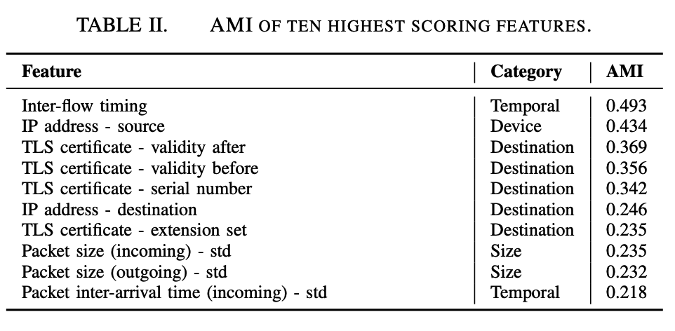
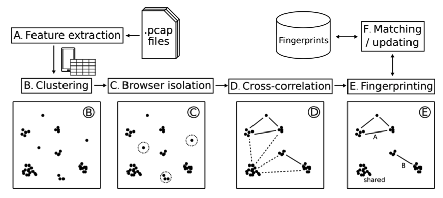
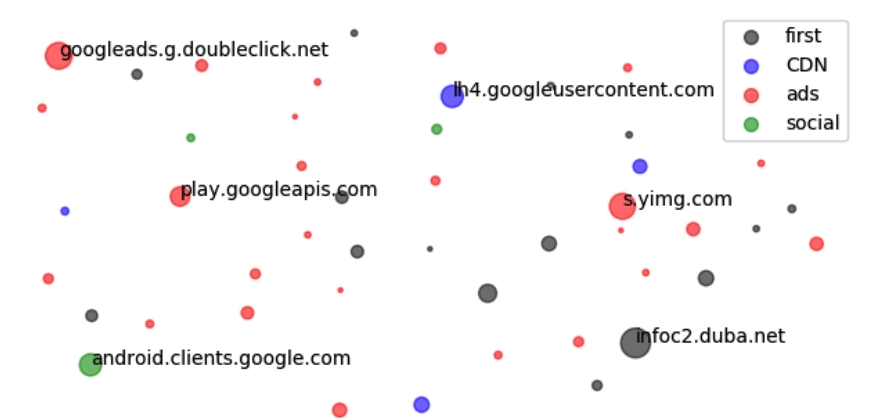
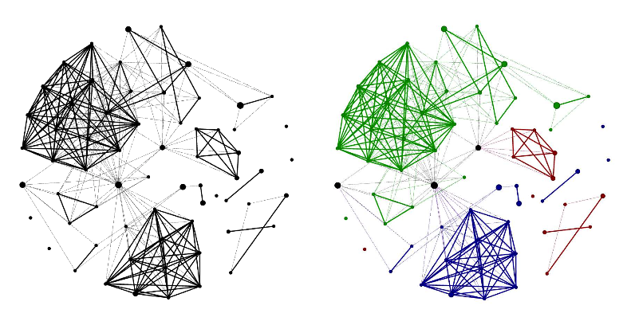

## 摘要

Mobile-application fingerprinting of network traffic is valuable for many security solutions as it provides insights into the apps active on a network. 

most mobile traffic is encrypted

As a solution, we propose FLOWPRINT, a semi-supervised半监督 approach for fingerprinting mobile apps from (encrypted) net- work traffic.

我们会自动在 destination-related features of network traffic之间找到时间相关性，并使用这些相关性来生成应用指纹。

## 1 introduction

90% of apps targeting Android 9 or higher, adopt Transport Layer Security (TLS)

基于网络的应用程序检测的思想已经在业界和学术界得到了广泛的探索。

All these approaches have in common that they require prior knowledge of apps before being able to distinguish them.

Unlike existing solutions, we assume *no prior knowledge* about the apps running in the network. We aim at generating fingerprints that act as markers, and that can be used to both recognize known apps and automatically detect and isolate previously unseen apps. 

挑战：

同质。移动网络流量是同质的，因为许多应用程序share common libraries for authentication, advertisements or analytics 。此外，部分内容通常通过内容交付网络（CDN）提供服务或由云提供商托管。因此，不同的应用程序共享许多网络流量特征

动态。移动网络流量通常是动态的，因为应用程序生成的数据可能取决于用户的行为

Evolving

研究表明，应用会定期定期更新为新版本， When new or updated apps are introduced into the network, these fingerprinting systems become less accurate。Our solution counters this by basing its fingerprints on pattern discovery in network traffic instead of training on labeled data. 

Our key observation is that mobile apps are composed of different modules that often communicate with a static set of destinations. We leverage this property to discover patterns in the network traffic corresponding to these different modules.

## 二 初步分析

To study mobile network traffic and identify strong indicators that can be used to recognize mobile apps, we performed a preliminary analysis 初步分析 on a small dataset.

As indicated in the introduction, our fingerprinting method should be able to distinguish mobile apps despite their homogeneous, dynamic and evolving behavior. **Hence, in our preliminary analysis we explored features that may be used to fingerprint apps**

A 数据集：

The ReCon AppVersions dataset consists of labeled network traces of 512 Android apps from the Google Play Store，包括为期8年的多个版本

Cross Platform. The Cross Platform dataset [51] consists of user-generated data for 215 Android and 196 iOS apps. 

Each app was executed between three and ten minutes while receiving real user inputs.

Andrubis: The Andrubis dataset contains labeled data of 1.03 million Android apps from the Google Play Store and 15 alternative market places. **Each trace in this dataset was generated by running the app for four minutes in a sandbox environment emulating an Android device.**

 The app was exercised by automatically invoking app activities and registered broadcast receivers, and simulating user interactions through the Android Application Exerciser Monkey.

 We use the Andrubis dataset for experiments requiring large traffic volume and to assess the performance of our method on both benign and potentially harmful apps.

Browser. Even though a browser is not a dedicated app, but rather a platform on which various web content is rendered, executed and displayed, a fingerprinting method with the purpose of detecting apps should also be able to detect the browser as a single app.

为此，我们通过在运行Android 6.0.1，带有Chrome，Firefox，Samsung Internet和UC Browser的Samsung Galaxy Note 4上抓取了前1,000个Alexa网站，从而收集了其他浏览器流量数据集，这些数据涵盖了90.9％的浏览器流量. Each website visit lasts for 15 seconds, while the Application Exerciser Monkey simulates a series of random movements and touches.

B. Feature Exploration

The TLS-encrypted traffic limits the available features to temporal时间的 and size-based features, as well as the **header values** of unencrypted layers and the **handshake** performed to establish a TLS connection. 

The data-link layer header provides only information about the linked devices, not about the app itself and is therefore not useful for our purposes. 

We further analyze the layers between the data-link and application layer, as we expect the latter to be encrypted. **From these layers, we extract all header values** controlled by the communicating app as well as the sizes and inter-arrival times of packets. 

另外，对于与大小和时间相关的特征，我们计算statistical properties：最小值，最大值，平均值，标准偏差，平均绝对偏差以及第10至第90个百分位数。

C. Feature Ranking

We score all features according to the Adjusted Mutual Information (AMI) [66], a metric for scoring features in unsu- pervised learning. 

D. Feature Evaluation

Using the AMI, we analyze and rank the features available in TLS-encrypted traffic of the ReCon dataset. The evaluation of our fingerprinting approach in Section V demonstrates that these features also generalize to other datasets. 

提取所有特征后，我们将它们分为categorical values和continuous values。As the AMI can be compared only for categorical values，因此我们将每个continuous value 划分为20个大小相等的大小范围，跨每个功能的整个范围。然后，我们针对应用标签计算了每个功能的AMI。表II显示了排名最高的十个功能，我们在https://github.com/Thijsvanede/FlowPrint提供了所有分析的功能及其AMI得分。

Temporal features时间特征: The Inter-flow timing and Packet inter-arrival time (incoming)  stress the importance of timing in network traffic. 。大多数应用程序主要在活动时进行通信，并且早期研究表明，数量有限的应用程序同时simultaneously活动.

As temporal features may be affected by latency and network congestion on a small-time scale, 因此我们的工作会在更多过程层次上使用时间。 We leverage the time between flows to correlate traffic occurring at the same time interval. In addition to our semi-supervised setting, supervised fingerprinting methods such as BIND [4] also use temporal features.

Device features. The IP address - source feature is the **IP address of the monitored device**. 

This feature demonstrates that the device producing network traffic reveals information about the app. 

直观上，不同的设备可能会运行不同的应用程序套件。Our work does not use the IP source address as a feature, but instead create app fingerprints separately per device

We reason that identifying apps on a per-device basis assists in limiting the amount of dynamic behavior.（我们认为，按设备识别应用程序有助于限制动态行为的数量）

此外，相关研究观察到，不同厂商和/或OS版本的设备可能会在流量功能方面表现出显着差异。因此，我们的方法以每个设备为基础处理流量，并为每个设备构造单独的指纹。

Destination features. The high AMI of the IP address - destination, i.e., 

The IP address of the server, and various TLS certificate features indicate that可以根据与应用程序进行通信的目的地来区分应用程序。

直观地讲，每个应用程序都由一组独特的不同模块组成，这些模块都提供了应用程序功能的一部分。每个模块与一组服务器进行通信，从而形成一组独特的网络目的地，从而使应用程序与众不同。

Size features. Both incoming and outgoing *Packet size* features show a high AMI.这意味着每个流发送和接收的数据量很好地指示了哪个应用程序处于活动状态。但是，所有其他数据包大小功能产生的AMI得分为0.07或更低，即占排名后50％的功能的三分之二。因此，我们没有在我们的方法中考虑数据包大小。

## 3. THREAT MODEL

Our work focuses on creating fingerprints for mobile apps and we assume the perspective of a security **monitor** who can 

(1) trace back flows to the device despite NAT or changing IP addresses, 

(2) distinguish mobile from non-mobile devices, 

 (3) only monitor its own network (e.g., the WiFi network of an enterprise)—traffic sent over other networks cannot be used to generate fingerprints. Our assumptions match the scenario of enterprise networks, where security operators have full network visibility and access to the DHCP server.

我们的设想与企业网络的情况相符，在该网络中，安全操作员具有完全的网络可见性并可以访问DHCP服务器。

Even without a priori knowledge about device types, security operators could still isolate network traffic from mobile devices based on MAC addresses and orthogonal OS fingerprinting approaches: 

for example, related work has shown that DHCP messages [46], TCP/IP headers [18], and OS-specific destinations [36] (e.g., update servers and mobile app markets), **can be used to identify mobile devices**, and even tethering

最后，我们专注于单个应用程序指纹，即我们假设mobile apps are executed one at the time.

## 4. APPROACH

We aim to fingerprint mobile apps in a semi-supervised and real-time fashion on the base of their (encrypted) network traffic.

We build our approach on the observation that mobile apps are composed of different modules that each communicate with a relatively invariable set of network destinations. 

Our focus lies on discovering these distinctive communication patterns without requiring any knowledge of the specific active apps. 为了这个目的, we create fingerprints based on **temporal correlation**s among network flows between monitored devices and the **destinations they interact with**.

As a result, our fingerprints are capable of dealing with evolving app suites

We periodically take network traffic of mobile devices as input and generate fingerprints that map to apps. To do so, we isolate TCP/UDP flows from the network traces for each device, and extract the required features. 

随后， for each individual device we cluster all flows according to their destination. This clustering allows the discovery of common communi- cation patterns later on. 

在生成应用程序指纹之前，我们的方法首先要特别注意浏览器，因为它们的行为就像访问Web内容的平台，而不是专用的应用程序。

之后，我们根据时间上接近的网络活动将剩余的群集关联起来，以生成应用指纹。当聚类显示出很强的相关性时，我们将它们的流归为一组。最后，我们将生成的指纹与已知指纹的数据库进行匹配，以识别应用程序。

A. Feature Extraction

we separately look at the TCP and UDP flows of each mobile device. 

Per device, we extract the destination IP and port number, timestamp (used to compute the timing between flows), size and direction of all packets in the flow and, if applicable, the TLS certificate for that flow.

**From these features, we use the destination IP and port number as well as the TLS certificate in the clustering phase**. 

Browser isolation additionally requires information about the amount of data that is sent over the network. Finally, the correlation关联 step uses the timestamps of packets to determine to what extent different flows are temporally correlated.

B. Clustering

由于我们的方法会定期处理每个设备的输入数据，因此我们首先将输入数据分成给定时间间隔的batches批次

在提取每个批处理的特征后，we cluster together TCP/UDP flows based on their network destination. 

如果流满足以下条件中的任何一个，我们认为它们将前往相同的网络目的地:

(1)流包含相同的(目的IP地址，目的端口)元组。

(2)流包含相同的TLS证书。

web服务可以使用多个IP地址来实现负载平衡和减少服务器响应时间。我们的方法通过基于（IP，端口）元组或TLS证书的相似性对目标进行聚类来解决此问题。

As discussed previously, one may even enrich the clustering features by including DNS traffic of flows as well if this information is available. Our evaluation in Section V shows that this method is robust against inconsistencies in network destinations.

图2显示了生成的群集的示例，其中目标群集是随机分散的。每个群集的大小与分配给它的流量成正比。请注意，某些群集是由多个应用程序生成的，我们称为shared clusters。进一步检查发现，这些共享群集对应于第三方服务，例如崩溃分析，移动广告（ad）网络，社交网络和CDN。

These services are often embedded through libraries that are used by many apps: e.g., googleads.g.doubleclick.net, lh4.googleusercontent.com and android.clients.- google.com are shared clusters that provide these services.

除了共享群集之外，应用程序还经常产生特定于该特定应用程序的群集，例如s.yimg.com和infoc2.duba.net群集仅出现在com.rhmsoft.fm应用程序的流量中。

略：

D. Cluster Correlation

Now that browsers are isolated, we leverage the remaining clusters for app fingerprinting.

However, using only destination clusters is insufficient for fingerprinting apps **as network destinations are shared among apps** and may change between different executions of an app.

A small-scale experiment on our datasets shows that an increasing number of apps leads to a rapid decline in **app-specific clusters**. When randomly selecting 100 apps from all our dataset over ten Monte Carlo cross validations, only 58% of apps show at least one app-specific destination cluster. In the same experiment, when selecting 1,000 apps, this number drops to 38%.

 Therefore, to fingerprint apps we also leverage the **temporal correlations** between active destination clusters. 

我们假设在每个时间点的活动目标群集的组合对于每个应用程序都是唯一且相对稳定的。这意味着随着时间的流逝，人们应该能够观察到属于同一应用程序的目的地的更强相关性。

#### Correlation graph

To measure the temporal correlation时间相关 between clusters, we compute the cross-correlation [49] between the activity of all cluster pairs as defined in Equation 3.

We consider a cluster **ci** active at time slice **t** if it sends or receives at least one message to or from the destination cluster during that window. 

Its activity is modeled as ci[t] = 1 if it is active or ci[t] = 0 if it is inactive.

Using the cross-correlation metric between each cluster, 我们构造了一个相关图，该图中的每个节点都代表一个群集。群集通过加权边缘连接，其中每个边缘的权重定义了两个群集之间的互相关。

图3显示了三个选定的应用程序的关联图。我们看到，属于同一应用程序的群集显示出很强的互相关性。此外，共享群集显示所有应用程序之间的相关性较弱，并且大多数唯一群集完全不相关。In addition, shared clusters show **weak correlation** between all apps and most of the unique clusters are not correlated at all.

E. App Fingerprints

为了构建应用指纹，我们在关联图中识别出高度关联的簇的最大集团，即完整的子图。为了发现这样的群体，我们首先删除互相关弱的所有边缘。

A cross-correlation is con- sidered weak if it is lower than a threshold. This leaves us with a correlation graph containing only the strongly correlated clusters. 

We then **extract all maximal cliques from this graph** and **transform变换 each clique into a fingerprint**. As all maximal cliques are *complete subgraphs*, the edges in the clique do not add any additional information. 