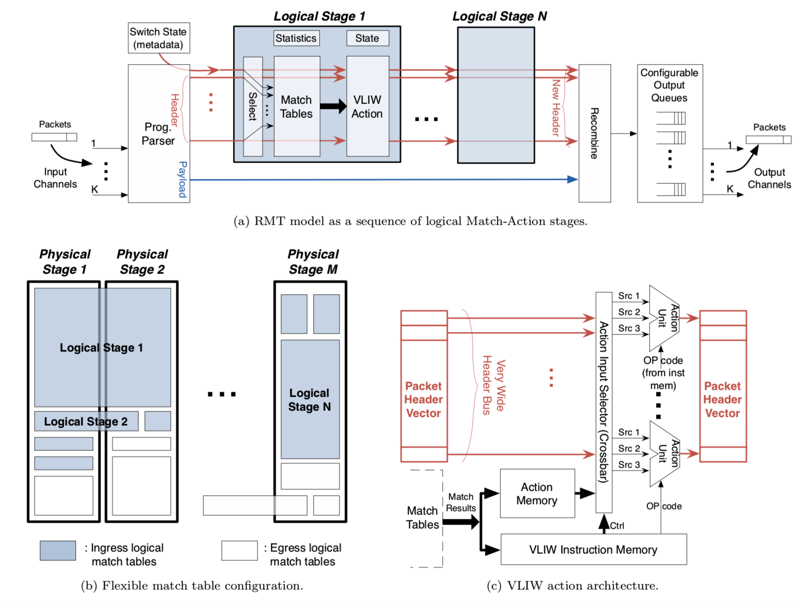
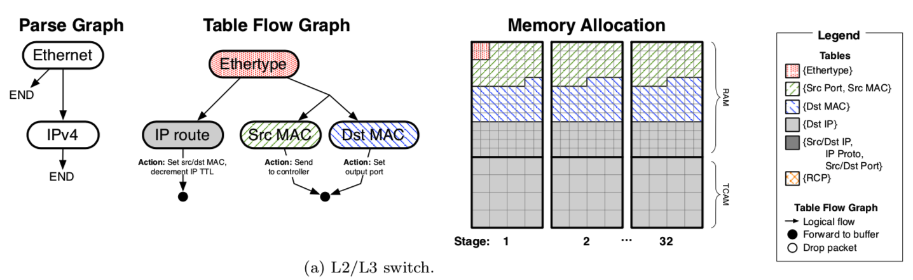

# Fast Programmable Match-Action Processing in Hardware for SDN

http://conferences.sigcomm.org/sigcomm/2013/papers/sigcomm/p99.pdf

## 摘要：
在软件定义网络（SDN）中，控制平面在物理上与转发平面分离。控制软件使用开放接口（例如OpenFlow）对转发平面（例如，交换机和路由器）进行编程。

本文旨在克服当前交换芯片和OpenFlow协议的两个局限性
1. 当前的硬件开关非常严格，仅允许在固定的一组字段fields上进行“匹配操作”处理，
2. OpenFlow规范仅定义了一个有限的字段数据包处理操作表。
Our paper describes the design of a 64 port by 10 Gb/s switch chip implementing the RMT model. 

## 1、introduction
由于关键的抽象，网络化取得了进展：TCP提供了端点之间已连接队列的抽象，而IP提供了从端点到网络边缘的简单数据报抽象。但是，网络内的路由和转发仍然是路由协议（例如BGP，ICMP，MPLS）和转发行为（例如路由器，网桥，防火墙）的混乱综合体，而控制和转发平面在内部仍然交织在一起封闭。

通过在控制平面和转发平面之间的开放接口（例如，OpenFlow）之间分离角色，软件定义网络（SDN）在抽象网络功能方面迈出了关键的一步。
基于称为“ Match-Action”的方法：分组字节的子集与表匹配；匹配的条目指定了应用于数据包的相应操作。

可以想象在通用CPU上用软件实现Match-Action。但是对于我们感兴趣的速度（今天大约为1 Tb / s）——we need the parallelism of dedicated hardware. 

十年来，交换芯片Switching chips 的交换速度比CPU快两个数量级，比网络处理器network processors快一个数量级，而且这种趋势不太可能改变。因此，我们需要考虑如何在硬件中实施Match-Action，利用pipelining and parallelism, while living within the constraints of on-chip table memories 有限的内存. 

在可编程性和速度之间存在自然的折衷。真正的问题是，是否可以在不牺牲速度的情况下以合理的成本完成这项工作。

### Single Match Table
**Single Match Table**: 控制器告诉交换机将数据包头字段的任何集合与单个匹配表中的条目进行匹配。SMT **assumes假设** that a parser locates and extracts the correct header fields to match against the table.  例如，以太网数据包可能具有可选的MPLS标签，这意味着IP标头可以位于两个不同的位置。

仔细研究表明，SMT模型的使用成本很高。该表需要存储头的每种组合；如果报头行为是正交的，则这是浪费的。

### Multiple Match Tables
**Multiple Match Tables**: MMT是SMT模型的自然改进。 MMT在一项重要的意义上超越了SMT：它允许多个较小的匹配表通过一个分组字段的子集进行匹配。
The match tables are arranged into a pipeline of stages; processing at stage j can be made to depend on processing from stage i < j by stage i modifying the packet headers or other information passed to stage j. 

MMT is easy to implement using a set of narrower tables in each stage; in fact, it is close enough to the way existing switch chips are implemented to make it easy to map onto existing pipelines. 

OpenFlow规范过渡到MMT模型[31]，但没有规定表的宽度，深度甚至数目, leaving implementors free to choose their multiple tables as they wish. 虽然许多字段已经标准化（例如IP和以太网字段），但Open-Flow允许通过用户定义的字段工具引入新的匹配字段。

Existing switch chips implement a small (4–8) number of tables whose widths, depths, and execution order are set when the chip is 制造出来。但这严重限制了灵活性。

用于核心路由器的芯片可能需要一个非常大的32位IP最长匹配表和一个很小的128位ACL匹配表。用于L2桥接器的芯片可能希望具有48位目的MAC地址匹配表和第二个48位源MAC地址学习表。企业路由器可能希望有一个较小的32位IP前缀表和一个更大的ACL表以及一些MAC地址匹配表。

如此看来，为每个用例制造单独的芯片效率很低，因此，商户交换芯片倾向于设计为支持所有通用配置的超集，并以预定的管道顺序排列一组固定大小的表。
第二个更棘手的问题是，交换芯片仅提供了与常见处理行为相对应的有限动作，例如，转发，丢弃，递减TTL，推入VLAN或MPLS标头以及GRE封装。到目前为止，OpenFlow仅指定其中的一个子集。这个动作集不容易扩展，也不是很抽象。A more abstract set of actions would allow any field to be modified, any state machine associated with the packet to be updated, and the packet to be forwarded to an arbitrary set of output ports.

### Reconfigurable Match Tables
**Reconfigurable Match Tables** : 在本文中，我们探索了称为RMT（可重配置匹配表）的MMT模型的改进。
**Like MMT, ideal RMT would allow a set of pipeline stages each with a match table of arbitrary depth and width.**
RMT超越了MMT，它允许通过以下四种方式重新配置数据平面。首先，可以更改字段定义并添加新字段；其次，可以指定匹配表的数量，拓扑，宽度和深度，但仅受匹配位数的整体资源限制；第三，可以定义新的动作，例如编写新的拥塞字段；第四，可以将任意修改的数据包放在指定的队列中，以在端口的任何子集输出，并为每个队列指定排队规则。该配置应由SDN控制器管理，但本文中未定义控制协议。
通过考虑最近几年提出的新协议，例如PBB，VxLAN，NVGRE，STT和OTV，可以看到RMT的好处。每个协议定义新的头字段。如果没有RMT这样的体系结构，则将需要新的硬件来匹配和处理这些协议。

人们一直怀疑RMT模型是否可以以很高的速度实施。

General purpose payload processing is not our goal. SDN/OpenFlow (and our design) aim to **identify the essential minimal set of primitives to process headers in hardware**.

## RMT ARCHITECTURE
We spoke of RMT as “**allow a set of pipeline stages ... each with a match table of arbitrary depth and width that matches on fields**”. 

**RMT switch consists of a parser**, to enable matching on fields,然后是任意数量的匹配阶段. 为谨慎起见，建议我们包括某种排队以处理输出处的拥塞。

The parser must allow field definitions to be modified or added, implying a reconfigurable parser. 这意味着可重新配置解析器
解析器的输出是一个包头向量，它是一组头字段，例如IP dest，Ethernet dest等。 The parser output is a packet header vector, which is a set of header fields such as IP dest, Ethernet dest, etc. In addition, the packet header vector includes “metadata” fields such as the input port on which the packet arrived and other router state variables.
向量流经一系列逻辑匹配阶段logical stage，每个阶段都抽象了图1a中数据包处理,each of which abstracts a logical unit of packet processing:

Each logical match stage allows the match table size to be configured: for IP forwarding, for example, 对于IP转发，可能需要一个256K 32位前缀的匹配表，对于以太网，可能需要64K 48位地址的匹配表。输入选择器选择要匹配的字段。

总之，图1a的理想RMT允许通过修改解析器来添加新字段，通过修改匹配存储器来匹配新字段，通过修改阶段指令stage instructions来进行新操作，以及通过修改每个队列的队列规则来进行新排队。理想的RMT可以模拟现有设备，例如网桥，路由器或防火墙。并且可以实现现有协议，例如MPLS和ECN，以及文献中提出的协议，例如使用非标准拥塞字段的RCP。最重要的是，它允许将来修改数据平面而无需修改硬件。

### 2.1 Implementation Architecture at 640Gb/s
我们提倡一种如图1b所示的实现架构，该架构由大量 physical pipeline stages 组成，根据每个逻辑阶段的资源需求，可以将较少数量的logical RMT stages 映射到该physical pipeline stages。此实现体系结构的动机是：
1. Factoring State: **Router forwarding typically has several stages** (e.g., forwarding, ACL), each of which uses a separate table; combining these into one table produces the cross-product of states

2. 灵活的资源分配，最大程度地减少资源浪费： physical pipeline stages具有一些资源（例如，CPU，内存）。逻辑阶段所需的资源可能相差很大。例如，防火墙可能需要所有ACL，核心路由器可能只需要前缀匹配，而边缘路由器可能需要每个前缀。通过将 physical  stages灵活地分配给逻辑阶段，人们可以重新配置 pipeline，以在现场从防火墙变成核心路由器。物理阶段N的数量应足够大，以使使用很少资源的逻辑阶段最多浪费1 / N的资源。当然，增加N会增加开销（布线，功耗）：在我们的芯片设计中，我们选择N = 32作为减少资源浪费和硬件开销之间的折衷方案。

总而言之，图1b的优势在于它使用的是带短导线的平铺架构，其资源可以用最少的浪费进行重新配置。
in networking most use cases are dominated by memory use, not processing.

### 2.2 Restrictions for Realizability
物理管道阶段体系结构需要限制以允许实现太比特速度：
匹配限制：我们的芯片设计在入口和出口都提供32个物理匹配阶段。通过将每个端口的修改推迟到缓冲之后，出口处的匹配操作处理可以更有效地处理多播数据包。

Packet header limits：The packet header vector containing the fields used for matching and action has to be limited。我们的芯片设计限制为4Kb（512B），可以处理相当复杂的标头。
Memory restrictions：每个物理匹配阶段都包含相同大小的表内存。通过将每个逻辑匹配阶段映射到多个物理匹配阶段或其中的各个部分，可以近似得出任意宽度和深度的匹配表（见图1b）。 For example, if each physical match stage allows only 1,000 prefix entries, a 2,000 IP log- ical match table is implemented in two stages (upper-left rectangle of Fig. 1b).
在我们的芯片中，每个阶段包含200多个动作单元：一个用于包头向量中的每个字段。芯片中包含7,000多个动作单元，但是与内存相比，这些动作单元占用的面积较小（<10％）。action unit processors非常简单，经过专门设计，可以避免执行指令所需的成本，并且每位所需的门数少于100。
这种RMT体系结构应该如何配置？需要两个信息：一个表示允许的报头序列的解析图，一个表示匹配表集以及它们之间的控制流的表流程图（请参见图2和§4.4）。理想情况下，编译器执行从这些图到适当的开关配置的映射。我们尚未设计出这样的编译器。

## 3、 EXAMPLE USE CASES
L2/L3 switch：首先，我们需要配置解析器，匹配表和操作表。, Figure 2a shows the parse graph, table flow graph, and memory allocation for our L2/L3 switch

Parse Graph and Table Flow Graph tell the parser解析器 to extract and place four fields (Ethertype, IP DA, L2 SA, L2 DA) on the wide header bus. 
The Memory Allocation tells us how the four logical tables are mapped to the physical memory stages. 

在我们的例子中，Ethertype table naturally falls into Stage 1
In our example, the Ethertype table naturally falls into Stage 1, with the remaining three tables spread across all physical stages to maximize their size. Most hash table RAM is split between L2 SA and DA, with 1.2 million entries for each. We devote the TCAM entries in all 32 stages to hold 1 million IP DA prefixes. Finally, we need to store the VLIW action primitives to be executed following a match (e.g. egress port(s), decrement TTL, rewrite L2 SA/DA). These require 30% of the stage’s RAM memory, leaving the rest for L2 SA/DA. If enabled, packet and byte counters would also consume RAM, halving the L2 table sizes.
Once configured, the control plane can start populating each table, for example by adding IP DA forwarding entries
