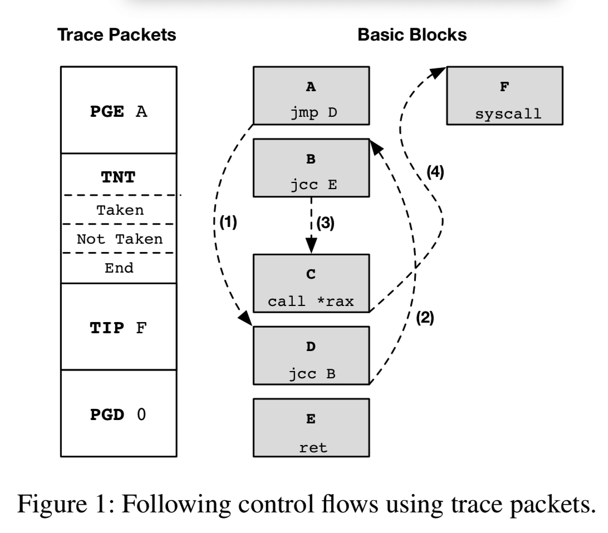

我们发现，最近引入的用于记录完整控制流跟踪的硬件功能（例如英特尔处理器跟踪（PT））为探索硬件辅助的CFI强制执行系统的效率和灵活性提供了机会。

尽管Intel PT旨在帮助进行脱机调试和故障诊断，但我们通过设计一种用于执行各种CFI策略的并行方法，探索了其对未经修改的二进制文件在线CFI实施的有效性。

我们已经在Linux 4.2内核中实现了一个名为GRIFFIN的原型，该原型可通过各种软件（包括Firefox浏览器及其固定代码）完全执行CFI。我们的实验表明，GRIFFIN可以按照研究人员的建议使用阴影堆栈来强制执行细粒度的CFI策略，其性能可与仅使用软件的仪器技术相媲美。此外，我们发现替代的日志记录方法可显着提高跟踪处理的性能，并为进一步的硬件帮助找到机会。

## 1.Introduction

CFI防御被确定为防御代码重用攻击的基础，因为此类攻击的根本目的是通过执行对手选择的控制流来利用授权程序。

We design and implement GRIFFIN, an operating system mechanism that leverages the Intel PT feature to enforce CFI policies over unmodified binaries. 它利用Intel PT特性对未修改的二进制文件执行CFI策略。

When a binary is run on GRIFFIN, GRIFFIN restricts the binary’s execution by comparing each indirect control transfer in the binary’s execution trace captured using Intel PT to a CFI policy for the binary. 

我们的目标是建立一个高性能的CFI强制执行机制，该机制能够对未修改的二进制文件强制执行各种CFI策略。

挑战：

Intel PT logs the information necessary to recon- struct a complete control-flow trace, but leaves the recon- struction of the trace to post-processing. 后置处理；后加工（错后处理，后部工艺）

To enforce some CFI policies, we need to know the call sites executed at runtime, but Intel PT does not record call sites, as they can be inferred from other information. Thus, **we must disassemble the binary and interpret the logged trace buffers to recover the program’s control-flow trace necessary for CFI enforcement**. 

## 2.Intel Processor Trace

Intel PT会生成跟踪数据包，这些数据包对控制流信息（例如branch targets and branch taken indications）进行编码。**当将记录的数据包与程序二进制文件结合时，软件解码器可以重建确切的控制流**。

Intel PT分别通过PGE和PGD数据包记录跟踪的开始和结束。在整个程序执行过程中，Intel PT会生成TNT数据包以记录是否采用了条件分支（例如jcc），而TIP数据包则记录了间接分支的目标（例如call *和ret）。

It is worth mentioning that direct branches (e.g., call) do not trigger any packets because of their deterministic effects on control flows.

All these features require a stateful processing of the logged trace packets, which presents a challenge for parallel processing.

Intel PT将数据包直接输出到物理内存，以避免地址转换的成本。

英特尔PT支持所选进程和/或线程的用户级和内核级跟踪。在GRIFFIN中，我们采用了选定进程的线程的用户级跟踪。

## 补充

Inside each Intel® PT generation module trace packets are queued to a FIFO buffer in order to send them out to the STM/SDRAM.

If trace packets are generated faster than can be sent out, the FIFO buffer can overflow and trace packets are lost.

### 4  Design Overview

GRIFFIN leverages Intel PT to record the complete user-level execution of a monitored program and **performs online control- flow checks** based on the recorded execution trace. 

GRIFFIN checks indirect control transfers both for *forward edges* (i.e., indirect calls and jumps) and *backward edges* (i.e., returns).

GRIFFIN支持的最简单但最不安全的CFI策略是粗粒度策略。根据此类政策，GRIFFIN仅检查间接控制转移的目的地是否合法(i.e., is a legal target of any call or return).

GRIFFIN还支持细粒度策略，该策略比粗粒度策略更安全，因为GRIFFIN会检查目标是否为每个源-目标对的源合法目标。 whether the destination is a legal target for the source for each source-destination pair

GRIFFIN同时执行非阻塞和阻塞控制流检查，以在不牺牲安全性的情况下实现更好的性能。**当英特尔PT跟踪缓冲区已满时，将触发非阻塞检查。在进行此类检查期间，程序将继续执行**。

Blocking checks are done when the monitored program makes a security-sensitive system call.

### 5.1 Coarse-Grained Policies

为了实施粗粒度策略，我们不需要重新构造控制流，因为在TIP数据包中给出了直接控制传输的目的地。

Target IP (TIP): If the processor executes an indirect jump or transfer instruction, the decoder will not be able to recover the control flow. **Therefore, the processor produces a TIP packet upon the execution of an instruction of the type indirect branch**, near ret or far transfer. These TIP packets store the corresponding target instruction pointer executed by the processor after the transfer or jump has occurred.

直接转移 JMP label (direct jump)
寄存器间接转移 JMP reg (register indirect jump)
存储器间接转移 JMP WORD PTR OPR (memory indirect jump)

Direct Transfer COFI 是相对分支. 意味着他们的目标地址是当前的 IP 加上一个 offset. 因为二进制反汇编就可以得到直接跳转的 IP, 所以没有必要在 trace 中记录 IP. 对于条件分支, 只需要标记该分支是 taken or not 就行. 无条件分支都不需要任何记录.

Indirect Transfer 指令会从寄存器或者内存地址中更新 IP, 所以 PT 就必须记录目的 IP， 使得 debugger 能够确定 COFI 的目的地址. 这个 IP 可能为 linear addres, 或 effective address.

we do not need to re- construct the control flow because the **destinations of indirect control transfers are given in TIP packets**

### 5.2 细粒度

为了执行细粒度的CFI策略，我们需要知道每个间接控制传输的源和目的地。但是，源地址在Intel PT的跟踪中不直接可用。为了恢复它，我们需要重构控制流，以便在发生间接控制传输时我们知道源地址。接下来，我们首先使用一个示例来说明如何基于Intel PT的跟踪数据包和程序二进制文件来重建控制流。

为了重建控制流，我们将Intel PT的跟踪数据包和程序二进制文件作为输入。基本思想是反汇编二进制文件，并通过跟踪跟踪数据包来跟踪执行过程。

The initial PGE packet identifies that the execution begins at block A. 

Then, the direct jmp instruction at the end of block A leads the control to block D

Note that direct branches do not generate any trace packet due to their deterministic effects. 

The first “Taken” bit in the TNT packet indicates that the next conditional branch (i.e., the one at the end of block D) is taken, thus the control is transferred to block B.

The conditional branch at the end of block B is not taken according to the next entry (“Not Taken”) in the same TNT packet, and the control falls through to the next block C.

It ends with an indirect call to block F as logged by the TIP packet. 

重构控制流程的过程很简单，但是设计挑战在于如何在GRIFFIN的在线处理中提高效率。指令，块或功能在程序执行期间往往会执行多次。一遍又一遍地分解相同的指令效率不高，因为我们只需要有关基本块的信息即可进行控制流重构。

In GRIFFIN, we trace each thread separately. This requires changing the Intel PT configuration state during context switches. We follow the suggestion made in the Intel man- ual [5, Sec. 36.3.5.2] to use XSAVES and XRSTORS instruc- tions to save and restore the configuration state at context switch. We enabled these two instructions in Linux 4.2 ker- nel by adding 30 SLoC to its context switch code.

 We hook the clone system call to notify GRIFFIN on task creations. GRIFFIN allocates a trace buffer for each new task and initializes its Intel PT configuration state accordingly. 

We directly write to the new task’s XSAVES area so that the initialized state will be loaded into the processor’s registers when its context is switched in.

GRIFFIN在Linux内核中运行。当它解析跟踪缓冲区并为受监视的进程执行控制流检查时，它将在该进程的上下文中运行。

Disassembling the same instructions over and over again is *not* efficient since we only need the information about the basic blocks for control-flow reconstruction. The key design question is how to store and look up such infor- mation in an efficient way.