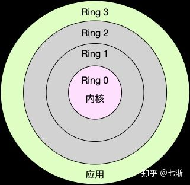

 CR3 value of the currently running process and hands it over to QEMU-PT for filtering

## 摘要

模糊测试是揭示各种软件故障的有前途的技术。

Most fuzzing efforts—especially feedback fuzzing—are limited to *user space components* of an operating system (OS), although bugs in *kernel components* are more severe, because they allow an attacker to gain access to a system with full privileges.

Unfortunately, kernel components are difficult to fuzz as feedback mechanisms (i.e., guided code coverage) cannot be easily applied.

We utilize a hypervisor and In- tel’s *Processor Trace* (PT) technology. This allows us to remain independent of the target OS as we just re- quire a small user space component that interacts with the targeted OS.

## 1 Introduction

长期以来，模糊测试一直是测试和确定软件质量的关键组件。但是，随着American Fuzzy Lop（AFL）的发展，更智能的模糊器已在行业和研究中获得了广泛的关注。

Google的OSS Fuzz项目进一步放大了这种趋势，该项目在安全性高的相关软件中成功发现并继续发现了许多严重的错误。

不幸的是，AFL仅限于用户空间应用程序，并且缺少内核支持。

以前的内核模糊测试方法不是可移植的，因为它们依赖于某些驱动程序或重新编译。

The overhead for feedback generation is very small (less than 5%) due to a new CPU feature: Intel’s *Processor Trace* (PT) technology provides control flow information on running code.

We use this information to construct a feedback mechanism similar to AFL’s in- strumentation. 

我们的模糊方法利用了英特尔的处理器跟踪（PT）技术，因此性能开销很小。此外，我们的PT解码器比Intel的ptxed解码器快30倍。因此，我们获得了完整的跟踪信息，这些信息可用来指导我们的进化模糊算法以最大化测试覆盖率。

## 2 Technical Background

We use the Intel Processor Trace (*Intel PT*) extension of *IA-32* CPUs to obtain coverage information for ring 0 execution of 任意的(even closed-source) OS code. 

To facilitate efficient and OS-independent fuzzing, we also make use of Intel’s hardware virtualization features (In- tel VT-x). 

Hence, our approach requires a CPU that supports both *Intel VT-x* and *Intel PT*. 

### 2.1 x86-64 Virtual Memory Layouts

Every commonly used x86-64 OS uses a *split virtual memory layout*:

内核通常位于每个虚拟内存空间的上半部分，而每个用户模式进程内存则位于下半部分。

### 2.2 Intel VT-x

依赖于现代的x86-64硬件虚拟化技术

我们区分三种CPU：物理CPU，逻辑CPU和虚拟CPU（vCPU）

物理CPU是用硬件实现的CPU。大多数现代CPU支持在没有额外的物理CPU内核的情况下提高多线程性能的机制（例如，英特尔超线程）

一个物理CPU上有多个逻辑CPU。这些不同的逻辑CPU共享一个物理CPU，因此一次只能激活其中一个。但是，硬件会交错执行不同的逻辑CPU，因此可以更有效地利用可用资源（例如，一个逻辑CPU使用算术逻辑单元，而另一个逻辑CPU等待数据提取）和操作-调度系统可以减少调度开销。

操作系统将每个逻辑CPU视为整个CPU。最后，可以在单个逻辑CPU上创建多个硬件支持的虚拟机（VM）。在这种情况下，每个VM都有一组自己的vCPU。

The virtualization role model is divided into two components: the virtual machine monitor (VMM) and the VM. 

The VMM, also named *hypervisor* or *host*, is privileged software that has full control over the physical CPU and **provides virtualized guests with restricted access to physical resources**. 

The VM, **also termed *guest***, is a piece of software that is transparently executed within the virtualized context provided by the VMM.可以在VMM提供的虚拟化上下文中透明执行。

### 2.3 Intel Processor Trace

与其他分支跟踪技术（例如* Intel Last Branch Record（LBR）*）不同，输出缓冲区的大小不再严格受特殊寄存器的限制。相反，它仅受主内存大小的限制。如果输出目标被反复及时排空，我们可以创建任意长度的迹线。

The processor’s output format is packet-oriented and separated into two different types:

general execution information and control flow informa- tion packets. 

Intel PT在运行期间会生成各种类型的与控制流相关的数据包类型。为了从跟踪数据中获得控制流信息，我们需要一个解码器。解码器需要跟踪软件来解释包含条件分支地址的数据包。

英特尔指定了五种类型的控制流影响指令，称为流指令更改（CoFI）。

The three CoFI types relevant to our work are:

1. Taken-Not-Taken (TNT): If the processor executes any conditional jump, the decision whether this jump was taken or not is encoded in a TNT packet.

2. Target IP (TIP): If the processor executes an indirect jump or transfer instruction, the decoder will not be able to recover the control flow. Therefore, the processor produces a TIP packet upon the execution of an instruction of the type indirect branch, near ret or far transfer. These TIP packets store the corresponding target instruction pointer executed by the processor after the transfer or jump has occurred.

3. Flow Update Packets (FUP): Another case where the processor must produce a hint packet for the software decoder are asynchronous events such as interrupts or traps. These events are recorded as FUPs and usually followed by a TIP to indicate the following instruction.

To limit the amount of trace data generated, Intel PT provides multiple options for runtime filtering. 

In accordance to the IP filtering mechanism, it is possible to filter traces by the current privilege level (CPL) of the protection ring model (e.g ring 0 or ring 3).该过滤器允许我们仅选择用户模式（CPL> 0）或内核模式（CPL = 0）活动。

kAFL利用此过滤器选项将跟踪明确地限制为内核模式执行。

To limit trace data generation to one specific virtual memory address space, software can use the *CR3 Filter*. Intel PT will only produce trace data if the CR3 value matches the configured filter value. 

The CR3 register contains the pointer to the current page table. The value of the CR3 register can thus be used to filter code executed on behalf of a certain ring 3 process, even in ring 0 mode. CR3寄存器包含指向当前页表的指针。因此，即使在环0模式下，CR3寄存器的值也可以用于过滤代表某个环3进程执行的代码。

Intel PT supports various configurable target domains for output data. 

kAFL focuses on the Table of Physical Addresses (ToPA) mechanism that enables us to specify multiple output regions: Every ToPA table contains multiple *ToPA entries*, which in turn contain the physical address of the associated memory chunk used to store trace data. 

Each ToPA entry contains the physical address, a size specifier for the referred memory chunk in physical memory, and multiple type bits. These type bits specify the CPU’s behavior on access of the ToPA entry and how to deal with filled output regions.

## 3 System Overview

Our system is split into three components: 

1. the fuzzing logic, 
2. the VM infrastructure (modified versions of QEMU and KVM denoted by QEMU-PT and KVM- PT), 
3. the user mode agent.

The fuzzing logic runs as a ring 3 process on the host OS. This logic is also re- ferred to as kAFL. 

The VM infrastructure consists of a ring 3 component (QEMU-PT) and a ring 0 component (KVM-PT). This facilitates communication between the other two components and makes the Intel PT trace data available to the fuzzing logic. 

In general, the guest only communicates with the host via hypercalls. The host can then read and write guest memory and continues VM execution once the request has been handled. A overview of the architecture can be seen in Figure 1.

## 4 Implementation Details

### 4.1 KVM-PT

## 什么是 CPU 上下文切换

就是先把前一个任务的 CPU 上下文（也就是 CPU 寄存器和程序计数器）保存起来，然后加载新任务的上下文到这些寄存器和程序计数器，最后再跳转到程序计数器所指的新位置，运行新任务。

而这些保存下来的上下文，会存储在系统内核中，并在任务重新调度执行时再次加载进来。这样就能保证任务原来的状态不受影响，让任务看起来还是连续运行。

Linux 按照特权等级，把进程的运行空间分为内核空间和用户空间，分别对应着下图中， CPU 特权等级的 Ring 0 和 Ring 3。

- 内核空间（Ring 0）具有最高权限，可以直接访问所有资源；
- 用户空间（Ring 3）只能访问受限资源，不能直接访问内存等硬件设备，**必须通过系统调用陷入到内核中，才能访问这些特权资源**。

### 系统调用

从用户态到内核态的转变，需要通过**系统调用**来完成。比如，当我们查看文件内容时，就需要多次系统调用来完成：首先调用 open() 打开文件，然后调用 read() 读取文件内容，并调用 write() 将内容写到标准输出，最后再调用 close() 关闭文件。

在这个过程中就发生了 CPU 上下文切换，整个过程是这样的：
1、保存 CPU 寄存器里原来用户态的指令位
2、为了执行内核态代码，CPU 寄存器需要更新为内核态指令的新位置。
3、跳转到内核态运行内核任务。
4、当系统调用结束后，CPU 寄存器需要恢复原来保存的用户态，然后再切换到用户空间，继续运行进程。

所以，**一次系统调用的过程，其实是发生了两次 CPU 上下文切换**。（用户态-内核态-用户态）

不过，需要注意的是，**系统调用过程中，并不会涉及到虚拟内存等进程用户态的资源，也不会切换进程**。这跟我们通常所说的进程上下文切换是不一样的：**进程上下文切换，是指从一个进程切换到另一个进程运行；而系统调用过程中一直是同一个进程在运行。**

所以，**系统调用过程通常称为特权模式切换，而不是上下文切换。**

但实际上，系统调用过程中，CPU 的上下文切换还是无法避免的。

## 进程上下文切换跟系统调用又有什么区别呢

首先，**进程是由内核来管理和调度的，进程的切换只能发生在内核态**。所以，进程的上下文不仅包括了虚拟内存、栈、全局变量等用户空间的资源，还包括了内核堆栈、寄存器等内核空间的状态。

因此，**进程的上下文切换就比系统调用时多了一步：在保存内核态资源（当前进程的内核状态和 CPU 寄存器）之前，需要先把该进程的用户态资源（虚拟内存、栈等）保存下来；而加载了下一进程的内核态后，还需要刷新进程的虚拟内存和用户栈**。

为了快速响应硬件的事件，**中断处理会打断进程的正常调度和执行，转而调用中断处理程序，响应设备事件**。而在打断其他进程时，就需要将进程当前的状态保存下来，这样在中断结束后，进程仍然可以从原来的状态恢复运行。

**跟进程上下文不同，中断上下文切换并不涉及到进程的用户态**。所以，即便中断过程打断了一个正处在用户态的进程，也不需要保存和恢复这个进程的虚拟内存、全局变量等用户态资源。中断上下文，其实只包括内核态中断服务程序执行所必需的状态，包括 CPU 寄存器、内核堆栈、硬件中断参数等。

**对同一个 CPU 来说，中断处理比进程拥有更高的优先级**，所以中断上下文切换并不会与进程上下文切换同时发生。同样道理，由于中断会打断正常进程的调度和执行，所以大部分中断处理程序都短小精悍，以便尽可能快的执行结束。