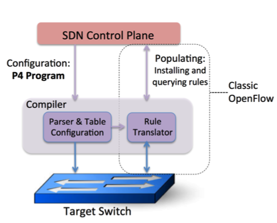
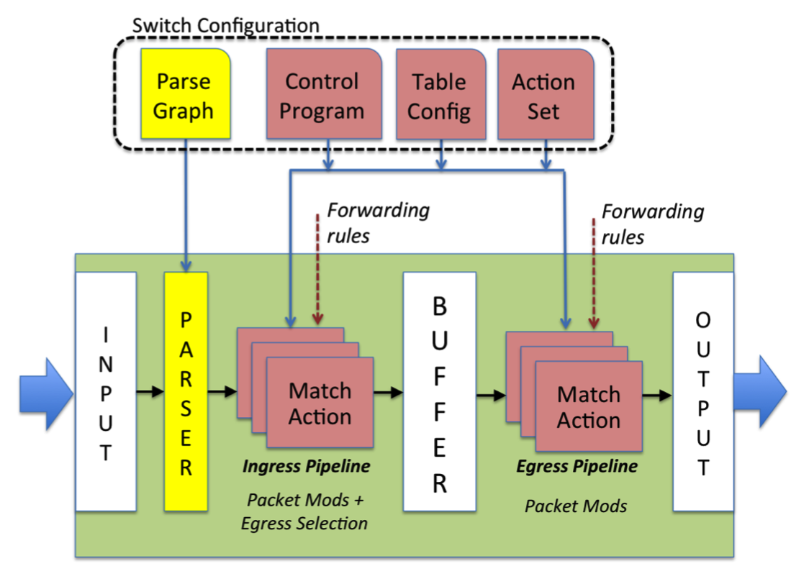

# Programming Protocol-Independent Packet Processors
P4 is a language to configure switches.
https://www.sigcomm.org/sites/default/files/ccr/papers/2014/July/0000000-0000004.pdf

P4与SDN控制协议（如OpenFlow）结合使用。在当前形式下，OpenFlow显式指定其运行所在的协议头。几年来，这个集合已经从12个字段增加到41个字段，这增加了规范的复杂性，同时仍然没有提供添加新header的灵活性。在本文中，我们建议使用P4作为有关OpenFlow在未来如何发展的建议。

We have three goals: 
(1) Reconfigurability in the field: Programmers should be able to change the way switches process packets once they are deployed. 
(2) Protocol independence: Switches should not be tied to any specific network protocols.
(3) Target inde- pendence: 程序员应该能够独立于底层硬件的细节来描述数据包处理功能.

作为示例，我们描述如何使用P4配置交换机以添加新的层次结构标签。

## 1、INTRODUCTION
软件定义网络（SDN）为运营商提供了对其网络的编程控制。在SDN中，控制平面与转发平面在物理上是分开的，并且一个控制平面控制多个转发设备。
**尽管可以通过多种方式对转发设备进行编程**，having a common, open, **vendor-agnostic interface供应商无关的接口 (like OpenFlow)** enables a control plane to control forwarding devices from different hardware and software vendors供应商.

OpenFlow接口从简单的规则表开始，**它可以匹配一打标头字段（例如，MAC地址，IP地址，协议，TCP / UDP端口号等）上的数据包**。在过去的五年中，该规范变得越来越复杂（请参见表1），其中包含更多的标头字段和规则表的多个阶段，以允许交换机将更多功能展示给控制器。

我们认为，未来的交换机应该支持灵活的机制来解析数据包和匹配标头字段，而不是重复扩展OpenFlow规范，从而允许控制器程序通过通用的开放接口（即新的“ OpenFlow 2.0” API）利用这些功能。

与今天的OpenFlow 1.x标准相比，这种通用，可扩展的方法将更简单，更优雅并且更适用于未来。

最新的芯片设计表明，这样的灵活性可以在定制ASIC中以太比特级速度实现。
Recent chip designs demonstrate that such flexibility can be achieved in custom ASICs at terabit speeds。
对新一代的交换芯片进行编程远非易事。每个芯片都有自己的low-level interface，类似于微代码编程。

图1显示了 P4（**用于配置交换机，告知其如何处理数据包**）与existing APIs (such as OpenFlow) that are designed to populate the forwarding tables in fixed function switches 之间的关系。

P4提高了对网络进行编程的抽象级别，并且可以**用作控制器和交换机之间的通用接口**。can serve as a general interface between the controller and the switches.
也就是说，我们相信，下一代OpenFlow应该允许控制器告诉交换机如何操作，而不是受固定交换机设计的约束。

P4设计的目标：
1. 可重新配置性。控制器应该能够重新定义 packet parsing and processing in the field.
2. 协议独立性。交换机不应绑定到特定的数据包格式。相反，控制器应该能够指定（i）数据包解析器，**用于提取具有特定名称和类型的标头字段**，以及（ii）处理这些标头的类型化match + action表的集合。
3. 目标独立性。就像C程序员不需要知道底层CPU的细节一样，控制器程序员也不需要知道底层switch的细节。 underlying switch.

## 2、ABSTRACT FORWARDING MODEL
在我们的抽象模型中（图2），通过可编程的解析器parser转发数据包，然后是多个阶段的match + action，它们以串联，并联或两者结合的方式排列。
我们的模型支持可编程的解析器，以允许定义新的headers。
其次，OpenFlow假设match + action阶段是串联的，而在我们的模型中，它们可以并联或串联。
第三，我们的模型假设动作由交换机支持的与协议无关的原语组成。

我们的抽象模型概括了如何在不同的转发设备（例如，以太网交换机，负载平衡器，路由器）和不同的技术（例如，固定功能交换机ASIC，NPU，可重配置交换机，软件交换机，FPGA）中处理数据包。这使我们能够设计一种通用语言（P4）来表示如何根据我们的通用抽象模型来处理数据包。

显然，在固定功能的ASIC交换机中，配置阶段没有多大意义。对于这种类型的switch，编译器的工作是简单地检查芯片是否可以支持P4程序。
取而代之的是，我们的目标是capture the general trend towards fast reconfigurable packet-processing pipelines

到达的数据包首先由解析器处理parser。The packet body is assumed to be buffered **separately**，并且不可用于匹配。parser从标头中识别并提取字段，从而定义交换机支持的协议。

然后将提取的header字段传递到match +action表。 The match+action tables are divided be- tween ingress and egress. 尽管两者都可以修改数据包报头，ingress match+action determines the egress port(s) and determines the queue into which the packet is placed 将数据包放入的队列. 

基于入口处理，可以转发，复制数据包（用于多播，跨度或到控制平面），丢弃数据包或触发流控制。出口match+action对数据包报头按实例进行修改，例如，对于多播副本。动作表（计数器，策略器等）可以与流相关联以跟踪帧到帧的状态。

Packets can carry additional information between stages, called metadata, which is treated identically to packet header fields该信息与数据包头字段的处理方式相同. Some examples of metadata include the ingress port, the transmit destination and queue, a timestamp that can be used for packet scheduling。

Queueing 规则的处理方式与当前OpenFlow相同：an action maps a packet to a queue, which is configured to receive a particular service discipline. The service discipline (e.g., minimum rate, DRR) is chosen as part of the switch configuration.
尽管超出了本文的讨论范围，但可以添加动作原语以允许程序员实现新的或现有的拥塞控制协议。例如，可以对交换机进行编程以根据新的条件设置ECN位，或者可以使用match + action表实现专有的拥塞控制机制

