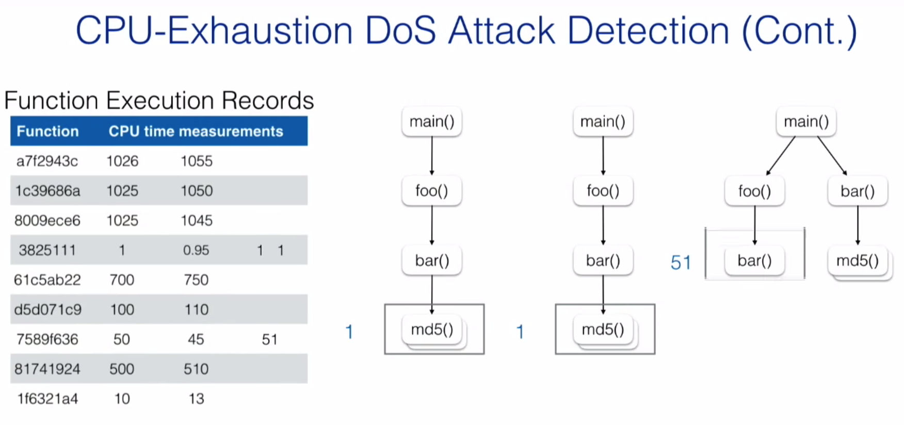

## 补充

表现*＂中间值＂*的统计名词：
　　a.均值: 　　mean，数列的算术平均值，反应了数列的集中趋势,等于有效数值的合除以有效数值的个数．
　　b.中位值: 　　median，等于排序后中间位置的值，当数列长度为偶数时，取中间两个值的均值．
　　c.众数: 　　mode，等于数列出现次数最多的数字，当多个数字都出现最高次数时，多个数字都是众数．

## 摘要

幸运的是，对于防御者而言，这些DDos攻击会给攻击者带来相对较高的成本（例如，获得大型僵尸网络以发起攻击），并且通常已经可以通过最先进的网络级防御机制来检测到它们

sophisticated DoS attacks gained signif- icant traction recently.  与传统的DDoS攻击依赖于以大量的流量泛滥受害者系统不同，复杂的DoS攻击需要更少的资源并利用较少量的密集请求来攻击受害者系统的可用性。

attackers target expensive or slow execution paths of the victim system. For example, an intensive attack might request the system to calculate computationally-expensive hashes for mil- lions of times by specifying an unusually high iteration count for the bcrypt function.异常高的迭代次数

## 1 Introduction

Specifically, Rampart actively monitors all requests to precisely model the resource usage of a web application at the function-level. It then dynamically builds and updates statistical execution models of each function by monitoring the runtime of the function called under different contexts.

## 2 Rampart

### 2.1 Threat Model and Challenges

Attack requests are well-formed, and, thus, they cannot be easily distinguished from legitimate requests through statistical features, such as the size, or the values of the payload. 她还可以发送合法请求，以将其攻击隐藏在合法流量中。但是，她不会在很短的时间范围内发送大量攻击请求，即淹没目标服务器，因为可以通过基于网络的互补防御措施轻松地检测到具有高攻击率的批量攻击。

我们的防御机制一定不能给受保护的应用程序带来巨大的性能开销。

As a result, the ID of a function frame depends on all of its parent callers. 

To keep track of previous application states, Rampart maintains a shadow call stack, where each function frame stores the application state when it is called. 

### 2.2 Web Application CPU Usage Modeling

To precisely model the resource usage of a web application in different states, Rampart employs context- sensitive function-level program profiling 剖析研究. Specifically, **Rampart records the CPU time spent in a function (including time spent by the operating system’s kernel on behalf of the function) instead of its wall clock time**, because an application instance can be interrupted and rescheduled by the operating system before the function returns.

### 2.3 CPU-Exhaustion DoS Attack Detection

一种用于检测CPU耗尽DoS攻击的稻草人方法是在Web应用程序中设置全局超时，因为此类攻击的关键特征是它们的请求要花费大量时间，并消耗受害者服务器的多个CPU周期。但是，合法请求也可能超时，并且可能被误认为是攻击尝试。例如，用户可能会上传一个大文件，这可能需要很长时间才能传输或处理

与（全局）超时相比，异常高的CPU使用率是一个更准确的指标:

Rampart在固定的时间间隔T内连续监视服务器的CPU使用率，并计算最近S次观察的平均CPU使用率rS，其中S是系统管理员配置为控制检测灵敏度的参数。如果rS大于预定义的阈值RCPU（例如90％），则Rampart会发出警报，从而表明服务器过载，并且很可能成为CPU耗尽DoS攻击的受害者。

Instead, Rampart leverages the function execution models it learned (Section 2.2) to detect suspicious requests that are statistically different from the historical profile.

Rampart **periodically**  (e.g., every 250 ms) checks the CPU time spent in **functions that have not returned yet**, 然后将时间与性能分析数据库中的对应记录进行比较，最后，它确定一个请求使用以下方法可疑：

*Tmin* and *Tmax* be the minimum and maximum time-out thresholds.

***TC* is the CPU time of a function f in the stack**

μ and σ are the mean and standard deviation of *TC* 标准差 with the ID state( *f* ) in the database; 

标准差是方差的算术平方根。标准差能反映一个数据集的离散程度。

*k* is a parameter that represents the distance from the mean.

当处理攻击请求时，与合法请求相比,  some frames in the call stack的TC 将大大提高。相反，在处理文件上载请求时，如果所有功能的TC都接近平均值，则这些请求将不会被标记为可疑. 如果不接近mean, 那么也会被标记为可疑。

Rampart的局限性在于，它至少需要对函数调用进行一次观察，才能依赖该函数确定请求是否可疑。**In practice, this training phase can be completed automatically by using a fuzzer**，a crawler program to traverse the web application, or an existing test harness. 

In fact, developers can easily collect training data when testing their applications before deploying them to production. 

另一个限制是，攻击者可能会通过逐渐增加CPU时间来污染其选择的应用程序状态的性能分析记录。为了进一步增加攻击者污染或漂移分析记录的难度，可以在计算均值和标准差时考虑为旧的测量记录分配更高重要性（权重）的策略（公式2）。

### 2.4 Probabilistic Request Termination

To reduce the impact of false positives, Rampart can rely on a probabilistic algorithm to determine if a suspicious request should be dropped. 

The observation is that suspicious user requests usually do not consume as much CPU time as attack requests. 

允许某些请求以较低的优先级需要更多的时间，而不是立即中止所有可疑请求。

### 2.5 CPU-Exhaustion DoS Attack Blocking

通过连续发送此类请求而导致CPU耗尽DoS。因此，Rampart需要阻止后续攻击请求，以进一步缓解CPU耗尽的DoS攻击。

Rampart使用攻击的源IP（网络）地址，请求的URI和请求参数（例如查询字符串和发布数据，即PHP的GET和POST数组的键和值）来构建过滤策略。

匹配请求会在过滤器的主生命周期内立即被丢弃。当过滤器的主要使用寿命到期时，它会转换为具有次要使用寿命的非活动状态。在次要生命周期中，Rampart允许该应用程序一次满足一个匹配的请求，以探讨移除过滤器的结果。如果检测到CPU耗尽DoS攻击尝试，Rampart将中止此请求，并使用更长的主生命周期更新过滤器以惩罚攻击者。否则，将删除过滤器，因为它可能已被创建为误报或攻击已停止。

Rampart是一种在线动态分析系统，因此可能会导致相当大的性能开销。

First, Rampart needs to make two system calls to measure the CPU time of a function call: one before the actual function call and one after it. 

One might consider the unprivileged RTDSC(P) instruction of x86 processors to query the Time Stamp Counter (TSC) efficiently. Unfortunately, TSC is a global counter and shared among all processes running on the same processor, including unrelated processes

我们禁用内置函数的分析，因为它们花费的时间几乎是常数

有些函数的执行时间，如字符串操作等，严格地取决于它的输入，我们需要把它们考虑进去。幸运的是，Rampart在分析它们的父函数时包含了它们的执行时间，因此我们不单独测量它们。

## Presentation

假设现在服务器要处理三个不同的请求：

从return后一路向数据库中去比较

实际上，我们可以更早地发现可疑的目标，譬如说设置超时时间