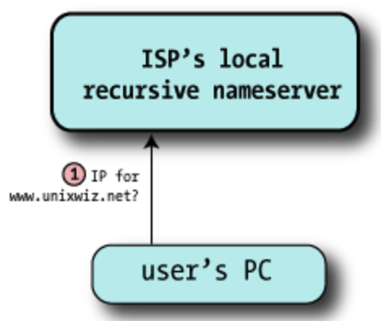
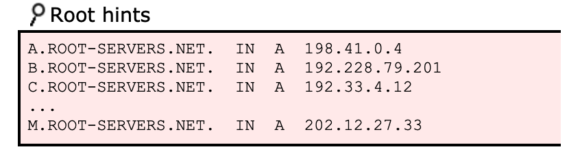
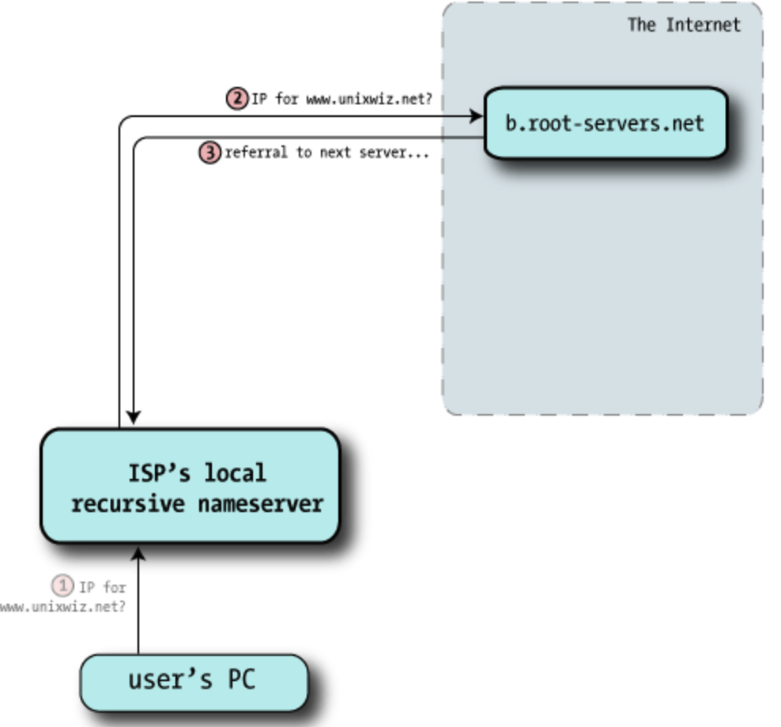
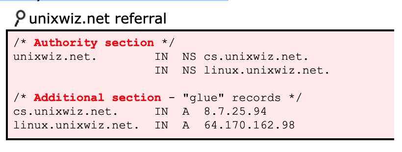
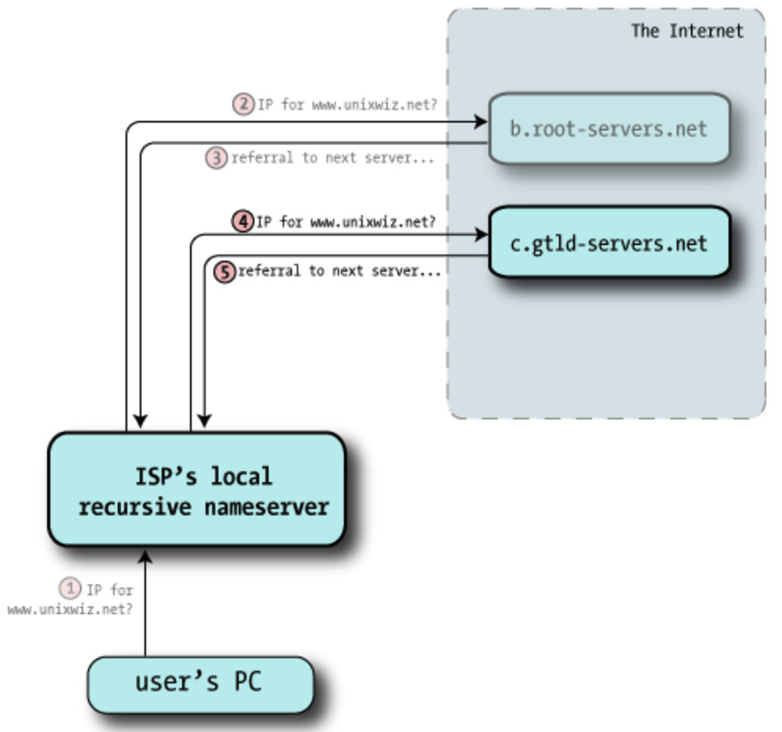
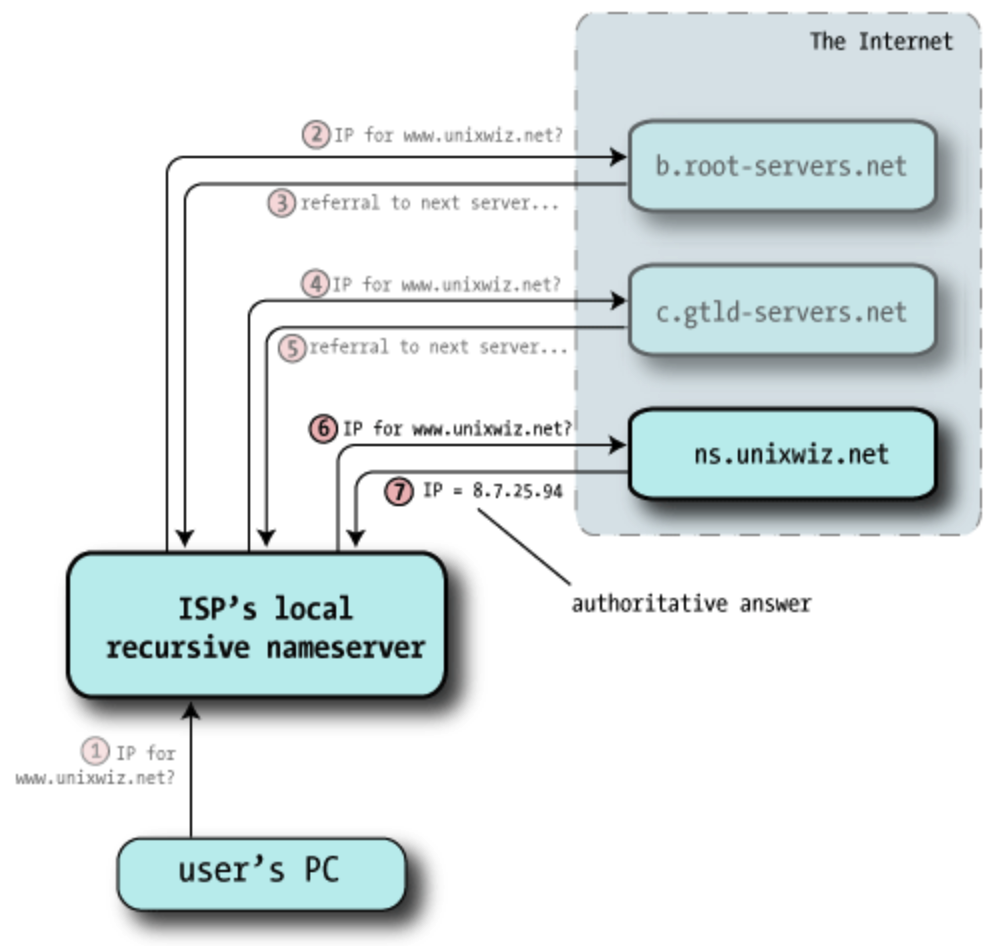
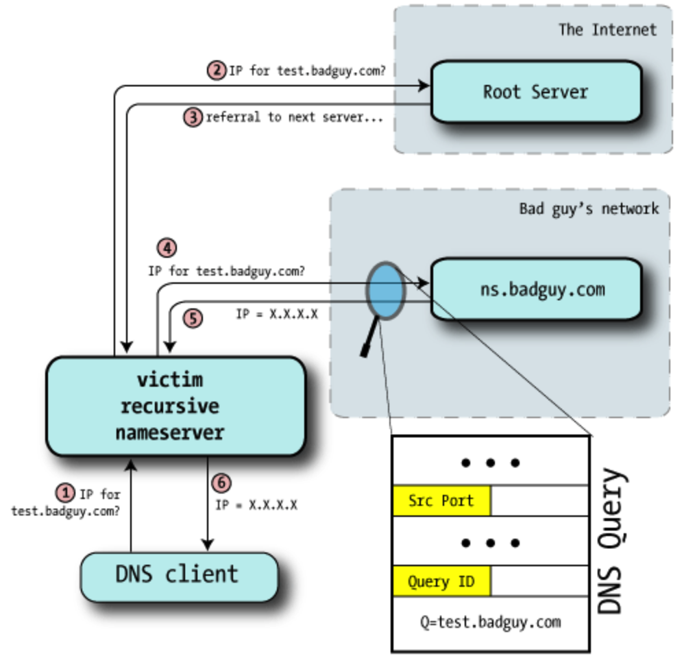
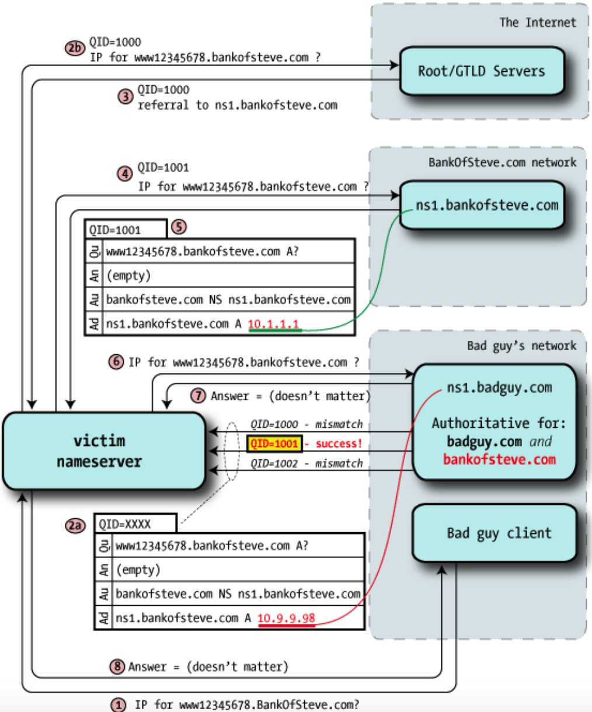
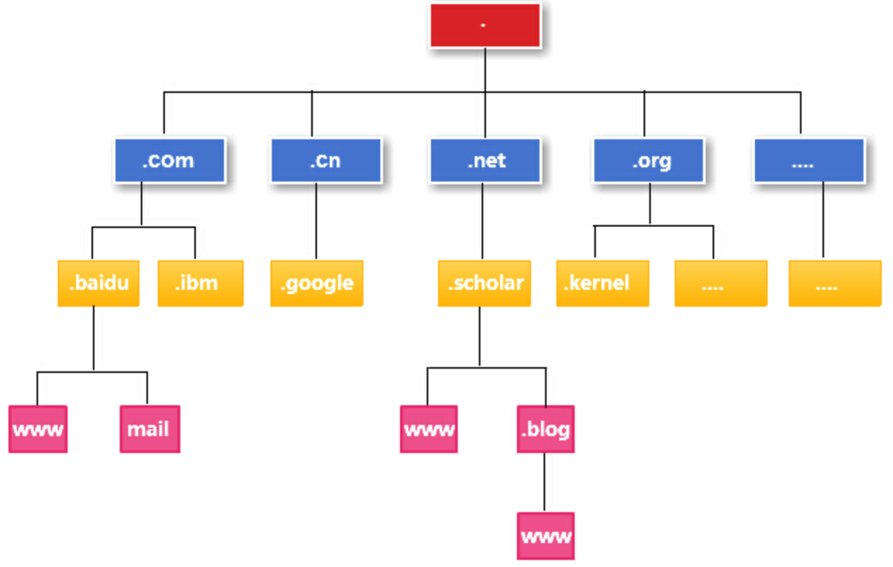

## An Illustrated Guide to the Kaminsky DNS Vulnerability
Nameserver
This is server software that answers DNS questions, such as "What is the IP address for www.unixwiz.net?". Sometimes a nameserver knows the answer directly (if it's "authoritative" for the zone), other times it has to go out to the internet and ask around to find the answer (if it's a recursive nameserver).

Authoritative Nameserver

For every zone, somebody has to maintain a file of the hostnames and IP address associations ("linux.unixwiz.net is 64.170.162.98", and so on). This is generally an administrative function performed by a human, and in most cases **one** machine has this file. It's the zone master.

Resolver

This is the client part of the DNS client/server system: it **asks the questions** about hostnames. The resolver is usually a small library **compiled into each program that requires DNS services**, and it knows just enough to send questions to a nearby nameserver.

On Linux/UNIX systems, the location of the servers-to-ask is found in the file **/etc/resolv.conf**

Recursive Nameserver

This is a nameserver that's willing to go out on the internet and find the results for zones it's not authoritative for, as a service to its clients. Not all nameservers are configured to provide recursive service, or are limited to just trusted clients (say, an ISP may provide nameservice only to its customers).

## Following a simple DNS query

1. The client (noted as "User's PC") makes a request for **www.unixwiz.net**, and it's routed to the nameserver provided by the user's ISP. It requests the **A record**, which represents an IP address.

   The ISP's nameserver knows that it's not authoritative for **unixwiz.net**, so it can't look it up in its local zone database. It also doesn't find the name it its cache of recently-seen data, so it knows it has to go out to the internet to find it for us.

   

2. All recursive nameservers are preconfigured with a list of 13 root servers, a selection of which looks like:

   

   Thankfully these IP addresses don't change very often.

   The nameserver picks one at random and sends off the query for the A record of **www.unixwiz.net**; here it's going to **b.root-servers.net**

3. The root server doesn't know anything about **unixwiz.net**, but is happy to send me the way of the Global Top Level Domain (GTLD) servers responsible for the **.net** domain. This is in the form of **NS** records of servers more qualified to answer our query: "Go ask these guys - here's a list".

   

4. With the helpful referral from the root servers, this nameserver chooses one of the authoritative servers at random — and sends off the same query: "I was told to ask you: what's the A record for **www.unixwiz.net**?".

5. The GTLD server doesn't know the specific answer to our query, but it does know how to get us closer. Like the root servers, it sends back a referral (a set of **NS** records) that are likely to have what we seek.

   

   

6. Once again the recursive nameserver is following a chain of referrals on the client's behalf, and it picks one of the nameservers at random and sends off a third query (the same as the other two).

7. Unlike the other answers, that merely passed the buck onto other nameservers, **this** one actually has what we were looking for: it provides the **A record** for **www.unixwiz.net**.

   In addition, the response includes a flag saying "This is an authoritative response", indicating it came from the source of truth for this domain.

   

8. Now with answer in hand, the ISP's recursive nameserver hands that answer back to the client, and that satisfies the entire query.

   The recursive nameserver also files away this answer into its own cache in case this or some other client makes the same query later.

**Common DNS Resource Record Types**

| Type | Description                                                  |
| ---- | ------------------------------------------------------------ |
| A    | This is an **IP Address** record, and is the most obvious type of data supported by DNS. Indeed; many users have no idea that DNS deals with anything other than IP addresses. |
| NS   | This describes a **Nameserver** record responsible for the domain asked about. |

The Time-To-Live

当DNS Answer存储在本地缓存中时，它不能永远保存：这可能导致非常陈旧的数据，有效地破坏了所涉及的域。

Fortunately, the recursive nameserver doesn't have the burden of guessing how long to cache things: the **administrator of the zone** specifies this information for every resource record. This is known as a **Time To Live** (TTL)

## Poisoning the cache

**Cache poisoning** is where the bad guy manages to inject bogus data into a recursive nameserver's cache, causing it to give out that bad information to unsuspecting local clients.

DNS only accepts **responses to pending queries**; unexpected responses are simply ignored.

How does a nameserver know that any response packet is "expected"：

- The response arrives on the same UDP port we sent it from: otherwise the network stack would not deliver it to the waiting nameserver process (it's dropped instead).

- The **Question** section (which is duplicated in the reply) matches the Question in the pending query.

- The **Query ID** matches the pending query

- The Authority and Additional sections represent names that are within the same domain as the question: this is known as "bailiwick checking".

  This prevents **ns.unixwiz.net** from replying with not only the IP address of **www.unixwiz.net**, but also fraudulent information about (say) **BankOfSteve.com**

  

If all of these conditions are satisfied, a nameserver will accept a packet as a genuine response to a query, and use the results found inside. 

We noted that unexpected packets were simply dropped, so a bad guy need not get everything right every time: **sending many packets attempting to guess some of the key parameters is likely to prove fruitful with enough attempts**.

### Guessing the Query ID

In old nameservers (and in our detailed packet trace example), the Query ID simply increments by one on each outgoing request, and this makes it easy to guess what the next one will be as long as an interloper can see a single query.

1. Bad guy asks the victim nameserver to look up a name in a zone for a nameserver he controls (perhaps **test.badguy.com**).
2. Victim nameserver receives the request and makes the usual rounds to resolve the name starting at the root servers. Here, we've put the root and GTLD servers in the same category to separate them from the bad guy's nameserver.
3. Eventually, the victim nameserver will be directed to the bad guy's nameserver: after all, it's authoritative for **badguy.com**.
4. Bad guy monitors this lookup of **test.badguy.com** by sniffing the IP traffic going to his own machine, or perhaps even with a custom modification to the nameserver software, and from this discovers the source port and Query ID used.

At this point he knows the last query ID and source port used by the victim nameserver.

### Shenanigans, Version 1

With the ability to easily predict a query ID, and since our victim nameserver always sends queries from the same UDP port, it should be easy enough to cause some trouble.

The rule is: **first good answer wins**. Most of the forged answers are dropped because the Query ID doesn't match, but if *just one* in the flurry of fake responses gets it right, the nameserver will accept the answer as genuine.

**The name can't already be in the cache**

If **www.bankofsteve.com** is already in the victim nameserver's cache, all of the external queries are avoided, and there's simply no way to poison it in this manner.

If the bad guy still wants to poison that particular hostname, he has to wait for it to expire from cache (as determined by the TTL).

**The bad guy has to guess the query ID**

This is made easy with (now-obsolete) nameservers that increment the Query ID by one each time — even a busy nameserver has a fairly small range to guess from.

**The bad guy has to be faster than the real nameserver**

If the victim nameserver and the real nameserver are topologically close (network wise), then the steps 2/3 and 4/5 may complete so quickly that the bad guy has a too-small window to exploit.

# Dan's Shenanigans

Dan Kaminsky found an approach that's dramatically more effective than this, and it caused quite a furor in the security community. The general approach is the same as the simple approach shown above, but the key difference is the nature of the forged payload.

**hijack the authority records**

Before undertaking the attack, the bad guy configures a nameserver that's authoritative for the **bankofsteve.com** zone, including whatever resource records he likes: A records, MX for email, etc.

**Step 1** — bad guy client requests a **random name** within the target domain (**www12345678.bankofsteve.com**), something unlikely to be in cache even if other lookups for this domain have been done recently.

**Step 2a** — As before, the bad guy sends a stream of forged packets to the victim, but instead of **A** records (IP Address) as part of an Answer, it instead delegates委托 to another nameserver via Authority records. **"I don't know the answer, but you can ask over there"**.

The authority data may well contain the "real" **bankofsteve.com** nameserver hostnames, but the glue **points those nameservers at badguy IPs**. This is the crucial poisoning, because a Query ID match means that the victim believes that **badguy's nameservers are authoritative for bankofsteve.com**.

The bad guy now **owns the entire zone**.

如图所示。如果客户端准备访问百度网站，客户端首先会检查本地缓存中是否有之前的查询记录，如果有，直接读取结果即可。
如果没有相关的缓存记录，**则向本地DNS服务器发送查询请求，也就是所谓的递归查询**，本地DNS服务器如果有答案，就会将答案直接返回给客户端。
但本地DNS服务器没有正确的答案时，它就需要向根服务器查询，但不是询问www.baidu.com对应的IP是多少，根服务器仅管理顶级域名，而且所有的顶级域名都属于根的管理范畴，
所以此时本地DNS服务器向根查询结果是：**根服务器会将它管理的com域对应的IP提供给本地DNS服务器**，本地DNS服务器得到com域服务器的IP后，**会再向com查询**，然而com也没有最终的答案，**com域服务器会将它所管理的baidu域服务器对应的IP提供给本地DNS服务器**，最后本地DNS服务器再向baidu域服务器查询，**询问该域下主机名为www的计算机对应的IP地址**，由于www主机确实直接属于baidu域的管理范畴，所以baidu会将最终的正确答案返回给本地DNS服务器，最后本地DNS服务器将得到的结果返回给客户端，同时本地DNS服务器会将结果缓存起来，当下次再有相同的查询请求时，本地DNS服务器就可以直接从缓存中找到结果返回给客户端。

TTL（Time to live），是指各地 DNS 服务器缓存解析记录的时长。

