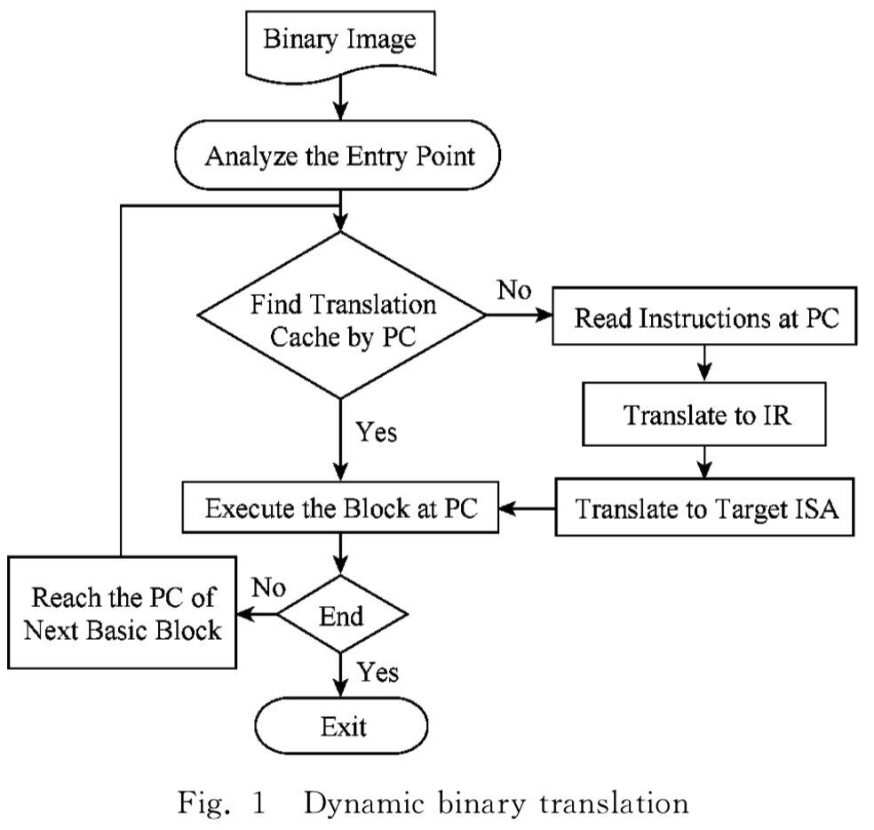
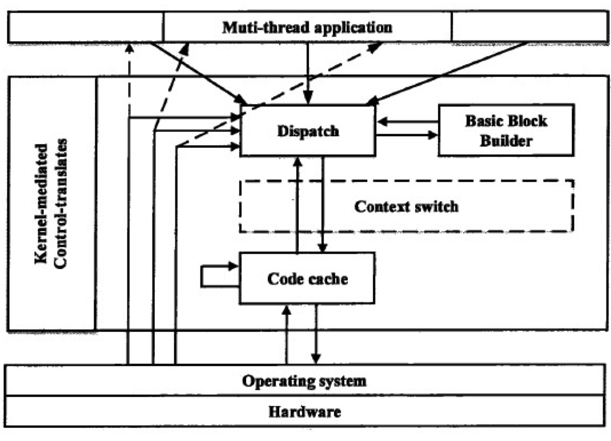
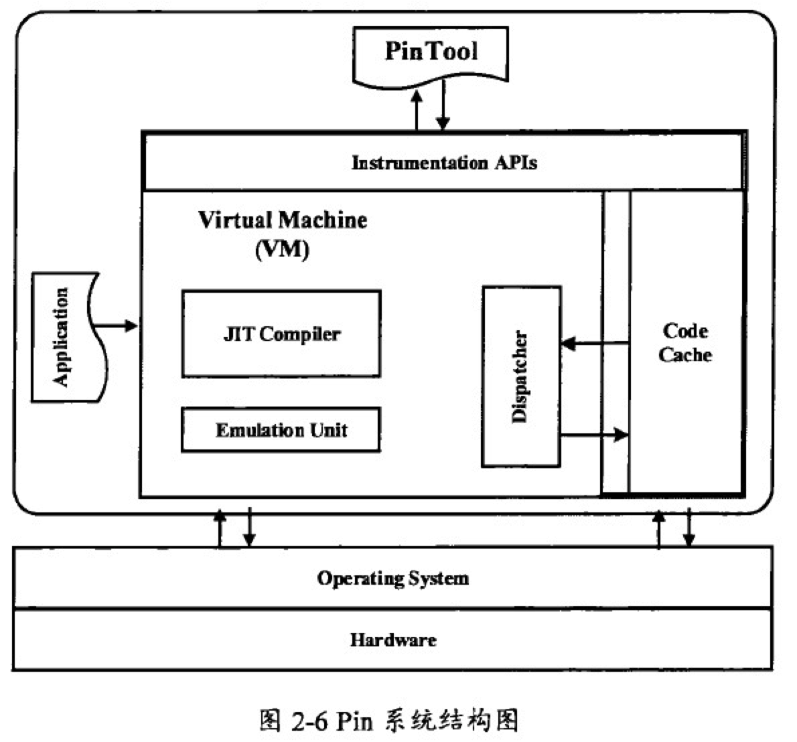

动态二进制工具（DBI）技术允许监控并可能更改正在运行的程序的执行，直至达到指令级别的粒度。 

DBI原语的易用性和灵活性使它们在包括软件安全性在内的不同领域的大量研究中很受欢迎。

人们质疑DBI在安全性方面的适用性：尽管它们不会干扰良性程序，但专门的对手可能会发现它们的存在并打败分析。

A popular instrumentation paradigm is represented by dynamic binary instrumentation. 

# 0. 知网related阅读

动态二进制翻译:

动态二进制翻译在执行时根据程序执行路径以基本块为单位进行实时加载、翻译 、生成目标代码 、执行 、缓 存 管理、代码优化等任务，解决了间接分支指令目的地址不确定性、动态生成代码的翻译问题，具有较好的完备性。

1. 首先，加载二进制镜像文件，二进制文件通常为 ELF，PE 或 者 Linux 内 核 格 式
2. 分 析 指 令 入 口 点 PC(program counter计算机中提供要从存储器中取出的下一个指令地址的寄存器)，完 成 内 存 映 射 、CPU 初 始 化 、虚 拟设备创建等工作，并进入翻译过程 

由于程序运行 的局部性，对已翻译的基本块进行缓存可大大节省 翻译开销

动态二进制翻译在执行某一基本块前，首先从缓存中查找，若该基本块已经翻译，则切换环境 后进入执行阶段;否则，**需要根据当前指令基本块首地址读取指令直到下一条分支指令**，转化为中间代码 (intermediate representation，IR)，最 后 生 成 目 标 指 令 集 (instruction set architecture，ISA )代 码 并 执行.

在二进制插桩的阶段，对需要执行的基本块进行二进制翻译，**在中 间代码阶段，针对特殊的函数调用与返回指令插入 桩指令**;

********

程序插桩技术：

程序插桩技术最大的问题在于，不管采取什么样的技术手段，都会大幅增加程序的运行时开销，这将导致一些对实时性要求很高的程序或者在一些硬件计算能力较差的环境中（比如一些嵌入式程序）无法使用这个技术来进行分析测试，但是随着硬件水平的提高，在很多情况下软件的性能瓶颈不再受限于CPU，很多软件的性能瓶颈在于IO，与插桩技术的便捷性和准确率相比，其带来的额外运行时开销是完全可以接受的。

### 0x01. 静态二进制插桩

静态二进制插桩直接对程序编译之后的二进制机器码进行插桩

由于二进制机器码的平台相关性，大幅降低了插桩程序的可移植性。实际上，由于动态链接库的存在，使用单纯的通过静态二进制插桩的办法对整个程序进行插桩是非常困难的.

### 0x02. 动态二进制插桩

动态二进制插桩在程序运行时，直接接管被测程序并且截获其二进制指令并插入探针。动态二进制插桩并不需要被测程序的源代码，同时还能够对存在于动态链接库里的二进制代码进行插桩。

DynamoRIO运行在应用程序和操作系统之间，创建模拟的应用上下文，运行在DynamoRIO框架上的目标程序使用虚拟的应用上下文，当需要运行在真正的处理器上时，进行上下文的切换，保存虚拟的应用上下文并使用真正的应用上下文。

DynamoRIO主要由三部分组成，分别是基本块构建器、代码缓存器和上下文调度器

架构图：

基本块构建器负责将目标程序划分为基本块并插入检测分析代码，代码缓存器负责缓存已经翻译过的程序基本块代码。

上下文调度器负责截获目标程序的指令流，进行虚拟上下文和实际上下文的切换以及对内存操作等事件的监测。

Pin是一款闭源的二进制插桩平台，但是它拥有活跃的开发者社区，并且提供了丰富的API供开发者用于开发检测分析工具－－Pintool，Pintool以插件的形式与Pin进行交互。

插桩进程主要由三部分组成：目标程序、Pintool和Pin。其中Pin主要由一个进程级别的虚拟机、code cache和instrumentation APIs组成。其中，code cache是对Pin对插桩程序代码基本块 JIT 编译完成之后的缓存。

Instrumentation APIs主要是指由Pin提供的丰富的供开发者使用的插桩接口

虚拟机VM 主要由ＪＩＴ编译器、虚拟执行单元和程序调度器三部分组成。

当Pin接管了被测程序的控制权之后，虚拟机通过协调各个组件来执行程序，首先根据程序的跳转指令和插桩粒度等将程序划分为基本块，并根据Pintool的程序逻辑在特定位置插入分析代码，**JIT 编译器对插桩后的代码进行动态的编译，然后交付给程序调度器调度执行**，还会将编译完成的代码块缓存起来。

**虚拟执行单元负责解释无法直接执行的特殊指令**，主要是为系统调用（system call）准备的，因为系统调用的执行需要虚拟机的特殊处理。

其中插桩代码用于决定在程序的特定位置插入分析代码，分析代码是在插桩处具体执行的代码。

在Pin读取目标程序的二进制代码后，会根据程序的控制流将程序划分为不同的轨迹，每个轨迹只有一个入口，但是通常会有多个出口。因此，在轨迹内部可以**根据程序跳转指令或判断指令将程序进一步划分为基本块（Basic Block）**，在程序进行代码缓存时通常以基本块为单位进行缓存。当程序在当前代码块跳转，到下一个代码块时，Pin 会优先在缓存中查找对应代码块，如果查找成功则直接执行，否则需要 JIT 编译器进行编译生成。

（１）指令级插桩：指令级插桩是指在每一条二进制指令执行时都会在合适的时机插入检测、分析代码，检测粒度更加细致，检测的方式也更加灵活，但是同时会带来更大的运行性能开销。
（２）轨迹级插桩：轨迹级插桩允许Pintool在轨迹／基本块层面进行插入探针。与指令级插桩相比，插桩对象由指令变成了轨迹／基本块。由于轨迹／**基本块 是依据跳转指令／函数返回指令划分的**，同时为了执行 JIT 优化，同一段检测代码可能会被拷贝到多个基本块中进行插桩，因此插桩方式不如指令级插桩灵活，但是与此同时，插桩的执行效率得到了一定的提升。

（３）函数级插桩：函数级插桩具有较高的抽象层次，可以在应用程序的函数层面进行插粧，并且还可以对函数进行包裹和替换，在替换的函数中依然可以正常的调用目标程序中的其他函数。由于函数级插桩需要识别函数边界，因此在目标程序载入时需要读取可执行文件的符号表。同时，函数级插桩并不能针对指令进行细粒度的插桩。

（４）镜像级插桩：镜像级插桩是对可执行程序、动态链接库（如exe程序、dll文件等）进行插桩的，在载入可执行文件或动态链接库时插入检测、分析代码。最简单的插桩

## 1 补充 CPU的unconditional transfer

为什么需要transfer：

**程序代码在程序存储器内按地址来数按序排列**，但程序执行时根据功能不同**不一定顺序执行**，这就需要使用跳转指令指挥CPU到指定地址去执行指令。跳转就是离开当前源地址到另一个地址去工作。

无条件跳转指令就是没任何条件，让你去哪你就去哪：

To implement if-then-else, when you get to the end of the "then" branch, you need to jump unconditionally past the "else" branch. 

The breaks in a C switch statement are also unconditional jumps.

# 2 DYNAMIC BINARY INSTRUMENTATION

DBI = DYNAMIC BINARY INSTRUMENTATION

We can think of a DBI system as an **application virtual machine** that interprets the ISA of a specific platform (usually **coinciding一致的 with the one where the system runs**) while offering instrumentation capabilities to support monitoring and altering instructions and data from an analysis tool component written by the user

A DBI system is an execution run- time running in user space for **process-level virtualization**. An un- modified compiled program executes within the runtime **as would happen in a native execution**

DBI系统的设计目标是使其有可能观察并可能更改被分析程序的整个体系结构状态，包括寄存器值，内存地址和内容以及控制流传输。

为此，大多数流行的DBI实施方案遵循的方法是重新进行动态编译：

the original code of the application is not executed directly, but rather analyzed, in- strumented and compiled using a just-in-time (JIT) compiler.

The compilation unit编译单元 is typically a trace, defined as a straight-line sequence of instructions ending in an unconditional transfer无条件 and possibly with 多个侧出口的条件分支. 

Compiled traces are placed in a code cache, while a dispatcher调度 component coordinates transfers among compiled traces and new fetches from the original code

## 补充 几种编译

1、**动态编译**（dynamic compilation）指的是“在运行时进行编译”；与之相对的是事前编译（ahead-of-time compilation，简称AOT），也叫**静态编译**（static compilation）。

2、*JIT*编译（just-in-time compilation）狭义来说是**当某段代码即将第一次被执行时进行编译**，因而叫“即时编译”。*JIT编译是动态编译的一种特例*。JIT编译一词后来被*泛化*，时常与动态编译等价；但要注意广义与狭义的JIT编译所指的区别。

JVM 与 JIT

