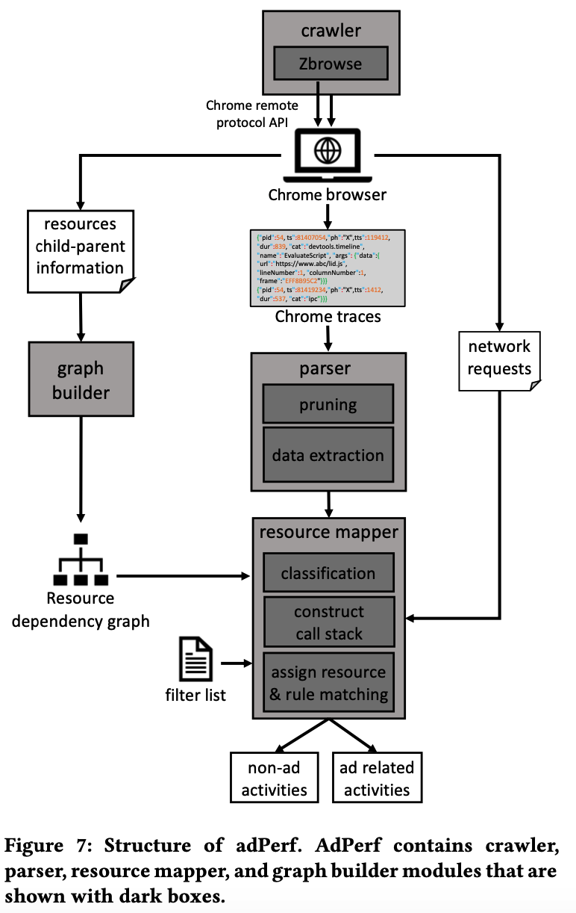
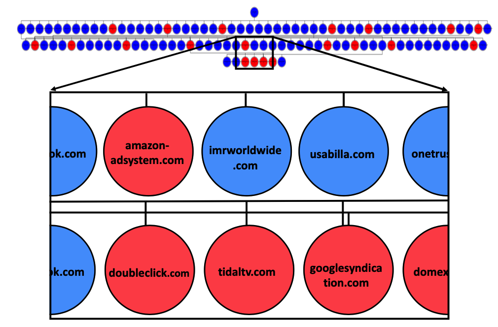

# adPerf:描述第三方广告的性能

鉴于如今的浏览器能够加载带有复杂动画和Javascript的动态网页，在线广告也发生了转变，并会对网页性能产生重大影响。

关于理解在线广告的性能影响的文献研究有限，我们认为这与隐私和安全同样重要。

在本文中，我们应用了一种深入的、首创的网络广告性能评估方法，与之前主要依靠广告拦截器的工作不同，我们对网络浏览器的页面加载过程进行了精细的分析，以解开网络广告性能成本的神秘面纱。

与之前主要依靠广告拦截器的工作不同，我们对网络浏览器的页面加载过程进行了细粒度的分析，以解开网络广告性能成本的神秘面纱。我们的目标是描述一个广告的每一个组成部分的成本特征，因此出版商、广告联盟和广告商可以在详细的指导下改善广告的性能。

For this purpose, we develop an infrastructure, adPerf, for the Chrome browser that classifies **page loading workloads** into **ad-related** and **main-content** at the granularity of browser activities (such as Javascript and Layout).

我们的评估显示，在线广告占浏览器页面加载工作量的15%以上，其中约88%用于JavaScript。

## 1 INTRODUCTION

Today, publishers display one or multiple advertisements (or ads) through pop-ups, banners, click-throughs, iframes, widgets, etc, to monetize their websites and web apps. 这些广告大部分既不来自发布者（网站），也不来自特定的域名。they are delivered through a chain of third-party content providers (such as ad providers, syndication agencies, ad exchange traders, trackers, and analytics service providers) who are part of a complex ad network on the server-side .

目前的广告发布方式迫使发布者在网站上嵌入未知的第三方内容（如JavaScript或HTML），这可能会危及用户的隐私和安全。因此，人们设计了不同的拦截和回避策略来防范此类恶意软件和侵略性跟踪[17，29]。

我们可以观察到，在过去，广告只包括超文本和图像。然而，今天的在线广告由JavaScript、iframe、动画、多媒体等组成。Therefore, evaluating and displaying these dynamic ad contents demand increased computation from the browser. 

现代浏览器的大部分页面加载时间都花在了计算活动上，结合这一观察，我们提出了几个有趣的问题。

- (a)广告增加了浏览器的页面渲染工作负荷有多大? 
- (b)哪种类型的广告内容对网站的性能贡献更大? 加载侵入性广告的性能开销变得更加重要，因为它还会对设备的能耗和用户的互联网账单产生影响。

以往围绕广告性能分析的研究缺乏全面的考察，至少有以下原因。首先，大多数研究集中在网络数据流量开销上，忽视了浏览器计算活动的性能成本，如渲染活动.

 Second, prior efforts fundamentally share the same approach for quantifying the performance of ads. 他们使用广告拦截器来拦截网站的广告内容，并通过与vanilla运行（无广告拦截）的比较来评估性能开销。但这种方法容易出现不准确的情况，因为它没有考虑到广告拦截器的内在开销。

## 2 related work

### 2.1 ad-blockers

our results show that ad-blockers themselves can have **significant performance overhead** due to **exhaustive filter-list matching** and tracking services. 对于一半的网站来说，由于过多的、耗费CPU的过滤规则匹配，Adblock Plus增加了超过32%的页面加载开销。然而，它通过积极的内容屏蔽，最终减少了页面加载时间。

广告拦截器早在网络请求启动时就对内容进行拦截，这导致了两个缺点。首先，**它阻止了浏览器层面的细粒度性能分析**。其次，由于内容在网络请求时就被屏蔽，因此在页面加载过程中，被屏蔽的文档进一步请求的资源就变得不可见，无法进行检查。此外，目前的作品都集中在网络数据流量开销上，忽略了广告的浏览器内计算开销。

我们的方法解决了上述局限性，在不增加大量开销或造成网站崩溃的情况下，可以对广告进行深入的性能分析。因此，与广告相关的活动，如内容解析、渲染和子代资源的加载等，现在都可以看到分析的结果.

### 2.2 performance

通过分析Alexa排名靠前的网页，得出的结论是，计算活动比网络活动对页面加载时间的贡献更大。 computation activities contribute more to the page loading time than network activities.

 we address this challenge of **distinguishing resources by type** and mapping browser activities to resource type for fine-grained performance analysis in this paper.

## 3 BROWSER ARCHITECTURE

Our performance characterization is based on 区分浏览器花在**加载页面主要内容上的工作量（main content ）**和**加载广告内容的额外工作量**。 区分这两种工作量（主要内容与广告内容）需要了解浏览器加载网页的方式。

现代浏览器具有不同的功能和用户界面，但它们基本上采用相同的架构来加载网页。

图5显示了浏览器的高层页面加载工作流程。当用户向浏览器界面提交一个URL请求时，这个过程就开始了。

资源加载器 resource loader 负责发起HTTP请求并从服务器上获取资源（网络活动）。

**一旦资源被下载（增量或全部）**，六个主要的计算阶段（图中绿色显示）评估资源并渲染网站。

这些计算阶段分别是HTML解析（构建DOM）、**Styling（评估样式表并向DOM树添加属性）**、Scripting（响应用户交互和页面的动态行为）、**Layout（评估DOM元素的大小和位置）**、Composite（组合图形层）和Paint（将层映射到像素）。

**Each of these stages might contain multiple sub-tasks or simply referred to as activities**. For example, HTML parsing consists of **byte stream decoding** and preprocessing, tokenizing, and DOM tree construction activities.

计算活动在页面加载过程中经常被浏览器调用。图6展示了加载www.apple.com时浏览器活动的快照。我们可以观察到，在页面加载过程中，有许多这样的活动实例。这些活动的执行顺序是基于页面内容所施加的依赖性。

As we can observe, there are numerous instances of such activities during page load. The order in which these activities are executed is based on the **dependency imposed by the page content**.

For instance, if JavaScript modifies an attribute of a DOM element, this forces the browser to **recalculate the style, update layouts, composite layers, and repaint the screen**. This is commonly known as reflow which can have a significant impact on performance.

如果JavaScript修改了一个DOM元素的属性，就会迫使浏览器重新计算样式、更新布局、复合图层和重新绘制屏幕。这通常被称为回流，会对性能产生重大影响。 However, if the JavaScript only modifies the color of a DOM node, the reflow pipeline bypasses layout and if the change does not modify the graphical layers, the reflow also bypasses compositing. 

如图所示。由于活动之间的依赖性、动态并行化以及浏览器在资源下载和调度任务中的随机行为，每个活动的时间是不确定的。**因此，跟踪浏览器活动之间的依赖关系链，并将活动归属于相应的工作负载类型，即广告或非广告，是一项具有挑战性的任务**。Therefore, tracking the dependency chain between browser activities and **attributing activities to the corresponding workload type**, i.e. ads or non-ads, are challenging tasks.

## 4 METHODOLOGY AND adPerf INFRASTRUCTURE

- First, we **extract all browser activities** that are associated with the **page loading process**.
- Second, we identify **which resource**, i.e. a web document, explicitly or implicitly **initiates each browser activity**. 识别哪些资源，即网页文档，明确或隐含地启动了browser activity
- Third, we **classify** activities into **ads and main content** considering the type of the resource corresponding to each activity. 
- Finally, we **measure** the total execution time spent on **each class of activity** as a performance index distinguishing the workload in each class.

To realize the above methodology, we implement an infrastructure, named adPerf, for the Chrome browser. Note that adPerf can be extended to other browsers as well since the same technique applies to all browser architectures. 

Figure 7 shows the design of adPerf. Below, we describe each module in detail.

adPerf中的第一个模块（图顶）是一个爬虫（Node.js脚本），负责设置无头Chrome和抓取网站。The crawler uses the Chrome remote protocol APIs [6] under the hood to interact with the browser and **streams Chrome traces  to the file**.   ( Chrome traces are primarily used for profiling and debugging the Chrome browser, so they are designed to be low-overhead. Chrome traces能够以微秒级的精度记录浏览器的中间计算活动，包括Blink渲染引擎和V8 JavaScript引擎的页面加载活动。每个跟踪包含一些相关活动的信息，如线程id和函数参数。)

此外，爬虫还会拦截网络请求，即onBeforeRequest事件，并提取每个HTTP请求的头和主体。这些信息将在以后用于资源匹配。

### 4.2 Parser

When the website is loaded, **the raw Chrome traces are fed to the parser as shown in the figure**.

adPerf parser主要完成两个任务。

- 修剪：它通过traces并提取所有的页面加载活动，并修剪那些与浏览器相关的活动（如浏览器垃圾收集和进程间通信活动）。 For instance, the parser considers every trace connected to **script evaluation, V8 script compiling, V8 execution, callback functions triggered by browser events or timeout among others as part of the Scripting stage**.

- Data extraction：对于每个活动，parser提取以下数据：开始时间，结束时间，相对阶段，线程和进程id，以及包含资源信息的函数参数。

  

这些数据对于构建调用栈和将活动归于资源是必要的。

### 4.3 Resource mapper

Once the traces are parsed and categorized, this data along with previously obtained network information is fed to the resource mapper module. 这些数据和以前获得的网络信息就会被送入资源映射器模块。

The task of the resource mapper is to assign each activity to an associated resource. Unfortunately, **we observed that a significant number of traces do not contain any resource information**. Therefore, a key challenge for the resource mapper is to extract this relation.

To address this challenge, the resource mapper first **builds a call stack of activities for every thread **by tracking the start time and end time of activities executed by each thread. 

Figure 8 demonstrates an example activity call stack timeline for a browser thread where activities are shown with boxes：

在构建调用堆栈之后，资源映射器将activity分为两组： **parsing and evaluation** and **tree manipulation and rendering**.

前者包含与资源明确相关的活动，如HTML parsing、image decoding,、stylesheet parsing 和 JavaScript evaluation等直**接对document进行操作的活动**。属于这一类的活动在图中用橙色表示。

后者包含与资源隐含相关的活动（The latter contains activities that implicitly relate to a resource. ）。

These include activities in styling (except stylesheet parsing which belong to the former group), **layout, composite, and paint stages** that deal with the browser’s intermediate data structures (trees) and display. 这些活动包括样式（除了属于前一组的样式表解析）、布局、合成和油漆阶段的活动，这些活动处理浏览器的中间数据结构（树）和显示。**示例中的紫色活动属于这一组**。

Parsing and evaluation：For the majority of the activities in this group, the resource mapper extracts the **resource file information from function parameters** extracted by the parser。

图8中橙色的HTML Parsing and Callback Function are examples of activities that the document on which they parse or evaluate can be determined from frame id and resource file data in their traces. 

但是，少数活动不包含任何资源信息。For activities with unresolved resource files，（图中以橙色和点状纹理显示的活动），资源映射器使用构造的调用堆栈，并跟踪它们的祖先，并将它们与调用者的资源文件相关联。

For example, appendChild JavaScript function is called by updateList and this function along with Compile Script activity are invoked by Evaluate Script activity that is previously assigned to a JavaScript document.

- Tree manipulation and rendering. 对于这个组，我们必须区分不同的资源，这些资源会隐式地触发属于这个组的活动。

  

  For styling activities, we observe that Chrome recalculates styles after the Schedule Style Recalculation event is fired.从图8中可以看出，这个事件是在解析和评估一个试图修改DOM节点样式的资源（通常是JavaScript文档）的过程中被触发的。**We track the call stack for this event（也就是 Schedule Style Recalculation event ）** to the initiated parsing and evaluation activity and relate this styling activity to the triggered document. 

  

  Similarly, for layout, Chrome updates layout tree when **Layout Invalidate event is fired**. In our example, this is fired when the command this._util.elem.innerHTML=e is executed in the Insert- Before() function. We use a similar procedure as styling to relate **layout activities** to the **initiating resource** from the call stack of the Layout Invalidate event.

  

  注意，浏览器不一定会在事件触发后立即更新节点的样式style和布局layout。根据任务调度器队列中其他活动的优先级，浏览器可能会在稍后调度这些活动。

  因此，当一个资源触发了这两个事件中的一个（Schedule Style Recalculation或Layout Invalidate），在浏览器更新树之前，第二个资源可能会再次触发这两个事件中的一个。**在这种情况下，我们将第一个资源视为启动器，因为即使在没有第二个资源的情况下，树也会被遍历和更新**。

  Chrome tends to composite合成 and/or paint immediately after styling or layout which leads to repaint.

  

  Therefore, the associated resource for the composite and paint activities simply derives by following the chain to the last executed styling or layout activity as shown by the red arrows in the figure.

Once **page loading activities** have been assigned to the **resources**, adPerf uses network data from the crawler to **link the resources** to the associated network requests (i.e. URLs). 

 Then it uses a filter list to distinguish between ad resources and non-ad resources. We use EasyList [7], the primary and most popular filter rules list for advertisements, for our experiments. 人们可能会认为，由于我们的方法论使用了与广告拦截器相同的规则匹配过程，因此可能会产生类似的开销。然而事实并非如此，因为adPerf中的规则匹配是被动的，不会从页面加载过程中窃取计算周期。最后，adPerf会报告按广告和非广告分类的页面加载活动的执行时间。

### 4.4 制图器
网站上的资源之间存在着依赖关系。例如，假设一个网站从第三方域下载了一个JavaScript文件。在这个文件中，它可以进一步从另一个域中请求一个图片或一个HTML文档，这个链条可以更深入。要评估不同资源（如广告域）的性能成本，并进一步评估其可信度（第6节），需要首先追踪这个资源依赖链，并建立一个资源依赖图。

我们使用Zbrowse[14]提取网站的资源之间的依赖关系。Zbrowse利用Chrome devTools协议，允许我们对Chrome浏览器进行检测、检查和调试。Zbrowse exploits Chrome devTools protocol that allows us to **instrument, inspect, and debug the Chrome browser**.  It also generates the **child-parent relation for every network request**. 

我们将Zbrowse嵌入到adPerf爬虫模块中，如图7所示。这样一来，我们在抓取网站时，就可以同时提取资源的子-父数据。（This way, we can extract the resources child-parent data at the same time when we crawl the websites.）

图形构建模块使用Zbrowse的输出并构建资源的依赖关系图。In cases where third-party JavaScript gets loaded into a first-party context and makes an AJAX request, the HTTP referrer appears to be the first-party. 由于一个资源可以反过来请求多个资源，所以构建的图具有树的形状，而不是简单的依赖链。

 

## 6 RESULTS AND DISCUSSION

In this section, we analyze the performance cost of ads both at the level of the ad domains (close to the origin) and deeper in the browser (close to the metal). 

首先，我们使用adPerf分析网站上广告的性能成本，按计算computation（即渲染引擎）和网络（即资源加载器）所产生的成本进行分解。

然后，我们再深究一个层次，进一步了解哪些计算阶段和哪些网络资源分别对计算和网络广告成本贡献较大。最后，我们放大并分析广告域ad domains本身，以解读它们对网络广告性能成本的贡献。

### 6.1 Computation cost of ads

对于每一个网站，我们计算出广告相关活动所花费的时间占总活动（广告+非广告）的比例

发现1. 根据图示，网络广告对网站的performance有很大影响。例如，一半的新闻网站在广告上花费的计算工作量超过15%。有趣的是，其中20%的网站在广告上花费的时间超过了30%，这从用户的角度来说是很令人担忧的。这也促使网站建设者和广告提供商优化广告内容。与新闻网站相比，广告在一般语料库中的成本较低。在这个语料库中，中位数是5%。

Finding 2. The figure presents another interesting detail when we compare the landing and post-click page graphs. Ads have a higher performance cost when loading the landing page versus the post-click page of news websites by about 25% on average.广告在加载登陆页面与新闻网站的点击后页面时，性能成本较高，平均高出25%左右。

广告计算成本的明细。由于我们观察到广告会对网站的加载产生重大影响，因此值得探讨这种开销来自哪里。这将使网站建设者和广告提供商能够将他们的优化工作集中在那些是性能损失主要来源的活动上。相应地，我们根据浏览器阶段的颗粒度对广告的计算成本进行分类（在第3节中概述）。

发现3。从图11我们可以观察到，脚本对广告的计算成本影响最大，超过88%。顺带一提，它对整个页面加载的计算工作量也有很大影响（73%）。

Incidentally顺带一提, it also has a significant impact (73%) on the computation workload of the entire page load. The difference between these two metrics indicates that ads are more scripting heavy than the total workload.

### 6.2 Network cost of ads

除了计算活动，加载广告会对网络活动造成开销（loading ads imposes overhead on the network activities）。为了衡量广告在网络上的性能成本，对于每个网站，**我们计算获取广告相关资源所花费的时间与获取所有请求资源所花费的总时间之比**。

