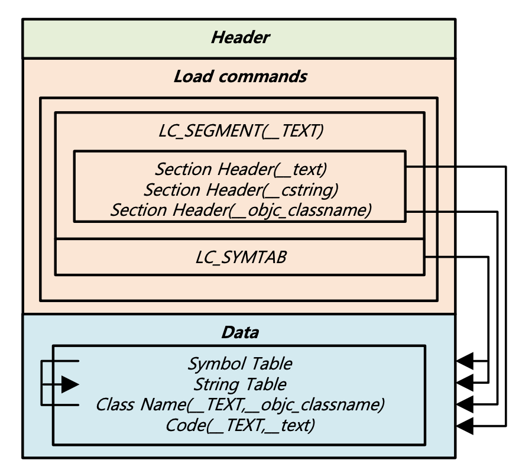
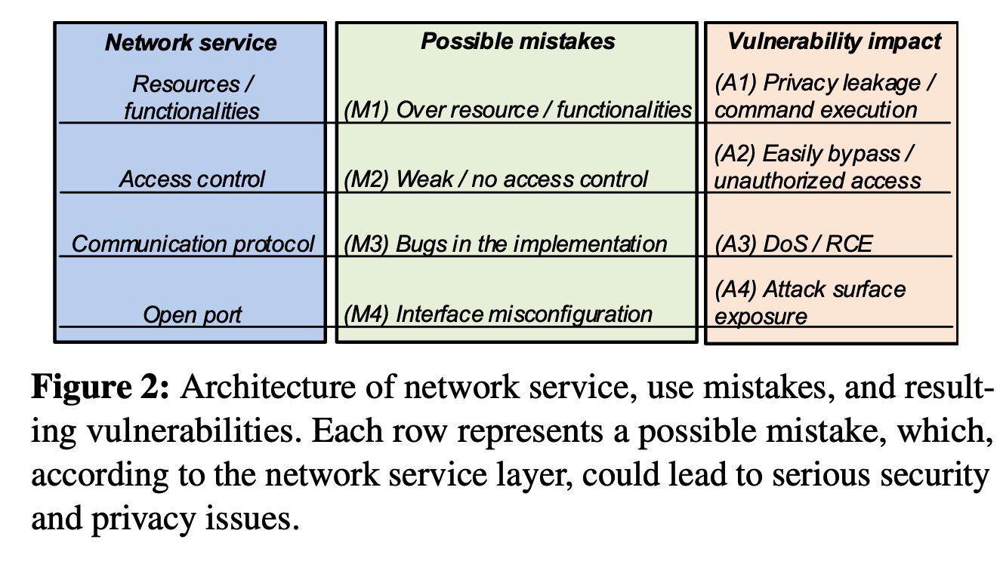
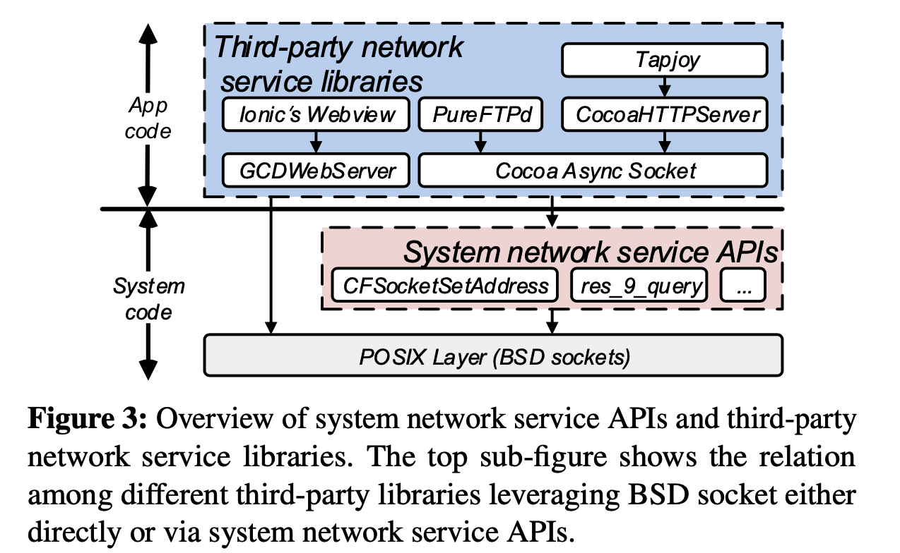
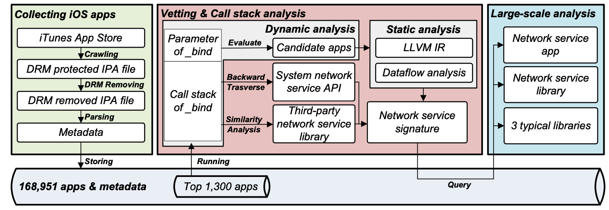

## 摘要

侦听网络连接的智能手机应用程序会给用户带来严重的安全和隐私威胁。在本文中，我们专注于审查和分析iOS应用程序的网络服务的安全性。

为此，我们开发了一种高效且可扩展的iOS应用程序收集工具。我们调查了1300个应用程序集合，以了解网络服务漏洞的特征，并确认了Waze，Now和QQBrowser等流行应用程序中的11个漏洞。From these vulnerabilities, we create signatures for a large-scale analysis of 168,951 iOS apps, which shows that the use of certain third-party libraries listening for remote connections is a common source of vulnerable network services in 92 apps. 

这些漏洞使iOS设备面临许多可能的攻击，包括数据泄漏，远程命令执行和拒绝服务攻击。


## 介绍

iOS’s network architecture is built on top of BSD sockets. When acting as a resource provider, the app turns the iOS device into a server to provide services to a client once a connection is established. 

苹果通过Bonjour协议鼓励不同组件之间的网络连接，该协议向客户端广播网络服务。尽管Apple在将第三方应用程序发布到iTunes App Store之前先对其进行了审核，但审核过程主要集中在检测恶意应用程序而不是网络服务漏洞上。


在这项工作中，我们第一个提出了iOS应用程序网络服务的审查方法。

与Android应用程序相比，以下三个要素使对iOS应用程序的审查和分析在技术上更具挑战性。 

 (i) Android apps are easy to collect and analyze; however, a public repository of iOS apps is not readily available due to the closed nature of Apple’s app ecosystem. 

(ii) 用于自动分析iOS应用程序（在Objective-C或SWIFT中实现）的实用程序分析工具不如用于Android的工具（用Java编写）开发得那么好或种类繁多[26，45，77]。 

 (iii) Android应用程序中代码的结构高度结构化，但iOS代码的边界模糊不清，导致先前用于Android应用程序中第三方库标识的方法[27、48、76]无法在iOS应用程序上正常运行。


First, to collect and analyze apps, we need to download, decrypt, and parse the executable。该过程利用iTunes独特的下载界面和特殊的解密方法来加快应用程序的收集速度。我们的收集方法每天仅使用两个Apple帐户和两个越狱的iOS设备即可下载和解密5,000多个应用程序，与过去的工作相比，providing better scaling up of tasks with lower latency than past works [62, 67].

收集后，我们解析iOS应用程序，获取应用程序的元数据，并将其输入搜索引擎中进行检索和后续分析。其次，为了提高审查结果的准确性和效率，we write an “addon” which evaluates the network interface on the fly. 


为了加速自动分析，we leverage an on-demand inter-procedural [70] data-flow analysis tool to restore the implicit call introduced by the message dispatch property [24] of Objective-C or SWIFT runtime. 


*Third*, to deal with the obscure（模糊的;含糊的;不明确） documentation of system and third-party network services, we propose a call stack based collection method that overcomes the limitations of the current class-clustering based third-party library identification [67]. 我们提出了一种基于调用堆栈的收集方法，该方法克服了当前基于 聚 类的第三方库标识的局限性

In our method, we first identify system network service APIs by traveling the call stack of each app; **then third- party network service libraries can be distinguished through similarity analysis** on the runtime call stack.


为了分析种子应用程序，我们采用“动态优先，静态优先，最后手动确认”的审查方法。动态分析可以大规模检查配置错误的网络接口。然后，可以使用比较耗时的静态分析对潜在的漏洞执行细粒度的检查。最后，手动确认涉及验证静态分析结果。


In addition, the precise call stack of _bind collected by dynamic analysis can be used for the identifica- tion of APIs and libraries.


The key contributions of this paper are as follows:

- An efficient iOS app collection tool. To facilitate our analysis, we introduce an iOS app collection tool thanks to the use of the headless-downloader and executable decryption.      The headless-downloader enables us to download .ipa files from iTunes App Store fluently. The executable decryption we developed does not need to upload large .ipa files to iOS devices, install apps, or download en- tire decrypted .ipa files from iOS devices. 两台iOS设备就可以每天解密超过5,000个应用程序，与采用最新技术的方法相比，数据收集的可伸缩性提高了17倍。 [62]。如此庞大的iOS应用程序数据集的收集是重要的资源，并且也是将来研究的有用基准。

- 我们用动态分析来收集每个应用程序的调用堆栈。根据调用堆栈信息，我们通过向后移动（traveling）堆栈来提取系统API，通过比较源自堆栈的令牌来识别第三方网络服务库。By taking signatures of the network services, we systematically characterize network services in iOS ecosystem, including the prevalent 普遍的 usage of network services of iOS apps, the distribution of network services across app categories, and the association of these network services.
  
- New vulnerabilities of iOS apps identified. 


## 2 Background and Threat Model

### 2.1 The Structure of iOS Apps

iOS应用是一个存档文件（即.ipa）which stores an Application Bundle including Info.plist file, executable, resource files, and other support files. 

为了进行数字版权管理（DRM），Apple使用.supp文件，其中包含.ipa文件中的密钥，以对可执行文件进行解密。**The executable in the Application Bundle is encoded in Mach-O format [68] consisting of three parts: Header, Load commands, and Data. **


Figure 1: The simplified inner structure of a Mach-O file:



The Load commands region of a Mach-O file contains multiple segments and each segment specifies a group of sections. Each section within is parallel, such as the instructions in the __text section, C string in the __cstring section, and Objective-C class object name in the ** __objc_classname section. In particular, instructions in the __text section are encoded with the ARM/THUMB instruction set**. The simplified Mach-O format file is depicted in Figure 1.


For security purposes, an iOS app’s interactions with the file system are limited to the **directories inside the app’s sandbox directory:**


During the installation of a new app, the installer creates **a bundle container directory** that holds the Application Bundle, whereas但是 the **data container directory holds runtime generated data of the app**. 

The bundle container directory and the data container directory reside in two randomly generated directories. 

For such design, if the root folder of a vulnerable network service is set to a bundle container directory, files within Application Bundle will be exposed. 随机生成的目录缓解了路径遍历威胁。


### 2.2 Network Services of iOS Apps

A network service is built on an API or a library that provides networked data storage, or other online functionality to applications. 

A bottom-up network service is defined as having “open port,” “communication protocol,” “access control,” and “resources/functionalities” layers (see Figure 2). 




As for the architecture of the network service of iOS apps, **both system and third-party network service libraries are directly or indirectly built on top of BSD sockets** (see Figure 3). 




Figure 3, iOS wrapped the BSD sockets for developers to facilitate the development of network services.  例如，Core Foundation框架中的系统API _CFSocketSetAddress [25]桥接对BSD套接字的访问。基于此API，开发人员可以在网络协议栈的TCP层之上组成各种应用程序，以提供网络服务。

如图3的蓝框所示。通常，第三方库提供的网络服务在网络协议堆栈的应用程序层上运行。


### 2.3 Threat Model

Previous works [55, 80] classified Android network service adversaries to local, remote, and web adversaries. 

但是，在我们的研究中，我们不考虑由本地安装在设备上的恶意应用（即local）进行攻击，也不通过诱使受害者浏览启用JavaScript的网页（即web adversaries.）来进行攻击。This paper focuses on more practical remote adversaries .

To find a potential victim, a remote adversary can scan and examine the network by designating指定 specific port numbers .

这个攻击者随后compares the **banner** returned from the connected server (i.e., a network service of the iOS app) .If the banner is expected, the adversary then confirms the real victim and can mount a remote 0-click attack, such as stealing personal information for profit.  

```
什么是Banner：

Banner is a specific message to uniquely identify a network service. 
For instance, after connected to the network service of the Waze app, **a client will receive the message “WL” from the server**.
```


图2显示了每一层都允许不同的远程攻击：

（i）如果激活了网络服务并且“开放端口”配置错误，则该接口将暴露出来。 

（ii）通常以通用语言C / C ++编写的“通信协议”执行不当，可能会导致应用程序发生DoS或RCE [5，17，74]。 （iii）“访问控制”不足会导致对网络资源/功能的未经授权的访问。





## 4 Vetting Methodology

在本节中，我们介绍审查方法（请参见图4的红色框）


### 4.1 Dynamic Analysis

Dynamic analysis is used to check for remote accessible net- work interfaces in the wild. 具体来说，我们使用动态分析来检查哪个应用程序利用了网络服务，and analyze the interface of the network service while preserving the call stack of the app.


**检查APP是否提供网络服务**

我们利用动态分析来检测应用程序是否提供网络服务。

To provide network services, the standard process in light of POSIX Layer is to

*(i)* create a socket, 

*(ii)* bind it to a port, 

 *(iii)* begin listening for incoming connections on that port. 


To study the interface of a network service, we implement an “addon” for jailbroken越狱的 iOS devices by using Cydia Substrate [72]. 

The “addon” redirects the _bind API calls initiated by each analyzed app to the vetting code.

 As discussed in Section 2.3, we only consider remote adversaries because they are more practical threats to the apps. Therefore, by parsing parameters of _bind API, **if the app uses the loopback interface**环路地址不考虑 (e.g., *127.0.0.1*), the vetting code consid-ers the app as safe and terminates the analysis. 

For the apps that use the LAN interface, for example, a developer passes a parameter *192.168.1.3* to _bind API, the vetting code in “addon” reports the app is accessible (i.e., a candidate app). We later run static analysis on these apps to vet the security of the network service.


**Call stack extraction.**

**We carry out call stack extraction for generating unique signatures so we can identify system APIs and third-party libraries relevant to network services**. 


For any active app, iOS maintains the runtime return address of a routine in a data structure known as the *call stack*. 对 于任何活动的应用程序，iOS在称为“调用堆栈”的数据结构中维护例程的运行时返回地址。

The call stack, filled with pointers, is depicted in the left-top box of Figure 8, where pointers indicate the site to which the routine should return when its execution is completed.  其中的指针指示例程在执行完成后应返回的位置。

由于API bind是设置网络服务的先决条件，因此要分析到达_bind API的呼叫跟踪，在分析网络服务的接口时，我们的“插件”会保留call stac。

The pointer in the call stack varies due to the Address Space Layout Randomization (ASLR) security mechanism of the iOS system. 调用堆栈中的指针因iOS系统的地址空间布局随机化（ASLR）安全机制而异。

为了将调用堆栈中的运行时浮动指针映射到静态可执行文件的具体偏移量，将保留可执行文件的ASLR值。


### 4.2静态分析和手动确认

We note that only network services behind the LAN interface can reach the static code analysis. 

通过使用静态分析，通过使用规则进一步缩小候选应用程序的范围。然后手动确认静态分析结果。


在iOS应用程序开发过程中，开发人员使用Objective-C和C或SWIFT的组合来编写应用程序。为了自动分析Objective-C和SWIFT二进制文件，我们选择进一步优化开源框架[49], which is a static slicer for inter-procedural data-flow analysis on LLVM IR of 64-bit ARM binary.


具体来说，分析iOS应用程序涉及三个阶段，即通过使用DAGGER [9]将机器码反编译为LLVM IR，优化IR和对IR进行切片。


LLVM 提供了一个详细的汇编语言表示:

https://zhuanlan.zhihu.com/p/66793637


为了使该框架适应我们的分析任务，我们尝试从以下几个方面增强该框架。

(i) 我们向反编译器补充了更多ARM指令的语义。

(ii) To speed up the performance, the on-demand inter- procedural analysis starts analyzing the function enclosing把…围起来 the reference to the expected class object name or method name of a network service API.

 After slicing on the function and the callees (functions) are solved, it **takes in all identified callees** to start another slicing iteration. This strategy significantly reduces the *n* of point-to analysis.

 

