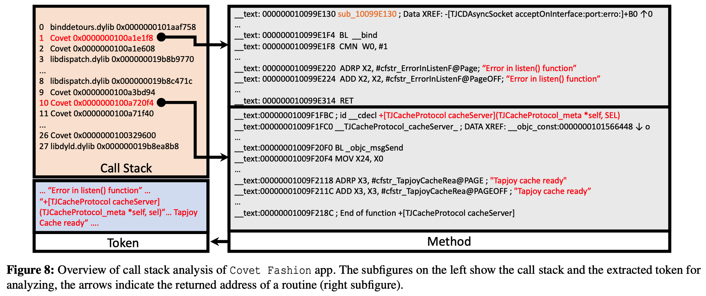

## 摘要

侦听网络连接的智能手机应用程序会给用户带来严重的安全和隐私威胁。在本文中，我们专注于审查和分析iOS应用程序的网络服务的安全性。

为此，我们开发了一种高效且可扩展的iOS应用程序收集工具。我们调查了1300个应用程序集合，以了解网络服务漏洞的特征，并确认了Waze，Now和QQBrowser等流行应用程序中的11个漏洞。From these vulnerabilities, we create signatures for a large-scale analysis of 168,951 iOS apps, which shows that the use of certain third-party libraries listening for remote connections is a common source of vulnerable network services in 92 apps. 

这些漏洞使iOS设备面临许多可能的攻击，包括数据泄漏，远程命令执行和拒绝服务攻击。


## 总结

First, to collect and analyze apps, we need to download, decrypt, and parse the executable, a process that leverages iTunes’ unique download interface with a special decryption method to expedite app collection. 我们的收集方法只需要使用两个苹果账号和两台越狱的iOS设备，每天就可以下载和解密超过5000个应用，


Second, to improve the accuracy and efficiency of our vetting results, we write an “addon” which evaluates the network interface on the fly. To expedite the automated analysis, we leverage an on-demand inter-procedural [70] data-flow analysis tool to restore the implicit call introduced by the message dispatch property [24] of Objective-C or SWIFT runtime.


Third, to deal with the obscure documentation of system and third-party network services, we propose a call stack based collection method that overcomes the limitations of the current class-clustering based third-party library identification [67]. In our method, we first identify system network service APIs by traveling the call stack of each app; then third- party network service libraries can be distinguished through similarity analysis on the runtime call stack.


## 介绍

iOS’s network architecture is built on top of BSD sockets. When acting as a resource provider, the app turns the iOS device into a server to provide services to a client once a connection is established. 

苹果通过Bonjour协议鼓励不同组件之间的网络连接，该协议向客户端广播网络服务。尽管Apple在将第三方应用程序发布到iTunes App Store之前先对其进行了审核，但审核过程主要集中在检测恶意应用程序而不是网络服务漏洞上。


在这项工作中，我们第一个提出了iOS应用程序网络服务的审查方法。

与Android应用程序相比，以下三个要素使对iOS应用程序的审查和分析在技术上更具挑战性。 

 (i) Android apps are easy to collect and analyze; however, a public repository of iOS apps is not readily available due to the closed nature of Apple’s app ecosystem. 

(ii) 用于自动分析iOS应用程序（在Objective-C或SWIFT中实现）的实用程序分析工具不如用于Android的工具（用Java编写）开发得那么好或种类繁多[26，45，77]。 

 (iii) Android应用程序中代码的结构高度结构化，但iOS代码的边界模糊不清，导致先前用于Android应用程序中第三方库标识的方法[27、48、76]无法在iOS应用程序上正常运行。


First, to collect and analyze apps, we need to download, decrypt, and parse the executable。该过程利用iTunes独特的下载界面和特殊的解密方法来加快应用程序的收集速度。我们的收集方法每天仅使用两个Apple帐户和两个越狱的iOS设备即可下载和解密5,000多个应用程序，与过去的工作相比，providing better scaling up of tasks with lower latency than past works [62, 67].

收集后，我们解析iOS应用程序，获取应用程序的元数据，并将其输入搜索引擎中进行检索和后续分析。其次，为了提高审查结果的准确性和效率，we write an “addon” which evaluates the network interface on the fly. 


为了加速自动分析，we leverage an on-demand inter-procedural [70] data-flow analysis tool to restore the implicit call introduced by the message dispatch property [24] of Objective-C or SWIFT runtime. 


Third, to deal with the obscure（模糊的;含糊的;不明确） documentation of system and third-party network services, we propose a call stack based collection method that overcomes the limitations of the current class-clustering based third-party library identification [67]. 我们提出了一种基于调用堆栈的收集方法，该方法克服了当前基于 聚 类的第三方库标识的局限性

************


在我们的方法中，我们首先通过travel每个应用的调用栈来识别系统网络服务API；**然后通过对运行时调用栈的相似性分析来区分第三方网络服务库**。

我们从一组1300个应用开始分析，我们将其称为 "种子应用"。种子应用程序用于了解网络服务漏洞的特征，并提取签名，以便对网络服务进行大规模分析。


为了分析种子应用程序，我们采用“动态优先，静态优先，最后手动确认”的审查方法。动态分析可以大规模检查配置错误的网络接口。然后，可以使用比较耗时的静态分析对潜在的漏洞执行细粒度的检查。最后，手动确认涉及验证静态分析结果。


```
In addition, the precise call stack of _bind collected by dynamic analysis can be used for the identification of APIs and libraries. 
```


Knowledge gained from seed apps is then applied to the large-scale analysis, including measuring the distribution of network services of iOS apps, finding the association of network service libraries, and fine-grained analysis on three typical libraries. 


## 2 Background and Threat Model

### 2.1 The Structure of iOS Apps

iOS应用是一个存档文件（即.ipa）which stores an Application Bundle including Info.plist file, executable, resource files, and other support files. 

为了进行数字版权管理（DRM），Apple使用.supp文件，其中包含.ipa文件中的密钥，以对可执行文件进行解密。**The executable in the Application Bundle is encoded in Mach-O format [68] consisting of three parts: Header, Load commands, and Data. **


For security purposes, an iOS app’s interactions with the file system are limited to the **directories inside the app’s sandbox directory:**


During the installation of a new app, the installer creates **a bundle container directory** that holds the Application Bundle, whereas但是 the **data container directory holds runtime generated data of the app**. 

The bundle container directory and the data container directory reside in two randomly generated directories. 

For such design, if the root folder of a vulnerable network service is set to a bundle container directory, files within Application Bundle will be exposed. 随机生成的目录缓解了路径遍历威胁。


### 2.2 Network Services of iOS Apps

A network service is built on an API or a library that provides networked data storage, or other online functionality to applications. 

A bottom-up network service is defined as having “open port,” “communication protocol,” “access control,” and “resources/functionalities” layers (see Figure 2). 


在iOS应用的网络服务架构方面，无论是系统还是第三方网络服务库，都直接或间接地构建在BSD套接字之上（见图3）。如图3的虚线、粉色方框所示，iOS将BSD套接字封装起来，方便开发者开发网络服务。例如，Core Foundation框架中的系统API _CFSocketSetAddress[25]是访问BSD套接字的桥梁。基于该API，开发者可以在网络协议栈的TCP层之上编译各种应用程序，提供网络服务。此外，还有很多第三方网络服务库可供开发者使用，如图3的蓝框所示。一般来说，第三方库提供的网络服务都是在网络协议栈的应用层上运行的。


### 2.3 Threat Model

Previous works [55, 80] classified Android network service adversaries to local, remote, and web adversaries. 

但是，在我们的研究中，我们不考虑由本地安装在设备上的恶意应用（即local）进行攻击，也不通过诱使受害者浏览启用JavaScript的网页（即web adversaries.）来进行攻击。This paper focuses on more practical remote adversaries .

To find a potential victim, a remote adversary can scan and examine the network by designating指定 specific port numbers .

这个攻击者随后compares the **banner** returned from the connected server (i.e., a network service of the iOS app) .If the banner is expected, the adversary then confirms the real victim and can mount a remote 0-click attack, such as stealing personal information for profit.  

```
什么是Banner：

Banner is a specific message to uniquely identify a network service. 
For instance, after connected to the network service of the Waze app, **a client will receive the message “WL” from the server**.
```


图2显示了每一层都允许不同的远程攻击：

（i）如果激活了网络服务并且“开放端口”配置错误，则该接口将暴露出来。 

（ii）通常以通用语言C / C ++编写的“通信协议”执行不当，可能会导致应用程序发生DoS或RCE [5，17，74]。 （iii）“访问控制”不足会导致对网络资源/功能的未经授权的访问。


## 3 iOS APP 收集的方法

在苹果iTunes上收集应用和元信息并不是一件简单的事情，iTunes对应用收集实施了各种限制，比如为限制自动抓取方法的请求数量设置上限。

Current iOS app downloading methods are UI manipulation [67] and in-device app crawler 。它们通过使用Clutch[6]、dumpdecrypted[10]或Frida[8]扩展frida-ios-dump[20]来解密可执行文件。


In this section, we describe our method for collecting iOS apps IDs, downloading the .ipa file from iTunes, removing DRM protection to get decrypted executable, and parsing executable. 

我们的方法由以下三个模块组成（见图4的绿框）:

- Collecting IDs and downloading apps from iTunes.  iTunes上的每个iOS应用都有一个唯一的标识符（即ID）。例如，Instagram的唯一标识：389801252，可以通过这个ID从iTunes中访问。基于iTunes搜索API[13]，我们递归地收集ID列表。例如，下面的请求会返回 "生产力 "类别中前20个应用的元信息，如ID和应用名称。

```
https://itunes.apple.com/search?term=productivity&country=u s&media=software&limit=20.
```

- Decrypting the executable. 为了研究代码，我们需要对下载的应用的可执行文件进行解密。
- Parsing the executable. 为了方便后续的分析和分享我们的数据集做进一步的研究，我们使用JTOOL[14]对可执行文件进行解析，并提取相关的元数据，如可执行文件中的类名和字符串。同时也提取了Info.plist中的数据，如 "CFBundleIdentifier "字段中的bundle ID或 "CFBundle- Name "字段中的应用程序名称。


## 4 Vetting Methodology

在本节中，我们介绍审查方法（请参见图4的红色框）

In this section, we introduce the vetting methodology (see the red box of Figure 4), which consists of dynamic analysis (cf. § 4.1) to select candidate apps, obtain a call stack from each app, static analysis and manual confirmation (cf. § 4.2) to scrutinize the network services of the candidate apps. 


### 4.1 Dynamic Analysis

Dynamic analysis is used to check for remote accessible net- work interfaces in the wild. 具体来说，我们使用动态分析来检查哪个应用程序利用了网络服务，and analyze the interface of the network service while preserving the call stack of the app.


**检查APP是否提供网络服务**

我们利用动态分析来检测应用程序是否提供网络服务。

要提供网络服务，在POSIX层(见图3)的标准流程是：

(i)创建socket，

(ii)将其绑定到一个端口，

(iii)开始监听该端口上的传入连接。

在这个过程的第二步，即调用_bind API，开发者可以向_bind API传递丰富的参数，表示网络服务的属性，通过指定网络接口为环回，用于本地主机访问，或LAN，用于Wi-Fi/蜂窝网络的远程访问，来限制网络服务的访问范围。


To study the interface of a network service, we implement an “addon” for jailbroken越狱的 iOS devices by using Cydia Substrate [72]. 

**The “addon” redirects the _bind API calls initiated by each analyzed app to the vetting code**.

在这里，通过解析_bind API的参数，如果应用程序使用环回接口(例如127.0.0.1)，审核代码认为应用程序是安全的并终止分析。对于使用局域网接口的应用，例如，开发者将一个参数192.168.1.3传给_bind API，则审核代码在
"addon "报告该应用可以访问（即候选应用）。之后我们对这些应用进行静态分析，以审核网络服务的安全性。





**Call stack extraction.**

 We carry out call stack extraction for generating unique signatures so we can identify system APIs and third-party libraries relevant to network services. 

对于任何活动的应用，iOS都会在一个被称为call stack的数据结构中维护例程的运行时返回地址。图8的左上角方框中描述了充满指针的调用栈，其中指针表示例程执行完成后应该返回的站点。

For any active app, iOS maintains the runtime return address of a routine in a data structure known as the *call stack*. 对 于任何活动的应用程序，iOS在称为“调用堆栈”的数据结构中维护例程的运行时返回地址。


由于API _bind是建立网络服务的前提条件，为了分析到达_bind API的调用跟踪，在分析网络服务的接口时，调用栈被我们的 "插件 "保留了下来。由于iOS系统的地址空间布局随机化(ASLR)安全机制，调用栈中的指针会发生变化。为了将调用栈中的运行时浮动指针映射到静态可执行文件的具体偏移量，保留了可执行文件的ASLR值。

In order to map the runtime floating pointers in the call stack to the concrete offset of the static executable, the ASLR value for the executable is preserved.


#### 补充 ASLR：

ASLR (Address Space Layout Randomization)，即地址空间随机布局。大部分主流的操作系统都已实现了 ASLR，以防范对已知地址进行恶意攻击。iOS 从 4.3 开始支持 ASLR，Android 从 4.0 也支持了 ASLR 机制。


采用ASLR技术，进程每次启动时，地址空间都会被简单地随机化——只是偏移，不是搅乱。实现方式是通过内核将Mach-O的段“平移”某个随机数。

简单的说，就是让可执行文件在内存中每次运行的初始地址不一样，提高逆向的难度。


Mach-O 文件的文件头会记录二进制的属性标识，有个 flag 叫做 PIE (Position Independent Enable)。开启了 PIE 的二进制文件，在执行时会产生 ASLR 。


我们可以使用 otool 工具，来查看任意应用程序二进制文件的属性，以支付宝为例：
`otool -hv Portal`


有 PIE 标识，表示该程序在启动时会产生随机地址布局。


### 4.2 静态分析和手动确认

只有LAN接口后面的网络服务才能达到静态代码分析。动态分析会选择提供网络服务的候选应用，排除使用环回网络接口的应用。接下来，通过静态分析，使用规则进一步缩小候选应用的范围。然后手动确认静态分析结果。


在iOS应用程序开发过程中，开发人员使用Objective-C和C或SWIFT的组合来编写应用程序。为了自动分析Objective-C和SWIFT二进制文件，我们选择进一步优化开源框架[49], which is a static slicer for inter-procedural data-flow analysis on LLVM IR of 64-bit ARM binary.


具体来说，分析iOS应用程序涉及三个阶段，即通过使用DAGGER [9]将机器码反编译为LLVM IR，优化IR和对IR进行切片。


LLVM 提供了一个详细的汇编语言表示:

https://zhuanlan.zhihu.com/p/66793637


为了使该框架适应我们的分析任务，我们尝试从以下几个方面增强该框架。

(i) 我们向反编译器补充了更多ARM指令的语义。

(ii) To speed up the performance, the on-demand inter- procedural analysis starts analyzing the function enclosing把…围起来 the reference to the expected class object name or method name of a network service API.

 After slicing on the function and the callees (functions) are solved, it **takes in all identified callees** to start another slicing iteration. This strategy significantly reduces the *n* of point-to analysis.

 

