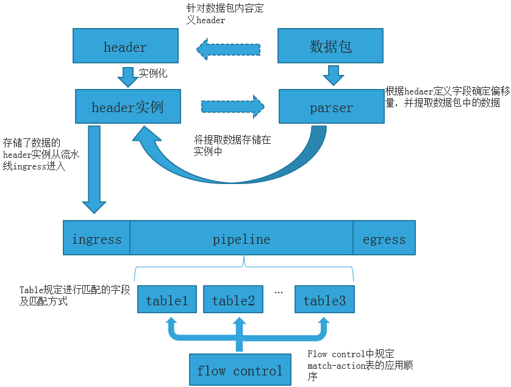
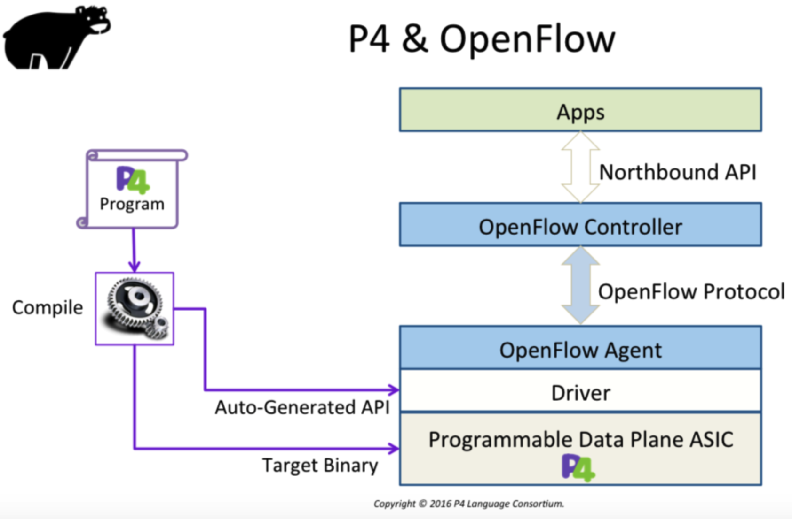
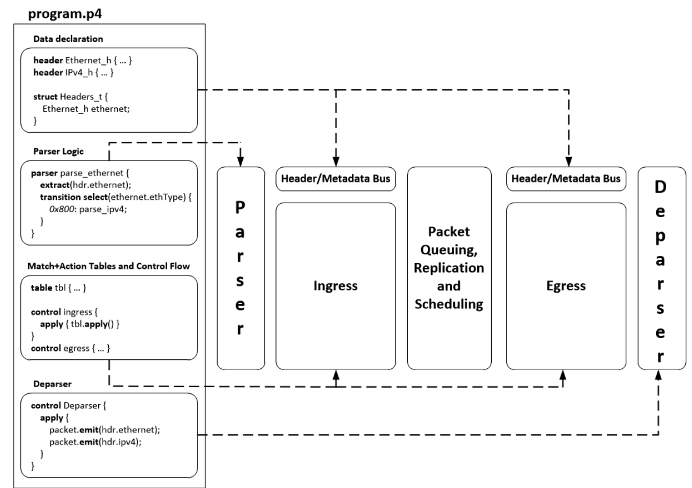

# P4


## differences between P4 and OpenFlow
https://p4.org/p4/clarifying-the-differences-between-p4-and-openflow.html

In P4, OpenFlow is one of many possible programs to describe what the forwarding plane does.  在P4中，OpenFlow是描述转发平面功能的众多可能程序之一。

早在2007年，当OpenFlow最初被构想时，我们就开始想要用一种通用的方法来使软件控制平面远程控制许多不同的交换机。我们注意到，在大多数网络中，**交换机的功能几乎相同：以太网，IPv4，访问控制列表（ACL），VLAN等**。


如果我们可以**定义一个标准的开放接口来填充这些交换机中的转发表**（例如，用于以太网地址查找的哈希表，用于IPv4的最长前缀匹配表以及用于ACL的通配符查找），那么就可以创建控制平面控制来自不同供应商的交换机。
We can see that it worked, as many big data centers today are built using homegrown control planes, that leveraged open interfaces to the data plane in part or in whole.


OpenFlow的第一个版本只支持为四个常用协议（以太网，VLAN，IPv4，ACL）。随着时间的推移，更多的报头类型header-types被添加到OpenFlow中，例如IPv6，MPLS和VXLAN。今天，OpenFlow允许我们添加和删除大约50种不同标头类型的转发条目。

why are **switch chips fixed-function**为什么交换机的芯片的功能是固定的呢？
In the past, programmable switch chips could only process packets at about 1/10th or 1/100th the rate of fixed-function ASICs


但是今天，市场上有可重新配置的交换芯片，其处理数据包的速度与最快的固定功能交换器一样快。（见同一目录下的Fast Programmable Match-Action Processing in Hardware for SDN）
We called this type of programmable chip a "PISA" chip (**Protocol Independent Switch Architecture**).
如果可编程PISA芯片的运行速度与固定功能的交换机芯片switch chips fixed-function一样快，那么我们可以开创网络的新时代，在这个时代中，**我们可以准确定义如何在交换机中处理数据包**。

此外，如果我们定义一种语言来编程fast switches，我们也可以使用相同的语言来编程较慢的switches，这些开关是使用NPU，FPGA或软件开关（例如vSwitches）构建的。

我们认为：**如果我们可以找到一种通用语言来对网络中的每个交换机进行编程**，那么交换机之间的互操作性几乎会立即发生-我们可以用相同的方式对它们进行编程。
we could even use the same language to unambiguously describe fixed-function switch ASICs too.

因此，在2013年，出于这些目标，来自Google，Intel，Microsoft，Stanford，Princeton和Barefoot的一群人开始定义P4语言。



P4并没有让交换机告诉我们它可以做的事情有限，而是提供了一种方法来告诉交换机应该做什么以及应该如何处理数据包。
P4 lets us define what headers a switch will recognize (or "parse"), how to match on each header, and what actions we would like the switch to perform on each header.

例如，我们可以告诉交换机通过在32位目标地址上执行最长前缀匹配，将其发送到下一跳，递减并检查TTL，更新校验和并封装在新的以太网中来处理IPv4标头标头。The protocol is just a program expressed in P4.
实际上，您可以编译P4程序以直接生成executable switch, 这样的开源编译器已经存在，并且可以测试新的switch功能。

P4让我们定义填充交换机所需的API，而不是由交换芯片供应商为我们定义我们的API，并锁定我们也使用他们的下一个芯片。我们说P4是“自上而下的”

OpenFlow 对于支持OpenFlow固定式以及可程式化 switch 的混合网络来说仍然是有用的。实际上，已经存在一个名为openflow.p4的P4程序，**该程序对PISA芯片进行编程以支持OpenFlow**。换句话说，在P4语言中，OpenFlow是一个程序。

尽管OpenFlow是为SDN网络设计的，在该网络中我们将控制平面与转发平面分开。**但P4旨在对任何交换机或路由器的行为进行编程，无论是从交换机操作系统本地控制还是由SDN控制器远程控制**。


没有特别的理由认为P4将使OpenFlow很快过时。市场上有很多固定功能交换机ASIC（fixed-function switch chips），并且其中很多可以使用OpenFlow进行控制。实际上，随着为固定功能交换芯片编写的TTP越来越多，有充分的理由认为OpenFlow将会出现一段时间。 

P4提供了一种使用可编程和fixed-function switches混合构建网络的无缝方法，并使我们可以通过软件向网络中引入新功能和协议，而不必等待新的硬件。而且，P4编码器可以将这些差异化功能保留给自己，而不是与芯片和盒装供应商以及通过其供应商与竞争对手共享所有内容。


## Network Prototyping Made Easy with P4 and Python
### Introduction
您是否曾经尝试深入了解网络协议的机制？我指的是计算机网络使用的网络协议，例如Internet协议（IP），传输控制协议（TCP）或生成树协议（STP）。

 P4技术和Python带来了便捷的原型网络解决方案！将P4与Python提供的工具（例如Scapy库或Mininet）结合使用，可以无限地实现，构建和测试复杂的网络系统。此外，您可以原型化网络协议，甚至还不存在！
 
 ### P4, Python (Scapy) and Mininet – the toolset of network researcher
P4 stands for Programming Protocol-Independent Packet Processors. **It has been developed as a next step in the evolution of Software-Defined Networking (SDN)**. 

the classical telecommunications architecture can be divided into data plane, control plane and management plane. 
数据平面是处理和转发数据包的层，而控制平面则决定应如何处理这些数据包。

P4旨在支持数据平面编程。因此，使用P4语言，您可以指定可以处理哪些数据包的标头，以及可以对数据包执行哪些操作。
**The data plane programming was the missing link in the software-based network systems, where control plane and management plane are programmable already**.
当前，可以使用软件来完全定义网络系统，并且可以通过更新软件版本来动态更改其行为。它为网络世界带来了很大的灵活性

P4 language. It is a high-level Domain-Specific Language (DSL) dedicated for programming of network devices。它允许指定网络设备可以识别的数据包格式（协议标头）以及对传入数据包执行的操作（转发，标头修改，添加协议标头等）。
尽管如此，P4语言不是由网络设备直接使用的，而是必须编译为特定平台的源代码（某些特定于目标的二进制文件）。These platforms are hardware-based (e.g. Barefoot Tofino, FPGA) or software-based (e.g. BMv2, eBPF/XDP, PISCES or P4rt-OVS). 

The concept of the P4 language has been presented below.


The P4 program is composed of three main sections: Protocols definition (data declaration), Parser Logic (Parser & Deparser) and a number of control blocks containing Match-Action tables. 
P4程序由三个主要部分组成：协议定义（数据声明），解析器逻辑（Parser＆Deparser）和许多包含Match-Action表的控制块。


The first section defines the protocols headers that the network device will be able to recognize. 第一部分定义了网络设备将能够识别的协议标头。例如，定义IPv4标头很简单：
```
header ipv4_t {
bit<4>    version;
bit<4>    ihl;
bit<8>    diffserv;
bit<16>   totalLen;
bit<16>   identification;
bit<3>    flags;
bit<13>   fragOffset;
bit<8>    ttl;
bit<8>    protocol;
bit<16>   hdrChecksum;
bit<32> srcAddr;
bit<32> dstAddr;
}
```

The programmer just needs to declare header fields and their length. Now, these headers are used to **parse incoming data and recognize type of packets**. 
Parser Logic定义了读取和解析传入数据包的步骤, Visually, the Parser can be represented as a cyclic graph循环图, in which every node processes a protocol’s header. 每个节点都处理了一个协议的header。

一个简单的 IPv4 router 的解析器如下：
```
parser RouterParser(packet_in packet,
out headers hdr,
inout metadata meta,
inout standard_metadata_t standard_metadata) {
state start {
transition parse_ethernet;
}
state parse_ethernet {
packet.extract(hdr.ethernet);
transition select(hdr.ethernet.etherType) {
TYPE_IPV4: parse_ipv4;
default: accept;
}
}
state parse_ipv4 {
packet.extract(hdr.ipv4);
transition accept;
}
}
```
 Furthermore 此外，在P4程序中，程序员必须定义许多控制块，其中包含Match-Action表。简单IPv4转发表的定义可以实现如下：
 ```
 table routing_table {
 key = {
 hdr.ipv4.dstAddr: lpm;
 }
 actions = {
 ipv4_forward;
 drop;
 NoAction;
 }
 default_action = NoAction();
 }
 ```
 routing_table读取IPv4目标IP地址，并根据最长前缀匹配算法进行匹配。然后，在符合规则的数据包上，可以执行三个操作：ipv4_forward，drop或NoAction。


The last part is to define the Deparser, which defines the order of packet’s headers for outgoing packets.
```
control deparser(packet_out packet,
in headers hdr) {

apply {
packet.emit(hdr.ethernet);
packet.emit(hdr.ipv4);
}
}
```

**P4语言可用于实现任何类型的数据平面协议**。尽管它有一些局限性，但它是一项强大的技术，可供网络研究人员用来对新的网络协议进行原型设计和测试。

Ok, P4 gives the tool to program the data plane, but what about a control plane? In fact, you can use any language to listen to the packets being sent from data plane. However, I believe the most simple to use is Python. It comes with the library named scapy. Scapy allows you to parse network packets received on sockets as well as construct new packets as simply as in the below example:

好的，P4提供了对数据平面进行编程的工具，但是控制平面呢？
实际上，**you can use any language to listen to the packets being sent from data plane**。但是，我认为最容易使用的是Python。它带有一个名为scapy的库。 Scapy允许您解析在套接字上接收到的网络数据包以及构造新数据包


根据我的经验，Scapy是一个用户友好的库，**可用于实现控制平面应用程序**或从主机设备生成自定义数据包。


P4语言允许我们对数据平面进行编程，而Python是实现原型网络的控制平面的推荐语言。瞧！现在，问题是如何**大规模模拟真实网络**？ **BMv2交换机（作为P4软件交换机）已与Mininet很好地集成在一起**。因此，您可以在本地计算机上创建任意大小的虚拟网络！我使用Mininet已有近四年的时间来试验SDN和OpenFlow –它是一个非常强大的工具，可简化网络研究人员的工作！


https://scapy.readthedocs.io/en/latest/introduction.html#quick-demo


## 问题和补充
### ACL是什么


P4 属于高级语言， 用来对 协议无关的网络包处理器 编程。

P4 用于SDN控制协议（如OpenFlow）


FPGA就是一个可以通过编程来改变内部结构的芯片


Management plane 
Control Plane
Data Plane

p4: forward packet in Data Plane

to build a real switch we need to have ingress pipeline and egress pipeline


1
p4 可以与软硬件结合

2
FPGA_based NICs


