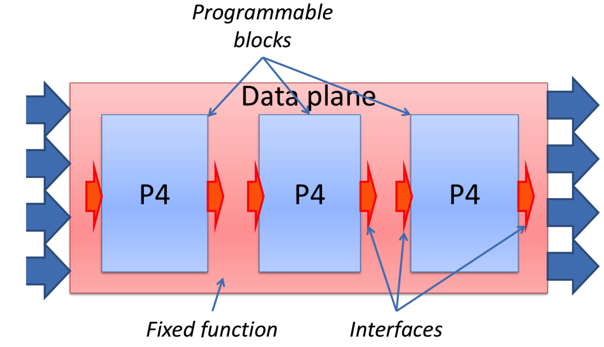

# Linux Network Programming with P4
http://vger.kernel.org/lpc_net2018_talks/p4-xdp-lpc18-paper.pdf

## XDP serve as programmable data-planes of the kernel

P4可以表达XDP
 P4抽象允许程序员以通用的方式编写网络协议，而无需了解目标数据平面的配置细节。
 
eBPF, and its extension the eXpress Data Path (XDP), effectively serve as **programmable data-planes of the kernel**.

P4C-XDP是一个将 XDP的性能 与 P4的通用性和可用性相结合 的项目。在本文档中，我们描述了如何将P4转换为eBPF / XDP。我们回顾了这两种技术的基本局限性，分析了几种已生成的XDP程序的性能，并讨论了在研究这种新技术时我们面临的问题。

## 1、Introduction
即使SDN使控制平面可编程，它仍然假定数据平面是固定的。**无法对数据平面进行编程是创新的重要障碍。**

为了解决这种情况，引入了P4语言，旨在使数据平面的行为可表示为软件。 P4已迅速被采用。P4最初是为编程网络交换机而设计的，但其范围已扩大到涵盖各种分组处理系统（例如，网卡，FP-GA等）。

## 2、Background concepts

2.1 The P4 programming language
P4是一种相对简单的，静态类型的编程语言，具有基于C的语法，旨在表达网络数据包的转换。

P4缺少许多其他编程语言中的常见功能：例如，P4不支持指针，动态内存分配，浮点数或递归。功能;循环构造仅在解析器中允许。

P4是一个静态语言：P4强调静态资源分配；与Linux tc子系统等系统不同，在P4中，**创建P4程序时必须声明所有数据包处理规则和所有表**。

2.2 P4 Architectures

P4允许程序在任意目标上执行。 Targets differ in their functionality, (e.g., a switch has to forward packets, a network card has to receive or transmit packets, and a firewall has to block or allow packets), and also in their custom capabilities (e.g., ASICs may provide associative TCAM memories or custom checksum computation hardware units, while an FPGA switch may allow users to implement cus- tom queueing disciplines).P4涵盖了目标的多样性，并提供了一些表达它的语言机制。

深度学习的三种硬件方案：ASICs，FPGAs，GPU

AlphaGo 的计算设备搭载了特制硬件，一个被谷歌称为“Tensor Processing Unit”（TPU）的计算卡。虽然谷歌对技术细节严格保密， 但已透露它们专为谷歌开源项目 TensorFlow 而优化；并且，它采取了一个越来越流行的深度学习运算加速方式：ASICs。它全称为应用型专用集成电路（application-specific integrated circuit）。

而微软采用了另一种逐渐流行起来的方式：FPGAs（现场可编程门阵列，field-programmable gate arrays） 。它的优势是，如果计算机需要改变，它可以被重新装配。

但是，最通用、最主流的方案仍旧是使用 GPU，以并行处理大量数学运算。不出预料，GPU 方案的主要推动者是该市场的霸主英伟达。

图2是P4程序如何与数据包处理的数据平面交互的抽象视图:

**数据平面是一种固定功能的设备，提供了几个可编程的“孔”**。用户编写一个P4程序来“填充”每个孔。目标制造商描述了可编程块与周围固定功能块之间的接口。这些接口是特定于目标的。

注意，**fixed-function part可以是软件，硬件，固件或mixture**。

### eBPF
而eBPF是一种低级编程语言。
eBPF programs are inserted into the kernel using hooks; their execution is triggered when the flow of control reaches these hookseBPF程序使用钩子插入内核。当控制流到达以下钩子时，将触发它们的执行:
1. 函数入口点可以充当挂钩；将eBPF程序附加到函数foo（）将使eBPF程序在每次某些内核线程执行foo（）时执行。
2. 也可以使用Linux流量控制（TC）子系统在网络数据包处理数据路径中附加eBPF程序。此类程序可用作TC分类器和操作。
3. eBPF程序也可以附加到套接字或网络接口。在这种情况下，它们可用于处理流经套接字/接口的数据包。

2.3.3 Concurrency
由于eBPF程序无法使用锁，因此通常无法避免其中某些竞争。

2.4 XDP: eXpress Data Path
最初，XDP的设计 to prevent denial-of-service attacks by quickly deciding whether a packet should be dropped, before too many kernel resources have been allocated。在DMA引擎从网络卡复制数据包之后，XDP程序可以检查网络数据包，还可以访问eBPF map。

1. XDP DROP the packet should be immediately dropped,
2. XDP TX bounce the received packet back on the same port it arrived on,XDP TX将收到的数据包反弹到到达的同一端口
3. XDP PASS continue to process the packet using the normal kernel network stack,
4. XDP REDIRECT forward the packet to another port.

### 2.5 Comparison of P4 and eBPF
P4被设计为用于编程交换设备的语言，主要在网络堆栈的L2和L3级别工作。虽然P4被用于对网络端点（例如，智能NIC）进行编程，但是某些 end-point functionality 无法自然地在P4中表达（例如，TSO，加密，深度包检查）。

eBPF同样有许多P4的不足之处。通常，尽管P4和eBPF可以执行相对简单的数据包过滤/重写，但**两种语言都不足以实现完整的end-point 网络堆栈**。表1比较了P4和eBPF的局限性。

##  3、Compiling P4 to eBPF
在本节中，我们描述了两个开源编译器，它们**将P4程序转换为风格化的C，然后可以使用LLVM eBPF后端将其编译为eBPF程序**。

### The eBPF back-end 
The eBPF back-end is part of the P4 reference compiler implementation. This back-end targets a relatively simple packet filter architecture. This architecture comprises a parser and a control block; the control block must produce a Boolean value, which indicates whether the packet is accepted or not.

### 3.2 Packet forwarding with XDP

第二个是P4到C的编译器：P4C-XDP
该编译器扩展了第3.1节中的eBPF编译器。**It can target either a packet filter, or a packet switch**。

The following listing shows the XDP architectural model targeted by this compiler：
您可以看到P4 XDP程序可以
（1）将2.4节中描述的四个结果之一返回内核：
- XDP DROP
- XDP TX 
- XDP PASS
- XDP REDIRECT

（2）它也可以通过插入，修改或删除header来修改数据包本身。

4 Testing eBPF programs

The P4 compiler includes a simple language (STF = Simple Testing Framework) to describe input/out- put packets and to populate P4 tables. The STF framework is written in Python.

Every packet received goes through the pipeline specified in P4.

XDP is designed for users who want programmability as well as performance. XDP allows users to write a C-like packet processing program and loads into the device driver's receiving queue. When the device observes an incoming packet, before hanging the packet to the Linux stack, the user-defined XDP pr
